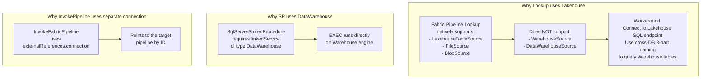

# Setup Guide -- Warehouse-Native Medallion Architecture (Template)
> Step-by-step instructions to build from scratch
> Generic template | Replace all {placeholders} with project-specific values
> Both approaches: Fabric UI and Fabric REST API
> Microsoft Fabric F256+

---

## Prerequisites

| Requirement | Detail |
|-------------|--------|
| Microsoft Fabric workspace | F256 or higher capacity |
| Fabric Warehouse | `{Project_Warehouse}` (create if not exists) |
| Source Lakehouse | `{Source_Lakehouse}` (must exist with shortcuts to source data) |
| Lookup Lakehouse | Any Lakehouse in the same workspace (for pipeline Lookup cross-DB) |
| Azure CLI | `az login` for token-based authentication |
| Python 3.9+ | For pyodbc approach |
| pyodbc + ODBC Driver 18 | For API approach: `pip install pyodbc` |

### Two Approaches

| Approach | When to Use | Tools |
|----------|-------------|-------|
| **Fabric UI** | Interactive setup, small changes, debugging | Warehouse query editor in browser |
| **API + Automation** | Bulk deployment, automation, CI/CD | pyodbc + `az account get-access-token` |

### API Connection Template (pyodbc)

```python
import pyodbc
import subprocess
import json

# Get Fabric access token via Azure CLI
token_result = subprocess.run(
    ["az", "account", "get-access-token", "--resource", "https://database.windows.net/"],
    capture_output=True, text=True
)
access_token = json.loads(token_result.stdout)["accessToken"]

# Connect to Fabric Warehouse
conn_str = (
    "Driver={ODBC Driver 18 for SQL Server};"
    "Server={warehouse_endpoint}.datawarehouse.fabric.microsoft.com;"
    "Database={Project_Warehouse};"
    "Encrypt=Yes;"
    "TrustServerCertificate=No;"
)
conn = pyodbc.connect(conn_str, attrs_before={1256: bytearray(access_token.encode("UTF-16-LE"))})
cursor = conn.cursor()

# Execute SQL
cursor.execute("SELECT @@VERSION")
print(cursor.fetchone()[0])
```

---

## Phase 0: Foundation -- Meta Schema

### Step 0.1: Create Schemas

**Fabric UI**: Open Warehouse query editor, run:

```sql
CREATE SCHEMA meta;
CREATE SCHEMA bronze;
CREATE SCHEMA silver;
CREATE SCHEMA gold;
```

**API**: Execute via pyodbc cursor.

### Step 0.2: Create Meta Tables (7 Tables)

Execute all DDL statements below. Note the Fabric Warehouse constraints -- no DEFAULT, no IDENTITY, no PRIMARY KEY, use DATETIME2(6), use INT instead of BIT.

```sql
-- Table 1: sp_registry (central config -- defines every data SP in the system)
-- Manual INPUT: INSERT when adding new tables
-- Auto-populated: last_load_date, rows_loaded, next_run_time (by usp_log_run)
CREATE TABLE meta.sp_registry (
    sp_name                 VARCHAR(200)    NOT NULL,    -- PK equivalent: '{schema}.usp_load_{table}'
    view_name               VARCHAR(200)    NULL,        -- '{schema}.vw_{table}'
    target_schema           VARCHAR(50)     NOT NULL,    -- bronze / silver / gold
    target_table            VARCHAR(200)    NOT NULL,    -- table name without schema
    layer                   VARCHAR(10)     NOT NULL,    -- BRZ / REF / SLV / GLD
    load_type               VARCHAR(20)     NOT NULL,    -- overwrite / incremental
    frequency               VARCHAR(20)     NOT NULL,    -- daily / hourly / weekly / monthly
    scheduled_hour          INT             NULL,        -- hour of day for scheduling
    execution_order         INT             NOT NULL,    -- 1=BRZ/REF, 2-4=SLV, 5=GLD
    parallel_group          INT             NULL,        -- optional grouping for parallel execution
    depends_on              VARCHAR(500)    NULL,        -- JSON: ["silver.usp_load_slv_xxx"] (silver-to-silver deps)
    source_objects          VARCHAR(2000)   NULL,        -- JSON: ["{Source_Lakehouse}.{schema}.{table}"] (for lineage)
    watermark_column        VARCHAR(100)    NULL,        -- column used for incremental loads
    primary_key             VARCHAR(500)    NULL,        -- logical PK columns (for DQ/upsert, not enforced)
    date_key                VARCHAR(100)    NULL,        -- date column for datekey/daterange patterns
    date_range_days         INT             NULL,        -- number of days for daterange pattern
    is_active               INT             NOT NULL,    -- 0/1 (no BIT in Fabric WH)
    last_load_date          DATETIME2(6)    NULL,        -- auto: last successful load timestamp
    last_watermark_value    VARCHAR(200)    NULL,        -- auto: last watermark for incremental
    next_run_time           DATETIME2(6)    NULL,        -- auto: next scheduled run
    rows_loaded             BIGINT          NULL,        -- auto: rows loaded in last run
    project                 VARCHAR(50)     NULL         -- project identifier for multi-project warehouses
);

-- Table 2: sp_run_history (execution journal -- every SP execution creates one row)
-- Auto-populated: entirely by usp_log_run
CREATE TABLE meta.sp_run_history (
    run_id                  VARCHAR(36)     NOT NULL,    -- NEWID() per execution
    pipeline_run_id         VARCHAR(36)     NULL,        -- links to pipeline_run_log
    sp_name                 VARCHAR(200)    NOT NULL,    -- which SP ran
    start_time              DATETIME2(6)    NOT NULL,    -- when it started
    end_time                DATETIME2(6)    NULL,        -- when it finished
    duration_seconds        INT             NULL,        -- computed: DATEDIFF(SECOND, start, end)
    rows_affected           BIGINT          NULL,        -- rows loaded/inserted
    status                  VARCHAR(20)     NOT NULL,    -- running / success / failed
    error_message           VARCHAR(4000)   NULL,        -- error text if failed
    load_type               VARCHAR(20)     NULL         -- overwrite / incremental
);

-- Table 3: dq_rules (DQ config -- defines what quality checks to run)
-- Manual INPUT: INSERT when adding DQ rules
CREATE TABLE meta.dq_rules (
    rule_id                 INT             NOT NULL,    -- manually assigned unique ID
    rule_name               VARCHAR(200)    NOT NULL,    -- descriptive name
    target_schema           VARCHAR(50)     NOT NULL,    -- schema to check
    target_table            VARCHAR(200)    NOT NULL,    -- table to check
    check_type              VARCHAR(30)     NOT NULL,    -- completeness/uniqueness/row_count/freshness/referential_integrity/validity/custom_sql
    column_name             VARCHAR(100)    NULL,        -- column to check (NULL for table-level checks)
    severity                VARCHAR(10)     NOT NULL,    -- CRITICAL / WARNING / INFO
    threshold               DECIMAL(18,2)   NULL,        -- expected minimum value
    params                  VARCHAR(1000)   NULL,        -- JSON for additional parameters
    is_active               INT             NOT NULL,    -- 0/1
    layer                   VARCHAR(10)     NOT NULL     -- BRZ / SLV / GLD
);

-- Table 4: dq_results (DQ outcomes -- stores pass/fail for each check)
-- Auto-populated: by usp_check_dq or external DQ runner
CREATE TABLE meta.dq_results (
    result_id               INT             NOT NULL,    -- manually computed: MAX(result_id)+1
    pipeline_run_id         VARCHAR(36)     NULL,        -- links to pipeline_run_log
    rule_id                 INT             NOT NULL,    -- links to dq_rules
    check_time              DATETIME2(6)    NOT NULL,    -- when the check ran
    status                  VARCHAR(10)     NOT NULL,    -- PASS / FAIL
    actual_value            VARCHAR(500)    NULL,        -- observed value
    expected_value          VARCHAR(500)    NULL,        -- threshold value
    error_detail            VARCHAR(4000)   NULL         -- error details if any
);

-- Table 5: sp_lineage (lineage graph -- source-to-target edges)
-- Auto-populated: by usp_build_lineage (DELETE + INSERT full rebuild)
CREATE TABLE meta.sp_lineage (
    lineage_id              INT             NOT NULL,    -- ROW_NUMBER assigned by usp_build_lineage
    source_schema           VARCHAR(100)    NOT NULL,    -- source schema (or external lakehouse)
    source_table            VARCHAR(200)    NOT NULL,    -- source table name
    target_schema           VARCHAR(100)    NOT NULL,    -- target schema in warehouse
    target_table            VARCHAR(200)    NOT NULL,    -- target table name
    relationship_type       VARCHAR(20)     NULL,        -- direct / join / union / lookup
    sp_name                 VARCHAR(200)    NULL         -- which SP creates this edge
);

-- Table 6: pipeline_run_log (pipeline-level tracking)
-- Auto-populated: by usp_log_pipeline_run (start) + usp_finalize_pipeline (end)
CREATE TABLE meta.pipeline_run_log (
    pipeline_run_id         VARCHAR(36)     NOT NULL,    -- NEWID() per pipeline execution
    pipeline_name           VARCHAR(100)    NOT NULL,    -- e.g., 'pl_{prefix}_master'
    status                  VARCHAR(20)     NOT NULL,    -- running / success / failed
    start_time              DATETIME2(6)    NOT NULL,    -- pipeline start
    end_time                DATETIME2(6)    NULL,        -- pipeline end
    tables_succeeded        INT             NULL,        -- count of SPs that succeeded
    tables_failed           INT             NULL,        -- count of SPs that failed
    dq_failures_critical    INT             NULL,        -- count of critical DQ failures
    notes                   VARCHAR(2000)   NULL         -- free text notes
);

-- Table 7: slv_dag_waves_runtime (silver wave computation results)
-- Auto-populated: by usp_compute_slv_waves (DELETE + INSERT each run)
CREATE TABLE meta.slv_dag_waves_runtime (
    sp_name                 VARCHAR(200)    NOT NULL,    -- silver SP name
    wave                    INT             NOT NULL     -- 0-based wave number
);
```

### Step 0.3: Create Utility Stored Procedures

```sql
-- SP 1: usp_log_run (log SP start/end to sp_run_history, update sp_registry)
CREATE OR ALTER PROCEDURE meta.usp_log_run
    @run_id VARCHAR(36), @sp_name VARCHAR(200), @status VARCHAR(20),
    @rows_affected BIGINT = NULL, @error_message VARCHAR(4000) = NULL,
    @pipeline_run_id VARCHAR(36) = NULL, @load_type VARCHAR(20) = NULL
AS
BEGIN
    IF @status = 'running'
        INSERT INTO meta.sp_run_history (run_id, pipeline_run_id, sp_name, start_time, status, load_type)
        VALUES (@run_id, @pipeline_run_id, @sp_name, CAST(GETUTCDATE() AS DATETIME2(6)), 'running', @load_type);
    ELSE
    BEGIN
        UPDATE meta.sp_run_history
        SET end_time = CAST(GETUTCDATE() AS DATETIME2(6)),
            duration_seconds = DATEDIFF(SECOND, start_time, GETUTCDATE()),
            rows_affected = @rows_affected, status = @status, error_message = @error_message
        WHERE run_id = @run_id;

        UPDATE meta.sp_registry
        SET last_load_date = CAST(GETUTCDATE() AS DATETIME2(6)), rows_loaded = @rows_affected,
            next_run_time = CASE
                WHEN frequency = 'daily'   THEN DATEADD(DAY, 1, CAST(GETUTCDATE() AS DATE))
                WHEN frequency = 'hourly'  THEN DATEADD(HOUR, 1, GETUTCDATE())
                WHEN frequency = 'weekly'  THEN DATEADD(WEEK, 1, CAST(GETUTCDATE() AS DATE))
                WHEN frequency = 'monthly' THEN DATEADD(MONTH, 1, CAST(GETUTCDATE() AS DATE))
                ELSE DATEADD(DAY, 1, CAST(GETUTCDATE() AS DATE)) END
        WHERE sp_name = @sp_name;
    END
END;

-- SP 2: usp_compute_slv_waves (iterative DAG wave computation for silver layer)
CREATE OR ALTER PROCEDURE meta.usp_compute_slv_waves AS
BEGIN
    DELETE FROM meta.slv_dag_waves_runtime;
    DECLARE @wave INT = 0, @assigned INT = 0, @new_count INT = 1;
    DECLARE @total INT, @max_waves INT = 30;

    SELECT @total = COUNT(*) FROM meta.sp_registry WHERE layer = 'SLV' AND is_active = 1;

    -- Wave 0: SPs with no silver dependencies
    INSERT INTO meta.slv_dag_waves_runtime (sp_name, wave)
    SELECT sp_name, 0 FROM meta.sp_registry
    WHERE layer = 'SLV' AND is_active = 1
    AND (depends_on IS NULL OR depends_on NOT LIKE '%silver.usp_%');

    SELECT @assigned = COUNT(*) FROM meta.slv_dag_waves_runtime;
    SET @wave = 1;

    -- Iterate: assign next wave when ALL deps are already assigned
    WHILE @assigned < @total AND @wave < @max_waves AND @new_count > 0
    BEGIN
        INSERT INTO meta.slv_dag_waves_runtime (sp_name, wave)
        SELECT r.sp_name, @wave FROM meta.sp_registry r
        WHERE r.layer = 'SLV' AND r.is_active = 1
        AND r.sp_name NOT IN (SELECT sp_name FROM meta.slv_dag_waves_runtime)
        AND NOT EXISTS (
            SELECT 1 FROM meta.sp_registry dep
            WHERE dep.layer = 'SLV' AND dep.is_active = 1
            AND r.depends_on LIKE '%' + dep.sp_name + '%'
            AND dep.sp_name NOT IN (SELECT sp_name FROM meta.slv_dag_waves_runtime)
        );
        SET @new_count = @@ROWCOUNT;
        SET @assigned = @assigned + @new_count;
        SET @wave = @wave + 1;
    END
END;

-- SP 3: usp_build_lineage (auto-build lineage from source_objects JSON in sp_registry)
CREATE OR ALTER PROCEDURE meta.usp_build_lineage AS
BEGIN
    DELETE FROM meta.sp_lineage;

    INSERT INTO meta.sp_lineage (lineage_id, source_schema, source_table,
                                  target_schema, target_table, relationship_type, sp_name)
    SELECT
        ROW_NUMBER() OVER (ORDER BY r.sp_name, src.value) AS lineage_id,
        CASE
            WHEN CHARINDEX('.', src.value) > 0
            THEN LEFT(src.value, CHARINDEX('.', src.value, CHARINDEX('.', src.value) + 1) - 1)
            ELSE 'unknown'
        END AS source_schema,
        CASE
            WHEN CHARINDEX('.', src.value) > 0
            THEN RIGHT(src.value, LEN(src.value) - CHARINDEX('.', src.value, CHARINDEX('.', src.value) + 1))
            ELSE src.value
        END AS source_table,
        r.target_schema,
        r.target_table,
        'direct' AS relationship_type,
        r.sp_name
    FROM meta.sp_registry r
    CROSS APPLY OPENJSON(r.source_objects) src
    WHERE r.source_objects IS NOT NULL;
END;

-- SP 4: usp_run_silver_dag (backup orchestrator -- runs silver SPs sequentially, no parallelism)
CREATE OR ALTER PROCEDURE meta.usp_run_silver_dag AS
BEGIN
    EXEC meta.usp_compute_slv_waves;

    DECLARE @max_wave INT;
    SELECT @max_wave = MAX(wave) FROM meta.slv_dag_waves_runtime;

    DECLARE @w INT = 0;
    WHILE @w <= @max_wave
    BEGIN
        DECLARE @sp VARCHAR(200);
        DECLARE @min_id INT = 0;

        WHILE 1 = 1
        BEGIN
            SELECT TOP 1 @sp = sp_name
            FROM meta.slv_dag_waves_runtime
            WHERE wave = @w AND sp_name > ISNULL(@sp, '')
            ORDER BY sp_name;

            IF @@ROWCOUNT = 0 BREAK;
            EXEC sp_executesql @sp;
        END

        SET @w = @w + 1;
    END
END;

-- SP 5: usp_check_dq (DQ engine -- reads rules, generates SQL, writes results)
-- NOTE: Known Fabric WH limitation -- WHILE loop with sp_executesql may only run 1 iteration.
-- Workaround: Run DQ checks from Python client or Pipeline ForEach instead.
CREATE OR ALTER PROCEDURE meta.usp_check_dq
    @target_schema VARCHAR(50) = NULL,
    @target_table VARCHAR(200) = NULL
AS
BEGIN
    DECLARE @rule_id INT, @check_type VARCHAR(30), @schema VARCHAR(50);
    DECLARE @table VARCHAR(200), @col VARCHAR(100), @threshold DECIMAL(18,2);
    DECLARE @sql NVARCHAR(4000), @result DECIMAL(18,2);
    DECLARE @status VARCHAR(10), @actual VARCHAR(500), @expected VARCHAR(500);
    DECLARE @result_id INT;

    SELECT @result_id = ISNULL(MAX(result_id), 0) FROM meta.dq_results;

    DECLARE @min_rule INT = 0;
    WHILE 1 = 1
    BEGIN
        SELECT TOP 1 @rule_id = rule_id, @check_type = check_type,
               @schema = target_schema, @table = target_table,
               @col = column_name, @threshold = threshold
        FROM meta.dq_rules
        WHERE is_active = 1 AND rule_id > @min_rule
        AND (@target_schema IS NULL OR target_schema = @target_schema)
        AND (@target_table IS NULL OR target_table = @target_table)
        ORDER BY rule_id;

        IF @@ROWCOUNT = 0 BREAK;
        SET @min_rule = @rule_id;

        -- Generate SQL based on check_type
        IF @check_type = 'completeness'
            SET @sql = N'SELECT @r = CAST(SUM(CASE WHEN ' + QUOTENAME(@col) +
                       N' IS NULL THEN 0 ELSE 1 END) * 100.0 / COUNT(*) AS DECIMAL(18,2)) FROM '
                       + QUOTENAME(@schema) + '.' + QUOTENAME(@table);
        ELSE IF @check_type = 'row_count'
            SET @sql = N'SELECT @r = CAST(COUNT(*) AS DECIMAL(18,2)) FROM '
                       + QUOTENAME(@schema) + '.' + QUOTENAME(@table);
        ELSE IF @check_type = 'uniqueness'
            SET @sql = N'SELECT @r = CAST(COUNT(*) - COUNT(DISTINCT ' + QUOTENAME(@col) +
                       N') AS DECIMAL(18,2)) FROM '
                       + QUOTENAME(@schema) + '.' + QUOTENAME(@table);
        ELSE IF @check_type = 'freshness'
            SET @sql = N'SELECT @r = CAST(DATEDIFF(HOUR, MAX(' + QUOTENAME(@col) +
                       N'), GETUTCDATE()) AS DECIMAL(18,2)) FROM '
                       + QUOTENAME(@schema) + '.' + QUOTENAME(@table);
        -- Add additional check_type handlers as needed (referential_integrity, validity, custom_sql)

        EXEC sp_executesql @sql, N'@r DECIMAL(18,2) OUTPUT', @r = @result OUTPUT;

        SET @actual = CAST(@result AS VARCHAR(500));
        SET @expected = CAST(@threshold AS VARCHAR(500));
        SET @status = CASE WHEN @result >= @threshold THEN 'PASS' ELSE 'FAIL' END;

        SET @result_id = @result_id + 1;
        INSERT INTO meta.dq_results (result_id, rule_id, check_time, status, actual_value, expected_value)
        VALUES (@result_id, @rule_id, CAST(GETUTCDATE() AS DATETIME2(6)), @status, @actual, @expected);
    END
END;

-- SP 6: usp_log_pipeline_run (log pipeline start)
CREATE OR ALTER PROCEDURE meta.usp_log_pipeline_run
    @pipeline_run_id VARCHAR(36),
    @pipeline_name VARCHAR(100),
    @status VARCHAR(20)
AS
BEGIN
    INSERT INTO meta.pipeline_run_log (pipeline_run_id, pipeline_name, status, start_time)
    VALUES (@pipeline_run_id, @pipeline_name, @status, CAST(GETUTCDATE() AS DATETIME2(6)));
END;

-- SP 7: usp_finalize_pipeline (build lineage + update pipeline_run_log with final status)
CREATE OR ALTER PROCEDURE meta.usp_finalize_pipeline
    @pipeline_run_id VARCHAR(36)
AS
BEGIN
    -- Rebuild lineage
    EXEC meta.usp_build_lineage;

    -- Update pipeline_run_log with final status
    DECLARE @succeeded INT, @failed INT;

    SELECT @succeeded = COUNT(*)
    FROM meta.sp_run_history
    WHERE pipeline_run_id = @pipeline_run_id AND status = 'success';

    SELECT @failed = COUNT(*)
    FROM meta.sp_run_history
    WHERE pipeline_run_id = @pipeline_run_id AND status = 'failed';

    UPDATE meta.pipeline_run_log
    SET status = CASE WHEN @failed > 0 THEN 'completed_with_errors' ELSE 'success' END,
        end_time = CAST(GETUTCDATE() AS DATETIME2(6)),
        tables_succeeded = @succeeded,
        tables_failed = @failed
    WHERE pipeline_run_id = @pipeline_run_id;
END;

-- SP 8: usp_generic_load (GENERIC SP -- replaces all per-table SPs)
-- Routes by load_type from sp_registry. Supports 8 patterns.
-- Called by pipeline ForEach: EXEC meta.usp_generic_load @target_schema, @target_table
CREATE OR ALTER PROCEDURE meta.usp_generic_load
    @target_schema VARCHAR(50),
    @target_table VARCHAR(200)
AS
BEGIN
    DECLARE @run_id VARCHAR(36) = CONVERT(VARCHAR(36), NEWID());
    DECLARE @rows BIGINT;
    DECLARE @view_name VARCHAR(200), @load_type VARCHAR(20);
    DECLARE @watermark_column VARCHAR(100), @primary_key VARCHAR(500);
    DECLARE @date_key VARCHAR(100), @date_range_days INT;
    DECLARE @last_wm VARCHAR(200), @sp_name VARCHAR(200);

    -- Read config from sp_registry
    SELECT @view_name = view_name, @load_type = load_type,
           @watermark_column = watermark_column, @primary_key = primary_key,
           @date_key = date_key, @date_range_days = date_range_days,
           @last_wm = last_watermark_value, @sp_name = sp_name
    FROM meta.sp_registry
    WHERE target_schema = @target_schema AND target_table = @target_table;

    EXEC meta.usp_log_run @run_id, @sp_name, 'running', @load_type = @load_type;

    BEGIN TRY
        -- Route by load_type
        IF @load_type = 'overwrite'
        BEGIN
            DECLARE @drop_sql NVARCHAR(500) = N'DROP TABLE IF EXISTS '
                + QUOTENAME(@target_schema) + '.' + QUOTENAME(@target_table);
            EXEC sp_executesql @drop_sql;

            DECLARE @ctas_sql NVARCHAR(4000) = N'CREATE TABLE '
                + QUOTENAME(@target_schema) + '.' + QUOTENAME(@target_table)
                + N' AS SELECT *, CAST(GETUTCDATE() AS DATETIME2(6)) AS _load_dt FROM ' + @view_name;
            EXEC sp_executesql @ctas_sql;
        END
        ELSE IF @load_type = 'incremental'
        BEGIN
            -- INSERT WHERE watermark > last value (or full load if first run)
            -- (see v9_setup_supplychain.md for full implementation)
            DECLARE @table_exists INT = 0;
            SELECT @table_exists = COUNT(*) FROM sys.tables t
            JOIN sys.schemas s ON t.schema_id = s.schema_id
            WHERE s.name = @target_schema AND t.name = @target_table;

            IF @table_exists = 0 OR @last_wm IS NULL
            BEGIN
                DECLARE @drop2 NVARCHAR(500) = N'DROP TABLE IF EXISTS '
                    + QUOTENAME(@target_schema) + '.' + QUOTENAME(@target_table);
                EXEC sp_executesql @drop2;
                DECLARE @full_sql NVARCHAR(4000) = N'CREATE TABLE '
                    + QUOTENAME(@target_schema) + '.' + QUOTENAME(@target_table)
                    + N' AS SELECT *, CAST(GETUTCDATE() AS DATETIME2(6)) AS _load_dt FROM ' + @view_name;
                EXEC sp_executesql @full_sql;
            END
            ELSE
            BEGIN
                DECLARE @incr_sql NVARCHAR(4000) = N'INSERT INTO '
                    + QUOTENAME(@target_schema) + '.' + QUOTENAME(@target_table)
                    + N' SELECT *, CAST(GETUTCDATE() AS DATETIME2(6)) AS _load_dt FROM ' + @view_name
                    + N' WHERE ' + QUOTENAME(@watermark_column) + N' > CAST(''' + @last_wm + ''' AS DATETIME2(6))';
                EXEC sp_executesql @incr_sql;
            END
        END
        -- ELSE IF @load_type = 'upsert'     -> MERGE on primary_key
        -- ELSE IF @load_type = 'datekey'     -> DELETE + INSERT by date_key
        -- ELSE IF @load_type = 'daterange'   -> DELETE last N days + INSERT
        -- ELSE IF @load_type = 'identity'    -> INSERT with MAX(id)+1
        -- ELSE IF @load_type = 'cdc'         -> Apply CDC operations
        -- ELSE IF @load_type = 'scd2'        -> SCD Type 2 logic

        -- Count rows
        DECLARE @count_sql NVARCHAR(500) = N'SELECT @r = COUNT(*) FROM '
            + QUOTENAME(@target_schema) + '.' + QUOTENAME(@target_table);
        EXEC sp_executesql @count_sql, N'@r BIGINT OUTPUT', @r = @rows OUTPUT;

        EXEC meta.usp_log_run @run_id, @sp_name, 'success',
             @rows_affected = @rows, @load_type = @load_type;
    END TRY
    BEGIN CATCH
        DECLARE @err VARCHAR(4000) = ERROR_MESSAGE();
        EXEC meta.usp_log_run @run_id, @sp_name, 'failed',
             @error_message = @err, @load_type = @load_type;
        THROW;
    END CATCH
END;
```

### Step 0.4: Create Function and View

```sql
-- Function: ufn_should_run (schedule gate -- returns 1 if SP should run now)
CREATE OR ALTER FUNCTION meta.ufn_should_run(@sp_name VARCHAR(200))
RETURNS INT
AS
BEGIN
    DECLARE @result INT = 0;
    SELECT @result = CASE
        WHEN is_active = 1 AND (next_run_time IS NULL OR next_run_time <= GETUTCDATE())
        THEN 1 ELSE 0 END
    FROM meta.sp_registry WHERE sp_name = @sp_name;
    RETURN ISNULL(@result, 0);
END;

-- View: vw_slv_dag_waves (legacy fixed-CTE approach, kept for reference)
-- NOTE: This view is limited to a fixed number of waves. Use usp_compute_slv_waves instead.
CREATE OR ALTER VIEW meta.vw_slv_dag_waves AS
WITH wave0 AS (
    SELECT sp_name, 0 AS wave FROM meta.sp_registry
    WHERE layer = 'SLV' AND is_active = 1
    AND (depends_on IS NULL OR depends_on NOT LIKE '%silver.usp_%')
),
wave1 AS (
    SELECT r.sp_name, 1 AS wave FROM meta.sp_registry r
    WHERE r.layer = 'SLV' AND r.is_active = 1
    AND r.sp_name NOT IN (SELECT sp_name FROM wave0)
    AND NOT EXISTS (
        SELECT 1 FROM meta.sp_registry dep
        WHERE dep.layer = 'SLV' AND r.depends_on LIKE '%' + dep.sp_name + '%'
        AND dep.sp_name NOT IN (SELECT sp_name FROM wave0)
    )
),
wave2 AS (
    SELECT r.sp_name, 2 AS wave FROM meta.sp_registry r
    WHERE r.layer = 'SLV' AND r.is_active = 1
    AND r.sp_name NOT IN (SELECT sp_name FROM wave0)
    AND r.sp_name NOT IN (SELECT sp_name FROM wave1)
)
SELECT * FROM wave0
UNION ALL SELECT * FROM wave1
UNION ALL SELECT * FROM wave2;
```

### Fabric Warehouse Constraints (Quick Reference)

Keep these in mind when writing any SQL for Fabric Warehouse:

| Constraint | Workaround |
|-----------|------------|
| No DEFAULT | Set values explicitly in INSERT/CTAS |
| No IDENTITY | ROW_NUMBER() or MAX(id)+1 |
| No PRIMARY KEY / UNIQUE | DQ checks in dq_rules instead |
| No CURSOR | WHILE + TOP 1 WHERE id > @current |
| No temp tables (#) | CTE or real table + DROP |
| No recursive CTE | SP iterative WHILE loop |
| Always DATETIME2(6) | Never use datetime, always CAST AS DATETIME2(6) |
| No BIT type | Use INT (0/1) |
| NVARCHAR specify length | Always NVARCHAR(200), never bare NVARCHAR |
| Lakehouse schema = folder name | Use `{Lakehouse}.{FolderName}.{Table}`, not `{Lakehouse}.dbo.{Table}` |

---

## Phase 1: Bronze Layer

### Step 1.1: Create Bronze Views

Each bronze view reads from the source system via 3-part naming. The view contains the ETL logic: column selection, CAST, TRIM, renaming.

**Fabric UI**: Open query editor, create each view.
**API**: Execute via pyodbc.

**Template -- Overwrite source view**:

```sql
CREATE OR ALTER VIEW bronze.vw_brz_{source_system}__{entity} AS
SELECT
    CAST({source_col_1} AS VARCHAR(200))            AS id_{entity_key},
    CAST({source_col_2} AS FLOAT)                   AS amt_{value_name},
    TRY_CONVERT(DATE, CAST({source_col_3} AS VARCHAR(20)))  AS dt_{date_name},
    TRY_CAST({source_col_4} AS DATETIME2(6))        AS ts_{timestamp_name},
    CAST({source_col_5} AS VARCHAR(100))             AS name_{name_field}
FROM {Source_Lakehouse}.{Folder_Name}.{Source_Table};
```

**Template -- Reference table view**:

```sql
CREATE OR ALTER VIEW bronze.vw_ref_{entity} AS
SELECT
    CAST({source_col_1} AS VARCHAR(200))    AS id_{key},
    CAST({source_col_2} AS VARCHAR(200))    AS name_{description},
    CAST({source_col_3} AS INT)             AS code_{category}
FROM {Source_Lakehouse}.{Folder_Name}.{Source_Table};
```

**Important**: The schema in the 3-part name corresponds to the **folder name** in the Lakehouse, not `dbo`. Using `dbo` will return a 404 error.

### Step 1.2: No Per-Table SPs Needed (Generic SP handles all loads)

With the Generic SP architecture, **no per-table stored procedures are needed** for bronze (or any layer). The pipeline calls `meta.usp_generic_load @target_schema, @target_table` for each table, and the generic SP reads sp_registry to determine the view_name and load_type.

**Example execution**:
```sql
-- Pipeline ForEach calls for each bronze table:
EXEC meta.usp_generic_load @target_schema = 'bronze', @target_table = 'brz_{source_system}__{entity}';
-- Generic SP reads sp_registry: load_type='overwrite', view_name='bronze.vw_brz_{source_system}__{entity}'
-- Then: DROP TABLE + CTAS from view

-- For incremental tables:
EXEC meta.usp_generic_load @target_schema = 'bronze', @target_table = 'brz_{source_system}__{entity}';
-- Generic SP reads sp_registry: load_type='incremental', watermark_column='{watermark_column}'
-- Then: INSERT WHERE watermark > last_watermark_value
```

**Note**: For hardcoded reference tables (no view), create a view that performs the hardcoded INSERT logic, or handle as a special case in sp_registry config.

### Step 1.3: Seed sp_registry for Bronze

```sql
-- Template: Bronze overwrite table
INSERT INTO meta.sp_registry (sp_name, view_name, target_schema, target_table,
    layer, load_type, frequency, execution_order, is_active, source_objects, project)
VALUES
('bronze.usp_load_brz_{source_system}__{entity}',
 'bronze.vw_brz_{source_system}__{entity}',
 'bronze', 'brz_{source_system}__{entity}',
 'BRZ', 'overwrite', 'daily', 1, 1,
 '["{Source_Lakehouse}.{Folder_Name}.{Source_Table}"]', '{project_name}');

-- Template: Bronze incremental table
INSERT INTO meta.sp_registry (sp_name, view_name, target_schema, target_table,
    layer, load_type, frequency, execution_order, watermark_column, is_active, source_objects, project)
VALUES
('bronze.usp_load_brz_{source_system}__{entity}',
 'bronze.vw_brz_{source_system}__{entity}',
 'bronze', 'brz_{source_system}__{entity}',
 'BRZ', 'incremental', 'daily', 1, '{watermark_column}', 1,
 '["{Source_Lakehouse}.{Folder_Name}.{Source_Table}"]', '{project_name}');

-- Template: Reference table
INSERT INTO meta.sp_registry (sp_name, view_name, target_schema, target_table,
    layer, load_type, frequency, execution_order, is_active, source_objects, project)
VALUES
('bronze.usp_load_ref_{entity}',
 'bronze.vw_ref_{entity}',
 'bronze', 'ref_{entity}',
 'REF', 'overwrite', 'daily', 1, 1,
 '["{Source_Lakehouse}.{Folder_Name}.{Source_Table}"]', '{project_name}');
```

### Step 1.4: Test Bronze Loads via Generic SP

```sql
-- Test one table load
EXEC meta.usp_generic_load @target_schema = 'bronze', @target_table = 'ref_{entity}';

-- Verify data
SELECT COUNT(*) FROM bronze.ref_{entity};
SELECT TOP 10 * FROM bronze.ref_{entity};

-- Verify logging
SELECT * FROM meta.sp_run_history
ORDER BY start_time DESC;
```

---

## Phase 2: Silver Layer

### Step 2.1: Spark SQL to T-SQL Conversion (if migrating from Notebooks)

| Spark SQL | T-SQL | Notes |
|-----------|-------|-------|
| `CAST(x AS STRING)` | `CAST(x AS VARCHAR(200))` | Specify length |
| `to_date(CAST(x AS STRING), 'yyyyMMdd')` | `TRY_CONVERT(DATE, CAST(x AS VARCHAR(20)))` | Use TRY_ for safety |
| `CAST(x AS TIMESTAMP)` | `TRY_CAST(x AS DATETIME2(6))` | Always DATETIME2(6) |
| `CAST(x AS DOUBLE)` | `CAST(x AS FLOAT)` | |
| `true` / `false` | `1` / `0` | INT, not BIT |
| `` `column` `` | `[column]` | Square brackets |
| `"string"` | `'string'` | Single quotes |
| `DATE_FORMAT(col, 'yyyy.MM')` | `FORMAT(col, 'yyyy.MM')` | |
| `ADD_MONTHS(date, n)` | `DATEADD(MONTH, n, date)` | |
| `DATE_TRUNC('year', date)` | `DATETRUNC(YEAR, date)` | No quotes on YEAR |
| `MAKE_DATE(y, m, d)` | `DATEFROMPARTS(y, m, d)` | |
| `LIMIT 1` | `TOP 1` | |
| `CURRENT_DATE()` | `CAST(GETDATE() AS DATE)` | |

### Step 2.2: Create Silver Views

Each silver view reads from bronze and/or other silver tables. Apply JOINs, CTEs, business logic.

**Template**:

```sql
CREATE OR ALTER VIEW silver.vw_slv_{business_concept} AS
WITH {cte_name} AS (
    SELECT
        a.id_{key},
        a.amt_{value},
        b.name_{dimension},
        c.dt_{reference_date}
    FROM bronze.brz_{source_system}__{entity_1} a
    JOIN bronze.ref_{entity_2} b ON a.id_{join_key} = b.id_{join_key}
    LEFT JOIN bronze.ref_{entity_3} c ON a.code_{category} = c.code_{category}
    WHERE a.is_active = 1
)
SELECT
    id_{key},
    CAST(amt_{value} AS FLOAT)      AS amt_{output_name},
    name_{dimension},
    dt_{reference_date}
FROM {cte_name};
```

**For silver-to-silver views** (tables in wave 1+):

```sql
CREATE OR ALTER VIEW silver.vw_slv_{derived_concept} AS
SELECT
    a.id_{key},
    a.amt_{value},
    b.val_{other}
FROM silver.slv_{upstream_concept_1} a
JOIN silver.slv_{upstream_concept_2} b ON a.id_{key} = b.id_{key}
LEFT JOIN bronze.ref_{entity} c ON a.code_{dim} = c.code_{dim};
```

### Step 2.3: No Per-Table SPs Needed (Generic SP handles all loads)

With the Generic SP architecture, **no per-table stored procedures are needed** for silver. The pipeline calls `meta.usp_generic_load @target_schema = 'silver', @target_table = 'slv_{business_concept}'` for each table.

```sql
-- Pipeline ForEach calls for each silver table:
EXEC meta.usp_generic_load @target_schema = 'silver', @target_table = 'slv_{business_concept}';
```

### Step 2.4: Seed sp_registry for Silver (with depends_on)

```sql
-- Template: Silver table with NO silver dependencies (wave 0)
INSERT INTO meta.sp_registry (sp_name, view_name, target_schema, target_table,
    layer, load_type, frequency, execution_order, depends_on, is_active, source_objects, project)
VALUES
('silver.usp_load_slv_{business_concept}',
 'silver.vw_slv_{business_concept}',
 'silver', 'slv_{business_concept}',
 'SLV', 'overwrite', 'daily', 2, NULL, 1,
 '["bronze.brz_{source}__{entity_1}", "bronze.ref_{entity_2}"]',
 '{project_name}');

-- Template: Silver table WITH silver dependencies (wave 1+)
INSERT INTO meta.sp_registry (sp_name, view_name, target_schema, target_table,
    layer, load_type, frequency, execution_order, depends_on, is_active, source_objects, project)
VALUES
('silver.usp_load_slv_{derived_concept}',
 'silver.vw_slv_{derived_concept}',
 'silver', 'slv_{derived_concept}',
 'SLV', 'overwrite', 'daily', 3,
 '["silver.usp_load_slv_{upstream_concept_1}", "silver.usp_load_slv_{upstream_concept_2}"]',
 1,
 '["silver.slv_{upstream_concept_1}", "silver.slv_{upstream_concept_2}", "bronze.ref_{entity}"]',
 '{project_name}');
```

### Step 2.5: Define depends_on for Each Silver SP

Map out the DAG before seeding:

| Silver SP | depends_on | Expected Wave |
|-----------|-----------|---------------|
| usp_load_slv_{concept_a} | NULL (only bronze deps) | 0 |
| usp_load_slv_{concept_b} | NULL (only bronze deps) | 0 |
| usp_load_slv_{concept_c} | `["silver.usp_load_slv_{concept_a}"]` | 1 |
| usp_load_slv_{concept_d} | `["silver.usp_load_slv_{concept_a}", "silver.usp_load_slv_{concept_b}"]` | 1 |
| usp_load_slv_{concept_e} | `["silver.usp_load_slv_{concept_c}"]` | 2 |

---

## Phase 3: Gold Layer

### Step 3.1: Create Gold Views

Gold views read from silver tables and optionally bronze reference tables.

**Template**:

```sql
CREATE OR ALTER VIEW gold.vw_gld_fact_{subject} AS
SELECT
    a.id_{key},
    a.amt_{measure_1},
    b.val_{measure_2},
    a.dt_{date},
    c.name_{dimension}
FROM silver.slv_{concept_1} a
JOIN silver.slv_{concept_2} b ON a.id_{key} = b.id_{key}
LEFT JOIN bronze.ref_{entity} c ON a.code_{dim} = c.code_{dim};
```

**Template -- UNION ALL pattern (combining multiple silver tables)**:

```sql
CREATE OR ALTER VIEW gold.vw_gld_fact_{subject} AS
SELECT id_{key}, amt_{value}, dt_{date}, '{source_label_1}' AS source_type
FROM silver.slv_{concept_1}
UNION ALL
SELECT id_{key}, amt_{value}, dt_{date}, '{source_label_2}' AS source_type
FROM silver.slv_{concept_2}
UNION ALL
SELECT id_{key}, amt_{value}, dt_{date}, '{source_label_3}' AS source_type
FROM silver.slv_{concept_3};
```

### Step 3.2: No Per-Table SPs Needed (Generic SP handles all loads)

With the Generic SP architecture, **no per-table stored procedures are needed** for gold. The pipeline calls `meta.usp_generic_load @target_schema = 'gold', @target_table = 'gld_fact_{subject}'` for each table.

```sql
-- Pipeline ForEach calls for each gold table:
EXEC meta.usp_generic_load @target_schema = 'gold', @target_table = 'gld_fact_{subject}';
```

### Step 3.3: Gold Naming

Use `gld_` prefix on all gold tables to avoid name collisions with any existing tables that use plain `fact_*` / `dim_*` naming in `dbo` or other schemas.

### Step 3.4: Seed sp_registry for Gold

```sql
INSERT INTO meta.sp_registry (sp_name, view_name, target_schema, target_table,
    layer, load_type, frequency, execution_order, is_active, source_objects, project)
VALUES
('gold.usp_load_gld_fact_{subject}',
 'gold.vw_gld_fact_{subject}',
 'gold', 'gld_fact_{subject}',
 'GLD', 'overwrite', 'daily', 5, 1,
 '["silver.slv_{concept_1}", "silver.slv_{concept_2}"]',
 '{project_name}');
```

---

## Phase 4: Seed Metadata

### Step 4.1: Insert sp_registry (all layers)

Combine all the INSERT statements from Phases 1-3. Verify the total count:

```sql
SELECT layer, COUNT(*) AS sp_count FROM meta.sp_registry GROUP BY layer ORDER BY layer;
-- Expected:
-- BRZ   {N_brz}
-- REF   {N_ref}
-- SLV   {N_slv}
-- GLD   {N_gld}
```

### Step 4.2: Insert dq_rules

```sql
-- Template: Completeness check
INSERT INTO meta.dq_rules (rule_id, rule_name, target_schema, target_table,
    check_type, column_name, severity, threshold, is_active, layer)
VALUES
({rule_id}, '{table}_completeness_{column}', '{schema}', '{table_name}',
 'completeness', '{column_name}', 'CRITICAL', 99.0, 1, '{BRZ|SLV|GLD}');

-- Template: Row count minimum
INSERT INTO meta.dq_rules (rule_id, rule_name, target_schema, target_table,
    check_type, column_name, severity, threshold, is_active, layer)
VALUES
({rule_id}, '{table}_row_count', '{schema}', '{table_name}',
 'row_count', NULL, 'WARNING', {min_expected_rows}, 1, '{BRZ|SLV|GLD}');

-- Template: Uniqueness check
INSERT INTO meta.dq_rules (rule_id, rule_name, target_schema, target_table,
    check_type, column_name, severity, threshold, is_active, layer)
VALUES
({rule_id}, '{table}_uniqueness_{column}', '{schema}', '{table_name}',
 'uniqueness', '{column_name}', 'CRITICAL', 0, 1, '{SLV|GLD}');

-- Template: Freshness check (max hours since last load)
INSERT INTO meta.dq_rules (rule_id, rule_name, target_schema, target_table,
    check_type, column_name, severity, threshold, is_active, layer)
VALUES
({rule_id}, '{table}_freshness', '{schema}', '{table_name}',
 'freshness', '_load_dt', 'WARNING', {max_hours}, 1, '{GLD}');
```

### Step 4.3: Run DQ Checks

Due to the known Fabric WH WHILE loop limitation, run DQ checks from Python:

```python
# Python DQ runner (workaround for SP WHILE loop limitation)
cursor.execute("""SELECT rule_id, check_type, target_schema, target_table,
                         column_name, threshold
                  FROM meta.dq_rules WHERE is_active = 1 ORDER BY rule_id""")
rules = cursor.fetchall()

next_result_id = 1  # or SELECT MAX(result_id)+1 FROM meta.dq_results

for rule in rules:
    rule_id, check_type, schema, table, col, threshold = rule

    if check_type == 'completeness':
        sql = f"""SELECT CAST(SUM(CASE WHEN [{col}] IS NULL THEN 0 ELSE 1 END)
                  * 100.0 / COUNT(*) AS DECIMAL(18,2)) FROM [{schema}].[{table}]"""
    elif check_type == 'row_count':
        sql = f"SELECT CAST(COUNT(*) AS DECIMAL(18,2)) FROM [{schema}].[{table}]"
    elif check_type == 'uniqueness':
        sql = f"""SELECT CAST(COUNT(*) - COUNT(DISTINCT [{col}])
                  AS DECIMAL(18,2)) FROM [{schema}].[{table}]"""
    elif check_type == 'freshness':
        sql = f"""SELECT CAST(DATEDIFF(HOUR, MAX([{col}]), GETUTCDATE())
                  AS DECIMAL(18,2)) FROM [{schema}].[{table}]"""
    else:
        continue

    cursor.execute(sql)
    result = cursor.fetchone()[0]
    status = 'PASS' if result >= threshold else 'FAIL'

    cursor.execute("""INSERT INTO meta.dq_results
                      (result_id, rule_id, check_time, status, actual_value, expected_value)
                      VALUES (?, ?, CAST(GETUTCDATE() AS DATETIME2(6)), ?, ?, ?)""",
                   next_result_id, rule_id, status, str(result), str(threshold))
    next_result_id += 1
    conn.commit()
```

### Step 4.4: Build Lineage

```sql
EXEC meta.usp_build_lineage;

-- Verify
SELECT * FROM meta.sp_lineage ORDER BY lineage_id;
-- Should return {N_expected_edges} rows
```

---

## Phase 5: Pipelines

### Approach A: Create via Fabric UI

#### Pipeline 1: pl_{prefix}_bronze

1. Open Fabric workspace, click **New** -> **Data Pipeline**
2. Name: `pl_{prefix}_bronze`
3. Add **Lookup** activity:
   - Name: `get_bronze_sps`
   - Source type: **Lakehouse** (select a Lakehouse in the workspace)
   - Use query: **Query**
   - Query:
     ```sql
     SELECT target_schema, target_table FROM {Project_Warehouse}.meta.sp_registry
     WHERE layer IN ('BRZ', 'REF') AND is_active = 1
     ```
   - First row only: **No** (return all rows)
4. Add **ForEach** activity:
   - Name: `run_bronze_tables`
   - Sequential: **No** (parallel)
   - Batch count: **{batch_size}**
   - Items: `@activity('get_bronze_sps').output.value`
5. Inside ForEach, add **Stored Procedure** activity:
   - Name: `exec_generic_load`
   - Linked service: Select **{Project_Warehouse}** (Data Warehouse type)
   - Stored procedure name: `meta.usp_generic_load`
   - Parameters: `@target_schema = @item().target_schema`, `@target_table = @item().target_table`
   - Retry: **2**, Retry interval: **30** seconds

#### Pipeline 2: pl_{prefix}_silver

1. Create pipeline: `pl_{prefix}_silver`
2. Add **Stored Procedure** activity (first):
   - Name: `compute_waves`
   - Stored procedure: `meta.usp_compute_slv_waves`
3. For each wave 0-9, add **Lookup** + **ForEach** pair:
   - Lookup name: `get_wave_N_sps`
   - Source: Lakehouse, Query: `SELECT r.target_schema, r.target_table FROM {Project_Warehouse}.meta.slv_dag_waves_runtime w JOIN {Project_Warehouse}.meta.sp_registry r ON w.sp_name = r.sp_name WHERE w.wave = N`
   - ForEach name: `run_wave_N`
   - Sequential: No, Batch count: {batch_size}
   - Items: `@activity('get_wave_N_sps').output.value`
   - Inside ForEach: Stored Procedure activity, `meta.usp_generic_load` with `@item().target_schema`, `@item().target_table`
4. Connect sequentially: compute_waves -> wave_0_lookup -> wave_0_foreach -> wave_1_lookup -> ...
5. Total: 1 SP + 10 Lookup + 10 ForEach = 21 activities

**Alternative (parent-child pattern)**:
1. Parent pipeline: compute_waves -> Lookup distinct waves -> ForEach (sequential) -> InvokePipeline child
2. Child pipeline `pl_{prefix}_silver_wave`: parameter `wave_number` -> Lookup SPs for that wave -> ForEach (parallel) -> EXEC SP

#### Pipeline 3: pl_{prefix}_gold

Same pattern as pl_{prefix}_bronze but with:
- Query: `WHERE layer = 'GLD' AND is_active = 1`
- Batch count: **{batch_size}**

#### Pipeline 4: pl_{prefix}_master

1. Create pipeline: `pl_{prefix}_master`
2. Add **Stored Procedure** activity: `log_start` -> EXEC `meta.usp_log_pipeline_run`
3. Add 3 **Invoke Pipeline** activities, connected sequentially:
   - `invoke_bronze` -> `invoke_silver` -> `invoke_gold`
   - Each invokes the corresponding child pipeline
4. Add **Stored Procedure** activity: `finalize` -> EXEC `meta.usp_finalize_pipeline`
5. Add **PBISemanticModelRefresh** activity: `refresh_sm` (see Phase 6 for details)
6. Connect: log_start -> invoke_bronze -> invoke_silver -> invoke_gold -> finalize -> refresh_sm

> ⚠ **DQ gates (future)**: DQ check activities (`meta.usp_check_dq`) can be added between each layer (after bronze, after silver, after gold) to validate data before proceeding. Currently experimental — `usp_check_dq` has a known WHILE loop limitation in Fabric WH. DQ checks currently run via Python script, not yet integrated into pipeline activities.

### Approach B: Create via REST API

#### Step B.1: Get Workspace and Item IDs

```bash
# List workspaces
az rest --method GET --url "https://api.fabric.microsoft.com/v1/workspaces"

# List items in workspace
az rest --method GET --url "https://api.fabric.microsoft.com/v1/workspaces/{workspace_id}/items"
```

#### Step B.2: Deploy Pipeline JSON

```python
import requests
import subprocess
import json

# Get token
token = subprocess.run(
    ["az", "account", "get-access-token", "--resource", "https://api.fabric.microsoft.com"],
    capture_output=True, text=True
)
access_token = json.loads(token.stdout)["accessToken"]
headers = {"Authorization": f"Bearer {access_token}", "Content-Type": "application/json"}

workspace_id = "{workspace_id}"

# Create pipeline
payload = {
    "displayName": "pl_{prefix}_bronze",
    "type": "DataPipeline",
    "definition": {
        "parts": [
            {
                "path": "pipeline-content.json",
                "payload": "<base64-encoded-pipeline-json>",
                "payloadType": "InlineBase64"
            }
        ]
    }
}

resp = requests.post(
    f"https://api.fabric.microsoft.com/v1/workspaces/{workspace_id}/items",
    headers=headers, json=payload
)
print(resp.json())
```

#### Step B.3: Pipeline JSON Structure Templates

**Bronze/Gold pipeline JSON template**:

```json
{
    "properties": {
        "activities": [
            {
                "name": "get_{layer}_sps",
                "type": "Lookup",
                "typeProperties": {
                    "source": {
                        "type": "LakehouseTableSource",
                        "sqlReaderQuery": "SELECT target_schema, target_table FROM {Project_Warehouse}.meta.sp_registry WHERE layer IN ('{layer_filter}') AND is_active = 1"
                    },
                    "firstRowOnly": false
                },
                "externalReferences": {
                    "connection": "{lakehouse_connection_id}"
                },
                "connectionSettings": {
                    "type": "Lakehouse",
                    "typeProperties": {
                        "artifactId": "{lakehouse_artifact_id}"
                    }
                }
            },
            {
                "name": "run_{layer}_sps",
                "type": "ForEach",
                "typeProperties": {
                    "isSequential": false,
                    "batchCount": "{batch_size}",
                    "items": {
                        "value": "@activity('get_{layer}_sps').output.value"
                    },
                    "activities": [
                        {
                            "name": "exec_generic_load",
                            "type": "SqlServerStoredProcedure",
                            "typeProperties": {
                                "storedProcedureName": "meta.usp_generic_load",
                                "storedProcedureParameters": {
                                    "target_schema": { "value": "@item().target_schema", "type": "Expression" },
                                    "target_table": { "value": "@item().target_table", "type": "Expression" }
                                }
                            },
                            "linkedServiceName": {
                                "type": "LinkedServiceReference"
                            },
                            "policy": {
                                "retry": 2,
                                "retryIntervalInSeconds": 30
                            }
                        }
                    ]
                },
                "dependsOn": [
                    {
                        "activity": "get_{layer}_sps",
                        "dependencyConditions": ["Succeeded"]
                    }
                ]
            }
        ]
    }
}
```

**Master pipeline JSON template**:

```json
{
    "properties": {
        "activities": [
            {
                "name": "log_start",
                "type": "SqlServerStoredProcedure",
                "typeProperties": {
                    "storedProcedureName": "meta.usp_log_pipeline_run",
                    "storedProcedureParameters": {
                        "pipeline_run_id": {"value": "@pipeline().RunId", "type": "Expression"},
                        "pipeline_name": {"value": "pl_{prefix}_master"},
                        "status": {"value": "running"}
                    }
                }
            },
            {
                "name": "invoke_bronze",
                "type": "InvokeFabricPipeline",
                "typeProperties": {
                    "pipelineId": "{bronze_pipeline_id}"
                },
                "dependsOn": [
                    {"activity": "log_start", "dependencyConditions": ["Succeeded"]}
                ]
            },
            {
                "name": "invoke_silver",
                "type": "InvokeFabricPipeline",
                "typeProperties": {
                    "pipelineId": "{silver_pipeline_id}"
                },
                "dependsOn": [
                    {"activity": "invoke_bronze", "dependencyConditions": ["Succeeded"]}
                ]
            },
            {
                "name": "invoke_gold",
                "type": "InvokeFabricPipeline",
                "typeProperties": {
                    "pipelineId": "{gold_pipeline_id}"
                },
                "dependsOn": [
                    {"activity": "invoke_silver", "dependencyConditions": ["Succeeded"]}
                ]
            },
            {
                "name": "finalize",
                "type": "SqlServerStoredProcedure",
                "typeProperties": {
                    "storedProcedureName": "meta.usp_finalize_pipeline",
                    "storedProcedureParameters": {
                        "pipeline_run_id": {"value": "@pipeline().RunId", "type": "Expression"}
                    }
                },
                "dependsOn": [
                    {"activity": "invoke_gold", "dependencyConditions": ["Succeeded"]}
                ]
            },
            {
                "name": "refresh_sm",
                "type": "PBISemanticModelRefresh",
                "typeProperties": {
                    "groupId": "{workspace_id}",
                    "datasetId": "{sm_id}",
                    "objects": [
                        {"table": "{dim_table_1}"},
                        {"table": "{fact_table_1}"}
                    ]
                },
                "externalReferences": {
                    "connection": "{sm_connection_id}"
                },
                "dependsOn": [
                    {"activity": "finalize", "dependencyConditions": ["Succeeded"]}
                ]
            }
        ]
    }
}
```

**Silver child pipeline JSON template (parent-child pattern)**:

```json
{
    "properties": {
        "parameters": {
            "wave_number": {"type": "int"}
        },
        "activities": [
            {
                "name": "get_wave_sps",
                "type": "Lookup",
                "typeProperties": {
                    "source": {
                        "type": "LakehouseTableSource",
                        "sqlReaderQuery": {
                            "value": "SELECT sp_name FROM {Project_Warehouse}.meta.slv_dag_waves_runtime WHERE wave = @{pipeline().parameters.wave_number}",
                            "type": "Expression"
                        }
                    },
                    "firstRowOnly": false
                },
                "externalReferences": {
                    "connection": "{lakehouse_connection_id}"
                }
            },
            {
                "name": "run_wave_sps",
                "type": "ForEach",
                "typeProperties": {
                    "isSequential": false,
                    "batchCount": "{batch_size}",
                    "items": {
                        "value": "@activity('get_wave_sps').output.value"
                    },
                    "activities": [
                        {
                            "name": "exec_generic_load",
                            "type": "SqlServerStoredProcedure",
                            "typeProperties": {
                                "storedProcedureName": "meta.usp_generic_load",
                                "storedProcedureParameters": {
                                    "target_schema": { "value": "@item().target_schema", "type": "Expression" },
                                    "target_table": { "value": "@item().target_table", "type": "Expression" }
                                }
                            },
                            "policy": {"retry": 2, "retryIntervalInSeconds": 30}
                        }
                    ]
                },
                "dependsOn": [
                    {"activity": "get_wave_sps", "dependencyConditions": ["Succeeded"]}
                ]
            }
        ]
    }
}
```

### Connection Topology Explanation



---

## Verification Checklist

After completing all phases, verify:

```sql
-- Count objects by schema
SELECT s.name AS schema_name, COUNT(*) AS object_count
FROM sys.tables t JOIN sys.schemas s ON t.schema_id = s.schema_id
GROUP BY s.name ORDER BY s.name;

-- Verify sp_registry
SELECT layer, COUNT(*) AS sp_count FROM meta.sp_registry GROUP BY layer;

-- Verify wave computation
EXEC meta.usp_compute_slv_waves;
SELECT * FROM meta.slv_dag_waves_runtime ORDER BY wave, sp_name;

-- Verify lineage
EXEC meta.usp_build_lineage;
SELECT COUNT(*) AS total_edges FROM meta.sp_lineage;

-- Test a single SP from each layer
EXEC bronze.usp_load_ref_{entity};
EXEC silver.usp_load_slv_{business_concept};
EXEC gold.usp_load_gld_fact_{subject};

-- Check logs
SELECT TOP 10 * FROM meta.sp_run_history ORDER BY start_time DESC;
```

---

## Phase 6: Semantic Model

### Step 6.1: Create the Semantic Model via API

Deploy the Semantic Model using the Fabric REST API with TMDL (Tabular Model Definition Language) format.

```python
import requests
import json
import base64
import subprocess

# Get Fabric token
token = subprocess.run(
    ["az", "account", "get-access-token", "--resource", "https://api.fabric.microsoft.com"],
    capture_output=True, text=True
)
access_token = json.loads(token.stdout)["accessToken"]
headers = {"Authorization": f"Bearer {access_token}", "Content-Type": "application/json"}

workspace_id = "{workspace_id}"

# Create SM with TMDL definition parts
# Each TMDL file (model.tmdl, tables/*.tmdl, relationships.tmdl, etc.) is a separate part
payload = {
    "displayName": "{SM_Name}",
    "description": "{SM_Description} - Direct Lake on {Project_Warehouse}",
    "definition": {
        "parts": [
            {
                "path": "model.tmdl",
                "payload": base64.b64encode(model_tmdl_content.encode()).decode(),
                "payloadType": "InlineBase64"
            },
            {
                "path": "definition/tables/{table_name}.tmdl",
                "payload": base64.b64encode(table_tmdl_content.encode()).decode(),
                "payloadType": "InlineBase64"
            }
            # ... additional TMDL parts for each table, relationships, measures
        ]
    }
}

resp = requests.post(
    f"https://api.fabric.microsoft.com/v1/workspaces/{workspace_id}/semanticModels",
    headers=headers, json=payload
)
print(resp.json())  # Response includes SM id
```

### Step 6.2: Source Remapping Technique

When migrating an existing SM to point at the new warehouse, keep table **display names** the same so Power BI reports can switch data source without breaking visuals, slicers, or DAX references.

In the TMDL files, update only the source references:

| TMDL Property | Old Value | New Value |
|---------------|----------|-----------|
| sourceLineageTag | `[{old_schema}].[{old_table}]` | `[{new_schema}].[{new_table}]` |
| partition entityName | `{old_table}` | `{new_table}` |
| partition schemaName | `{old_schema}` | `{new_schema}` |

**Key insight**: Relationships and DAX measures reference **display names** (e.g., `dim_calendar[dt_date]`), not source table names. Since display names are unchanged, all DAX and relationships continue to work after remapping.

### Step 6.3: Gold View Fixes for SM Compatibility

If the SM expects specific column names from the v8 schema, update gold views to match:

```sql
-- If v8 SM expects 'qty' but v9 gold view outputs 'qty_demand':
-- Rename in the gold view: qty_demand -> qty

-- If v8 SM expects 'qty_naive_forecast' but v9 has 'qty_naive':
-- Rename in the gold view: qty_naive -> qty_naive_forecast

-- If v8 SM expects additional computed columns (e.g., ABS values):
-- Add them to the gold view
```

The goal is to make the gold table columns match exactly what the SM table definitions expect. Fix the views, re-run the gold SPs, then the SM will read the correct columns.

### Step 6.4: Refresh the Semantic Model via Power BI API

The SM refresh uses the **Power BI API** (not the Fabric API). Note the different API endpoint and resource scope.

```python
# Power BI API token (different resource than Fabric API)
token = subprocess.run(
    ["az", "account", "get-access-token", "--resource", "https://analysis.windows.net/powerbi/api"],
    capture_output=True, text=True
)
pbi_token = json.loads(token.stdout)["accessToken"]
pbi_headers = {"Authorization": f"Bearer {pbi_token}", "Content-Type": "application/json"}

workspace_id = "{workspace_id}"
dataset_id = "{sm_id}"

# Refresh SM - specify tables to refresh
refresh_payload = {
    "type": "Full",
    "objects": [
        {"table": "{dim_table_1}"},
        {"table": "{dim_table_2}"},
        {"table": "{fact_table_1}"},
        {"table": "{fact_table_2}"}
        # List all tables that have warehouse sources (not _Measure or parameter tables)
    ]
}

resp = requests.post(
    f"https://api.powerbi.com/v1.0/myorg/groups/{workspace_id}/datasets/{dataset_id}/refreshes",
    headers=pbi_headers, json=refresh_payload
)
print(resp.status_code)  # 202 = accepted (async)
```

### Step 6.5: SM API Methods Reference

| Operation | Method | Endpoint |
|-----------|--------|----------|
| Create SM | POST | `https://api.fabric.microsoft.com/v1/workspaces/{id}/semanticModels` |
| Get SM definition | POST | `https://api.fabric.microsoft.com/v1/workspaces/{id}/semanticModels/{id}/getDefinition` (async 202) |
| Refresh SM | POST | `https://api.powerbi.com/v1.0/myorg/groups/{ws}/datasets/{id}/refreshes` (Power BI API) |
| Delete SM | DELETE | `https://api.fabric.microsoft.com/v1/workspaces/{id}/semanticModels/{id}` |
| List SMs | GET | `https://api.fabric.microsoft.com/v1/workspaces/{id}/semanticModels` |

### Step 6.6: Add refresh_sm to Master Pipeline

Update `pl_{prefix}_master` to add a PBISemanticModelRefresh activity after finalize:

**Fabric UI**:
1. Open `pl_{prefix}_master`
2. Add **PBISemanticModelRefresh** activity after `finalize`
   - Name: `refresh_sm`
   - Connection: `{sm_connection_id}` (Semantic Model connection)
   - groupId: workspace_id
   - datasetId: SM id
   - objects: list of table names to refresh
3. Connect: finalize -> refresh_sm (on success dependency)

**Pipeline JSON (add to activities array)**:
```json
{
    "name": "refresh_sm",
    "type": "PBISemanticModelRefresh",
    "typeProperties": {
        "groupId": "{workspace_id}",
        "datasetId": "{sm_id}",
        "objects": [
            {"table": "{dim_table_1}"},
            {"table": "{fact_table_1}"}
        ]
    },
    "externalReferences": {
        "connection": "{sm_connection_id}"
    },
    "dependsOn": [
        {"activity": "finalize", "dependencyConditions": ["Succeeded"]}
    ]
}
```

The master pipeline now has **7 activities** (was 5):
`log_start -> invoke_bronze -> invoke_silver -> invoke_gold -> finalize -> refresh_sm`

---

*Template version: v9 Warehouse-Native Medallion Setup Guide*
*Replace all {placeholders} before use.*
