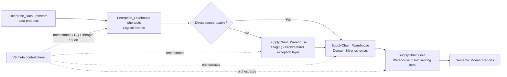

# Super Plan: Hybrid Medallion Refactor Cho Supply Chain v9

## 1. Ket Luan Kien Truc

Chon huong **Hybrid Medallion, domain-owned Silver, exception-based staging**.

- [Verified] `Enterprise_Lakehouse` trong `SupplyChain Dev` la shortcut/access layer, khong phai transformation-owned Bronze.
- [Verified] Logical Bronze nen la du lieu source/shortcut tu `Enterprise_Data`, theo Fabric medallion va shortcut guidance.
- [Verified] Lakehouse SQL Analytics Endpoint la read-only, nen neu can `CTAS`, `MERGE`, persisted snapshot, audit/replay thi van can Warehouse/staging.
- [Likely] Khong nen xoa toan bo lop mirror ngay. Nen chuyen tu "load all Bronze" sang "direct by default, staging by exception".

Target flow:

Pure Mermaid file: [`mermaid/01_super_plan_target_flow.mmd`](mermaid/01_super_plan_target_flow.mmd)

## 2. Layer Definition Sau Refactor

| Layer | Vi tri de xuat | Vai tro | Rule chinh |
|---|---|---|---|
| Bronze | `Enterprise_Data` source + `SupplyChain Dev.Enterprise_Lakehouse` shortcuts | Logical raw/source access | Bronze phai mimic source structure, khong chua business enhancement |
| Staging / BronzeMirror | `SupplyChain Dev.SupplyChain_Warehouse` | Persisted operational cache khi can | Chi dung cho exception: source thieu on dinh, performance, snapshot, replay, EDW supplement |
| Silver | `SupplyChain Dev.SupplyChain_Warehouse` cho domain Supply Chain | Cleaned, conformed trong domain, business transformation | Schema PascalCase theo nhom metric/process, khong dung schema generic `silver` dai han |
| Enterprise Silver | `Enterprise_Data` workspace | Reusable/conformed across domains | Chi promote entity neu all-domain hoac shared enterprise contract |
| Gold | Dedicated Supply Chain Gold Warehouse / serving item | BI-ready, semantic model source | Tach khoi transformation warehouse neu co the |

## 3. Mapping Tu v9 Hien Tai Sang Target

Current v9 co 28 active tables, 52 lineage edges, 7 pipelines, generic SQL framework, DQ, DAG, lineage, audit. Target khong rewrite toan bo. Refactor chu yeu la **physical separation + naming + source access policy**.

| Current v9 | Target | Hanh dong |
|---|---|---|
| `bronze` schema | Logical Bronze nam o shortcuts/source; persisted part thanh `Staging` hoac `BronzeMirror` | Rename concept truoc, migrate vat ly theo compatibility plan |
| `bronze` objects co `TRIM`, `CAST`, `CASE`, filter, standardization | Silver / working transformation | Move logic ra khoi Bronze vi Bob dung: enhancement khong nen o Bronze |
| 4 `_edw` supplement tables | Staging exception | Giu tam trong initial build; 2 object la ExitCandidate, 2 object NotReady theo v9 note; formal lifecycle in `ADR-002` |
| `silver` schema | PascalCase domain schemas | Vi du: `ForecastHistory`, `WholesaleSalesHistoryAFI`, `OpenOrderHistory`, `MasterDataReference` |
| `gold` schema | Dedicated Gold Warehouse / Gold serving schemas | Vi du: `ForecastAccuracyWholesale`, `ForecastAccuracyRetail` |
| `meta` schema | V9 control plane retained | Extend metadata de support direct/stage/cross-workspace |

## 4. Quy Tac Direct vs Staging

Default moi: **direct from `Enterprise_Lakehouse` shortcuts**.

Chi giu staging neu mot trong cac dieu kien dung:

- Source chua co SLA/schema contract ro rang.
- Can snapshot consistency cho ca pipeline run.
- Can replay/debug raw input sau khi source thay doi.
- Query direct qua cham hoac bi scan lap nhieu lan.
- Can persisted `_load_dt`, batch id, audit columns.
- Can xu ly bang Warehouse-native DML/CTAS/MERGE.
- Source hien tai la workaround, vi du 4 `_edw` supplement. Sau nay cutover tung object qua `Enterprise_Lakehouse` khi dual-read validation va approval pass.
- `_edw` exit phai theo `docs/decisions/ADR-002-edw-supplement-exit-strategy.md`, khong bulk switch.

Neu data sau nay on dinh: [Likely] co the bo lop mirror cho cac table du dieu kien. Nhung khong nen bo staging nhu mot capability cua framework. Nen giu **optional staging pattern** trong v9, khong giu **mandatory Bronze duplication**.

## 5. V9 Capability Phai Giu 100% / Hoan Thien Neu Dang Optional

Khong thay v9 bang architecture "dep nhung mat van hanh". Cac capability van hanh cua v9 la non-negotiable, nhung sau audit can tach ro 2 nhom:

### 5.1 Existing capability phai preserve

- Metadata-driven control plane: `sp_registry`, config-based execution.
- Generic reusable SQL load framework.
- DAG/wave orchestration cho Silver.
- Lineage tu dong tu metadata/source objects.
- Run history, audit logging, pipeline finalization.
- Semantic model integration discipline.
- Parent-child pipeline orchestration.

### 5.2 Capability phai preserve intent va hoan thien/verify

- DQ rules va DQ gate behavior: engine co san, gate dang deactivated for performance.
- Source-target reconciliation: can build/activate ro trong v10, khong claim la da hoan tat trong v9.
- Smart scheduling / skip logic: `next_run_time` va function co san, nhung can verify live pipeline Lookup vi docs hien tai co conflict.
- Schema contracts va drift detection: objects co san, can promote thanh first-class preflight gate.
- Performance baseline / cost monitor: objects co san, can quyet dinh activate hay keep optional.
- Alerting/SLA: design co san nhung dang blocked by IT/admin permissions.

Diem can chinh: framework phai hieu them `AccessMode`:

- `DirectShortcut`
- `StageRequired`
- `EDWSupplement`
- `ManualSeed`
- `EnterpriseSilver`
- `GoldServing`

## 6. Metadata / Interface Changes

Extend metadata layer, khong hardcode trong pipeline.

| Field | Muc dich |
|---|---|
| `canonical_layer` | Bronze / Staging / Silver / Gold theo logical architecture |
| `physical_workspace` | Workspace thuc te chua object |
| `physical_item` | Warehouse/Lakehouse thuc te |
| `access_mode` | DirectShortcut / StageRequired / EDWSupplement / ManualSeed |
| `domain_group` | ForecastHistory, InventoryHistory, SalesHistory, etc. |
| `is_enterprise_reusable` | Co promote sang Enterprise_Data hay khong |
| `staging_reason` | Vi sao can persisted staging |
| `source_contract_status` | Stable / Pending / Exception |
| `approval_status` | Draft / RakeshApproved / BobReviewed |

## 7. Uoc Luong Cong Viec

Uoc luong nay la theo engineering effort, khong phai object count.

| Nhom | Uoc luong | Ghi chu |
|---|---:|---|
| Giu nguyen ve concept | 30-35% | v9 control plane, DAG, DQ, lineage, audit, scheduling van giu |
| Chinh sua/refactor | 45-50% | registry, pipeline params, schema naming, source references, DQ semantics, lineage |
| Build moi | 15-25% | Gold Warehouse, compatibility views, source contract gates, migration validation |

Danh gia: [Likely] day la **refactor architecture lon**, nhung **khong phai rewrite v9**. Phan business SQL co the tai su dung nhieu; phan orchestration/control-plane giu lai logic chinh nhung can mo rong metadata.

## 8. Implementation Phases

### Phase 0 - Approval And Baseline

- Export current registry, lineage, view definitions, row counts, DQ results, semantic model dependencies.
- Chot naming standard voi Bob/Rakesh: PascalCase cho Silver/Gold, Bronze mimic source.
- Chot entity classification: domain-specific vs enterprise-reusable.

Exit criteria:

- Co mapping table cho toan bo active objects.
- Co danh sach table direct vs staging.
- Co approval gate truoc khi develop.

### Phase 1 - Classification

Phan loai tung object:

- Source mimic only.
- Operational staging.
- Silver transformation.
- Enterprise reusable Silver.
- Gold serving.
- Manual/domain reference.

Current likely classification:

- 4 `_edw` tables: staging exception.
- Current `bronze` views co transformation: move logic sang Silver/working layer.
- Current Silver: domain Silver, giu o `SupplyChain Dev.SupplyChain_Warehouse` tru khi entity reusable.
- Current Gold: move sang dedicated Gold serving item.

### Phase 2 - Metadata Refactor

- Add metadata fields cho `access_mode`, `canonical_layer`, `domain_group`, `physical_item`.
- Update generic load logic de chon direct vs stage.
- Update lineage builder de show ca logical Bronze va physical staging neu co.
- Update DQ framework de tach:
  - source contract checks,
  - staging checks,
  - Silver business DQ,
  - Gold KPI reconciliation.

### Phase 3 - Bronze Demotion To Logical Bronze

- Khong xem current `bronze` schema la canonical Bronze nua.
- Direct-read candidates doc tu `Enterprise_Lakehouse` shortcuts.
- Persisted tables chi con trong `Staging`/`BronzeMirror` neu co ly do.
- Khong drop old `bronze` ngay. Tao compatibility layer trong transition.

### Phase 4 - Silver Domain Schema Refactor

- Convert schema generic `silver` sang PascalCase logical schemas.
- Candidate grouping:
  - `ForecastHistory`
  - `WholesaleSalesHistoryAFI`
  - `OpenOrderHistory`
  - `MasterDataReference`
  - `InventoryHistory` neu co inventory-specific entities sau nay
- Promote sang `Enterprise_Data` chi khi entity reusable across domains.

### Phase 5 - Gold Separation

- Tao dedicated Gold serving item cho Supply Chain.
- Move BI-ready outputs ra khoi transformation schema.
- Candidate Gold schemas/marts:
  - `ForecastAccuracyWholesale`
  - `ForecastAccuracyRetail`
  - shared `ForecastAccuracy` neu retail/wholesale chua tach du ro.
- Semantic model chi nen doc Gold serving layer, khong doc Silver/Staging truc tiep.
- Neu semantic model dung Direct Lake nghiem ngat, Gold serving nen la physical Gold tables backed by Delta/OneLake. Khong nen dat SQL views lam default semantic-source layer vi non-materialized SQL views co the lam DirectQuery fallback.
- Compatibility views chi nen dung cho migration/legacy/import/DirectQuery scenarios, hoac khi da chap nhan fallback behavior.

### Phase 6 - Parallel Run And Cutover

- Build new objects side-by-side.
- Run old v9 and new target pipeline in parallel.
- Compare row counts, key-level counts, aggregates, DQ results, semantic measures.
- Cutover only after repeated successful runs and approval.

Recommended cutover gate:

- 3 successful daily runs.
- 0 critical DQ failures.
- Gold KPI variance explained and signed off.
- Semantic model refresh green.
- Lineage graph complete from Enterprise source to Gold.

## 9. Test Plan

Required validation:

- Schema contract: all required columns, types, nullability expectations.
- Row count reconciliation: source/direct/stage/Silver/Gold.
- Duplicate checks on business keys.
- Null checks on key dimensions and measure fields.
- Freshness checks for direct shortcuts and staged tables.
- Source-target reconciliation for all high-volume facts.
- DQ gate behavior for fail/warn modes.
- DAG dependency order and smart skip behavior.
- Lineage completeness, including `_edw` temporary bridge.
- Performance comparison against current v9 baseline.
- Semantic model refresh and measure parity.

## 10. Main Risks

| Risk | Impact | Mitigation |
|---|---|---|
| Direct shortcut source changes during run | Non-deterministic results | Use staging only for tables requiring snapshot consistency |
| Removing mirror too early | Loss of replay/audit/debug ability | Table-by-table staging decision |
| PascalCase/schema rename breaks consumers | Reports/models fail | Compatibility views and controlled cutover |
| Enterprise reusable boundary unclear | Wrong ownership | Rakesh/Bob approval gate |
| Current Bronze contains transformations | Architecture remains non-standard | Move transformations to Silver/domain schemas |
| EDW supplement still temporary | Lineage/source confusion | Keep explicit `EDWSupplement` access mode |

Current readiness score: `88/100` in `16_v10_readiness_scorecard_and_v9_cleanup.md`. Score nay du cho side-by-side planning, chua du cho production cutover hay v9 cleanup.

## 11. Recommendation

Proceed with **Hybrid Medallion Refactor**:

1. Treat `Enterprise_Lakehouse` shortcuts as logical Bronze.
2. Keep `SupplyChain_Warehouse` in `SupplyChain Dev` as domain processing warehouse.
3. Keep SupplyChain-specific Silver in SupplyChain Dev.
4. Promote only reusable/all-domain Silver entities to `Enterprise_Data`.
5. Replace mandatory Bronze duplication with optional staging.
6. Create dedicated Gold serving boundary.
7. Preserve v9 control-plane capabilities fully.
8. Refactor by metadata and compatibility, not destructive rename/drop.

## 12. Sources Used

Official docs:

- Microsoft Fabric medallion architecture: https://learn.microsoft.com/en-us/fabric/onelake/onelake-medallion-lakehouse-architecture
- Microsoft Fabric shortcuts: https://learn.microsoft.com/en-us/fabric/onelake/onelake-shortcuts
- Lakehouse shortcuts: https://learn.microsoft.com/en-us/fabric/data-engineering/lakehouse-shortcuts
- Lakehouse SQL analytics endpoint: https://learn.microsoft.com/en-us/fabric/data-engineering/lakehouse-sql-analytics-endpoint
- Lakehouse + Warehouse SQL endpoint usage: https://learn.microsoft.com/en-us/fabric/data-warehouse/get-started-lakehouse-sql-analytics-endpoint
- Lakehouse vs Warehouse guide: https://learn.microsoft.com/en-us/fabric/fundamentals/decision-guide-lakehouse-warehouse
- Fabric Warehouse T-SQL surface area: https://learn.microsoft.com/en-us/fabric/data-warehouse/tsql-surface-area

Local project evidence:

- [README.md](../01_Architect_v9_April/README.md)
- [FULL_CONTEXT.md](../01_Architect_v9_April/FULL_CONTEXT.md)
- [01_architecture.md](../01_Architect_v9_April/01_sc_forecast/docs/01_architecture.md)
- [03_fabric_vs_enterprise.md](../01_Architect_v9_April/01_sc_forecast/enterprise/03_fabric_vs_enterprise.md)
- [edw_source_swap.md](../01_Architect_v9_April/01_sc_forecast/docs/operations/edw_source_swap.md)
- [ADR-002 EDW supplement exit](../docs/decisions/ADR-002-edw-supplement-exit-strategy.md)
- [v10 readiness scorecard](16_v10_readiness_scorecard_and_v9_cleanup.md)
