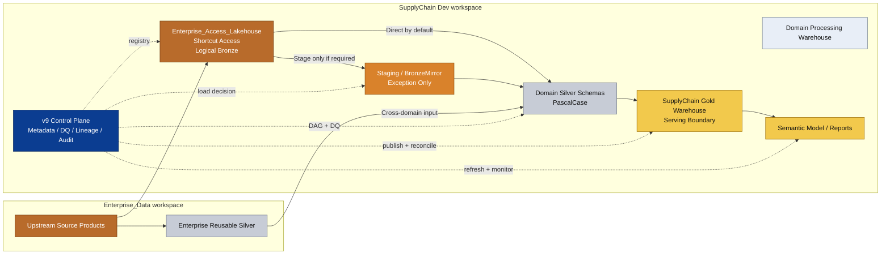
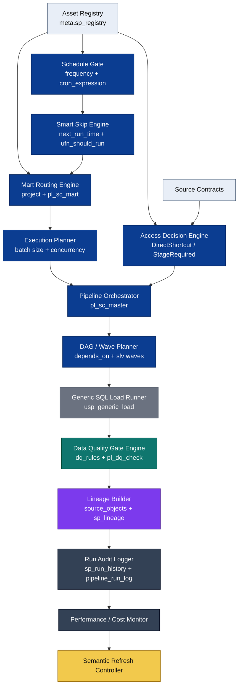
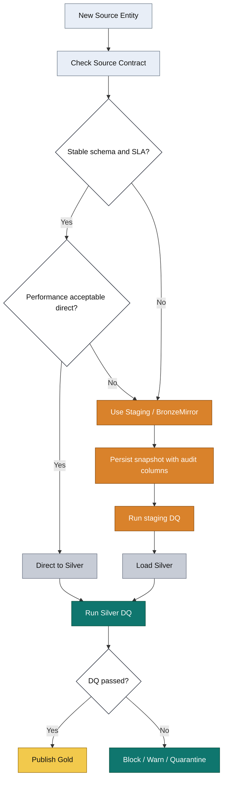
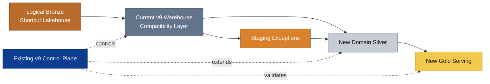
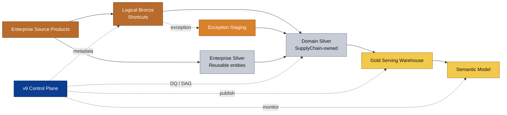
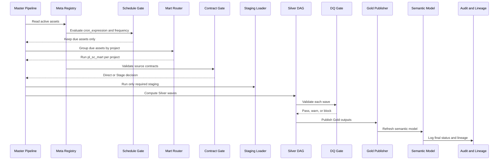

# Architecture Blueprint: Hybrid Medallion v10

Muc tieu: nhin kien truc theo 2 lop rieng biet:

- **Logical Medallion**: Bronze / Silver / Gold theo chat luong du lieu.
- **Physical Fabric Setup**: workspace, lakehouse, warehouse, control plane, pipeline, semantic model.

Diem quan trong: **v9 control plane khong phai Bronze/Silver/Gold**. No la lop dieu khien nam ngang, quan ly orchestration, DQ, lineage, audit, scheduling cho toan bo Medallion.

## 1. Pure Mermaid Files

Neu copy len Mermaid Live Editor, hay copy truc tiep cac file `.mmd` trong folder [`mermaid`](mermaid/), khong copy cac block `text`.

- [`mermaid/01_super_plan_target_flow.mmd`](mermaid/01_super_plan_target_flow.mmd)
- [`mermaid/02_main_architecture.mmd`](mermaid/02_main_architecture.mmd)
- [`mermaid/03_control_plane.mmd`](mermaid/03_control_plane.mmd)
- [`mermaid/04_direct_vs_staging_decision.mmd`](mermaid/04_direct_vs_staging_decision.mmd)
- [`mermaid/05_short_term_transition.mmd`](mermaid/05_short_term_transition.mmd)
- [`mermaid/06_long_term_target.mmd`](mermaid/06_long_term_target.mmd)
- [`mermaid/07_pipeline_sequence.mmd`](mermaid/07_pipeline_sequence.mmd)
- [`mermaid/08_mart_schedule_smart_skip.mmd`](mermaid/08_mart_schedule_smart_skip.mmd)
- [`mermaid/09_v9_feature_parity_control_plane.mmd`](mermaid/09_v9_feature_parity_control_plane.mmd)
- [`mermaid/10_bob_standards_overlay.mmd`](mermaid/10_bob_standards_overlay.mmd)

## 2. Overview De Nhin

Enterprise_Data:

- Upstream source products.
- Reusable enterprise Silver when cross-domain.

SupplyChain Dev:

- `Enterprise_Access_Lakehouse`: shortcut access layer, logical Bronze for Supply Chain.
- Optional `Staging` / `BronzeMirror`: only when direct shortcut is not enough.
- Domain Silver schemas: Supply Chain-owned transformation.
- Gold serving warehouse/item: BI-ready consumption boundary.
- Semantic model / reports.

v9/v10 Control Plane:

Note: day la control-plane target can preserve/activate trong v10. Mot so capability hien tai co object/design nhung can verify hoac activate trong pipeline, dac biet `Smart Skip`, `Schema Contract Gate`, `Performance Baseline Monitor`, `Cost Monitor`, va alert/SLA hooks.

- Metadata registry.
- Generic load framework.
- Load pattern router.
- Mart routing / multi-mart orchestration.
- Schedule gate / cron evaluation.
- Smart skip by `next_run_time`.
- Execution planner for batch size and concurrency.
- DAG orchestration.
- Parent-child wave runner.
- DQ gates.
- Schema contract gate.
- Lineage.
- Audit logging.
- Retry / snapshot conflict guard.
- Smart scheduling.
- Timezone normalizer.
- Enterprise dictionary adapter.
- Performance baseline monitor.
- Cost monitor.
- Schema contracts.
- Semantic refresh controls.

## 3. Main Architecture Diagram

GitHub/Mermaid version:

Pure Mermaid file: [`mermaid/02_main_architecture.mmd`](mermaid/02_main_architecture.mmd)



## 4. Medallion Meaning Sau Refactor

### Bronze

- [Verified] Bronze la raw/source-aligned layer.
- Trong kien truc nay, Bronze khong nen la schema `bronze` trong Warehouse nua.
- Bronze logical = `Enterprise_Access_Lakehouse` shortcuts toi source tu `Enterprise_Data`.
- Bronze phai mimic source structure, khong chua business enhancement.

### Staging / BronzeMirror

- Khong phai Medallion layer chuan.
- La lop van hanh phu tro.
- Chi dung khi direct shortcut chua du on dinh hoac can persisted state.
- Day la noi thay the tu duy "copy toan bo Bronze".

### Silver

- La layer transformation chinh.
- Voi domain Supply Chain, Silver co the nam trong `SupplyChain Dev.SupplyChain_Warehouse`.
- Neu object la cross-domain, reusable, conformed enterprise entity thi moi promote sang `Enterprise_Data`.

### Gold

- La serving layer.
- Nen tach thanh Gold Warehouse/item rieng de phuc vu semantic model va BI.
- Gold khong nen lan voi staging/control/transformation.

## 5. Physical Setup Template

Khong dung table/data thuc te, chi la template.

```text
SupplyChain Dev workspace
├── Enterprise_Access_Lakehouse
│   ├── SourceSystemA
│   ├── SourceSystemB
│   └── ReferenceDomain
│
├── SupplyChain_Processing_Warehouse
│   ├── Meta
│   ├── Staging
│   ├── ForecastHistory
│   ├── InventoryHistory
│   ├── SalesHistory
│   ├── OrderHistory
│   └── ReferenceMaster
│
├── SupplyChain_Gold_Warehouse
│   ├── ForecastAccuracy
│   ├── InventoryPerformance
│   └── ServiceLevel
│
└── SupplyChain_Semantic_Model
    ├── certified measures
    ├── relationships
    └── BI reports
```

Enterprise side:

```text
Enterprise_Data workspace
├── Source_Data / upstream source products
├── Shared_Enterprise_Silver
│   ├── Customer
│   ├── Product
│   ├── Calendar
│   └── CrossDomainSales
└── Enterprise governance / contracts / approvals
```

## 6. Control Plane Placement

Recommended:

```text
Near-term:
  Keep v9 control plane inside SupplyChain_Processing_Warehouse.Meta

Long-term:
  Option A: keep local Meta for domain autonomy
  Option B: move shared orchestration metadata to enterprise ETL framework
  Option C: split local execution metadata and enterprise governance metadata
```

Recommendation: giu `Meta` local truoc. Khong nen move control plane qua som vi de pha DAG, DQ, logging, lineage hien tai.

Control plane khong chua business fact. No chua metadata van hanh.

Pure Mermaid file: [`mermaid/03_control_plane.mmd`](mermaid/03_control_plane.mmd)



Dedicated multi-mart, schedule, smart-skip Mermaid:

Pure Mermaid file: [`mermaid/08_mart_schedule_smart_skip.mmd`](mermaid/08_mart_schedule_smart_skip.mmd)

Full v9 feature parity control-plane Mermaid:

Pure Mermaid file: [`mermaid/09_v9_feature_parity_control_plane.mmd`](mermaid/09_v9_feature_parity_control_plane.mmd)

## 7. Direct vs Staging Logic

Pure Mermaid file: [`mermaid/04_direct_vs_staging_decision.mmd`](mermaid/04_direct_vs_staging_decision.mmd)



Rule:

```text
Direct shortcut is default.
Staging is exception.

Use staging only when:
- source contract is not stable
- schema drift risk is high
- source coverage is incomplete
- persisted snapshot is required
- replay/debug is required
- direct query performance is not acceptable
- warehouse-native DML/CTAS/MERGE is required
```

## 8. Short-Term vs Long-Term

### Short-Term Target

```text
Keep v9 running
  -> classify objects
  -> introduce AccessMode metadata
  -> treat Lakehouse shortcut as logical Bronze
  -> keep current mirror only where needed
  -> create compatibility views
  -> build new Gold boundary
  -> run old and new paths in parallel
```

Short-term diagram:

Pure Mermaid file: [`mermaid/05_short_term_transition.mmd`](mermaid/05_short_term_transition.mmd)



### Long-Term Target

```text
Logical Bronze shortcut is trusted
  -> direct to Silver for most entities
  -> staging exists but only for exceptions
  -> reusable Silver promoted to Enterprise_Data
  -> Gold is clean serving layer
  -> v9 control plane remains the operating system
```

Long-term diagram:

Pure Mermaid file: [`mermaid/06_long_term_target.mmd`](mermaid/06_long_term_target.mmd)



## 9. Metadata Template

Control plane nen co metadata du de khong hardcode layer logic.

```text
Meta.AssetRegistry
  - asset_name
  - logical_layer
  - physical_workspace
  - physical_item
  - physical_schema
  - physical_object
  - domain_group
  - access_mode
  - load_pattern
  - schedule_group
  - dependency_group
  - is_enterprise_reusable
  - is_active

Meta.SourceContract
  - source_asset
  - owner
  - sla_status
  - schema_status
  - freshness_expectation
  - allowed_drift_policy
  - approval_status

Meta.StagingPolicy
  - asset_name
  - staging_required
  - staging_reason
  - snapshot_required
  - retention_policy
  - replay_required

Meta.DqRule
  - asset_name
  - rule_type
  - severity
  - gate_action
  - sql_template
  - active_flag

Meta.LineageEdge
  - source_asset
  - target_asset
  - edge_type
  - logical_layer_from
  - logical_layer_to
  - physical_item_from
  - physical_item_to

Meta.RunLog
  - run_id
  - asset_name
  - status
  - start_time
  - end_time
  - rows_read
  - rows_written
  - error_message
```

## 10. Pipeline Logic Template

```text
pl_master
  -> load active registry
  -> group by schedule / mart / domain
  -> call pl_domain_mart

pl_domain_mart
  -> source contract validation
  -> staging decision
  -> run staging loads if required
  -> compute Silver DAG waves
  -> run Silver loads by dependency wave
  -> run DQ gates
  -> publish Gold
  -> refresh semantic model
  -> finalize lineage and audit
```

Mermaid:

Pure Mermaid file: [`mermaid/07_pipeline_sequence.mmd`](mermaid/07_pipeline_sequence.mmd)



## 11. Diem Sang v9 Duoc Giu 100%

```text
v9 strengths kept:
- Metadata-driven execution
- Generic SQL load framework
- DAG / wave orchestration
- Data Quality gates
- Auto lineage
- Run audit and finalization
- Smart scheduling
- Schema contracts
- Performance baseline
- Cost logging
- Semantic model refresh discipline
```

Diem thay doi la: v9 khong con assume "Bronze = local warehouse schema bat buoc". v9 se control bang metadata:

```text
AccessMode = DirectShortcut
AccessMode = StageRequired
AccessMode = ManualSeed
AccessMode = EnterpriseSilver
AccessMode = GoldServing
```

## 12. Danh Gia Kien Truc

- [Verified] Fabric medallion khuyen nghi Bronze raw, Silver enriched/validated, Gold curated.
- [Verified] Shortcuts giup query/reference data khong copy, phu hop de xem Enterprise Lakehouse shortcut la logical Bronze.
- [Verified] Lakehouse SQL Analytics Endpoint read-only, nen khong thay the hoan toan Warehouse-native processing neu can write/DML/CTAS/MERGE.
- [Likely] Hybrid la best fit cho v9 vi giu duoc diem manh van hanh nhung giam duplication.
- [Likely] Long-term nen giam staging dan, nhung khong xoa staging capability khoi framework.

## 13. Nguon Chinh

- Microsoft Fabric Medallion Architecture: https://learn.microsoft.com/en-us/fabric/onelake/onelake-medallion-lakehouse-architecture
- Fabric Lakehouse Shortcuts: https://learn.microsoft.com/en-us/fabric/data-engineering/lakehouse-shortcuts
- OneLake Shortcuts: https://learn.microsoft.com/en-us/fabric/onelake/onelake-shortcuts
- Lakehouse SQL Analytics Endpoint: https://learn.microsoft.com/en-us/fabric/data-engineering/lakehouse-sql-analytics-endpoint
- Better Together Lakehouse and Warehouse: https://learn.microsoft.com/en-us/fabric/data-warehouse/get-started-lakehouse-sql-analytics-endpoint
- Warehouse vs Lakehouse Decision Guide: https://learn.microsoft.com/en-us/fabric/fundamentals/decision-guide-lakehouse-warehouse
- Fabric Warehouse T-SQL Surface Area: https://learn.microsoft.com/en-us/fabric/data-warehouse/tsql-surface-area
