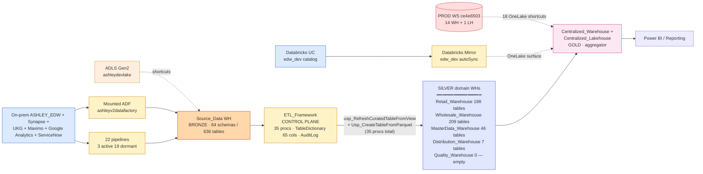

# Architecture at a Glance — `EnterpriseData-Dev`

## High-level data flow

## Layer roles

| Layer | Workspace location | Object type | Owner |
|-------|---------------------|-------------|-------|
| Source raw | `Source_Data` (64 schemas, 636 tables) | Warehouse | Bob's team central |
| Control plane | `ETL_Framework` (35 procs, TableDictionary, AuditLog) | Warehouse | Bob's team central |
| Silver — Wholesale | `Wholesale_Warehouse` (28 schemas, 209 tables, 126 _Wrk views) | Warehouse | Wholesale value-stream team |
| Silver — Retail | `Retail_Warehouse` (25 schemas, 198 tables, 41 views, 146 procs) | Warehouse | Retail value-stream team |
| Silver — Master Data | `MasterData_Warehouse` (14 schemas, 46 tables) | Warehouse | MasterData / Central team |
| Silver — Distribution | `Distribution_Warehouse` (8 schemas, 7 tables) | Warehouse | Distribution team (incomplete) |
| Silver — Quality | `Quality_Warehouse` (6 schemas, **0 tables — empty shell**) | Warehouse | TBD (not built) |
| Silver — **SupplyChain (NEW, pending)** | `SupplyChain_Warehouse` — DOES NOT EXIST | Warehouse | **VN team** (proposed) |
| Gold | `Centralized_Warehouse` (23 schemas, 38 tables, 0 procs internal) | Warehouse | Bob's team |
| Gold lakehouse | `Centralized_Lakehouse` (501 tables, 5.92B rows via shortcut to PROD) | Lakehouse | Bob's team |
| Sandbox | `A_Developement` (3 local + 7 ADLS shortcuts) | Lakehouse | Dev sandbox |

## Domain ownership pattern

Each domain Silver warehouse is **owned by the value-stream team** building data products on it. The team:
- Self-registers tables in `ETL_Framework.DW_Developer.TableDictionary`
- Writes Bronze→Silver views in their own `_Wrk` schemas
- Calls `usp_RefreshCuratedTableFromView` (or family variant) to load curated tables
- Owns SLA, alerts, code review for their slice

This is the **hub-and-spoke pattern**: one shared substrate (this workspace) + N value-stream workspaces consuming + contributing.

## Active vs dormant

| Status | Count | Note |
|--------|------:|------|
| Active (recent runs) | 3 / 41 | `Source_EDW_Check_Test` daily, `EDW2FabricLoader`, `MetaData-Pull` |
| Dormant (definitions only) | 38 / 41 | Most pipelines exist but don't run on schedule |
| Mirror Databricks autoSync | 1 (always running) | last sync 2026-05-08 05:57 |

## Critical operational facts

- **Data lives in PROD, not DEV**. `Centralized_Lakehouse.Retail_*` tables = OneLake shortcuts to PROD `EnterpriseData` workspace. Writing back affects PROD-shaped paths.
- **Don't run** `MetaData-Pull` notebook **cell 1** — has plaintext SP secret; use cell 2/3/4 with Key Vault.
- **Don't trust pipeline names** like `test`, `pipeline1` — they perform real cross-workspace Copy from PROD into `Commissions_Prototype` SQLDatabase.
- **VN team has read-only access via shortcuts**, no write to any WH currently.

## Cross-refs

- [Workspace overview](01_workspace_overview.md)
- [Storage inventory](../10_evidence/01_storage_inventory.md)
- [ETL framework deep dive](../projects/etl_framework/SYNTHESIS.md)
- Raw scan diagram: `_external_refs/enterprisedata-dev-docs/images/01-high-level-architecture.svg`
