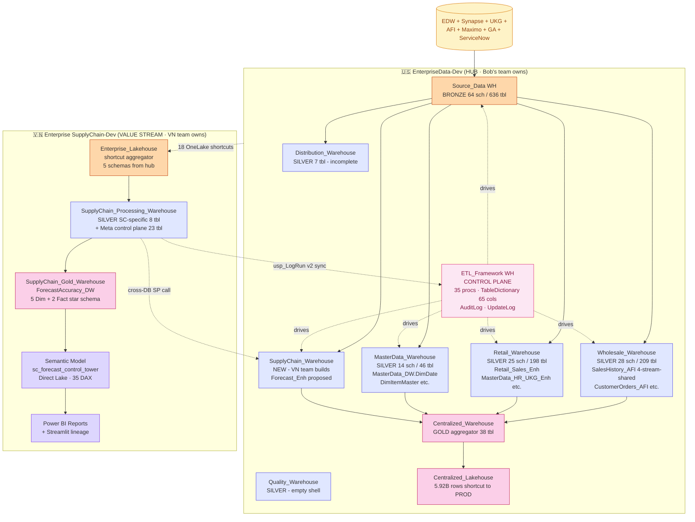
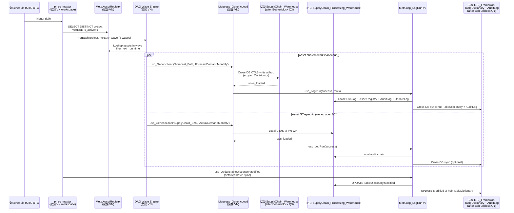
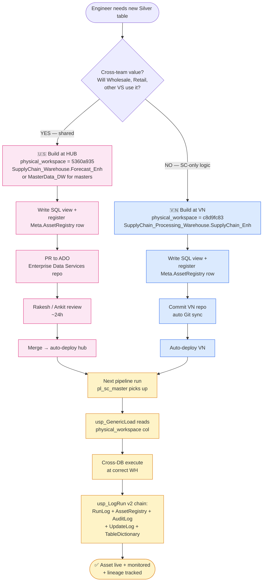

# Cross-Workspace Multi-Medallion Flow

> Mermaid diagrams showing data flow across `EnterpriseData-Dev` (hub) and `Enterprise SupplyChain-Dev` (VN value stream).

## Diagram 1 — End-to-end architecture (current state)



## Diagram 2 — Daily pipeline orchestration



## Diagram 3 — Engineer adding a new Silver table (decision tree)



## Diagram 4 — Domain ownership map

```mermaid
flowchart LR
    classDef hub fill:#fce7f3,stroke:#db2777
    classDef vs fill:#dbeafe,stroke:#2563eb

    subgraph TEAMS [Domain teams]
        BOB[Bob/Rakesh team<br/>US Enterprise]
        WS[Wholesale team]
        RT[Retail team]
        DI[Distribution team]
        SC[VN SC team<br/>Aric + Cherry]
    end

    subgraph HUB [🇺🇸 EnterpriseData-Dev]
        ETLF[ETL_Framework]:::hub
        SD[Source_Data]:::hub
        WHWH[Wholesale_Warehouse]:::hub
        RTWH[Retail_Warehouse]:::hub
        MDWH[MasterData_Warehouse]:::hub
        DSWH[Distribution_Warehouse]:::hub
        SCWH[SupplyChain_Warehouse<br/>NEW]:::hub
        CWH[Centralized_Warehouse]:::hub
    end

    subgraph VS [🇻🇳 Enterprise SupplyChain-Dev]
        ELake[Enterprise_Lakehouse]:::vs
        SCPWH[SupplyChain_Processing_Warehouse]:::vs
        SCGWH[SupplyChain_Gold_Warehouse]:::vs
    end

    BOB -.owns.-> ETLF
    BOB -.owns.-> SD
    BOB -.owns.-> MDWH
    BOB -.owns.-> CWH
    WS -.owns.-> WHWH
    RT -.owns.-> RTWH
    DI -.owns.-> DSWH
    SC -.owns scoped.-> SCWH

    SC ==owns full==> ELake
    SC ==owns full==> SCPWH
    SC ==owns full==> SCGWH
```

## Cross-refs

- Storage inventory: [`../10_evidence/01_storage_inventory.md`](../10_evidence/01_storage_inventory.md)
- ETL framework alignment: [`../20_proposals/01_etl_framework_alignment.md`](../20_proposals/01_etl_framework_alignment.md)
- VN architect diagrams: [`../../Enterprise_SupplyChain_Dev_architect/diagrams/`](../../Enterprise_SupplyChain_Dev_architect/diagrams/)
