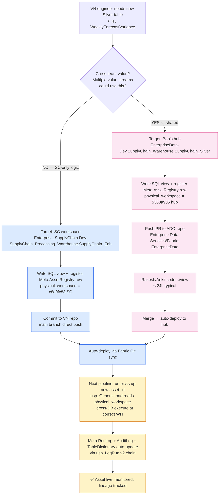
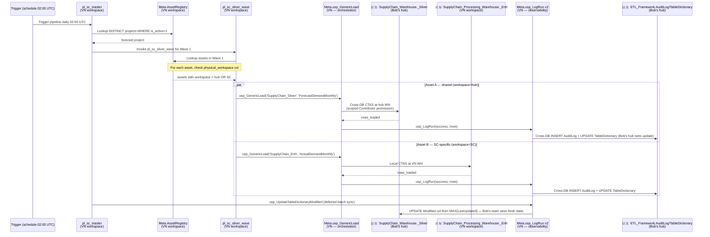

# Future-State Workflow — Build-Direct Pattern (post Bob unblock)

> Pre-condition: Bob/Rakesh grant scoped Contributor on `EnterpriseData-Dev.SupplyChain_Warehouse.SupplyChain_Silver` + Azure DevOps `Enterprise Data Services` access.

## §1. End-to-End Data Flow (architectural view)

```
┌──────────────────────────────────────────────────────────────────────────────────────────┐
│                          🇺🇸 EnterpriseData-Dev (Bob's hub)                              │
│                                                                                            │
│  ┌─ Bronze layer ─────────┐   ┌─ Silver shared cross-team ──────────────────────────┐   │
│  │ Source_Data            │──▶│ MasterData_Warehouse.MasterData_DW                  │   │
│  │  ├─ EDW landing 64 sch │   │  ├─ DimDate (extended +29 cols by VN)               │   │
│  │  ├─ ADF mounted feeds  │   │  └─ DimItemMaster (existing, owned by Bob's team)   │   │
│  │  └─ Mirror Databricks  │   │                                                       │   │
│  └────────────────────────┘   │ Wholesale_Warehouse.SalesHistory_AFI                 │   │
│           │                    │  └─ InvoiceDetail (existing, shared 4 streams)       │   │
│           │                    │                                                       │   │
│           ▼                    │ SupplyChain_Warehouse.SupplyChain_Silver  (NEW)     │   │
│  ┌─ Control plane ────────┐   │  ├─ ForecastDemandMonthly  (VN built directly)      │   │
│  │ ETL_Framework          │◀──│  ├─ NaiveForecastMonthly   (VN built directly)      │   │
│  │  ├─ TableDictionary 65 │   │  └─ ForecastCycle          (VN reference)            │   │
│  │  ├─ AuditLog           │   └────────────────────────────────────────────────────┘   │
│  │  └─ usp_Refresh procs  │                       ▲                                    │
│  └────────────────────────┘                       │                                    │
└────────────────────────────────────────────────────┼────────────────────────────────────┘
                       ▲                             │
                       │ (1) shortcut READ           │ (3) cross-DB SP CALL from VN pipeline
                       │     to Enterprise_Lakehouse │     (Contributor scoped to 1 schema)
                       │                             │
┌──────────────────────┼─────────────────────────────┼────────────────────────────────────┐
│                      │     🇻🇳 Enterprise_SupplyChain Dev (VN team)                   │
│                                                    │                                    │
│  ┌─ Bronze view ──────────┐   ┌─ Silver SC-specific (8 tables) ──────────────────┐  │
│  │ Enterprise_Lakehouse   │──▶│ SupplyChain_Processing_Warehouse                  │  │
│  │  (shortcut aggregator) │   │  └─ SupplyChain_Enh                               │  │
│  │  ├─ MasterData_DW.*    │   │      ├─ CustomerAccountGroup                      │  │
│  │  ├─ Customers.*        │   │      ├─ CustomerGrouping                          │  │
│  │  ├─ Wholesale_Codis_AFI│   │      ├─ ForecastHorizon                           │  │
│  │  ├─ Wholesale_Sourcing │   │      ├─ ActualDemandMonthly                       │  │
│  │  └─ SupplyChain_DW     │   │      ├─ ActualDemandWeekly                        │  │
│  └────────────────────────┘   │      ├─ InvoiceWeekly                             │  │
│                                │      ├─ OpenOrderLineLevel                        │  │
│                                │      └─ OpenOrderMonthly                          │  │
│                                └───────────────────────────────────────────────────┘  │
│                                                ▲                                       │
│                                                │ (4) cross-DB call                     │
│                                                │                                        │
│  ┌─ Control plane (Meta) ──┐                  │                                        │
│  │ AssetRegistry  (33 rows│ ─── reads ──▶ usp_GenericLoad ──┘                          │
│  │  ├─ shared:    workspace=hub                  │                                     │
│  │  └─ specific: workspace=SC                    ▼                                     │
│  │                                          (5) execute SP at right WH                 │
│  │ RunLog, AuditLog, UpdateLog, TableDictionary, DQRule, LineageEdge, DAG runtime  │  │
│  │      │                                                                          │  │
│  │      └── sync ──────▶ 🇺🇸 ETL_Framework.AuditLog/TableDictionary (cross-DB)   │  │
│  └─────────────────────────────────────────────────────────────────────────────┘  │
│                                                                                        │
│  ┌─ Gold + serving ──────────────────────────────────────────────────────────────┐  │
│  │ SupplyChain_Gold_Warehouse.ForecastAccuracy_DW                                 │  │
│  │  ├─ Dim* (5 tables)  ◀── consume Silver from BOTH workspaces (cross-DB)        │  │
│  │  └─ Fact* (2 tables)                                                            │  │
│  │           │                                                                      │  │
│  │           ▼                                                                      │  │
│  │ Semantic model: sc_forecast_control_tower (Direct Lake on Gold)                │  │
│  └─────────────────────────────────────────────────────────────────────────────┘  │
│                                  │                                                     │
│                                  ▼                                                     │
│                    Power BI reports + Streamlit lineage explorer (VN consumption)     │
└────────────────────────────────────────────────────────────────────────────────────────┘
```

## §2. Daily engineer workflow — adding a new Silver table



## §3. Pipeline execution sequence (cross-WS orchestration)



## §4. End-state object distribution

| Category | Count | Workspace | Owner |
|----------|------:|-----------|-------|
| Bronze raw (Source_Data 64 schemas) | 636 | 🇺🇸 hub | Bob's team |
| Bronze shortcut aggregator (Enterprise_Lakehouse) | 5 schemas | 🇻🇳 SC | Auto (from hub) |
| Silver shared — Master Data | 4 dims (DimDate ext, DimItemMaster, etc.) | 🇺🇸 hub | Bob's team primary, VN extension via PR |
| Silver shared — Wholesale (existing) | ~209 tables | 🇺🇸 hub | Wholesale team |
| Silver shared — SC (NEW build-direct) | 3 tables | 🇺🇸 hub | VN team scoped Contributor |
| Silver SC-specific | 8 tables | 🇻🇳 SC | VN team full owner |
| Meta control plane | 23 tables + 4 views + 17 SPs + 3 fns | 🇻🇳 SC primary, sync to 🇺🇸 hub | VN team |
| Gold + Star schema | 7 tables | 🇻🇳 SC | VN team |
| Semantic model | 1 (35 measures) | 🇻🇳 SC | VN team |
| Pipelines | 7 | 🇻🇳 SC | VN team |
| Reports + Streamlit | N | 🇻🇳 SC | VN team / Cherry |
| v8 legacy | SupplyChain_Lakehouse + SupplyChain_Warehouse | 🇻🇳 SC | Cherry |

## §5. Permission matrix (post Bob unblock)

| Role | 🇺🇸 EnterpriseData-Dev | 🇻🇳 Enterprise_SupplyChain Dev |
|------|-------------------------|----------------------------------|
| Bob / Rakesh team | Admin | Viewer (audit) |
| VN team (Aric, Cherry) | **Scoped Contributor** on `SupplyChain_Warehouse.SupplyChain_Silver` schema only + Viewer on rest | **Admin** |
| Cross-team value streams | Viewer / cross-DB consume | (no access) |

Scoping prevents VN team from accidentally touching Bob's `MasterData_DW`, `Wholesale_Warehouse`, `ETL_Framework` — write only to designated SC slot.

## §6. Engineer's mental model

```
┌────────────────────────────────────────────────────────────┐
│  When register asset_id, choose workspace by 1 question:  │
│                                                             │
│       "Will another value stream use this?"                 │
│                                                             │
│   YES  → physical_workspace = 5360a935 (hub)                │
│           → PR via Enterprise Data Services repo            │
│           → Rakesh review                                   │
│                                                             │
│   NO   → physical_workspace = c8d9fc83 (SC)                 │
│           → commit to VN repo                               │
│           → no review needed                                │
│                                                             │
│   Rest of the workflow is identical for both paths.         │
└────────────────────────────────────────────────────────────┘
```

## §7. Migration phases

| Phase | When | Action |
|-------|------|--------|
| **0 — Now** | Complete | Build-then-promote pattern (current). All Silver in SC workspace. |
| **1 — Bob unblock** | Pending Q1 + Q3 + Q4 | Bob grants scoped Contributor + creates `SupplyChain_Warehouse` in hub |
| **2 — Tier B retire** | After phase 1 | Drop 5 passthrough Silver tables (ItemMaster/Warehouse/CustomerAccount/CustomerShippingLocation/OrderType) — Gold reads Bronze direct |
| **3 — Tier C build-direct** | After phase 1 | Build 3 forecast Silver tables directly at hub `SupplyChain_Warehouse.SupplyChain_Silver` |
| **4 — Tier A MERGE** | After phase 1 | Extend `MasterData_Warehouse.MasterData_DW.DimDate` with VN's +29 cols via PR |
| **5 — Tier E retire** | After Bob data ready | Drop Staging_Wrk EDW supplements per ADR-002 |
| **6 — Tier F audit** | After workspace read access | Verify InvoiceDetailLineLevel overlap with `SalesHistory_AFI.InvoiceDetail` — retire if match |
| **7 — Steady state** | Phase 5 complete | All future shared Silver built directly at hub. SC workspace only has SC-specific + Gold + serving. |

## §8. Trade-offs (build-direct vs current promote pattern)

| Trade-off | Build-direct (future) | Current promote pattern |
|-----------|------------------------|--------------------------|
| Round-trip data movement | ✅ None | ❌ Build SC → promote hub |
| Engineer workflow complexity | ✅ 1 decision (workspace target) | ❌ Build + later promote |
| Permission model | ✅ Scoped (1 schema only) | ✅ No cross-WS write needed |
| Iteration speed for SC-specific | ✅ Direct VN commit | ✅ Same |
| Iteration speed for shared | ⚠️ PR review (≤ 24h) | ⚠️ Promote work (1-2 days) |
| Drift risk | ✅ None | ❌ 2 versions during transition |
| Bob's team visibility | ✅ Real-time (data in hub) | ❌ Only post-promote |
| Cross-team consumption | ✅ Direct from hub | ❌ Wait for promote completion |
| Onboarding new shared product | ✅ 1 day | ❌ 1 build + 1-2 promote |

## §9. Cross-refs

- ADR-005 v2 — Promote pathway (current state)
- ADR-008 — Bob alignment (current state — Implemented 2026-05-10)
- ADR-009 — **TBD** — Build-direct future state (write after Bob confirms permission model)
- `_open_questions_for_bob.md` Q3 — `SupplyChain_Warehouse` creation + Contributor scoping
- Email draft `email_to_bob_ankit_2026-05-10.md` Q3
