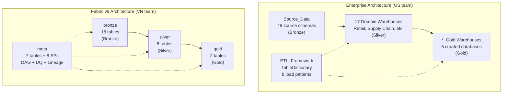

# Enterprise Architecture vs Fabric v9 — Detailed Comparison
> Enterprise: afi-migration-pilot/data-edw-fabric (US team)
> Fabric v9: SupplyChain_Warehouse Medallion (VN team)

---

## 1. Architecture Overview



| Aspect | Enterprise | v9 |
|--------|-----------|-----|
| Scale | 17 warehouses, 48 source schemas, 2578 files | 1 warehouse, 4 schemas, 100 objects |
| Language | T-SQL (.sqlproj) | T-SQL (direct on Warehouse) |
| Deployment | DacFx (.dacpac) via Azure Pipelines | Fabric REST API + Claude Code |
| Framework | Shared ETL_Framework (generic SPs) | meta schema (per-project) |

---

## 2. ETL Framework Comparison

### 2.1 Metadata Table

| | Enterprise `TableDictionary` | v9 `meta.sp_registry` |
|-|------------------------------|----------------------|
| Columns | **64** | 20 |
| Scope | ALL warehouses (enterprise-wide) | 1 warehouse only |
| Load patterns | 8 (CDC, DELINSERT, Upsert, DateKey, DateRange, Identity, Insert, SCD2) | **8/8 implemented** (overwrite, incremental, upsert, datekey, daterange, identity, cdc, scd2) in `meta.usp_generic_load` |
| Source tracking | SourceServer, SourceDatabase, SourceObject, SourcePlatform | source_objects (JSON array) |
| Scheduling | JobName, JobServer, RefreshRate | frequency, scheduled_hour, next_run_time |
| DAG | Not built-in | depends_on (JSON) + auto wave computation |
| DQ config | Not in TableDictionary | Separate dq_rules table |
| Lineage | Not built-in | source_objects → auto-built sp_lineage |
| Statistics | 40+ column stats on metadata table | None |
| Databricks | ClusterVersion, NodeType, ClusterRange | N/A |
| Data Lake | Folder paths, archive expiry | N/A |

### 2.2 Load Engine

| | Enterprise | v9 |
|-|-----------|-----|
| **Approach** | 1 generic SP handles ALL tables | **1 generic SP** (`meta.usp_generic_load`) handles ALL tables |
| **Main SP** | `usp_IncrementalTableLoad` (33KB, 8 patterns) | `usp_generic_load` — **8/8 patterns matched** |
| **SCD2** | `usp_SCD2_TableLoad` (built-in) | **Implemented** (scd2 load_type in generic SP) |
| **View refresh** | `usp_RefreshCuratedTableFromView` | Overwrite pattern (DROP + CTAS from view) |
| **Parquet** | `usp_CreateTableFromParquet` | N/A (reads via 3-part naming) |
| **Audit** | `usp_Audit_FABRIC_Tables` | meta.usp_check_dq (config-driven, 2 check types) |
| **Alerts** | `usp_DataWarehouseDataFeedAlert_Fabric` | Not implemented |
| **Dynamic SQL** | SqlCmdVariables + dynamic routing | sp_executesql parameterized |

### 2.3 Load Patterns Detail

| Pattern | Enterprise Implementation | v9 Implementation |
|---------|-------------------------|-------------------|
| **Full reload** | DELINSERT (delete all, insert fresh) | overwrite (DROP TABLE + CTAS) |
| **Incremental** | DateKey (filter by date column) | watermark (WHERE ts > last_wm) |
| **Upsert** | MERGE with PK from TableDictionary | **Implemented** (DELETE matching + INSERT by PK) |
| **SCD2** | Full history: EffectiveStart/End, IsCurrent, RowVersion | **Implemented** (_scd2_start_dt, _scd2_end_dt, _scd2_is_current, _scd2_version) |
| **CDC** | Change Data Capture from source | **Implemented** (DELETE matching + INSERT from CDC view) |
| **DateRange** | Configurable N-day range delete+insert | **Implemented** (date_key + date_range_days from sp_registry) |
| **Identity** | Filter by auto-increment PK | **Implemented** (INSERT WHERE PK > MAX existing) |
| **Append** | Insert-only, no duplicate check | Covered by incremental pattern |

---

## 3. Schema Pattern

### Enterprise: 3-tier within each warehouse
```
{Warehouse}/
├── {Source_Schema}/        ← replicated source (e.g., Retail_Corporate)
│   └── Tables/             ← raw data
├── {Domain}_Wrk/           ← working/staging
│   └── Views/              ← v_{table} — transformation logic
├── {Domain}_Enh/           ← enhanced/curated
│   ├── Views/              ← v_{table} — business logic
│   ├── Tables/             ← fact/dim tables
│   └── Indexes/            ← columnstore + statistics
└── SecurityAccess/         ← row-level security
```

### v9: 4 schemas flat
```
SupplyChain_Warehouse/
├── bronze/     ← raw mirror (= Source_Schema)
├── silver/     ← transform + join (= _Wrk + _Enh)
├── gold/       ← BI-ready (= _Enh curated)
└── meta/       ← framework (= ETL_Framework)
```

### Mapping
| Enterprise | v9 | Notes |
|-----------|-----|-------|
| Source_Data.{schema}.{table} | Enterprise_Lakehouse.{schema}.{table} | External source |
| {Warehouse}.{Source_Schema}.{table} | bronze.brz_{table} | Raw replicated |
| {Warehouse}.{Domain}_Wrk.v_{table} | bronze.vw_brz_{table} | ETL views |
| {Warehouse}.{Domain}_Enh.{table} | silver.slv_{table} / gold.gld_{table} | Curated tables |
| ETL_Framework.DW_Developer.ETL.* | meta.* | System objects |

---

## 4. Change Propagation (schema thay doi)

### Enterprise: Auto-DETECTION at build time
```
Source_Data table changes column
    ↓
Azure Pipeline triggers build (ALL .sqlproj)
    ↓
SQL Parser validates references
    ↓
BUILD FAIL: "unresolved reference to [column_name]"
    ↓
Developer manually fixes affected views/SPs
    ↓
Rebuild → pass → deploy
```

**Key mechanism**: `.sqlproj ProjectReference` with `SuppressMissingDependenciesErrors=False`
- Build of downstream project FAILS if upstream schema changed
- Transitive: Source_Data → Retail_Warehouse → Retail_Warehouse_Gold
- ALL projects rebuild every time (not just changed ones)

### v9: Runtime detection only
```
View references column from source
    ↓
Pipeline triggers SP
    ↓
SP runs CTAS from view
    ↓
RUNTIME ERROR: "Invalid column name"
    ↓
SP logs error to sp_run_history
    ↓
Developer manually fixes view
```

**No build-time validation** — errors only discovered when pipeline runs.

### Comparison

| | Enterprise | v9 |
|-|-----------|-----|
| When detected | **Build time** (before deploy) | **Runtime** (when SP executes) |
| Blocks deploy | **Yes** (CI/CD fails) | **No** (deploys, fails at run) |
| Coverage | All SQL files parsed | Only running SP |
| Auto fix | No | No |
| Developer action | Fix SQL → rebuild | Fix view → re-run SP |
| Production safety | **High** (broken code never reaches prod) | **Lower** (broken views deploy fine) |

---

## 5. Naming Convention Comparison

| Object | Enterprise | v9 |
|--------|-----------|-----|
| Tables | PascalCase: `SalesOrderHeader` | snake_case: `brz_saleshistory_afi__invoicedetail` |
| Columns | PascalCase: `CustomerName` | snake_prefix: `id_customer`, `qty_shipped`, `dt_invoice` |
| Views | `v_{Object}` | `vw_{prefix}_{object}` |
| SPs | `usp_{Action}_{Object}` | `usp_load_{prefix}_{object}` |
| Functions | `fn_{Purpose}` | `ufn_{purpose}` |
| Working schema | `{Domain}_Wrk` | `silver` |
| Enhanced schema | `{Domain}_Enh` | `gold` |

---

## 6. CI/CD Comparison

| | Enterprise | v9 |
|-|-----------|-----|
| Source control | Azure DevOps | GitHub |
| Build tool | DacFx (.sqlproj → .dacpac) | N/A (direct SQL execution) |
| Pipeline | Azure Pipelines (YAML) | Fabric Data Pipelines (JSON) |
| Deployment | sqlpackage publish .dacpac | Fabric REST API + pyodbc |
| Environment | Dev → Prod via publish profiles | Single DEV workspace |
| Branch model | feature → dev → release → main | main only |
| Validation | Build-time schema validation | Runtime only |

---

## 7. Audit & Monitoring

| | Enterprise | v9 |
|-|-----------|-----|
| Audit log | `AuditLog` table (DateTime, User, Description, Command) | `sp_run_history` (run_id, sp_name, status, rows, duration) |
| Timezone | `fn_GetDate` multi-timezone (EST/CST/PST + DST) | UTC only (GETUTCDATE) |
| Pipeline log | Not in framework (Azure Pipeline handles) | `pipeline_run_log` (auto by log_start + finalize) |
| DQ | `usp_Audit_FABRIC_Tables` (row count validation) | `dq_rules` + `dq_results` (7 check types, config-driven) |
| Alerts | `usp_DataWarehouseDataFeedAlert_Fabric` (Teams/email) | Not implemented |
| Lineage | Not built-in | `sp_lineage` (52 edges, auto-built) |
| DAG | Not built-in | `depends_on` + `usp_compute_slv_waves` + parent-child pipeline |

---

## 8. What v9 Can Adopt from Enterprise

### High priority (completed)
1. ~~**Generic load SP**~~ — **DONE**: `meta.usp_generic_load` handles 8/8 patterns via sp_registry lookup
2. ~~**SCD2 support**~~ — **DONE**: scd2 load_type in generic SP
3. **.sqlproj integration** — build-time schema validation (not implemented)
4. **fn_GetDate timezone** — multi-timezone audit timestamps (not implemented)

### Medium priority
5. **TableDictionary expansion** — add SourcePlatform, StorageType, DateRangeDays
6. **Alert system** — Teams/email on failures
7. **Environment control** — Dev/Prod separation

### Low priority (v9 already has better alternatives)
8. **DAG orchestration** — Enterprise doesn't have this, v9's depends_on is better
9. **Lineage** — Enterprise doesn't have auto-built lineage
10. **DQ config-driven** — Enterprise DQ is simpler
11. **Semantic Model API** — Enterprise doesn't integrate

---

## 9. What Enterprise Can Adopt from v9

1. **depends_on DAG** — auto wave computation for parallel execution
2. **sp_lineage** — auto-built source→target map
3. **Config-driven DQ** — 7 check types in dq_rules table
4. **Semantic Model refresh** — auto-refresh in pipeline
5. **Parent-child pipeline** — parallel within wave, sequential between
6. **Lineage web app** — interactive visualization (Streamlit)

---

## 10. Path to Integration

To make v9 SupplyChain work within Enterprise ecosystem:

### Phase 1: Align naming
- v9 snake_case → Enterprise PascalCase (or keep v9 convention for VN team)
- Add v9 schemas to SupplyChain_Warehouse.sqlproj

### Phase 2: Register in TableDictionary
- INSERT v9 tables into ETL_Framework.TableDictionary
- Map: sp_registry fields → TableDictionary columns
- v9 tables become visible to Enterprise monitoring

### Phase 3: .sqlproj integration
- Create .sqlproj for v9 bronze/silver/gold schemas
- Add ProjectReference to Source_Data
- Enable build-time validation

### Phase 4: Shared ETL patterns
- Adopt usp_IncrementalTableLoad for new tables
- Keep v9 SP-per-table for existing tables (migration later)
- Share fn_GetDate for timezone consistency
