# Architecture Template -- Warehouse-Native Medallion on Microsoft Fabric
> Generic template | Replace all {placeholders} with project-specific values
> Microsoft Fabric F256+ | Pure T-SQL | Metadata-driven

---

## 1. Architecture Overview

### 1.1 Data Flow

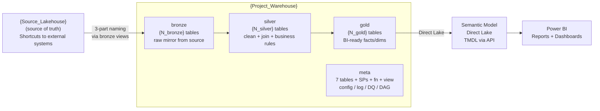

### 1.2 Four Schemas

| Schema | Role | Contains |
|--------|------|----------|
| `bronze` | Raw mirror from {Source_Lakehouse} | Tables + Views (ETL logic) + SPs (load execution) |
| `silver` | Clean, conform, join, apply business rules | Tables + Views + SPs |
| `gold` | Business-ready facts/dimensions for Power BI | Tables + Views + SPs |
| `meta` | System control plane | 7 Tables + SPs + Function + View |

### 1.3 Design Principles

| Principle | Implementation |
|-----------|---------------|
| **Pure T-SQL** | No Notebooks, no PySpark, no Lakehouse ETL. All logic in SQL views and stored procedures. |
| **3-file-per-table** | Every data table has exactly 3 objects: VIEW (ETL formula) + SP (execution robot) + TABLE (materialized data). |
| **Metadata-driven** | Adding a new table = INSERT 1 row in `meta.sp_registry`. The pipeline picks it up automatically. No pipeline JSON changes. |
| **DAG orchestration** | Silver SPs declare `depends_on` in sp_registry. `usp_compute_slv_waves` auto-computes execution waves. Pipeline runs waves sequentially, SPs within a wave in parallel. |
| **Config-driven DQ** | DQ rules stored in `meta.dq_rules` table, not hardcoded. 7 check types. Add a rule = INSERT 1 row. |
| **Auto-built lineage** | `source_objects` JSON in sp_registry is parsed by `usp_build_lineage` to generate a full lineage graph. |

---

## 2. Warehouse Structure (Generic Tree)

```
{Project_Warehouse}/
|
+-- bronze/
|   +-- Tables/
|   |   +-- brz_{source_system}__{entity_1}
|   |   +-- brz_{source_system}__{entity_2}
|   |   +-- ref_{reference_entity_1}
|   |   +-- ref_{reference_entity_2}
|   |
|   +-- Views/
|   |   +-- vw_brz_{source_system}__{entity_1}
|   |   +-- vw_brz_{source_system}__{entity_2}
|   |   +-- vw_ref_{reference_entity_1}
|   |   +-- vw_ref_{reference_entity_2}
|   |
|   +-- Stored Procedures/
|       +-- usp_load_brz_{source_system}__{entity_1}
|       +-- usp_load_brz_{source_system}__{entity_2}
|       +-- usp_load_ref_{reference_entity_1}
|       +-- usp_load_ref_{reference_entity_2}
|
+-- silver/
|   +-- Tables/
|   |   +-- slv_{business_concept_1}               (wave 0)
|   |   +-- slv_{business_concept_2}               (wave 0)
|   |   +-- slv_{business_concept_3}               (wave 1)
|   |   +-- slv_{business_concept_4}               (wave 2)
|   |
|   +-- Views/
|   |   +-- vw_slv_{business_concept_1}
|   |   +-- vw_slv_{business_concept_2}
|   |   +-- vw_slv_{business_concept_3}
|   |   +-- vw_slv_{business_concept_4}
|   |
|   +-- Stored Procedures/
|       +-- usp_load_slv_{business_concept_1}
|       +-- usp_load_slv_{business_concept_2}
|       +-- usp_load_slv_{business_concept_3}
|       +-- usp_load_slv_{business_concept_4}
|
+-- gold/
|   +-- Tables/
|   |   +-- gld_fact_{subject_1}
|   |   +-- gld_dim_{subject_2}
|   |
|   +-- Views/
|   |   +-- vw_gld_fact_{subject_1}
|   |   +-- vw_gld_dim_{subject_2}
|   |
|   +-- Stored Procedures/
|       +-- usp_load_gld_fact_{subject_1}
|       +-- usp_load_gld_dim_{subject_2}
|
+-- meta/
    +-- Tables/ (7)
    |   +-- sp_registry                  config: SP definitions
    |   +-- sp_run_history               log: SP executions
    |   +-- dq_rules                     config: DQ check definitions
    |   +-- dq_results                   log: DQ check outcomes
    |   +-- sp_lineage                   map: data flow edges
    |   +-- pipeline_run_log             log: pipeline-level runs
    |   +-- slv_dag_waves_runtime        runtime: wave computation results
    |
    +-- Stored Procedures/
    |   +-- usp_log_run                  log SP start/end/rows/status
    |   +-- usp_check_dq                 DQ engine (read rules -> execute -> log)
    |   +-- usp_build_lineage            parse source_objects -> build lineage
    |   +-- usp_compute_slv_waves        iterative DAG wave computation
    |   +-- usp_run_silver_dag           orchestrator backup (sequential)
    |   +-- usp_log_pipeline_run         log pipeline start/end
    |   +-- usp_finalize_pipeline        build lineage + update pipeline_run_log
    |
    +-- Functions/ (1)
    |   +-- ufn_should_run               check schedule gate (returns 1/0)
    |
    +-- Views/ (1)
        +-- vw_slv_dag_waves             legacy fixed-CTE view (replaced by SP)
```

---

## 3. Pipeline Architecture

### 3.1 Pipeline Inventory

| Pipeline | Purpose | Activities |
|----------|---------|------------|
| pl_{prefix}_master | Orchestrate log_start -> bronze -> silver -> gold -> finalize -> refresh_sm | SP + 3 InvokePipeline + SP + PBISemanticModelRefresh |
| pl_{prefix}_bronze | Load all bronze/ref tables in parallel | 1 Lookup + 1 ForEach(SP) |
| pl_{prefix}_silver | Parent: compute waves, iterate wave-by-wave | 1 SP + 10 Lookup + 10 ForEach = 21 activities |
| pl_{prefix}_silver_wave | Child: run all SPs for a given wave in parallel | 1 Lookup + 1 ForEach(SP) |
| pl_{prefix}_gold | Load all gold tables in parallel | 1 Lookup + 1 ForEach(SP) |

### 3.2 pl_{prefix}_master

```mermaid
flowchart LR
    LS["SP: log_start\nEXEC meta.usp_log_pipeline_run\n@status = 'running'"]
    B["pl_{prefix}_bronze"]
    S["pl_{prefix}_silver"]
    G["pl_{prefix}_gold"]
    FN["SP: finalize\nEXEC meta.usp_finalize_pipeline\n(build_lineage + update log)"]

    SM["PBISemanticModelRefresh\nrefresh_sm\nDirect Lake metadata sync"]

    LS -->|"on success"| B
    B -->|"on success"| DQ1["DQ: bronze ⚠"]
    DQ1 -->|"on success"| S
    S -->|"on success"| DQ2["DQ: silver ⚠"]
    DQ2 -->|"on success"| G
    G -->|"on success"| DQ3["DQ: gold ⚠"]
    DQ3 -->|"on success"| FN
    FN -->|"on success"| SM
```

> ⚠ DQ gates shown for completeness. Currently experimental — `meta.usp_check_dq` has a known WHILE loop limitation in Fabric WH. DQ checks currently run via Python script, not yet integrated into pipeline activities.

The master pipeline invokes each child pipeline sequentially using InvokePipeline activities, runs finalize to rebuild lineage and update the run log, then refreshes the Semantic Model. If any child fails, the master stops (no subsequent layers run). The `log_start` SP inserts a row into `pipeline_run_log` with status='running'. The `finalize` SP calls `usp_build_lineage` and updates the pipeline_run_log row with final status, counts, and end_time. The `refresh_sm` activity syncs the Direct Lake Semantic Model with the latest gold table data.

### 3.3 pl_{prefix}_bronze

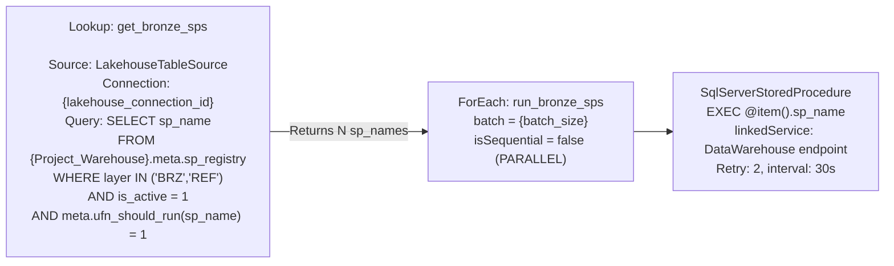

**Retry policy**: Each SP activity has retry=2, interval=30 seconds. This handles snapshot isolation conflicts that occur when multiple DROP+CTAS operations run in parallel.

### 3.4 pl_{prefix}_silver -- PARENT Pipeline

Fabric Pipeline does not support the Until activity reliably. The implementation uses **10 pre-built sequential Lookup+ForEach stages** (wave 0 through wave 9). Empty waves simply skip (empty ForEach).

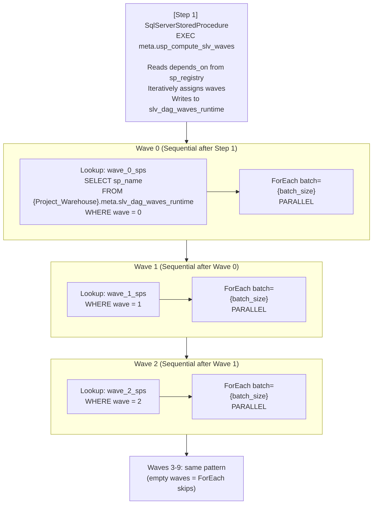

**Total activities**: 1 SP + 10 Lookup + 10 ForEach = 21 activities.
**Scaling**: Supports up to 10 DAG waves without pipeline changes. Beyond 10 waves, add more Lookup+ForEach stages.

**Alternative (parent-child pattern)**: The parent does a Lookup for distinct waves, then a sequential ForEach that invokes a child pipeline `pl_{prefix}_silver_wave` with parameter `wave_number`. The child does its own Lookup for SPs in that wave and a parallel ForEach. Cleaner but adds cross-pipeline invocation overhead.

### 3.5 pl_{prefix}_silver_wave -- CHILD Pipeline

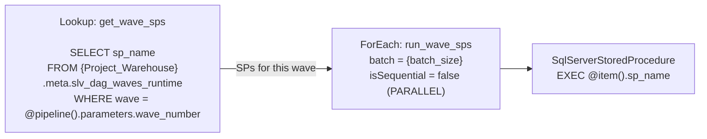

**Parameter**: `wave_number` (INT) -- passed from the parent pipeline's ForEach.

### 3.6 pl_{prefix}_gold

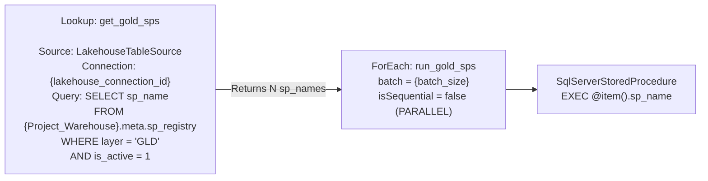

---

## 4. Connection Topology

### 4.1 Connection Architecture

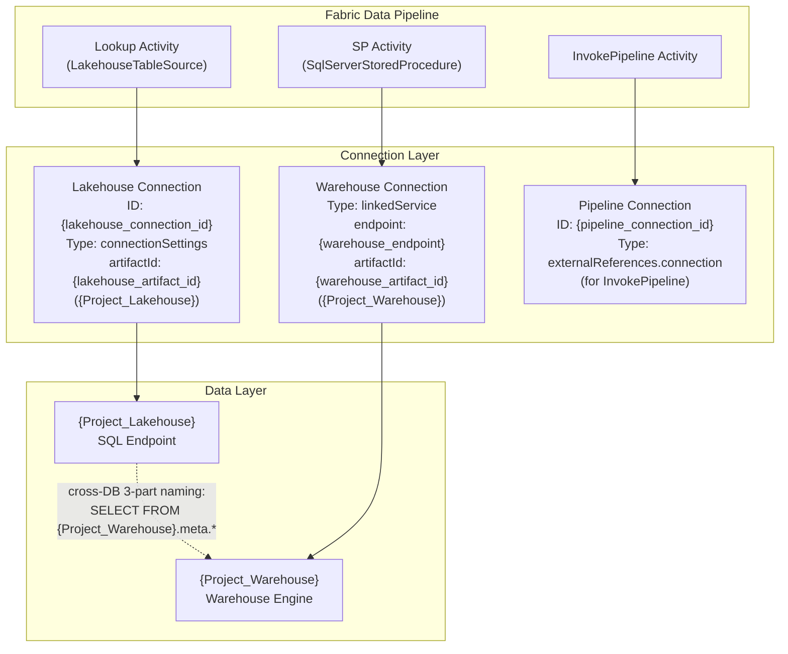

### 4.2 Why Lakehouse for Lookup?

Fabric Pipeline's Lookup activity natively supports `LakehouseTableSource` but **does not natively support Warehouse as a Lookup source** (returns "Failed to open resource" errors).

**Workaround**: The Lookup connects to a Lakehouse SQL endpoint, then uses cross-database 3-part naming to query Warehouse tables:

```sql
-- Executed on Lakehouse SQL endpoint, reads from Warehouse
SELECT sp_name
FROM {Project_Warehouse}.meta.sp_registry
WHERE layer IN ('BRZ', 'REF')
  AND is_active = 1
```

This works because Fabric's SQL endpoint supports cross-database queries between artifacts in the same workspace.

### 4.3 Connection Details per Activity Type

| Activity Type | Source Config | Connection Type | Target |
|---------------|-------------|-----------------|--------|
| Lookup | LakehouseTableSource + connectionSettings | Lakehouse | Lakehouse SQL endpoint -> cross-DB to Warehouse |
| SqlServerStoredProcedure | linkedService (DataWarehouse) | Warehouse | Warehouse engine directly |
| InvokePipeline | externalReferences.connection | Pipeline | Target pipeline by ID |

---

## 5. 3-File-Per-Table Pattern

### 5.1 Pattern Diagram

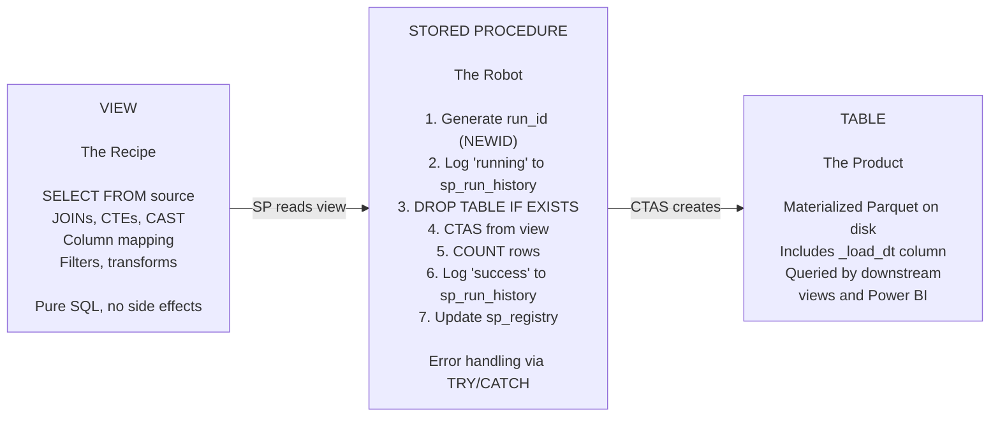

### 5.2 Why This Pattern?

- **Separation of concerns**: View holds logic, SP handles execution/logging, table stores data.
- **Testability**: `SELECT * FROM vw_xxx` previews results without materializing.
- **Reusability**: Every SP follows the same template -- only the schema/table names change.
- **Observability**: Every execution is logged with run_id, start/end time, row count, status, error message.

### 5.3 SP Template -- Overwrite Pattern

```sql
CREATE OR ALTER PROCEDURE {schema}.usp_load_{table_name} AS
BEGIN
    DECLARE @run_id VARCHAR(36) = CONVERT(VARCHAR(36), NEWID());
    DECLARE @rows BIGINT;

    EXEC meta.usp_log_run @run_id, '{schema}.usp_load_{table_name}', 'running',
         @load_type = 'overwrite';

    BEGIN TRY
        DROP TABLE IF EXISTS {schema}.{table_name};
        CREATE TABLE {schema}.{table_name} AS
        SELECT *, CAST(GETUTCDATE() AS DATETIME2(6)) AS _load_dt
        FROM {schema}.vw_{table_name};

        SELECT @rows = COUNT(*) FROM {schema}.{table_name};

        EXEC meta.usp_log_run @run_id, '{schema}.usp_load_{table_name}', 'success',
             @rows_affected = @rows, @load_type = 'overwrite';
    END TRY
    BEGIN CATCH
        DECLARE @err VARCHAR(4000) = ERROR_MESSAGE();
        EXEC meta.usp_log_run @run_id, '{schema}.usp_load_{table_name}', 'failed',
             @error_message = @err, @load_type = 'overwrite';
        THROW;
    END CATCH
END
```

### 5.4 SP Template -- Incremental Pattern

```sql
CREATE OR ALTER PROCEDURE {schema}.usp_load_{table_name} AS
BEGIN
    DECLARE @run_id VARCHAR(36) = CONVERT(VARCHAR(36), NEWID());
    DECLARE @rows BIGINT;
    DECLARE @last_wm VARCHAR(200);
    DECLARE @new_wm VARCHAR(200);
    DECLARE @table_exists INT = 0;

    EXEC meta.usp_log_run @run_id, '{schema}.usp_load_{table_name}', 'running',
         @load_type = 'incremental';

    BEGIN TRY
        -- Check if table already exists
        SELECT @table_exists = COUNT(*) FROM sys.tables t
        JOIN sys.schemas s ON t.schema_id = s.schema_id
        WHERE s.name = '{schema}' AND t.name = '{table_name}';

        -- Get last watermark
        SELECT @last_wm = last_watermark_value FROM meta.sp_registry
        WHERE sp_name = '{schema}.usp_load_{table_name}';

        IF @table_exists = 0 OR @last_wm IS NULL
        BEGIN
            -- First run: full load with optional cutoff
            DROP TABLE IF EXISTS {schema}.{table_name};
            CREATE TABLE {schema}.{table_name} AS
            SELECT *, CAST(GETUTCDATE() AS DATETIME2(6)) AS _load_dt
            FROM {schema}.vw_{table_name}
            WHERE {watermark_column} >= CAST('{initial_cutoff_date}' AS DATETIME2(6));
            SELECT @rows = COUNT(*) FROM {schema}.{table_name};
        END
        ELSE
        BEGIN
            -- Subsequent: append only new rows
            INSERT INTO {schema}.{table_name}
            SELECT *, CAST(GETUTCDATE() AS DATETIME2(6)) AS _load_dt
            FROM {schema}.vw_{table_name}
            WHERE {watermark_column} > CAST(@last_wm AS DATETIME2(6));
            SELECT @rows = @@ROWCOUNT;
        END

        -- Update watermark
        SELECT @new_wm = CAST(MAX({watermark_column}) AS VARCHAR(200))
        FROM {schema}.{table_name};
        UPDATE meta.sp_registry SET last_watermark_value = @new_wm
        WHERE sp_name = '{schema}.usp_load_{table_name}';

        EXEC meta.usp_log_run @run_id, '{schema}.usp_load_{table_name}', 'success',
             @rows_affected = @rows, @load_type = 'incremental';
    END TRY
    BEGIN CATCH
        DECLARE @err VARCHAR(4000) = ERROR_MESSAGE();
        EXEC meta.usp_log_run @run_id, '{schema}.usp_load_{table_name}', 'failed',
             @error_message = @err, @load_type = 'incremental';
        THROW;
    END CATCH
END
```

---

## 6. Silver DAG Wave System

### 6.1 How It Works

The Silver layer uses a Directed Acyclic Graph (DAG) to determine execution order. Each silver SP declares its dependencies via the `depends_on` column in `meta.sp_registry`. The system computes execution "waves" -- groups of SPs that can run in parallel because all their dependencies have been satisfied in prior waves.

### 6.2 depends_on Column

The `depends_on` column stores a JSON array of SP names that this SP depends on. Only silver-to-silver dependencies matter for wave computation. Dependencies on bronze tables are ignored (bronze always runs first as a complete layer).

```sql
-- Example: a silver SP depends on 2 other silver tables
depends_on = '["silver.usp_load_slv_{concept_a}", "silver.usp_load_slv_{concept_b}"]'
```

### 6.3 Wave Computation Algorithm

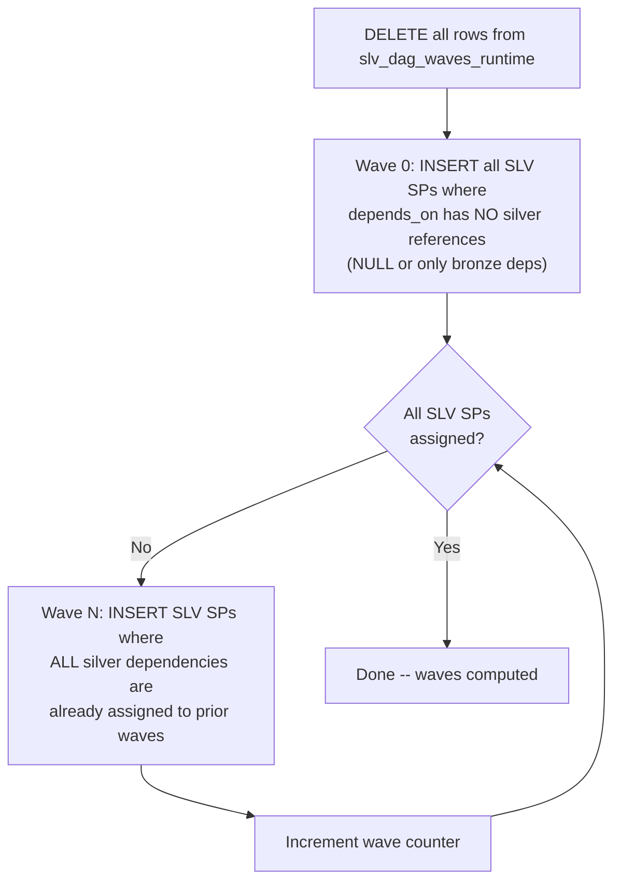

### 6.4 Wave Assignment Diagram (Generic Example)

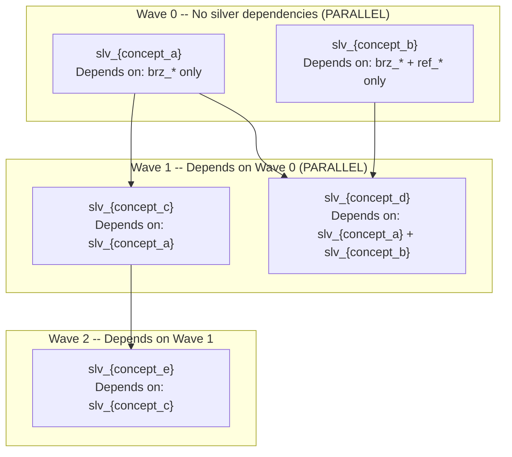

### 6.5 Parent-Child Pipeline Pattern

The silver pipeline uses a parent-child pattern because Fabric Pipeline does not allow nesting ForEach inside ForEach, or ForEach inside Until.

**Pre-built stages approach**: The parent pipeline has 10 sequential Lookup+ForEach stages (wave 0 through 9). Waves with no SPs simply skip (empty ForEach). Supports up to 10 waves without changes.

**Parent-child invocation approach**: Parent looks up distinct wave numbers, then a sequential ForEach invokes a child pipeline with `wave_number` parameter. Child pipeline runs the Lookup+ForEach for that specific wave. Cleaner but adds latency.

---

## 7. Meta Schema Detail

### 7.1 Tables (7)

#### meta.sp_registry

| Aspect | Detail |
|--------|--------|
| **Purpose** | Central registry -- defines every data SP: what to run, how, when, dependencies. |
| **Auto-populated columns** | `last_load_date`, `rows_loaded`, `next_run_time` (updated by usp_log_run) |
| **Manual input columns** | All other columns (INSERT when adding a new table) |
| **Key columns** | `sp_name` (PK equivalent), `layer` (BRZ/REF/SLV/GLD), `depends_on` (JSON), `source_objects` (JSON), `is_active` (0/1), `load_type` (overwrite/incremental) |

#### meta.sp_run_history

| Aspect | Detail |
|--------|--------|
| **Purpose** | Execution journal -- every SP execution creates one row. |
| **Auto-populated** | Entirely by `usp_log_run`. |
| **Key columns** | `run_id` (NEWID per execution), `sp_name`, `start_time`, `end_time`, `duration_seconds`, `rows_affected`, `status` (running/success/failed), `error_message` |

#### meta.dq_rules

| Aspect | Detail |
|--------|--------|
| **Purpose** | Configuration table for data quality checks. |
| **Auto-populated** | No. Manual INSERT only. |
| **Key columns** | `rule_id`, `check_type`, `target_schema`, `target_table`, `column_name`, `severity` (CRITICAL/WARNING/INFO), `threshold`, `params` (JSON) |

#### meta.dq_results

| Aspect | Detail |
|--------|--------|
| **Purpose** | Stores outcome of each DQ check -- pass/fail, actual vs expected. |
| **Auto-populated** | Yes, by `usp_check_dq`. |
| **Key columns** | `result_id`, `rule_id`, `check_time`, `status` (PASS/FAIL), `actual_value`, `expected_value` |

#### meta.sp_lineage

| Aspect | Detail |
|--------|--------|
| **Purpose** | Data lineage graph -- source-to-target edges auto-generated from source_objects JSON. |
| **Auto-populated** | Yes, by `usp_build_lineage`. DELETE + INSERT full rebuild. |
| **Key columns** | `lineage_id`, `source_schema`, `source_table`, `target_schema`, `target_table`, `relationship_type`, `sp_name` |

#### meta.pipeline_run_log

| Aspect | Detail |
|--------|--------|
| **Purpose** | Top-level pipeline run tracking -- master pipeline start/end and aggregate statistics. |
| **Auto-populated** | Yes, by `usp_log_pipeline_run` (log_start) and `usp_finalize_pipeline` (finalize). |
| **Key columns** | `pipeline_run_id`, `pipeline_name`, `status`, `start_time`, `end_time`, `tables_succeeded`, `tables_failed`, `dq_failures_critical` |

#### meta.slv_dag_waves_runtime

| Aspect | Detail |
|--------|--------|
| **Purpose** | Stores computed wave assignment for each silver SP. Refreshed each pipeline run. |
| **Auto-populated** | Yes, by `usp_compute_slv_waves`. DELETE + INSERT on each run. |
| **Key columns** | `sp_name`, `wave` (INT, 0-based) |

### 7.2 Auto-Population Map

| Meta Table | When Written | Written By | Frequency |
|------------|-------------|------------|-----------|
| sp_run_history | During each SP execution | usp_log_run | 2 writes per SP (INSERT at start, UPDATE at end) |
| sp_registry (auto cols) | After each SP execution | usp_log_run | 1 UPDATE per SP |
| slv_dag_waves_runtime | Before silver wave execution | usp_compute_slv_waves | 1 DELETE + N INSERTs per pipeline run |
| sp_lineage | During finalize step | usp_build_lineage | 1 full rebuild per pipeline run |
| pipeline_run_log | At pipeline start and end | usp_log_pipeline_run + usp_finalize_pipeline | 1 INSERT + 1 UPDATE per pipeline run |
| dq_results | When DQ checks are run | usp_check_dq or external runner | 1 INSERT per rule checked |

### 7.3 Manual Input Required

| Meta Table | When to Write | What to Write |
|------------|--------------|---------------|
| sp_registry | When adding a new table | INSERT 1 row with sp_name, layer, load_type, depends_on, source_objects, etc. |
| dq_rules | When adding DQ checks | INSERT 1 row per rule with check_type, target table, threshold, severity |

---

## 8. DQ System

### 8.1 Overview

The Data Quality system is **config-driven**. Rules are stored in `meta.dq_rules`. Adding a new check = INSERT 1 row. The DQ engine reads rules, generates SQL dynamically, executes it, and writes results to `meta.dq_results`.

### 8.2 Seven Check Types

| Check Type | What It Checks | SQL Pattern Generated |
|------------|---------------|----------------------|
| `completeness` | Column NOT NULL percentage >= threshold | `SUM(CASE WHEN {col} IS NULL THEN 0 ELSE 1 END) * 100.0 / COUNT(*)` |
| `uniqueness` | Column has no duplicate values | `COUNT(*) - COUNT(DISTINCT {col})` (expects 0) |
| `referential_integrity` | FK value exists in parent table | `COUNT(*) FROM child LEFT JOIN parent WHERE parent.key IS NULL` |
| `row_count` | Table row count >= minimum | `COUNT(*) FROM {table}` (compare to threshold) |
| `validity` | Values within expected set | `COUNT(*) WHERE {col} NOT IN ({valid_values})` |
| `freshness` | Most recent _load_dt within N hours | `DATEDIFF(HOUR, MAX(_load_dt), GETUTCDATE())` (compare to threshold) |
| `custom_sql` | Any arbitrary SQL check | Executes SQL from `params` column, expects 0 = pass |

### 8.3 DQ Rule Template

```sql
INSERT INTO meta.dq_rules (rule_id, rule_name, target_schema, target_table,
    check_type, column_name, severity, threshold, is_active, layer)
VALUES
({rule_id}, '{descriptive_rule_name}', '{schema}', '{table_name}',
 '{check_type}', '{column_name_or_null}', '{CRITICAL|WARNING|INFO}',
 {threshold_value}, 1, '{BRZ|SLV|GLD}');
```

---

## 9. Naming Convention

### 9.1 Object Names

| Schema | Table Pattern | View Pattern | SP Pattern |
|--------|--------------|--------------|------------|
| bronze | `brz_{source_system}__{entity}` | `vw_brz_{source_system}__{entity}` | `usp_load_brz_{source_system}__{entity}` |
| bronze (ref) | `ref_{entity}` | `vw_ref_{entity}` | `usp_load_ref_{entity}` |
| silver | `slv_{business_concept}` | `vw_slv_{business_concept}` | `usp_load_slv_{business_concept}` |
| gold | `gld_{fact\|dim}_{subject}` | `vw_gld_{fact\|dim}_{subject}` | `usp_load_gld_{fact\|dim}_{subject}` |
| meta | descriptive (e.g., `sp_registry`) | `vw_*` | `usp_*` / `ufn_*` |

### 9.2 Column Prefixes

| Prefix | Meaning | Example |
|--------|---------|---------|
| `id_` | Identifiers / keys | `id_customer`, `id_product` |
| `code_` | Codes / categories | `code_warehouse`, `code_region` |
| `name_` | Descriptive names | `name_customer`, `name_product` |
| `qty_` | Quantities | `qty_ordered`, `qty_shipped` |
| `amt_` | Monetary amounts | `amt_sales`, `amt_revenue` |
| `dt_` | Dates | `dt_invoice`, `dt_created` |
| `num_` | Numeric values | `num_line_item`, `num_order` |
| `ts_` | Timestamps | `ts_snapshot`, `ts_modified` |
| `pct_` | Percentages | `pct_accuracy`, `pct_fill_rate` |
| `val_` | Calculated values | `val_forecast`, `val_score` |
| `is_` | Boolean flags (INT 0/1) | `is_active`, `is_deleted` |
| `sk_` | Surrogate keys | `sk_customer`, `sk_product` |
| `_load_dt` | System column (load timestamp) | Always DATETIME2(6), added by SP |

### 9.3 Special Naming Notes

- **Bronze double underscore** (`__`): Separates source system from entity name. Example: `brz_{source_system}__{entity}`.
- **Gold `gld_` prefix**: Required to avoid name collisions with any existing tables in `dbo` or other schemas that use plain `fact_*` / `dim_*` naming.
- **Meta naming**: Uses descriptive names without layer prefix (e.g., `sp_registry` not `meta_sp_registry`) because the schema name provides context.

---

## 10. Adding a New Table Checklist

### Adding a Bronze Table

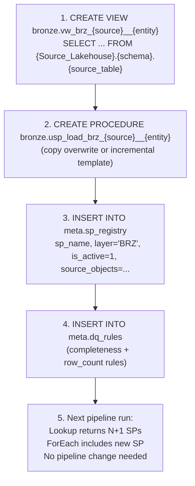

### Adding a Silver Table

```mermaid
flowchart TD
    A["1. CREATE VIEW silver.vw_slv_{business_concept}\n   SELECT ... FROM bronze/silver tables"]
    B["2. CREATE PROCEDURE silver.usp_load_slv_{business_concept}\n   (copy overwrite template)"]
    C["3. INSERT INTO meta.sp_registry\n   layer='SLV', depends_on='[\"silver.usp_load_slv_xxx\"]'"]
    D["4. Next pipeline run:\n   usp_compute_slv_waves recalculates\n   New SP auto-assigned to correct wave"]
    E["5. ForEach for that wave\n   includes the new SP\n   No pipeline change needed"]

    A --> B --> C --> D --> E
```

### Adding a Gold Table

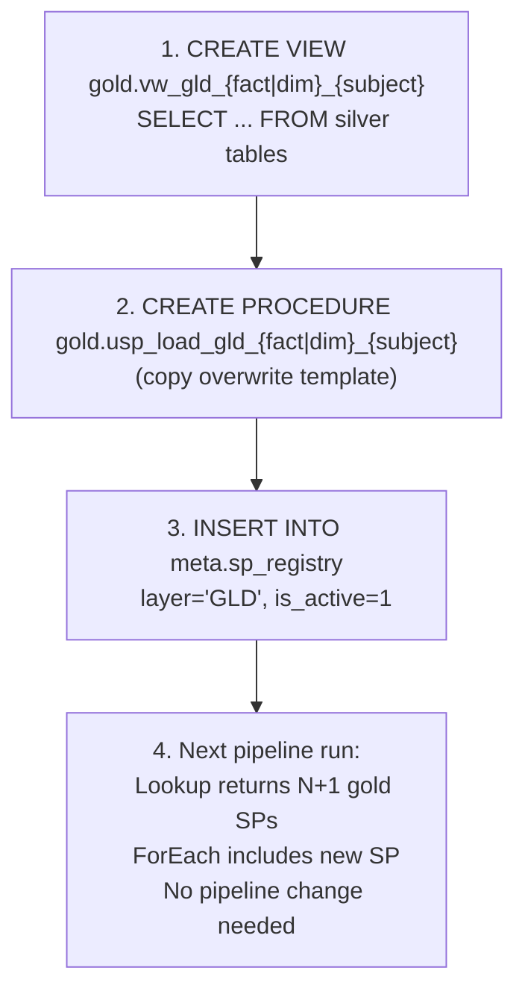

**In all cases**: No pipeline JSON changes required. The Lookup dynamically reads sp_registry. The ForEach iterates over whatever the Lookup returns.

---

## 11. Semantic Model

### 11.1 Overview

The architecture includes a **Direct Lake Semantic Model** deployed via the Fabric REST API using TMDL format. The SM sits on top of the gold layer and is automatically refreshed at the end of every pipeline run.

| Aspect | Detail |
|--------|--------|
| **Mode** | Direct Lake (reads Parquet from {Project_Warehouse}) |
| **Deployment** | Fabric REST API: `POST /v1/workspaces/{id}/semanticModels` with TMDL definition parts |
| **Refresh** | Power BI API: `POST https://api.powerbi.com/v1.0/myorg/groups/{ws}/datasets/{id}/refreshes` |
| **Pipeline activity** | PBISemanticModelRefresh (last step in pl_{prefix}_master) |

### 11.2 Source Remapping Pattern

When migrating an existing SM to point at the new warehouse, keep table **display names** the same so reports can switch source without breaking:

| TMDL Property | What to Change |
|---------------|---------------|
| sourceLineageTag | `[old_schema].[old_table]` to `[new_schema].[new_table]` |
| partition entityName | Old entity name to new table name |
| partition schemaName | Old schema to new schema (e.g., `dbo` to `bronze`) |

Relationships and DAX measures reference display names, not source table names, so they require **no changes** during remapping.

### 11.3 SM API Methods

| Operation | Method | Endpoint |
|-----------|--------|----------|
| Create SM | POST | `/v1/workspaces/{id}/semanticModels` (TMDL definition parts) |
| Get SM definition | POST | `/v1/workspaces/{id}/semanticModels/{id}/getDefinition` (async 202, TMDL) |
| Refresh SM | POST | `https://api.powerbi.com/v1.0/myorg/groups/{ws}/datasets/{id}/refreshes` (Power BI API) |
| Delete SM | DELETE | `/v1/workspaces/{id}/semanticModels/{id}` |
| List SMs | GET | `/v1/workspaces/{id}/semanticModels` |

### 11.4 Pipeline Integration

The `refresh_sm` activity in pl_{prefix}_master:

| Aspect | Detail |
|--------|--------|
| Activity type | PBISemanticModelRefresh |
| Connection | externalReferences.connection: `{sm_connection_id}` |
| groupId | workspace_id |
| datasetId | SM id |
| objects | List of table names to refresh (dims + facts) |

---

## 12. Object Count Summary

| Schema | Tables | Views | SPs | Functions | Total |
|--------|--------|-------|-----|-----------|-------|
| bronze | {N_brz_tables} | {N_brz_views} | {N_brz_sps} | -- | {subtotal} |
| silver | {N_slv_tables} | {N_slv_views} | {N_slv_sps} | -- | {subtotal} |
| gold | {N_gld_tables} | {N_gld_views} | {N_gld_sps} | -- | {subtotal} |
| meta | 7 | 1 | {N_meta_sps} | 1 | {subtotal} |
| **Total** | **{total}** | **{total}** | **{total}** | **1** | **{grand_total}** |

**Pipelines**: 5 (`pl_{prefix}_master`, `pl_{prefix}_bronze`, `pl_{prefix}_silver`, `pl_{prefix}_silver_wave`, `pl_{prefix}_gold`)

**Semantic Model**: 1 (Direct Lake, refreshed by pl_{prefix}_master)

---

## 13. Fabric Warehouse Constraints

| # | Constraint | Error / Behavior | Workaround |
|---|-----------|-----------------|------------|
| 1 | No DEFAULT constraint | `DEFAULT is not supported` on CREATE TABLE | Set values in SP INSERT/CTAS logic |
| 2 | No IDENTITY column | `IDENTITY is not supported` | ROW_NUMBER() OVER (...) or MAX(id)+1 |
| 3 | No PRIMARY KEY | `PRIMARY KEY is not supported` | DQ uniqueness check in dq_rules |
| 4 | No UNIQUE constraint | `UNIQUE is not supported` | DQ uniqueness check |
| 5 | No CURSOR | `CURSOR is not supported` | WHILE + MIN(id) WHERE id > @current |
| 6 | No temp tables (#) | `Temporary tables not supported` | CTE or real table + DROP after use |
| 7 | No recursive CTE | `Recursive CTE not supported` | SP iterative WHILE loop |
| 8 | DATETIME2 requires precision | Implicit precision causes errors | Always use DATETIME2(6) |
| 9 | datetime type in CTAS fails | `datetime not supported in CTAS` | CAST(GETUTCDATE() AS DATETIME2(6)) |
| 10 | BIT type unstable | Unpredictable behavior | Use INT (0/1) instead |
| 11 | TRIM on numeric fails | `TRIM expects string input` | Remove TRIM or CAST to VARCHAR first |
| 12 | NVARCHAR(4000) in CTAS | CTAS issues with NVARCHAR | CAST to VARCHAR(n) explicitly |
| 13 | NVARCHAR default length 30 | `CAST(x AS NVARCHAR)` truncates to 30 chars | Always specify length: NVARCHAR(200) |
| 14 | SetVariable self-reference | `Variable cannot reference itself` in Pipeline | Use 2 variables: next + current |
| 15 | Warehouse not as Lookup source | `Failed to open resource` | LakehouseTableSource + cross-DB query |
| 16 | Until activity not supported | `BadRequest` on pipeline start | 10 pre-built sequential Lookup+ForEach stages |
| 17 | sp_executesql in WHILE loop | Only 1 iteration executes | Run dynamic SQL from Python client |
| 18 | VARCHAR in sp_executesql | sp_executesql rejects VARCHAR @sql | Use NVARCHAR(4000) for dynamic SQL |
| 19 | 3-part name with dbo | 404 error on Lakehouse tables | Use folder name as schema: {Lakehouse}.{Folder}.{Table} |
| 20 | Script activity for SP | `ReferenceName null` error | Use SqlServerStoredProcedure + linkedService |
| 21 | ForEach inside ForEach | Not supported in Fabric Pipeline | Parent-child pipeline pattern |
| 22 | ForEach inside Until | Not supported / BadRequest | Pre-built sequential stages |
| 23 | DECIMAL(10,4) overflow | Overflow on values > 999999.9999 | Use DECIMAL(18,2) |
| 24 | Nested EXEC from Pipeline | `BadRequest` when SP calls sp_executesql | Pipeline directly calls individual SPs via ForEach |

---

*Template version: v9 Warehouse-Native Medallion Architecture*
*Replace all {placeholders} before use.*
