# Architecture v9 — Complete Reference
> SupplyChain_Warehouse | Microsoft Fabric F256 | Warehouse-Native Medallion Architecture
> Build date: 2026-04-13 | Authors: Claude Code + Aric Nguyen
> This document is the single source of truth for the entire v9 architecture.

---

## 1. Architecture Overview

### 1.1 Data Flow

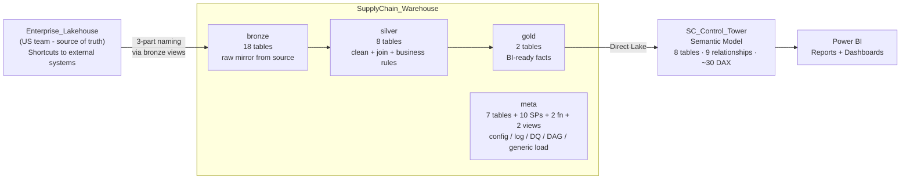

### 1.2 Four Schemas

| Schema | Role | Contains |
|--------|------|----------|
| `bronze` | Raw mirror from Enterprise_Lakehouse | 18 Tables + 17 Views (ETL logic) |
| `silver` | Clean, conform, join, apply business rules | 8 Tables + 8 Views |
| `gold` | Business-ready facts/dimensions for Power BI | 2 Tables + 2 Views |
| `meta` | System control plane | 7 Tables + 10 SPs (incl. usp_generic_load, usp_check_dq_single) + 2 Functions + 2 Views |

### 1.3 Design Principles

| Principle | Implementation |
|-----------|---------------|
| **Pure T-SQL** | No Notebooks, no PySpark, no Lakehouse ETL. All logic in SQL views and stored procedures. |
| **Generic SP + 2-file-per-table** | Every data table has 2 objects: VIEW (ETL formula) + TABLE (materialized data). A single generic SP (`meta.usp_generic_load`) handles all loads by reading sp_registry config. Supports 8 load patterns: overwrite, incremental, upsert, datekey, daterange, identity, cdc, scd2. |
| **Metadata-driven** | Adding a new table = CREATE VIEW + INSERT 1 row in `meta.sp_registry`. No per-table SP needed. The pipeline picks it up automatically. No pipeline JSON changes. |
| **DAG orchestration** | Silver SPs declare `depends_on` in sp_registry. `usp_compute_slv_waves` auto-computes execution waves. Pipeline runs waves sequentially, SPs within a wave in parallel. |
| **Config-driven DQ** | DQ rules stored in `meta.dq_rules` table, not hardcoded. 7 check types. Add a rule = INSERT 1 row. |
| **Auto-built lineage** | `source_objects` JSON in sp_registry is parsed by `usp_build_lineage` to generate a full lineage graph (52 edges). |

### 1.4 v8 to v9 Comparison

| Aspect | v8 (Legacy) | v9 (Current) |
|--------|-------------|--------------|
| Storage | SupplyChain_Lakehouse (Delta) | SupplyChain_Warehouse (native Parquet) |
| Compute | PySpark Notebooks | T-SQL Stored Procedures |
| ETL logic | Python variables (COLUMN_SQL, SQL_TRANSFORM) | CREATE VIEW statements |
| Orchestration | Pipeline -> ForEach -> Notebook | Pipeline -> ForEach -> EXEC SP |
| Metadata | utl_pipeline_metadata (1 table) | meta schema (7 tables + 10 SPs) |
| DAG | execution_order (static integer) | depends_on + auto wave computation |
| DQ | Python nb_dq_engine (hardcoded) | Config-driven dq_rules table |

---

## 2. Warehouse Structure (Full Tree)

```
SupplyChain_Warehouse/
|
+-- bronze/
|   +-- Tables/ (18)
|   |   +-- brz_saleshistory_afi__invoicedetail             35,798,317 rows
|   |   +-- brz_saleshistory_afi__invoiceheader              4,044,847 rows
|   |   +-- brz_supplychain_enh_1__demandforecastsnapshotdaily  1,306,460,284 rows
|   |   +-- brz_wholesale_codis_afi__codatan                   918,213 rows
|   |   +-- brz_wholesale_codis_afi__comast                    229,461 rows
|   |   +-- brz_wholesale_codis_afi__extord                    229,736 rows
|   |   +-- brz_wholesale_codis_afi__extorit                   912,132 rows
|   |   +-- ref_calendar                                        21,551 rows
|   |   +-- ref_customer_account                                35,581 rows
|   |   +-- ref_customer_account_group                          35,454 rows
|   |   +-- ref_customer_grouping                                    9 rows
|   |   +-- ref_customer_shipping_location                     127,515 rows
|   |   +-- ref_forecast_cycle                                      43 rows
|   |   +-- ref_forecast_horizon                                     8 rows
|   |   +-- ref_item_master                                    379,331 rows
|   |   +-- ref_order_type                                          29 rows
|   |   +-- ref_product                                        373,326 rows
|   |   +-- ref_warehouse                                           55 rows
|   |
|   +-- Views/ (17)
|   |   +-- vw_brz_saleshistory_afi__invoicedetail
|   |   +-- vw_brz_saleshistory_afi__invoiceheader
|   |   +-- vw_brz_supplychain_enh_1__demandforecastsnapshotdaily
|   |   +-- vw_brz_wholesale_codis_afi__codatan
|   |   +-- vw_brz_wholesale_codis_afi__comast
|   |   +-- vw_brz_wholesale_codis_afi__extord
|   |   +-- vw_brz_wholesale_codis_afi__extorit
|   |   +-- vw_ref_calendar
|   |   +-- vw_ref_customer_account
|   |   +-- vw_ref_customer_account_group
|   |   +-- vw_ref_customer_grouping
|   |   +-- vw_ref_customer_shipping_location
|   |   +-- vw_ref_forecast_cycle
|   |   (no view for ref_forecast_horizon -- hardcoded INSERT)
|   |   +-- vw_ref_item_master
|   |   +-- vw_ref_order_type
|   |   +-- vw_ref_product
|   |   +-- vw_ref_warehouse
|   |
|   +-- Stored Procedures/ (0)
|       (DELETED -- all 18 per-table SPs replaced by meta.usp_generic_load)
|
+-- silver/
|   +-- Tables/ (8)
|   |   +-- slv_invoice_detail_line_level                  35,798,317 rows  (wave 0)
|   |   +-- slv_forecast_demand_monthly                    13,876,949 rows  (wave 0)
|   |   +-- slv_open_order_line_level                         258,197 rows  (wave 0)
|   |   +-- slv_actual_demand_monthly                         571,822 rows  (wave 1)
|   |   +-- slv_actual_demand_weekly                        1,102,162 rows  (wave 1)
|   |   +-- slv_invoice_weekly                             15,571,003 rows  (wave 1)
|   |   +-- slv_open_order_monthly                            119,575 rows  (wave 1)
|   |   +-- slv_naive_forecast_monthly                        346,792 rows  (wave 2)
|   |
|   +-- Views/ (8)
|   |   +-- vw_slv_invoice_detail_line_level
|   |   +-- vw_slv_forecast_demand_monthly
|   |   +-- vw_slv_open_order_line_level
|   |   +-- vw_slv_actual_demand_monthly
|   |   +-- vw_slv_actual_demand_weekly
|   |   +-- vw_slv_invoice_weekly
|   |   +-- vw_slv_open_order_monthly
|   |   +-- vw_slv_naive_forecast_monthly
|   |
|   +-- Stored Procedures/ (0)
|       (DELETED -- all 8 per-table SPs replaced by meta.usp_generic_load)
|
+-- gold/
|   +-- Tables/ (2)
|   |   +-- gld_fact_flat_forecast_actual                  14,795,563 rows
|   |   +-- gld_fact_forecast_kpi                          41,055,048 rows
|   |
|   +-- Views/ (2)
|   |   +-- vw_gld_fact_flat_forecast_actual
|   |   +-- vw_gld_fact_forecast_kpi
|   |
|   +-- Stored Procedures/ (0)
|       (DELETED -- all 2 per-table SPs replaced by meta.usp_generic_load)
|
+-- meta/
    +-- Tables/ (7)
    |   +-- sp_registry                    28 rows     config: SP definitions
    |   +-- sp_run_history                129 rows     log: SP executions
    |   +-- dq_rules                       30 rows     config: DQ check definitions
    |   +-- dq_results                     30 rows     log: DQ check outcomes
    |   +-- sp_lineage                     52 rows     map: data flow edges
    |   +-- pipeline_run_log                         log: pipeline-level runs (auto by usp_log_pipeline_run + usp_finalize_pipeline)
    |   +-- slv_dag_waves_runtime           8 rows     runtime: wave computation results
    |
    +-- Stored Procedures/ (10)
    |   +-- usp_generic_load              GENERIC SP: routes by load_type (8 patterns), replaces all 28 per-table SPs
    |   +-- usp_log_run                   log SP start/end/rows/status
    |   +-- usp_check_dq                  DQ engine (read rules -> execute -> log) — legacy, replaced by usp_check_dq_single
    |   +-- usp_check_dq_single           Single-rule DQ engine (no WHILE loop, called by pl_dq_check ForEach)
    |   +-- usp_build_lineage             parse source_objects -> build lineage
    |   +-- usp_compute_slv_waves         iterative DAG wave computation
    |   +-- usp_run_silver_dag            orchestrator backup (sequential)
    |   +-- usp_debug_loop                debugging utility for WHILE loop behavior
    |   +-- usp_finalize_pipeline         builds lineage + updates pipeline_run_log to 'success'
    |   +-- usp_log_pipeline_run          logs pipeline start/end to pipeline_run_log
    |
    +-- Functions/ (2)
    |   +-- ufn_should_run                check schedule gate (returns 1/0)
    |   +-- ufn_cron_is_due               cron-style schedule evaluation
    |
    +-- Views/ (2)
        +-- vw_slv_dag_waves              legacy fixed 3-CTE view (replaced by SP)
        +-- vw_run_history_tz             run history with timezone conversion
```

---

## 3. Pipeline Architecture (Super Detailed)

### 3.1 Pipeline Inventory

| Pipeline | ID | Purpose | Activities |
|----------|----|---------|------------|
| pl_sc_master | 319a8160 | Orchestrate log_start -> bronze -> dq_bronze -> silver -> dq_silver -> gold -> dq_gold -> finalize -> refresh_sm | 1 SP + 3 InvokePipeline + 3 InvokePipeline(DQ) + 1 SP + 1 PBISemanticModelRefresh |
| pl_bronze_forecast | 1bdbaebb | Load all bronze/ref tables in parallel | 1 Lookup + 1 ForEach(SP) |
| pl_silver_forecast | 46437ae6 | Parent: compute waves, iterate wave-by-wave via child pipeline | 1 SP + 1 Lookup + 1 ForEach(InvokePipeline) |
| pl_silver_wave_forecast | 57a09720 | Child: run all SPs for a given wave in parallel | 1 Lookup + 1 ForEach(SP) batch=8 |
| pl_gold_forecast | 94fc130e | Load all gold tables in parallel | 1 Lookup + 1 ForEach(SP) |
| pl_dq_check | c32dc18d | DQ gate: Lookup dq_rules by layer -> ForEach(batch=5) -> EXEC usp_check_dq_single | 1 Lookup + 1 ForEach(SP) |

### 3.2 pl_sc_master (319a8160)

```mermaid
flowchart LR
    LS["[1] log_start\n(SqlServerStoredProcedure)\nEXEC meta.usp_log_pipeline_run\nINSERT pipeline_run_log\nstatus='running'"]
    B["[2] pl_bronze_forecast\n1bdbaebb"]
    S["[3] pl_silver_forecast\n46437ae6"]
    G["[4] pl_gold_forecast\n94fc130e"]
    FN["[5] finalize\n(SqlServerStoredProcedure)\nEXEC meta.usp_finalize_pipeline\nbuilds lineage + updates\npipeline_run_log to 'success'"]
    SM["[6] refresh_sm\n(PBISemanticModelRefresh)\nRefresh SC_Control_Tower\nDirect Lake metadata sync"]

    LS -->|"on success"| B
    B -->|"on success"| DQ1["DQ: bronze ⚠"]
    DQ1 -->|"on success"| S
    S -->|"on success"| DQ2["DQ: silver ⚠"]
    DQ2 -->|"on success"| G
    G -->|"on success"| DQ3["DQ: gold ⚠"]
    DQ3 -->|"on success"| FN
    FN -->|"on success"| SM
```

> DQ gates are now integrated into the pipeline via `pl_dq_check` (added 2026-04-17). Each gate invokes `pl_dq_check` with a layer parameter, which runs `usp_check_dq_single` per rule via ForEach(batch=5). CRITICAL failures THROW and halt the pipeline.

The master pipeline starts with a `log_start` activity that inserts a row into `pipeline_run_log` (status='running'), then invokes each child pipeline sequentially using InvokePipeline activities with DQ gates between layers, runs `finalize` to rebuild lineage and update the run log, and finally refreshes the Semantic Model. The pipeline now has **9 activities** (log_start, bronze, dq_bronze, silver, dq_silver, gold, dq_gold, finalize, refresh_sm). If any child or DQ gate fails, the master stops (no subsequent layers run).

### 3.3 pl_bronze_forecast (1bdbaebb)

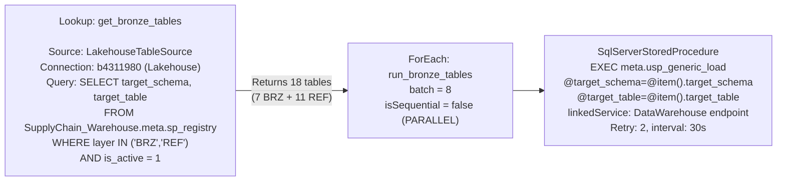

**Retry policy**: Each SP activity has retry=2, interval=30 seconds. This handles snapshot isolation conflicts that occur when multiple DROP+CTAS operations run in parallel on overlapping Parquet files.

### 3.4 pl_silver_forecast (46437ae6) -- PARENT Pipeline

The silver pipeline uses a **parent-child pattern** (the Microsoft-recommended approach for dynamic iteration in Fabric Pipeline). The parent computes waves, looks up distinct wave numbers, and invokes the child pipeline `pl_silver_wave_forecast` once per wave in sequential order. Each child invocation runs all SPs for that wave in parallel.

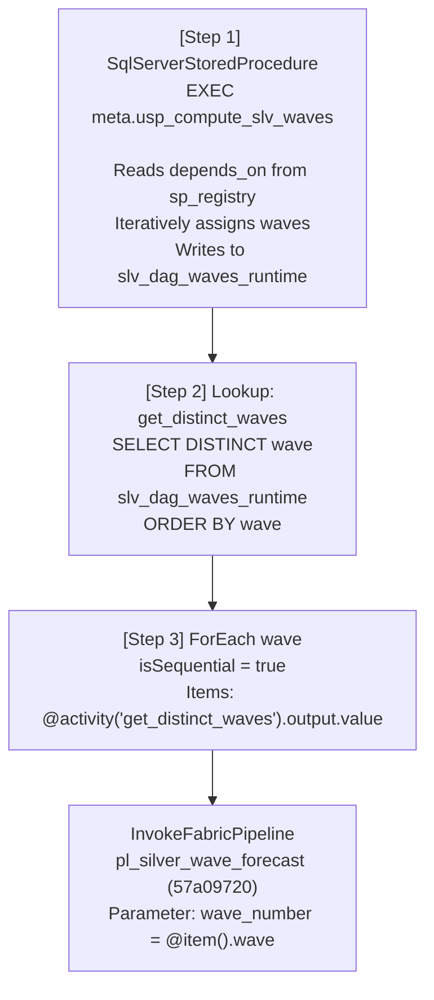

**Scaling**: Supports any number of DAG waves without pipeline changes. Adding new silver tables with deeper dependency chains automatically creates additional waves.

**Historical note**: An earlier design used 10 pre-built sequential Lookup+ForEach stages (wave 0 through wave 9). This was replaced by the parent-child pattern which is cleaner and does not impose a fixed wave limit.

### 3.5 pl_silver_wave_forecast (57a09720) -- CHILD Pipeline

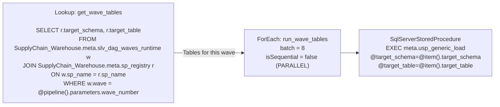

**Parameter**: `wave_number` (INT) -- passed from the parent pipeline's ForEach.

### 3.6 pl_gold_forecast (94fc130e)

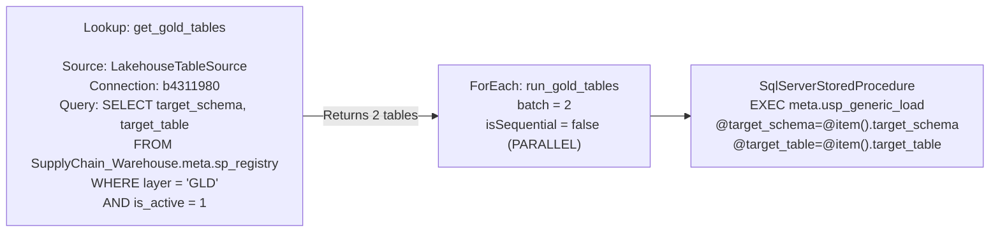

### 3.7 Pipeline Execution Timeline (Actual Run #3)

```mermaid
gantt
    title pl_sc_master Run #3 (2026-04-14, ~16 min total)
    dateFormat HH:mm
    axisFormat %H:%M

    section Master
    log_start (usp_log_pipeline_run) :ls, 14:18, 0m

    section Bronze
    18 SPs batch=8 parallel      :b, after ls, 3m

    section Silver
    Wave 0 (3 SPs parallel)      :s0, after b, 2m
    Wave 1 (4 SPs parallel)      :s1, after s0, 3m
    Wave 2 (1 SP)                :s2, after s1, 1m

    section Gold
    2 SPs parallel               :g, after s2, 1m

    section Master
    finalize (usp_finalize_pipeline) :fn, after g, 0m
```

---

## 4. Connection Topology

### 4.1 Connection Architecture

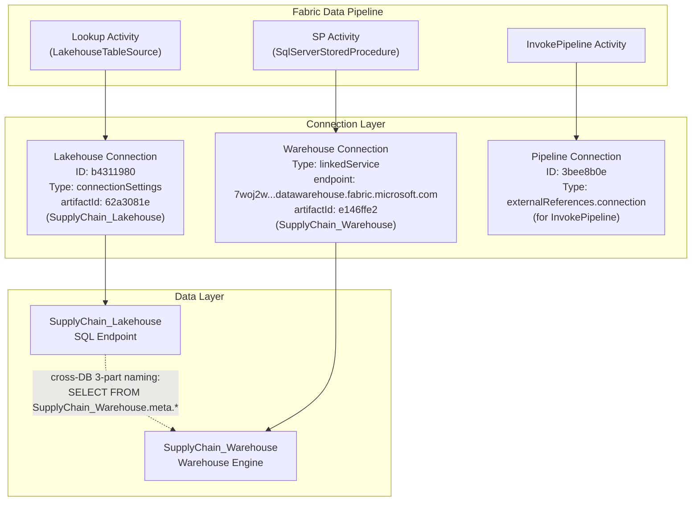

### 4.2 Why Lakehouse for Lookup?

Fabric Pipeline's Lookup activity natively supports `LakehouseTableSource` as a source type, but **does not natively support Warehouse as a Lookup source**. Attempting to use a Warehouse connection in a Lookup returns "Failed to open resource" errors.

**Workaround**: The Lookup activity connects to the SupplyChain_Lakehouse SQL endpoint, then uses cross-database 3-part naming to query Warehouse tables:

```sql
-- Executed on Lakehouse SQL endpoint, reads from Warehouse
SELECT sp_name
FROM SupplyChain_Warehouse.meta.sp_registry
WHERE layer IN ('BRZ', 'REF')
  AND is_active = 1
```

This works because Fabric's SQL endpoint supports cross-database queries between artifacts in the same workspace.

### 4.3 Connection Details per Activity Type

| Activity Type | Source Config | Connection ID | Target |
|---------------|-------------|---------------|--------|
| Lookup | LakehouseTableSource + connectionSettings | b4311980 (Lakehouse) | Lakehouse SQL endpoint -> cross-DB to Warehouse |
| SqlServerStoredProcedure | linkedService (DataWarehouse) | e146ffe2 (Warehouse) | Warehouse engine directly |
| InvokePipeline | externalReferences.connection | 3bee8b0e (Pipeline) | Target pipeline by ID |

---

## 5. Generic SP + 2-File-Per-Table Pattern

### 5.1 Pattern Diagram

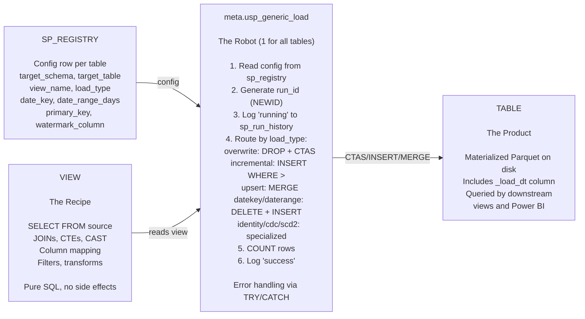

### 5.2 Why This Pattern?

- **Separation of concerns**: View holds logic, generic SP handles execution/logging, table stores data.
- **Testability**: You can `SELECT * FROM vw_xxx` to preview results without materializing.
- **Zero-SP onboarding**: Adding a new table requires only a VIEW + 1 row in sp_registry. No per-table SP.
- **8 load patterns**: overwrite, incremental, upsert, datekey, daterange, identity, cdc, scd2 -- all handled by 1 SP reading from sp_registry.
- **Observability**: Every execution is logged with run_id, start/end time, row count, status, error message.
- **Aligned with Enterprise ETL_Framework**: Same load_type taxonomy used across all projects.

### 5.3 Generic SP -- meta.usp_generic_load (replaces all 28 per-table SPs)

```sql
-- Called by pipeline ForEach:
EXEC meta.usp_generic_load @target_schema = 'bronze', @target_table = 'brz_saleshistory_afi__invoicedetail';

-- The SP internally:
-- 1. Reads sp_registry WHERE target_schema = @target_schema AND target_table = @target_table
-- 2. Gets: view_name, load_type, watermark_column, primary_key, date_key, date_range_days
-- 3. Routes by load_type:
--    'overwrite'    -> DROP TABLE IF EXISTS + CTAS from view
--    'incremental'  -> INSERT WHERE watermark_column > last_watermark_value
--    'upsert'       -> MERGE on primary_key
--    'datekey'      -> DELETE WHERE date_key IN (SELECT DISTINCT date_key FROM view) + INSERT
--    'daterange'    -> DELETE WHERE date_key >= DATEADD(DAY, -date_range_days, GETUTCDATE()) + INSERT
--    'identity'     -> INSERT with MAX(id)+1
--    'cdc'          -> Apply CDC operations
--    'scd2'         -> SCD Type 2 logic
-- 4. Logs start/end via meta.usp_log_run
-- 5. Updates sp_registry with rows_loaded, last_load_date
```

### 5.4 sp_registry New Columns for Generic SP

| Column | Type | Purpose |
|--------|------|---------|
| `date_key` | VARCHAR(100) | Date column name for datekey/daterange patterns |
| `date_range_days` | INT | Number of days for daterange pattern |

These columns are NULL for overwrite/incremental patterns and only used when load_type requires date-based partitioning.

---

## 6. Silver DAG System

### 6.1 How It Works

The Silver layer uses a Directed Acyclic Graph (DAG) to determine execution order. Each silver SP declares its dependencies via the `depends_on` column in `meta.sp_registry`. The system then computes execution "waves" -- groups of SPs that can run in parallel because all their dependencies have been satisfied in prior waves.

### 6.2 depends_on Column

The `depends_on` column in `meta.sp_registry` stores a JSON array of SP names that this SP depends on. Only silver-to-silver dependencies matter for wave computation. Dependencies on bronze tables are ignored (bronze always runs first as a complete layer).

Example:
```sql
-- slv_actual_demand_monthly depends on 2 silver tables
depends_on = '["silver.usp_load_slv_invoice_detail_line_level", "silver.usp_load_slv_open_order_line_level"]'
```

### 6.3 meta.usp_compute_slv_waves -- Iterative Wave Computation

Fabric Warehouse does not support recursive CTEs. The wave computation uses an iterative WHILE loop instead:

```sql
CREATE OR ALTER PROCEDURE meta.usp_compute_slv_waves AS
BEGIN
    DELETE FROM meta.slv_dag_waves_runtime;
    DECLARE @wave INT = 0, @assigned INT = 0, @new_count INT = 1;
    DECLARE @total INT, @max_waves INT = 30;

    SELECT @total = COUNT(*) FROM meta.sp_registry
    WHERE layer = 'SLV' AND is_active = 1;

    -- Wave 0: SPs with no silver dependencies
    INSERT INTO meta.slv_dag_waves_runtime (sp_name, wave)
    SELECT sp_name, 0 FROM meta.sp_registry
    WHERE layer = 'SLV' AND is_active = 1
    AND (depends_on IS NULL OR depends_on NOT LIKE '%silver.usp_%');

    SELECT @assigned = COUNT(*) FROM meta.slv_dag_waves_runtime;
    SET @wave = 1;

    -- Iterate: assign next wave when ALL deps are already assigned
    WHILE @assigned < @total AND @wave < @max_waves AND @new_count > 0
    BEGIN
        INSERT INTO meta.slv_dag_waves_runtime (sp_name, wave)
        SELECT r.sp_name, @wave FROM meta.sp_registry r
        WHERE r.layer = 'SLV' AND r.is_active = 1
        AND r.sp_name NOT IN (SELECT sp_name FROM meta.slv_dag_waves_runtime)
        AND NOT EXISTS (
            SELECT 1 FROM meta.sp_registry dep
            WHERE dep.layer = 'SLV' AND dep.is_active = 1
            AND r.depends_on LIKE '%' + dep.sp_name + '%'
            AND dep.sp_name NOT IN (SELECT sp_name FROM meta.slv_dag_waves_runtime)
        );
        SET @new_count = @@ROWCOUNT;
        SET @assigned = @assigned + @new_count;
        SET @wave = @wave + 1;
    END
END
```

### 6.4 Current Wave Assignment (3 Waves, 8 SPs)

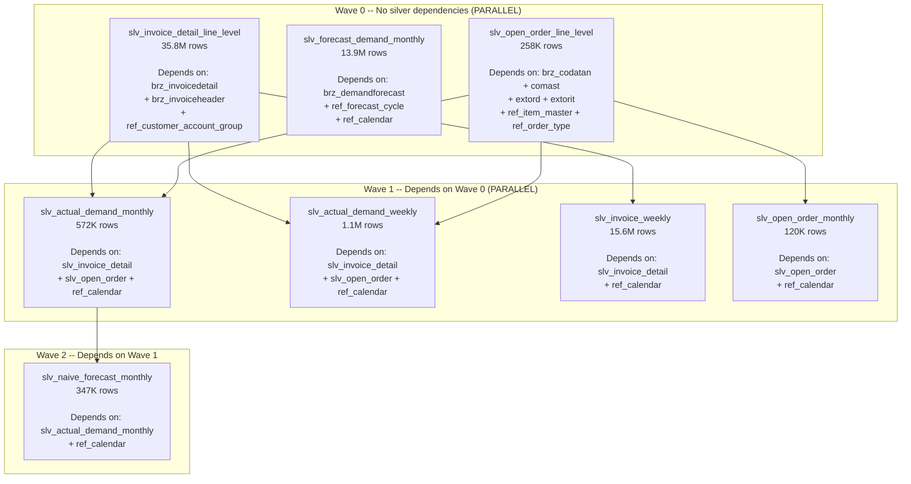

### 6.5 Parent-Child Pipeline Pattern

The silver pipeline uses a **parent-child pattern** to handle DAG waves. This is the Microsoft-recommended approach because Fabric Pipeline does not allow nesting ForEach inside Until, nor ForEach inside another ForEach.

**Current implementation**: The parent pipeline (`pl_silver_forecast`) computes waves, does a Lookup for distinct wave numbers, then uses a ForEach (isSequential=true) to invoke `pl_silver_wave_forecast` for each wave with a `wave_number` parameter. The child pipeline does its own Lookup for SPs in that wave and a ForEach (batch=8, parallel) to execute them.

**Historical note**: An earlier design used 10 pre-built sequential Lookup+ForEach stages (wave 0 through wave 9). This was replaced by the parent-child pattern which is cleaner and supports any number of waves without pipeline changes.

---

## 7. Semantic Model: SC_Control_Tower

### 7.1 Overview

| Aspect | Detail |
|--------|--------|
| **Name** | SC_Control_Tower |
| **ID** | a52841ee-d853-46df-b2f7-2a2cc4493d60 |
| **Mode** | Direct Lake (reads Parquet from SupplyChain_Warehouse) |
| **Tables** | 8 (5 dims + 2 facts + _Measure + para_metric_table) |
| **Relationships** | 9 (copied from v8 SM) |
| **DAX measures** | ~30 (copied from v8 SM) |
| **Removed from v8** | dq_forecast_accuracy table (not needed in v9) |

### 7.2 Tables

| Table (Display Name) | Warehouse Source | Type |
|----------------------|-----------------|------|
| dim_calendar | bronze.ref_calendar | Dimension |
| dim_customer | bronze.ref_customer_account | Dimension |
| dim_customer_group | bronze.ref_customer_grouping | Dimension |
| dim_product | bronze.ref_product | Dimension |
| dim_warehouse | bronze.ref_warehouse | Dimension |
| fact_flat_forecast_actual | gold.gld_fact_flat_forecast_actual | Fact |
| fact_forecast_kpi | gold.gld_fact_forecast_kpi | Fact |
| _Measure | (DAX measures container) | Utility |
| para_metric_table | (parameter table) | Utility |

### 7.3 Source Remapping Technique

The SM uses the same **display names** as the v8 Semantic Model (dim_calendar, fact_forecast_kpi, etc.) so that Power BI reports can switch data source without breaking visuals, slicers, or DAX references.

Under the hood, the TMDL source references were remapped:

| TMDL Property | v8 Value | v9 Value |
|---------------|---------|---------|
| sourceLineageTag | `[dbo].[dim_calendar]` | `[bronze].[ref_calendar]` |
| partition entityName | `dim_calendar` | `ref_calendar` |
| partition schemaName | `dbo` | `bronze` |

Relationships and DAX measures reference display names only, so they required **no changes** during remapping.

### 7.4 Gold View Fixes for SM Compatibility

Two gold views were updated to match the column names expected by the SM:

**vw_gld_fact_flat_forecast_actual**:
- Renamed `qty_demand` to `qty`
- Removed `amt_demand` and `dt_snapshot` from output

**vw_gld_fact_forecast_kpi**:
- Renamed `qty_naive` to `qty_naive_forecast`
- Renamed `qty_forecast_error` to `qty_fcst_error`
- Added ABS columns for absolute error values
- Added `dt_snapshot` column
- Removed `code_customer_group` from join

### 7.5 SM API Methods

| Operation | Method | Endpoint |
|-----------|--------|----------|
| Create SM | POST | `/v1/workspaces/{id}/semanticModels` (with TMDL definition parts) |
| Get SM definition | POST | `/v1/workspaces/{id}/semanticModels/{id}/getDefinition` (async 202, returns TMDL) |
| Refresh SM | POST | `https://api.powerbi.com/v1.0/myorg/groups/{ws}/datasets/{id}/refreshes` (Power BI API) |
| Delete SM | DELETE | `/v1/workspaces/{id}/semanticModels/{id}` |
| List SMs | GET | `/v1/workspaces/{id}/semanticModels` |

### 7.6 SM Refresh in Pipeline

The master pipeline includes a `refresh_sm` activity (step [6]) that refreshes the Semantic Model after finalize:

| Aspect | Detail |
|--------|--------|
| Activity type | PBISemanticModelRefresh |
| Connection | externalReferences.connection: `0f1e7cd1-737b-44f3-a630-29c73a5e40cd` |
| groupId | workspace_id |
| datasetId | a52841ee-d853-46df-b2f7-2a2cc4493d60 |
| objects | 7 tables (5 dims + 2 facts, excluding _Measure and para_metric_table) |

The refresh syncs Direct Lake metadata with the latest Parquet files written by the gold layer SPs.

---

## 8. Meta Schema Detail

### 8.1 Tables (7)

#### meta.sp_registry (28 rows)

| Aspect | Detail |
|--------|--------|
| **Purpose** | The central registry -- defines every data SP in the system: what to run, how, when, and what it depends on. |
| **Auto-populated** | `last_load_date`, `rows_loaded`, `next_run_time` (updated by usp_log_run after each SP execution) |
| **Manual input** | All other columns (INSERT when adding a new table) |
| **Key columns** | `sp_name` (PK equivalent), `layer` (BRZ/REF/SLV/GLD), `depends_on` (JSON), `source_objects` (JSON), `is_active` (0/1), `load_type` (overwrite/incremental/upsert/datekey/daterange/identity/cdc/scd2), `watermark_column`, `last_watermark_value`, `date_key` (for datekey/daterange patterns), `date_range_days` (for daterange pattern) |
| **Written when** | Manual INSERT for each new table. Auto-UPDATE after each SP run. |

```sql
CREATE TABLE meta.sp_registry (
    sp_name             VARCHAR(200)    NOT NULL,
    view_name           VARCHAR(200)    NULL,
    target_schema       VARCHAR(50)     NOT NULL,
    target_table        VARCHAR(200)    NOT NULL,
    layer               VARCHAR(10)     NOT NULL,     -- BRZ / REF / SLV / GLD
    load_type           VARCHAR(20)     NOT NULL,     -- overwrite / incremental
    frequency           VARCHAR(20)     NOT NULL,     -- daily / hourly / weekly / monthly
    scheduled_hour      INT             NULL,
    execution_order     INT             NOT NULL,     -- 1=BRZ/REF, 2-4=SLV, 5=GLD
    parallel_group      INT             NULL,
    depends_on          VARCHAR(500)    NULL,         -- JSON: ["silver.usp_load_slv_xxx"]
    source_objects      VARCHAR(2000)   NULL,         -- JSON: ["Enterprise_Lakehouse.schema.table"]
    watermark_column    VARCHAR(100)    NULL,
    primary_key         VARCHAR(500)    NULL,
    date_key            VARCHAR(100)    NULL,         -- date column for datekey/daterange patterns
    date_range_days     INT             NULL,         -- number of days for daterange pattern
    is_active           INT             NOT NULL,     -- 0/1 (no BIT in Fabric WH)
    last_load_date      DATETIME2(6)    NULL,
    last_watermark_value VARCHAR(200)   NULL,
    next_run_time       DATETIME2(6)    NULL,
    rows_loaded         BIGINT          NULL,
    project             VARCHAR(50)     NULL
);
```

#### meta.sp_run_history (129 rows)

| Aspect | Detail |
|--------|--------|
| **Purpose** | Execution journal -- every SP execution creates one row with start/end time, row count, status, and errors. |
| **Auto-populated** | Yes, entirely by `usp_log_run`. |
| **Manual input** | None. |
| **Key columns** | `run_id` (NEWID per execution), `sp_name`, `start_time`, `end_time`, `duration_seconds`, `rows_affected`, `status` (running/success/failed), `error_message` |
| **Written when** | Twice per SP execution: INSERT on start (status='running'), UPDATE on end (status='success' or 'failed'). |

```sql
CREATE TABLE meta.sp_run_history (
    run_id              VARCHAR(36)     NOT NULL,
    pipeline_run_id     VARCHAR(36)     NULL,
    sp_name             VARCHAR(200)    NOT NULL,
    start_time          DATETIME2(6)    NOT NULL,
    end_time            DATETIME2(6)    NULL,
    duration_seconds    INT             NULL,
    rows_affected       BIGINT          NULL,
    status              VARCHAR(20)     NOT NULL,
    error_message       VARCHAR(4000)   NULL,
    load_type           VARCHAR(20)     NULL
);
```

#### meta.dq_rules (30 rows)

| Aspect | Detail |
|--------|--------|
| **Purpose** | Configuration table for data quality checks -- defines what to check, on which table/column, severity, and thresholds. |
| **Auto-populated** | No. |
| **Manual input** | Yes, INSERT when adding DQ rules for new or existing tables. |
| **Key columns** | `rule_id` (manually assigned INT), `check_type` (completeness/uniqueness/row_count/freshness/referential_integrity/validity/custom_sql), `target_schema`, `target_table`, `column_name`, `severity` (CRITICAL/WARNING/INFO), `threshold`, `params` (JSON) |
| **Written when** | Manual INSERT during setup or when adding new tables. |

```sql
CREATE TABLE meta.dq_rules (
    rule_id             INT             NOT NULL,
    rule_name           VARCHAR(200)    NOT NULL,
    target_schema       VARCHAR(50)     NOT NULL,
    target_table        VARCHAR(200)    NOT NULL,
    check_type          VARCHAR(30)     NOT NULL,
    column_name         VARCHAR(100)    NULL,
    severity            VARCHAR(10)     NOT NULL,
    threshold           DECIMAL(18,2)   NULL,
    params              VARCHAR(1000)   NULL,
    is_active           INT             NOT NULL,
    layer               VARCHAR(10)     NOT NULL
);
```

#### meta.dq_results (30 rows)

| Aspect | Detail |
|--------|--------|
| **Purpose** | Stores the outcome of each DQ check execution -- pass/fail, actual value vs expected. |
| **Auto-populated** | Yes, by `usp_check_dq_single` (or legacy `usp_check_dq`). |
| **Manual input** | None. |
| **Key columns** | `result_id`, `rule_id`, `check_time`, `status` (PASS/FAIL), `actual_value`, `expected_value`, `error_detail` |
| **Written when** | Each time DQ checks are executed via `pl_dq_check` pipeline. |

```sql
CREATE TABLE meta.dq_results (
    result_id           INT             NOT NULL,
    pipeline_run_id     VARCHAR(36)     NULL,
    rule_id             INT             NOT NULL,
    check_time          DATETIME2(6)    NOT NULL,
    status              VARCHAR(10)     NOT NULL,
    actual_value        VARCHAR(500)    NULL,
    expected_value      VARCHAR(500)    NULL,
    error_detail        VARCHAR(4000)   NULL
);
```

#### meta.sp_lineage (52 rows)

| Aspect | Detail |
|--------|--------|
| **Purpose** | Data lineage graph -- source-to-target edges auto-generated from sp_registry's source_objects JSON. |
| **Auto-populated** | Yes, by `usp_build_lineage` (called automatically by `usp_finalize_pipeline` in the master pipeline's finalize step). |
| **Manual input** | None. |
| **Key columns** | `lineage_id`, `source_schema`, `source_table`, `target_schema`, `target_table`, `relationship_type` (direct/join/union/lookup), `sp_name` |
| **Written when** | Every master pipeline run (rebuilt during finalize step). Also can be run manually via `EXEC meta.usp_build_lineage`. Deletes and rebuilds all rows. |

```sql
CREATE TABLE meta.sp_lineage (
    lineage_id          INT             NOT NULL,
    source_schema       VARCHAR(100)    NOT NULL,
    source_table        VARCHAR(200)    NOT NULL,
    target_schema       VARCHAR(100)    NOT NULL,
    target_table        VARCHAR(200)    NOT NULL,
    relationship_type   VARCHAR(20)     NULL,
    sp_name             VARCHAR(200)    NULL
);
```

#### meta.pipeline_run_log

| Aspect | Detail |
|--------|--------|
| **Purpose** | Top-level pipeline run tracking -- logs master pipeline start/end and aggregate statistics. |
| **Auto-populated** | Yes. INSERT by `usp_log_pipeline_run` (called by `log_start` activity in master pipeline), UPDATE by `usp_finalize_pipeline` (called by `finalize` activity). |
| **Manual input** | None. |
| **Key columns** | `pipeline_run_id`, `pipeline_name`, `status`, `start_time`, `end_time`, `tables_succeeded`, `tables_failed`, `dq_failures_critical`, `notes` |
| **Written when** | Every master pipeline run: INSERT at start (status='running'), UPDATE at end (status='success', counts populated). |

```sql
CREATE TABLE meta.pipeline_run_log (
    pipeline_run_id     VARCHAR(36)     NOT NULL,
    pipeline_name       VARCHAR(100)    NOT NULL,
    status              VARCHAR(20)     NOT NULL,
    start_time          DATETIME2(6)    NOT NULL,
    end_time            DATETIME2(6)    NULL,
    tables_succeeded    INT             NULL,
    tables_failed       INT             NULL,
    dq_failures_critical INT            NULL,
    notes               VARCHAR(2000)   NULL
);
```

#### meta.slv_dag_waves_runtime (8 rows)

| Aspect | Detail |
|--------|--------|
| **Purpose** | Stores the computed wave assignment for each silver SP. Refreshed each time `usp_compute_slv_waves` runs. |
| **Auto-populated** | Yes, by `usp_compute_slv_waves`. DELETE + INSERT on each run. |
| **Manual input** | None. |
| **Key columns** | `sp_name`, `wave` (INT, 0-based) |
| **Written when** | Every time the silver pipeline runs (Step 1 of pl_silver_forecast). |

```sql
CREATE TABLE meta.slv_dag_waves_runtime (
    sp_name             VARCHAR(200)    NOT NULL,
    wave                INT             NOT NULL
);
```

### 8.2 Stored Procedures (10)

#### meta.usp_generic_load

| Aspect | Detail |
|--------|--------|
| **What it does** | Generic load SP that replaces all 28 per-table SPs. Reads config from `sp_registry` (view_name, load_type, watermark_column, primary_key, date_key, date_range_days) and routes to the correct load pattern. Supports 8 patterns: overwrite, incremental, upsert, datekey, daterange, identity, cdc, scd2. |
| **When called** | By the pipeline ForEach activity for every table in every layer (bronze, silver, gold). Called as `EXEC meta.usp_generic_load @target_schema, @target_table`. |
| **Key logic** | 1) Read sp_registry config for @target_schema + @target_table. 2) Generate run_id, log 'running'. 3) Route by load_type to appropriate load pattern. 4) Count rows, log 'success'/'failed'. Aligned with Enterprise ETL_Framework patterns. |

#### meta.usp_log_run

| Aspect | Detail |
|--------|--------|
| **What it does** | Logs SP execution start and end to `sp_run_history`. On completion, also updates `sp_registry` with last_load_date, rows_loaded, and next_run_time. |
| **When called** | Twice per SP execution: once with status='running' (INSERT), once with status='success' or 'failed' (UPDATE). |
| **Key logic** | If status='running': INSERT new row. Else: UPDATE existing row (matched by run_id) with end_time, duration_seconds, rows_affected. Also UPDATE sp_registry to set next_run_time based on frequency (daily -> +1 day, hourly -> +1 hour, etc.). |

```sql
CREATE OR ALTER PROCEDURE meta.usp_log_run
    @run_id VARCHAR(36), @sp_name VARCHAR(200), @status VARCHAR(20),
    @rows_affected BIGINT = NULL, @error_message VARCHAR(4000) = NULL,
    @pipeline_run_id VARCHAR(36) = NULL, @load_type VARCHAR(20) = NULL
AS
BEGIN
    IF @status = 'running'
        INSERT INTO meta.sp_run_history (run_id, pipeline_run_id, sp_name, start_time, status, load_type)
        VALUES (@run_id, @pipeline_run_id, @sp_name, CAST(GETUTCDATE() AS DATETIME2(6)), 'running', @load_type);
    ELSE
    BEGIN
        UPDATE meta.sp_run_history
        SET end_time = CAST(GETUTCDATE() AS DATETIME2(6)),
            duration_seconds = DATEDIFF(SECOND, start_time, GETUTCDATE()),
            rows_affected = @rows_affected, status = @status, error_message = @error_message
        WHERE run_id = @run_id;

        UPDATE meta.sp_registry
        SET last_load_date = CAST(GETUTCDATE() AS DATETIME2(6)), rows_loaded = @rows_affected,
            next_run_time = CASE
                WHEN frequency = 'daily'   THEN DATEADD(DAY, 1, CAST(GETUTCDATE() AS DATE))
                WHEN frequency = 'hourly'  THEN DATEADD(HOUR, 1, GETUTCDATE())
                WHEN frequency = 'weekly'  THEN DATEADD(WEEK, 1, CAST(GETUTCDATE() AS DATE))
                WHEN frequency = 'monthly' THEN DATEADD(MONTH, 1, CAST(GETUTCDATE() AS DATE))
                ELSE DATEADD(DAY, 1, CAST(GETUTCDATE() AS DATE)) END
        WHERE sp_name = @sp_name;
    END
END
```

#### meta.usp_check_dq

| Aspect | Detail |
|--------|--------|
| **What it does** | DQ engine: reads `dq_rules`, dynamically generates and executes SQL for each rule, writes results to `dq_results`. |
| **When called** | After data load completes (currently run manually via Python due to the WHILE loop bug). |
| **Key logic** | WHILE loop iterates over dq_rules rows. For each rule, generates a SQL check based on check_type (completeness -> COUNT NULL, uniqueness -> COUNT DISTINCT vs COUNT, etc.), executes via sp_executesql, compares result to threshold, writes PASS/FAIL to dq_results. |
| **Known bug** | The WHILE loop only executes 1 iteration in Fabric Warehouse. Root cause unknown (possibly a Fabric WH limitation with sp_executesql inside WHILE). Workaround: run DQ checks from Python/Pipeline instead of the SP. |

#### meta.usp_check_dq_single

| Aspect | Detail |
|--------|--------|
| **What it does** | Single-rule DQ engine. Processes 1 rule at a time, generates SQL, executes, writes to dq_results. CRITICAL fail -> THROW. No WHILE loop. |
| **When called** | By `pl_dq_check` pipeline ForEach activity. Each iteration passes a single `@rule_id`. |
| **Key logic** | Read dq_rules by rule_id -> generate SQL by check_type (completeness, uniqueness, row_count, freshness, referential_integrity, validity, custom_sql) -> sp_executesql -> write result to dq_results with retry 3x. If severity = CRITICAL and check fails, THROW to halt the pipeline. |

#### meta.usp_build_lineage

| Aspect | Detail |
|--------|--------|
| **What it does** | Parses the `source_objects` JSON column from `sp_registry` and generates source-to-target lineage edges in `sp_lineage`. |
| **When called** | Automatically by `usp_finalize_pipeline` during the master pipeline's finalize step. Can also be run manually after adding new tables to sp_registry. |
| **Key logic** | Deletes all existing lineage rows, then for each sp_registry row, parses the source_objects JSON array and creates one lineage edge per source object. Handles 3-part names (External.Schema.Table) by extracting schema and table. |

#### meta.usp_compute_slv_waves

| Aspect | Detail |
|--------|--------|
| **What it does** | Computes execution waves for silver SPs based on their depends_on declarations. |
| **When called** | As the first step of pl_silver_forecast pipeline, every time silver runs. |
| **Key logic** | See Section 6.3 for full SQL. Iterative WHILE loop assigns wave 0 (no silver deps), wave 1 (all deps in wave 0), etc., up to max 30 waves. Results stored in slv_dag_waves_runtime. |

#### meta.usp_run_silver_dag

| Aspect | Detail |
|--------|--------|
| **What it does** | Backup orchestrator: computes waves, then sequentially executes all silver SPs wave by wave. |
| **When called** | Not used in production pipeline (replaced by the Lookup+ForEach pattern). Available as a manual fallback. |
| **Key logic** | Calls usp_compute_slv_waves, then loops through waves 0..N, and within each wave loops through SPs, calling EXEC for each. All execution is sequential (no parallelism). |

#### meta.usp_debug_loop

| Aspect | Detail |
|--------|--------|
| **What it does** | Debugging utility to test WHILE loop behavior in Fabric Warehouse. |
| **When called** | Ad-hoc debugging only. |
| **Key logic** | Simple WHILE loop that inserts rows into a temp table to verify loop iteration count. Used to diagnose the usp_check_dq WHILE loop bug. |

#### meta.usp_log_pipeline_run

| Aspect | Detail |
|--------|--------|
| **What it does** | Logs pipeline start/end to `pipeline_run_log`. Inserts a row with status='running' at pipeline start. |
| **When called** | By the `log_start` activity (SqlServerStoredProcedure) as the first step of `pl_sc_master`. |
| **Key logic** | INSERT INTO meta.pipeline_run_log with pipeline_run_id, pipeline_name, status='running', start_time. |

#### meta.usp_finalize_pipeline

| Aspect | Detail |
|--------|--------|
| **What it does** | Finalizes the pipeline run: 1) Runs `usp_build_lineage` to refresh the lineage graph, 2) Counts success/failed SPs from sp_run_history, 3) Updates `pipeline_run_log` with final status='success', end_time, and SP counts. |
| **When called** | By the `finalize` activity (SqlServerStoredProcedure) as the last step of `pl_sc_master`. |
| **Key logic** | EXEC meta.usp_build_lineage; count success/failed from sp_run_history; UPDATE pipeline_run_log SET status='success', end_time, tables_succeeded, tables_failed. |

### 8.3 Functions (2)

#### meta.ufn_should_run

| Aspect | Detail |
|--------|--------|
| **What it does** | Returns 1 if a given SP should run now (is_active=1 AND (next_run_time IS NULL OR next_run_time <= GETUTCDATE())). Returns 0 otherwise. |
| **When called** | In pipeline Lookup queries as a filter: `WHERE meta.ufn_should_run(sp_name) = 1`. |
| **Key logic** | Simple scalar function. Reads is_active and next_run_time from sp_registry. |

#### meta.ufn_cron_is_due

| Aspect | Detail |
|--------|--------|
| **What it does** | Cron-style schedule evaluation function. Returns 1 if the current time matches the cron expression for a given SP. |
| **When called** | As an alternative/complement to ufn_should_run for more granular scheduling. |
| **Key logic** | Evaluates cron-style schedule parameters against GETUTCDATE(). |

### 8.4 Views (2)

#### meta.vw_slv_dag_waves

| Aspect | Detail |
|--------|--------|
| **What it does** | Legacy view that computes silver waves using 3 hardcoded CTEs (max 3 waves). |
| **Status** | Replaced by `usp_compute_slv_waves` (iterative SP, supports up to 30 waves). Kept for reference. |

#### meta.vw_run_history_tz

| Aspect | Detail |
|--------|--------|
| **What it does** | View over `sp_run_history` that converts UTC timestamps to a configured timezone for human-readable run history. |
| **Status** | Active. Used for operational monitoring. |

---

## 9. DQ System

### 9.1 Overview

The Data Quality system is **config-driven**. Rules are stored in `meta.dq_rules`. Adding a new check = INSERT 1 row. The DQ engine reads rules, generates SQL dynamically, executes it, and writes results to `meta.dq_results`.

### 9.2 Seven Check Types

| Check Type | What It Checks | SQL Pattern Generated |
|------------|---------------|----------------------|
| `completeness` | Column NOT NULL percentage >= threshold | `SELECT CAST(SUM(CASE WHEN {col} IS NULL THEN 0 ELSE 1 END) * 100.0 / COUNT(*) AS DECIMAL(18,2))` |
| `uniqueness` | Column has no duplicate values | `SELECT COUNT(*) - COUNT(DISTINCT {col})` (expects 0) |
| `referential_integrity` | FK value exists in parent table | `SELECT COUNT(*) FROM child LEFT JOIN parent WHERE parent.key IS NULL` |
| `row_count` | Table row count within min/max range | `SELECT COUNT(*) FROM {table}` (compare to threshold) |
| `validity` | Values within expected set | `SELECT COUNT(*) WHERE {col} NOT IN ({valid_values})` |
| `freshness` | Most recent _load_dt within N hours | `SELECT DATEDIFF(HOUR, MAX(_load_dt), GETUTCDATE())` (compare to threshold) |
| `custom_sql` | Any arbitrary SQL check | Executes SQL from `params` column, expects 0 = pass |

### 9.3 Current Rule Distribution

| Layer | Rules | Examples |
|-------|-------|---------|
| Bronze | 18 | completeness on key columns, row_count minimums |
| Silver | 8 | uniqueness on composite keys, referential integrity |
| Gold | 4 | row_count ranges, freshness checks |
| **Total** | **30** | **30/30 PASS as of last run** |

### 9.4 Known Bug: WHILE Loop in usp_check_dq -- RESOLVED

The `meta.usp_check_dq` stored procedure used a WHILE loop to iterate over DQ rules and execute each one via `sp_executesql`. In Fabric Warehouse, this WHILE loop only executed **1 iteration** and then exited, regardless of the loop condition.

**Status**: **RESOLVED** (2026-04-17)

**Root cause**: Fabric Warehouse limitation with `sp_executesql` inside WHILE loops.

**Fix**: `usp_check_dq_single` replaces the WHILE loop approach. Each rule is processed individually by the pipeline's ForEach activity (`pl_dq_check`), which calls `usp_check_dq_single` once per rule with batch=5 parallelism. DQ is now fully integrated into the pipeline as gates between layers (dq_bronze, dq_silver, dq_gold). CRITICAL failures THROW and halt the pipeline.

> Fixed 2026-04-17: usp_check_dq_single replaces WHILE loop. DQ now integrated into pipeline as gates between layers.

---

## 10. Lineage System

### 10.1 Overview

The lineage system automatically generates a source-to-target data flow graph. It parses the `source_objects` JSON column in `meta.sp_registry` and creates edges in `meta.sp_lineage`.

### 10.2 Current State: 52 Edges

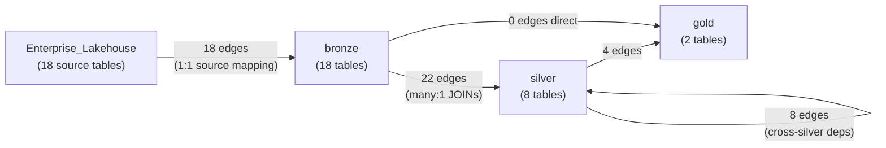

**Edge breakdown**:
- Enterprise_Lakehouse -> bronze: 18 edges (each bronze table reads from 1 source)
- bronze -> silver: 22 edges (silver tables JOIN multiple bronze tables)
- silver -> silver: 8 edges (wave 1+ silver tables depend on wave 0 silver tables)
- silver -> gold: 4 edges (gold tables read from silver tables)
- **Total**: 52 edges

### 10.3 usp_build_lineage Logic

1. DELETE FROM meta.sp_lineage (full rebuild)
2. For each row in sp_registry where source_objects is not NULL:
   - Parse source_objects JSON array
   - For each source object, extract schema and table name
   - INSERT into sp_lineage (source_schema, source_table, target_schema, target_table, sp_name)
3. Assign lineage_id as ROW_NUMBER()

---

## 11. Naming Convention

### 11.1 Object Names

| Schema | Table Pattern | View Pattern | SP Pattern |
|--------|--------------|--------------|------------|
| bronze | `brz_{source_system}__{entity}` | `vw_brz_{source_system}__{entity}` | (none -- uses meta.usp_generic_load) |
| bronze (ref) | `ref_{entity}` | `vw_ref_{entity}` | (none -- uses meta.usp_generic_load) |
| silver | `slv_{business_concept}` | `vw_slv_{business_concept}` | (none -- uses meta.usp_generic_load) |
| gold | `gld_{fact\|dim}_{subject}` | `vw_gld_{fact\|dim}_{subject}` | (none -- uses meta.usp_generic_load) |
| meta | descriptive (e.g., `sp_registry`) | `vw_*` (e.g., `vw_slv_dag_waves`) | `usp_*` / `ufn_*` |

### 11.2 Column Prefixes

| Prefix | Meaning | Example |
|--------|---------|---------|
| `id_` | Identifiers / keys | `id_customer`, `id_product` |
| `code_` | Codes / categories | `code_warehouse`, `code_order_type` |
| `name_` | Descriptive names | `name_customer`, `name_product` |
| `qty_` | Quantities | `qty_ordered`, `qty_shipped` |
| `amt_` | Monetary amounts | `amt_sales`, `amt_revenue` |
| `dt_` | Dates | `dt_invoice`, `dt_forecast` |
| `num_` | Numeric values | `num_line_item`, `num_invoice` |
| `ts_` | Timestamps | `ts_snapshot`, `ts_created` |
| `pct_` | Percentages | `pct_accuracy`, `pct_fill_rate` |
| `val_` | Calculated values | `val_forecast`, `val_naive` |
| `is_` | Boolean flags (INT 0/1) | `is_active`, `is_deleted` |
| `sk_` | Surrogate keys | `sk_customer`, `sk_product` |
| `_load_dt` | System column (load timestamp) | Always DATETIME2(6), added by SP |

### 11.3 Special Naming Notes

- **Bronze double underscore** (`__`): Separates source system from entity name. Example: `brz_saleshistory_afi__invoicedetail` = source system `saleshistory_afi`, entity `invoicedetail`.
- **Gold `gld_` prefix**: Required to avoid name collisions with v8 tables in `dbo` and `test_sp` schemas that use plain `fact_*` / `dim_*` naming.
- **Meta naming**: Uses descriptive names without layer prefix (e.g., `sp_registry` not `meta_sp_registry`) because the schema name already provides context.

---

## 12. Object Count Summary

| Schema | Tables | Views | SPs | Functions | Total |
|--------|--------|-------|-----|-----------|-------|
| bronze | 18 | 18 | 0 | -- | 36 |
| silver | 8 | 8 | 0 | -- | 16 |
| gold | 2 | 2 | 0 | -- | 4 |
| meta | 7 | 2 | 10 | 2 | 22 |
| **Total** | **35** | **30** | **10** | **2** | **78** |

> **Change from previous version**: 28 per-table SPs (18 bronze + 8 silver + 2 gold) have been **deleted** and replaced by 1 generic SP (`meta.usp_generic_load`). meta SPs increased from 8 to 10. Total objects reduced from 100 to 78. Added usp_check_dq_single, ufn_cron_is_due, vw_run_history_tz (2026-04-17).

**Pipelines**: 6 (`pl_sc_master`, `pl_bronze_forecast`, `pl_silver_forecast`, `pl_silver_wave_forecast`, `pl_gold_forecast`, `pl_dq_check`)

**Grand total**: 78 warehouse objects + 6 pipelines = **84 managed artifacts**

### Row Count Summary

| Layer | Tables | Total Rows |
|-------|--------|------------|
| Bronze | 18 | ~1,349,457,255 (~1.35 billion) |
| Silver | 8 | ~67,644,817 (~67.6 million) |
| Gold | 2 | ~55,850,611 (~55.9 million) |
| Meta | 7 | ~277 |
| **Total** | **35** | **~1,472,952,960 (~1.47 billion)** |

---

## 13. Bronze Source Mapping (Complete)

| v9 Table | Source (3-part name) | Rows | Load Type |
|----------|---------------------|------|-----------|
| brz_saleshistory_afi__invoicedetail | Enterprise_Lakehouse.SalesHistory_AFI.InvoiceDetail | 35,798,317 | overwrite |
| brz_saleshistory_afi__invoiceheader | Enterprise_Lakehouse.SalesHistory_AFI.InvoiceHeader | 4,044,847 | overwrite |
| brz_supplychain_enh_1__demandforecastsnapshotdaily | Enterprise_Lakehouse.SupplyChain_Enh_1.DemandForecastSnapshotDaily | 1,306,460,284 | **incremental** |
| brz_wholesale_codis_afi__codatan | Enterprise_Lakehouse.Wholesale_Codis_AFI.codatan | 918,213 | overwrite |
| brz_wholesale_codis_afi__comast | Enterprise_Lakehouse.Wholesale_Codis_AFI.COMAST | 229,461 | overwrite |
| brz_wholesale_codis_afi__extord | Enterprise_Lakehouse.Wholesale_Codis_AFI.EXTORD | 229,736 | overwrite |
| brz_wholesale_codis_afi__extorit | Enterprise_Lakehouse.Wholesale_Codis_AFI.EXTORIT | 912,132 | overwrite |
| ref_calendar | Enterprise_Lakehouse.MasterData_DW.DimDate | 21,551 | overwrite |
| ref_customer_account | Enterprise_Lakehouse.Customers.AccountMaster | 35,581 | overwrite |
| ref_customer_account_group | Enterprise_Lakehouse.Wholesale_ProductSourcing_AFI.CustomerGrouping | 35,454 | overwrite |
| ref_customer_grouping | Enterprise_Lakehouse.Wholesale_ProductSourcing_AFI.CustomerGrouping | 9 | overwrite |
| ref_customer_shipping_location | Enterprise_Lakehouse.Customers.ShippingLocations | 127,515 | overwrite |
| ref_forecast_cycle | SupplyChain_Lakehouse.dbo.ref_forecast_cycle | 43 | overwrite |
| ref_forecast_horizon | Hardcoded INSERT (8 rows) | 8 | overwrite |
| ref_item_master | Enterprise_Lakehouse.MasterData_DW.DimItemMaster | 379,331 | overwrite |
| ref_order_type | Enterprise_Lakehouse.Wholesale_Codis_AFI.AAORDTYP | 29 | overwrite |
| ref_product | Enterprise_Lakehouse.SupplyChain_DW.DimCurrentProductDetails | 373,326 | overwrite |
| ref_warehouse | Enterprise_Lakehouse.SupplyChain_DW.DimAFIWarehouses | 55 | overwrite |

**Notes**:
- 16 tables read from Enterprise_Lakehouse (US team source of truth) via 3-part naming
- 1 table (ref_forecast_cycle) reads from SupplyChain_Lakehouse.dbo (existing v8 reference)
- 1 table (ref_forecast_horizon) uses hardcoded INSERT of 8 rows (no view)
- Source schema in 3-part name = folder name in Lakehouse (not dbo)

---

## 14. Spark SQL to T-SQL Conversion Reference

| Spark SQL | T-SQL Equivalent |
|-----------|-----------------|
| `CAST(x AS STRING)` | `CAST(x AS VARCHAR(200))` |
| `to_date(CAST(x AS STRING), 'yyyyMMdd')` | `TRY_CONVERT(DATE, CAST(x AS VARCHAR(20)))` |
| `CAST(x AS TIMESTAMP)` | `TRY_CAST(x AS DATETIME2(6))` |
| `CAST(x AS DOUBLE)` | `CAST(x AS FLOAT)` |
| `true` / `false` | `1` / `0` (INT, not BIT) |
| `` `column` `` (backtick) | `[column]` (square bracket) |
| `"string"` (double quote) | `'string'` (single quote) |
| `GETUTCDATE()` | `CAST(GETUTCDATE() AS DATETIME2(6))` (required in CTAS) |
| `CURRENT_DATE()` | `CAST(GETDATE() AS DATE)` |
| `DATE_FORMAT(col, 'yyyy.MM')` | `FORMAT(col, 'yyyy.MM')` |
| `ADD_MONTHS(date, n)` | `DATEADD(MONTH, n, date)` |
| `DATE_TRUNC('year', date)` | `DATETRUNC(YEAR, date)` |
| `MAKE_DATE(y, m, d)` | `DATEFROMPARTS(y, m, d)` |
| `LIMIT 1` | `TOP 1` |

---

## 15. Fabric Warehouse Constraints (Comprehensive)

| Feature Not Supported | Impact | Workaround Used |
|----------------------|--------|-----------------|
| DEFAULT constraint | Cannot set default values in DDL | Set values explicitly in SP INSERT/CTAS |
| IDENTITY column | No auto-increment | ROW_NUMBER() OVER (...) or MAX(id)+1 |
| PRIMARY KEY / UNIQUE constraint | No enforced uniqueness | DQ uniqueness check in dq_rules |
| CURSOR / @@FETCH_STATUS | Cannot use cursors for iteration | WHILE + MIN(id) WHERE id > @current pattern |
| Temp tables (#temp) | No temporary tables | CTE or real table + DROP after use |
| Recursive CTE | No WITH RECURSIVE | SP with iterative WHILE loop (usp_compute_slv_waves) |
| DATETIME2 without precision | Implicit precision causes errors | Always specify DATETIME2(6) |
| datetime type in CTAS | GETUTCDATE() returns datetime, CTAS rejects | CAST(GETUTCDATE() AS DATETIME2(6)) |
| BIT data type | Unstable behavior in Fabric WH | Use INT (0/1) instead |
| TRIM(numeric_column) | TRIM on non-string errors | Remove TRIM or CAST to VARCHAR first |
| NVARCHAR(4000) in CTAS | Default NVARCHAR columns cause CTAS issues | CAST to VARCHAR(n) explicitly |
| NVARCHAR default length | CAST AS NVARCHAR defaults to 30 chars, truncates | CAST AS NVARCHAR(200) or use VARCHAR |
| SetVariable self-reference | `x = x + 1` causes "self-referencing" error | Use 2 variables: `next_wave = current + 1`, then `current = next_wave` |
| Warehouse as Lookup source | Pipeline Lookup does not support Warehouse natively | LakehouseTableSource + cross-DB 3-part naming |
| Until activity in Pipeline | Until loop fails with BadRequest in Fabric Pipeline | Parent-child pipeline pattern (pl_silver_forecast invokes pl_silver_wave_forecast per wave) |
| Nested dynamic EXEC from Pipeline | SP calling sp_executesql called from Pipeline SP activity fails | Pipeline directly calls individual SPs via ForEach |
| DECIMAL(10,4) for large numbers | Overflow on values like 1000000 | Use DECIMAL(18,2) |
| sp_executesql in WHILE loop | Only 1 iteration executes | Single-rule SP (usp_check_dq_single) + pipeline ForEach |

---

## 16. Alternatives Considered

| Problem | Approach Tried | Result | Final Solution |
|---------|---------------|--------|---------------|
| Bronze source | Read from SupplyChain_Lakehouse (v8 tables) | Creates dependency on v8 | **Read from Enterprise_Lakehouse** (independent) |
| Enterprise_Lakehouse access | 3-part name with dbo schema | 404 error | **3-part name with folder schema** (e.g., SalesHistory_AFI.InvoiceDetail) |
| Silver DAG | Static execution_order integer | Does not scale | **depends_on + iterative wave computation** |
| Wave computation | Recursive CTE | Not supported in Fabric WH | **SP iterative WHILE loop** (usp_compute_slv_waves) |
| Wave view | 3 hardcoded CTEs | Max 3 waves | **SP + runtime table** (max 30 waves) |
| Silver pipeline | SP orchestrator (usp_run_silver_dag) | All sequential, no parallelism | **Lookup+ForEach pattern** (parallel within wave) |
| Silver pipeline loop | Until + SetVariable loop | BadRequest error in Fabric Pipeline | **Parent-child pattern** (pl_silver_forecast invokes pl_silver_wave_forecast) |
| SetVariable increment | current_wave = current_wave + 1 | Self-reference error | **2 variables** (next_wave + current_wave) |
| Pipeline Lookup source | WarehouseSource + connectionSettings | "Failed to open resource" | **LakehouseTableSource + cross-DB query** |
| Pipeline SP activity | Script activity type | "ReferenceName null" error | **SqlServerStoredProcedure + linkedService** |
| Gold table naming | fact_* / dim_* (plain) | Name collision with v8 dbo/test_sp | **gld_fact_* / gld_dim_*** |
| DQ engine SP | WHILE + sp_executesql loop | Only 1 iteration executes | **usp_check_dq_single + pl_dq_check ForEach** (resolved 2026-04-17) |
| DQ threshold column | DECIMAL(10,4) | Overflow on 1000000 | **DECIMAL(18,2)** |
| Dynamic SQL variable | VARCHAR @sql | sp_executesql rejects VARCHAR | **NVARCHAR(4000)** |
| NVARCHAR cast | CAST AS NVARCHAR (no length) | Defaults to 30 chars, truncates | **CAST AS NVARCHAR(200)** |

---

## 17. Pipeline Run History

### Run #3 -- SUCCESS (2026-04-14)

| Metric | Value |
|--------|-------|
| Run ID | c41c1240-ae81-4377-8835-f0644ac4681c |
| Status | COMPLETED |
| Start | 2026-04-14 14:18:18 UTC |
| End | 2026-04-14 14:34:40 UTC |
| Duration | ~16 minutes |
| Tables refreshed | 28/28 |
| Total rows | ~1,472,804,014 (~1.47 billion) |

| Layer | Tables | Rows | Duration | Parallelism |
|-------|--------|------|----------|-------------|
| Bronze | 18/18 | 1,349,457,255 | ~3 min | batch=8 |
| Silver | 8/8 | 67,490,512 | ~6 min | wave 0-2, batch=8/wave |
| Gold | 2/2 | 55,856,247 | ~1 min | batch=2 |

**Retries**: 3 bronze SPs retried once due to snapshot isolation conflicts (auto-handled by retry policy, 30s interval).

### Run #2 -- FAILED (2026-04-14 14:07)

| Status | FAILED at pl_silver_forecast |
|--------|----------------------|
| Error | BadRequest -- Until activity not supported in Fabric Pipeline |
| Fix | Replaced Until loop with 10 sequential Lookup+ForEach wave stages |

### Run #1 -- FAILED (2026-04-14 13:56)

| Status | FAILED at pl_silver_forecast |
|--------|----------------------|
| Error | BadRequest -- SqlServerStoredProcedure calling usp_run_silver_dag (nested dynamic EXEC) |
| Fix | Changed silver pipeline from single SP orchestrator to Lookup+ForEach pattern |

---

*This document was generated on 2026-04-14, updated 2026-04-17. It reflects the production state of SupplyChain_Warehouse v9 running on Microsoft Fabric F256.*
