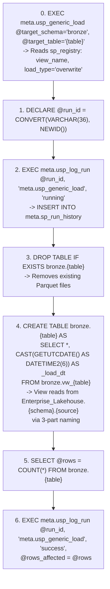
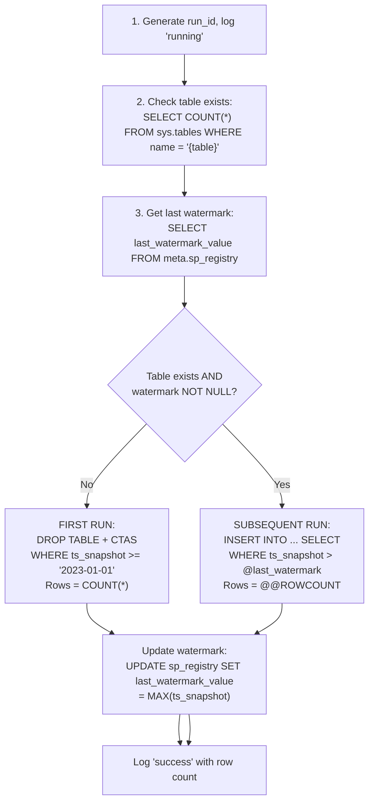
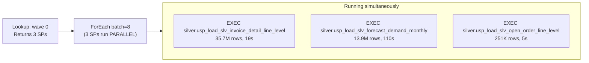
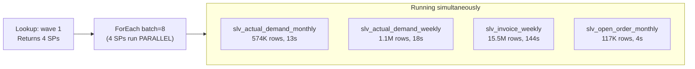
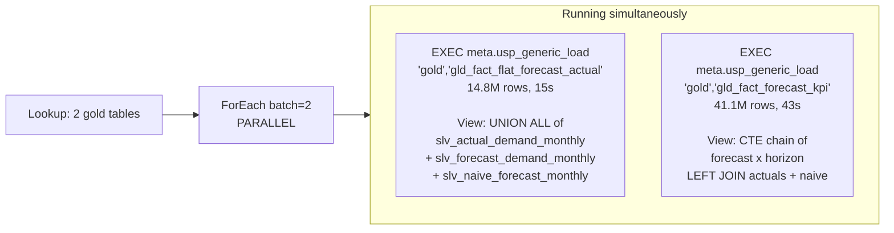
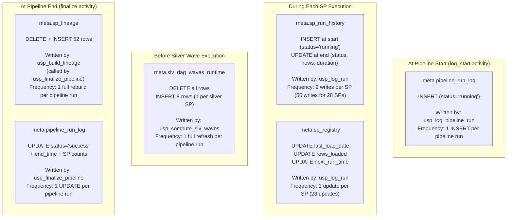
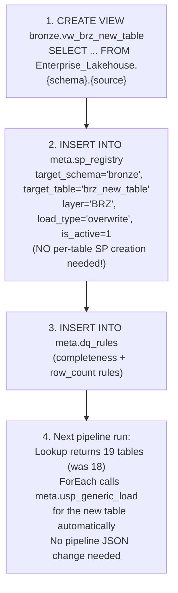
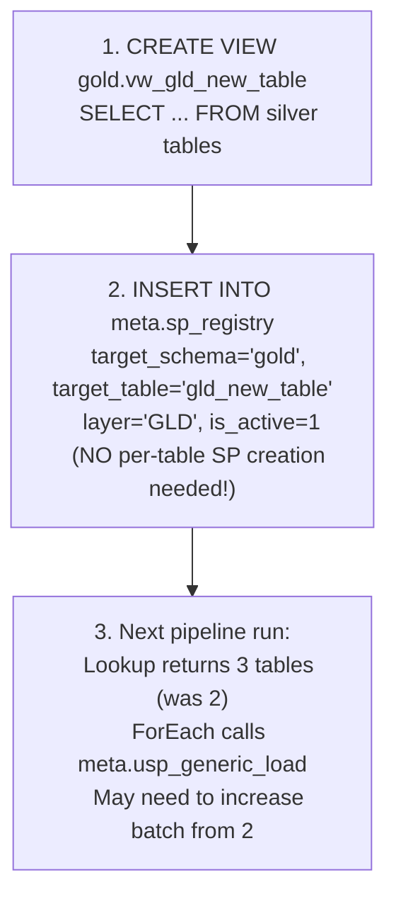

# Pipeline Deep Dive -- Execution Trace
> What happens step-by-step when pl_sc_master is triggered
> SupplyChain_Warehouse v9 | Microsoft Fabric F256

This document is a complete execution walkthrough of the master pipeline. It traces every activity, every SQL call, every data flow from start to finish. Read this to understand exactly what happens at runtime.

---

## Trigger: pl_sc_master Starts

When `pl_sc_master` (ID: 319a8160) is triggered (manually or on schedule), it executes 9 activities sequentially: log_start, 3 child pipelines, 3 DQ gates, finalize, and Semantic Model refresh:

```mermaid
flowchart LR
    T["Trigger\n(manual or schedule)"]
    LS["Step 1: log_start\n(SqlServerStoredProcedure)\nEXEC meta.usp_log_pipeline_run\nINSERT pipeline_run_log\nstatus='running'"]
    B["Step 2: pl_bronze_forecast\n(1bdbaebb)"]
    DQ1["Step 3: dq_bronze\n(InvokePipeline)\npl_dq_check layer='bronze'"]
    S["Step 4: pl_silver_forecast\n(46437ae6)"]
    DQ2["Step 5: dq_silver\n(InvokePipeline)\npl_dq_check layer='silver'"]
    G["Step 6: pl_gold_forecast\n(94fc130e)"]
    DQ3["Step 7: dq_gold\n(InvokePipeline)\npl_dq_check layer='gold'"]
    FN["Step 8: finalize\n(SqlServerStoredProcedure)\nEXEC meta.usp_finalize_pipeline\nbuilds lineage + updates\npipeline_run_log to 'success'"]
    SM["Step 9: refresh_sm\n(PBISemanticModelRefresh)\nRefresh SC_Control_Tower\nDirect Lake metadata sync\n7 tables refreshed"]

    T --> LS -->|"on success"| B
    B -->|"on success"| DQ1
    DQ1 -->|"on success"| S
    S -->|"on success"| DQ2
    DQ2 -->|"on success"| G
    G -->|"on success"| DQ3
    DQ3 -->|"on success"| FN -->|"on success"| SM
```



> DQ gates (dq_bronze, dq_silver, dq_gold) invoke pl_dq_check pipeline with layer parameter. CRITICAL DQ failure stops pipeline.

If any child pipeline or DQ gate fails, execution stops. Silver does not run if bronze fails. Gold does not run if silver fails. The `log_start` activity records the pipeline run at the beginning, the `finalize` activity rebuilds lineage and updates the run log with final status, and the `refresh_sm` activity syncs the Semantic Model's Direct Lake metadata with the latest gold tables.

---

## Step 1: pl_bronze_forecast Executes

### 1.1 Lookup Activity: Get Bronze SP List

The Lookup activity connects to the **Lakehouse SQL endpoint** (not the Warehouse directly) and runs a cross-database query:

```sql
-- Executed on: SupplyChain_Lakehouse SQL endpoint
-- Connection: b4311980 (LakehouseTableSource)
SELECT target_schema, target_table
FROM SupplyChain_Warehouse.meta.sp_registry
WHERE layer IN ('BRZ', 'REF')
  AND is_active = 1
```

**Returns 18 rows** (7 BRZ + 11 REF):

| # | target_schema | target_table | Layer |
|---|---------------|--------------|-------|
| 1 | bronze | brz_saleshistory_afi__invoicedetail | BRZ |
| 2 | bronze | brz_saleshistory_afi__invoiceheader | BRZ |
| 3 | bronze | brz_supplychain_enh_1__demandforecastsnapshotdaily | BRZ |
| 4 | bronze | brz_wholesale_codis_afi__codatan | BRZ |
| 5 | bronze | brz_wholesale_codis_afi__comast | BRZ |
| 6 | bronze | brz_wholesale_codis_afi__extord | BRZ |
| 7 | bronze | brz_wholesale_codis_afi__extorit | BRZ |
| 8 | bronze | ref_calendar | REF |
| 9 | bronze | ref_customer_account | REF |
| 10 | bronze | ref_customer_account_group | REF |
| 11 | bronze | ref_customer_grouping | REF |
| 12 | bronze | ref_customer_shipping_location | REF |
| 13 | bronze | ref_forecast_cycle | REF |
| 14 | bronze | ref_forecast_horizon | REF |
| 15 | bronze | ref_item_master | REF |
| 16 | bronze | ref_order_type | REF |
| 17 | bronze | ref_product | REF |
| 18 | bronze | ref_warehouse | REF |

### 1.2 ForEach Activity: Execute Generic SP in Parallel

The ForEach activity iterates over the 18 table rows with `batch=8` and `isSequential=false`. This means up to **8 tables load in parallel** at any time.

Each table is loaded via `SqlServerStoredProcedure` activity calling the **generic SP**:
- **Connection**: DataWarehouse linkedService (endpoint: 7woj2w...datawarehouse.fabric.microsoft.com, artifactId: e146ffe2)
- **Retry policy**: retry=2, interval=30 seconds
- **Command**: `EXEC meta.usp_generic_load @target_schema = @item().target_schema, @target_table = @item().target_table`

### 1.3 Inside the Generic SP (Overwrite Pattern -- 17 of 18 tables)

The generic SP `meta.usp_generic_load` reads `sp_registry` to determine the view_name and load_type, then executes the correct pattern. For the overwrite pattern (17 of 18 bronze tables):



**If an error occurs** (TRY/CATCH):
1. `DECLARE @err = ERROR_MESSAGE()`
2. `EXEC meta.usp_log_run @run_id, sp_name, 'failed', @error_message = @err`
3. `THROW` (re-raises error to pipeline, triggering retry)

### 1.4 Inside the Generic SP -- Incremental Pattern (demandforecast -- 1 of 18 tables)

For `brz_supplychain_enh_1__demandforecastsnapshotdaily`, `sp_registry.load_type = 'incremental'`, so `meta.usp_generic_load` uses the incremental pattern:



**On the successful pipeline run #3**: This SP returned 0 new rows because no new data had arrived since the last manual load. This is expected behavior, not an error.

### 1.5 Snapshot Conflict and Retry

When 8 bronze SPs run in parallel, they all do DROP TABLE + CTAS. If two SPs operate on Parquet files that share the same underlying storage segments, a **snapshot isolation conflict** occurs:

```
Error: "Snapshot isolation transaction aborted due to update conflict.
The transaction was aborted because another concurrent operation modified or deleted
the same resource."
```

**How it is handled**: The pipeline retry policy (retry=2, interval=30s) automatically retries the failed SP. After a 30-second wait, the conflicting transaction has completed, and the retry succeeds.

**Observed in Run #3**: 3 SPs required 1 retry each (brz_invoicedetail, brz_demandforecast, ref_warehouse). All succeeded on retry.

### 1.6 Bronze Execution Results (Run #3)

| SP | Rows | Duration | Retries |
|----|------|----------|---------|
| brz_saleshistory_afi__invoicedetail | 35,671,179 | 31s | 1 |
| brz_saleshistory_afi__invoiceheader | 4,074,633 | 31s | 0 |
| brz_supplychain_enh_1__demandforecastsnapshotdaily | 0 (incremental) | 4s | 1 |
| brz_wholesale_codis_afi__codatan | 918,213 | 14s | 0 |
| brz_wholesale_codis_afi__comast | 224,272 | 3s | 0 |
| brz_wholesale_codis_afi__extord | 223,617 | 8s | 0 |
| brz_wholesale_codis_afi__extorit | 912,132 | 15s | 0 |
| ref_calendar | 21,551 | 1s | 0 |
| ref_customer_account | 35,585 | 3s | 0 |
| ref_customer_account_group | 35,454 | 1s | 0 |
| ref_customer_grouping | 9 | 1s | 0 |
| ref_customer_shipping_location | 127,526 | 14s | 0 |
| ref_forecast_cycle | 43 | 6s | 0 |
| ref_forecast_horizon | 8 | 1s | 0 |
| ref_item_master | 379,339 | 24s | 0 |
| ref_order_type | 29 | 1s | 0 |
| ref_product | 373,326 | 11s | 0 |
| ref_warehouse | 55 | 1s | 1 |

**Total**: 18/18 success, ~1.35 billion rows, ~3 minutes elapsed time.

---

## Step 2: pl_silver_forecast Executes

### 2.1 Step 1 of Silver: Compute DAG Waves

The first activity in pl_silver_forecast is a SqlServerStoredProcedure that calls:

```sql
EXEC meta.usp_compute_slv_waves
```

This SP does the following:

1. **DELETE** all rows from `meta.slv_dag_waves_runtime` (clean slate)
2. **Wave 0**: Find all SLV SPs where `depends_on` does not reference any silver SP:
   ```sql
   INSERT INTO slv_dag_waves_runtime (sp_name, wave)
   SELECT sp_name, 0 FROM sp_registry
   WHERE layer = 'SLV' AND is_active = 1
   AND (depends_on IS NULL OR depends_on NOT LIKE '%silver.usp_%')
   ```
   **Result**: 3 SPs assigned to wave 0
3. **Wave 1**: Find SLV SPs where ALL silver dependencies are already assigned:
   ```sql
   INSERT INTO slv_dag_waves_runtime (sp_name, wave)
   SELECT r.sp_name, 1 FROM sp_registry r
   WHERE r.layer = 'SLV' AND r.is_active = 1
   AND r.sp_name NOT IN (SELECT sp_name FROM slv_dag_waves_runtime)
   AND NOT EXISTS (
       SELECT 1 FROM sp_registry dep
       WHERE dep.layer = 'SLV' AND dep.is_active = 1
       AND r.depends_on LIKE '%' + dep.sp_name + '%'
       AND dep.sp_name NOT IN (SELECT sp_name FROM slv_dag_waves_runtime)
   )
   ```
   **Result**: 4 SPs assigned to wave 1
4. **Wave 2**: Same logic, next iteration. **Result**: 1 SP assigned to wave 2
5. All 8 SPs assigned. Loop exits.

**Final content of `meta.slv_dag_waves_runtime` (8 rows)**:

| sp_name | wave |
|---------|------|
| silver.usp_load_slv_invoice_detail_line_level | 0 |
| silver.usp_load_slv_forecast_demand_monthly | 0 |
| silver.usp_load_slv_open_order_line_level | 0 |
| silver.usp_load_slv_actual_demand_monthly | 1 |
| silver.usp_load_slv_actual_demand_weekly | 1 |
| silver.usp_load_slv_invoice_weekly | 1 |
| silver.usp_load_slv_open_order_monthly | 1 |
| silver.usp_load_slv_naive_forecast_monthly | 2 |

### 2.2 Steps 2-3 of Silver: Parent-Child Wave Execution

The silver pipeline uses a **parent-child pattern**. After computing waves, the parent pipeline:

1. **Lookup** (Step 2): Queries the Lakehouse SQL endpoint with cross-DB:
   ```sql
   SELECT DISTINCT wave
   FROM SupplyChain_Warehouse.meta.slv_dag_waves_runtime
   ORDER BY wave
   ```
2. **ForEach** (Step 3, isSequential=**true**): For each wave, invokes child pipeline `pl_silver_wave_forecast` (57a09720) with parameter `wave_number = @item().wave`.

The child pipeline (`pl_silver_wave_forecast`) then:
1. **Lookup**: `SELECT sp_name FROM SupplyChain_Warehouse.meta.slv_dag_waves_runtime WHERE wave = @pipeline().parameters.wave_number`
2. **ForEach** (batch=8, PARALLEL): Executes each returned SP via SqlServerStoredProcedure.

### 2.3 Wave 0 Execution (3 SPs in Parallel)



Each SP follows the same overwrite pattern as bronze:
1. Generate run_id
2. Log 'running' to sp_run_history
3. DROP TABLE IF EXISTS silver.{table}
4. CTAS from silver.vw_{table} (view reads from bronze tables, applies JOINs/CTEs/transforms)
5. COUNT rows
6. Log 'success', update sp_registry

**Wave 0 completes when all 3 SPs finish**. The slowest SP (slv_forecast_demand_monthly at 110s) determines the wave duration.

### 2.4 Wave 1 Execution (4 SPs in Parallel)

Wave 1 starts only after wave 0 completes (sequential between waves).



These SPs depend on wave 0 outputs. For example, `slv_actual_demand_monthly`'s view reads from `silver.slv_invoice_detail_line_level` and `silver.slv_open_order_line_level` (both wave 0 tables that are now materialized).

### 2.5 Wave 2 Execution (1 SP)


This SP depends on `slv_actual_demand_monthly` (wave 1), which is why it runs in wave 2.

### 2.6 Only 3 Waves in Current State

The Lookup returns only 3 distinct waves (0, 1, 2), so the ForEach invokes `pl_silver_wave_forecast` exactly 3 times. If future silver tables create deeper dependency chains, additional waves are handled automatically without pipeline changes.

### 2.7 Silver Execution Results (Run #3)

| Wave | SP | Rows | Duration |
|------|----|------|----------|
| 0 | slv_invoice_detail_line_level | 35,671,179 | 19s |
| 0 | slv_forecast_demand_monthly | 13,876,949 | 110s |
| 0 | slv_open_order_line_level | 250,667 | 5s |
| 1 | slv_actual_demand_monthly | 574,253 | 13s |
| 1 | slv_actual_demand_weekly | 1,112,585 | 18s |
| 1 | slv_invoice_weekly | 15,537,894 | 144s |
| 1 | slv_open_order_monthly | 116,988 | 4s |
| 2 | slv_naive_forecast_monthly | 349,997 | 5s |

**Total**: 8/8 success, ~67.5 million rows, ~6 minutes elapsed time.

---

## Step 3: pl_gold_forecast Executes

### 3.1 Lookup Activity: Get Gold SP List

```sql
-- Executed on: SupplyChain_Lakehouse SQL endpoint (cross-DB)
SELECT target_schema, target_table
FROM SupplyChain_Warehouse.meta.sp_registry
WHERE layer = 'GLD'
  AND is_active = 1
```

**Returns 2 rows**:

| target_schema | target_table |
|---------------|--------------|
| gold | gld_fact_flat_forecast_actual |
| gold | gld_fact_forecast_kpi |

### 3.2 ForEach Activity: Execute Generic SP for Gold Tables

ForEach with `batch=2` and `isSequential=false`. Both tables load in parallel via `meta.usp_generic_load`.



### 3.3 Gold Execution Results (Run #3)

| SP | Rows | Duration |
|----|------|----------|
| gld_fact_flat_forecast_actual | 14,801,199 | 15s |
| gld_fact_forecast_kpi | 41,055,048 | 43s |

**Total**: 2/2 success, ~55.9 million rows, ~1 minute elapsed time.

---

## Meta Tables: What Gets Written During a Pipeline Run

### Auto-populated Tables



| Table | Writes per Pipeline Run | Written by |
|-------|------------------------|------------|
| pipeline_run_log | 1 INSERT (start) + 1 UPDATE (end) | usp_log_pipeline_run (start) + usp_finalize_pipeline (end) |
| sp_run_history | 56 (2 per table x 28 tables) | usp_log_run (called by usp_generic_load) |
| sp_registry | 28 (1 update per table) | usp_log_run (called by usp_generic_load) |
| slv_dag_waves_runtime | 1 DELETE + 8 INSERTs | usp_compute_slv_waves |
| sp_lineage | 1 DELETE + 52 INSERTs | usp_build_lineage (called by usp_finalize_pipeline) |
| SC_Control_Tower (SM) | 1 refresh (7 tables) | refresh_sm activity (PBISemanticModelRefresh) |

### Tables Requiring Manual Input

| Table | When to Write | What to Write |
|-------|--------------|---------------|
| sp_registry | When adding a new table | INSERT 1 row with sp_name, layer, load_type, depends_on, source_objects, etc. |
| dq_rules | When adding DQ checks | INSERT 1 row per rule with check_type, target table, threshold, severity |

### Tables Not Written During Pipeline Run

| Table | Status | Notes |
|-------|--------|-------|
| dq_rules | Read-only during run | Config table, manual maintenance |
| dq_results | Not written by pipeline | Written by DQ engine (run separately from Python) |

---

## Adding a New Table: Impact on Pipeline Flow

### Adding a Bronze Table (Simplified -- No SP Needed)



**What changes in the pipeline**: Nothing. The Lookup dynamically reads sp_registry. The ForEach calls `meta.usp_generic_load` for each table. Adding a view + 1 registry row is sufficient.

> **DQ recommendation**: When adding a new table, consider adding DQ rules to `meta.dq_rules` (e.g., completeness, row_count, freshness checks). DQ rules are optional but recommended -- the dq_bronze/dq_silver/dq_gold gates will automatically pick up any new rules for the corresponding layer on the next pipeline run.

### Adding a Silver Table (Simplified -- No SP Needed)

```mermaid
flowchart TD
    A["1. CREATE VIEW silver.vw_slv_new_table\n   SELECT ... FROM bronze/silver tables"]
    B["2. INSERT INTO meta.sp_registry\n   target_schema='silver', target_table='slv_new_table'\n   layer='SLV', depends_on='[\"silver.slv_xxx\"]'\n   (NO per-table SP creation needed!)"]
    C["3. Next pipeline run:\n   usp_compute_slv_waves recalculates\n   New table auto-assigned to correct wave\n   meta.usp_generic_load handles load\n   No pipeline change needed"]

    A --> B --> C
```

**What changes in the pipeline**: Nothing. The wave computation is dynamic. The parent-child pattern supports any number of waves. The new table is automatically placed in the correct wave based on its `depends_on` declaration.

**Example**: If you add `slv_new_table` with `depends_on = '["silver.slv_naive_forecast_monthly"]'`, it would be auto-assigned to wave 3 (because slv_naive_forecast_monthly is in wave 2). The parent pipeline's ForEach would invoke `pl_silver_wave_forecast` for wave 3, and `meta.usp_generic_load` would load the new table.

### Adding a Gold Table (Simplified -- No SP Needed)



**What changes in the pipeline**: Nothing in the pipeline definition. The Lookup dynamically picks up the new table. `meta.usp_generic_load` handles the load. Consider increasing the ForEach batch size if the number of gold tables grows significantly.

---

## End-to-End Timeline (Complete Trace)

```
T+00:00  pl_sc_master triggers
T+00:00  -> log_start: EXEC meta.usp_log_pipeline_run (INSERT pipeline_run_log, status='running')
T+00:00  -> Invokes pl_bronze_forecast (1bdbaebb)
T+00:01    -> Lookup: SELECT 18 sp_names from sp_registry (via Lakehouse cross-DB)
T+00:02    -> ForEach batch=8: first 8 SPs start in parallel
T+00:10    ->   8 more SPs start as slots free up
T+00:20    ->   remaining 2 SPs start
T+03:00    -> All 18 bronze SPs complete (3 retried once for snapshot conflicts)
T+03:00  -> pl_bronze_forecast completes
T+03:00  -> dq_bronze: pl_dq_check (22 rules, ~1 min)
T+03:01  -> dq_bronze completes, master invokes pl_silver_forecast (46437ae6)
T+03:01    -> SP: EXEC meta.usp_compute_slv_waves (computes 3 waves, writes 8 rows)
T+03:02    -> Lookup wave 0: returns 3 SPs
T+03:02    -> ForEach wave 0: 3 SPs start in parallel
T+04:52    -> Wave 0 completes (slowest: forecast_demand_monthly at 110s)
T+04:53    -> Lookup wave 1: returns 4 SPs
T+04:53    -> ForEach wave 1: 4 SPs start in parallel
T+07:17    -> Wave 1 completes (slowest: invoice_weekly at 144s)
T+07:18    -> Lookup wave 2: returns 1 SP
T+07:18    -> ForEach wave 2: 1 SP runs
T+07:23    -> Wave 2 completes (naive_forecast_monthly at 5s)
T+07:24    -> No more waves (Lookup returned only 3 distinct waves)
T+09:00  -> pl_silver_forecast completes
T+09:00  -> dq_silver: pl_dq_check (8 rules, ~1 min)
T+09:01  -> dq_silver completes, master invokes pl_gold_forecast (94fc130e)
T+09:01    -> Lookup: returns 2 sp_names
T+09:01    -> ForEach batch=2: both SPs start in parallel
T+09:44    -> Both gold SPs complete (slowest: forecast_kpi at 43s)
T+10:00  -> dq_gold: pl_dq_check (4 rules, ~1 min)
T+10:01  -> dq_gold completes
T+10:01  -> finalize: EXEC meta.usp_finalize_pipeline
             -> EXEC meta.usp_build_lineage (rebuild 52 lineage edges)
             -> Count success/failed SPs from sp_run_history
             -> UPDATE pipeline_run_log SET status='success', end_time, tables_succeeded, tables_failed
T+10:02  -> refresh_sm: PBISemanticModelRefresh
             -> POST https://api.powerbi.com/v1.0/myorg/groups/{ws}/datasets/{id}/refreshes
             -> Refreshes 7 tables in SC_Control_Tower (5 dims + 2 facts)
             -> Direct Lake metadata sync with latest Parquet files
T+10:16  pl_sc_master completes successfully

Total: ~16 minutes for 1.47 billion rows across 28 tables + 3 DQ gates + SM refresh
```

---

## Error Scenarios and Recovery

### Scenario 1: Bronze SP Fails After All Retries

If a bronze SP fails after 2 retries:
- The ForEach marks that iteration as failed
- **Other SPs in the ForEach continue** (ForEach does not abort on individual failure by default)
- pl_bronze_forecast marks as failed after ForEach completes
- pl_sc_master stops -- silver and gold do NOT run
- **sp_run_history** shows the failed run with error_message
- **Fix**: Investigate error, fix issue, re-trigger pl_sc_master (all bronze re-runs, silver/gold follow)

### Scenario 2: Silver SP Fails

If a silver SP fails within a wave:
- Other SPs in the same wave continue (parallel ForEach)
- The wave's ForEach marks as failed
- Subsequent waves do NOT run (sequential between waves)
- pl_silver_forecast fails, pl_gold_forecast does not run
- **Impact**: Any SP in a later wave that depends on the failed SP would also fail if it ran, so stopping is correct behavior

### Scenario 3: Wave Computation Produces Unexpected Results

If `usp_compute_slv_waves` assigns SPs to wrong waves (e.g., due to incorrect depends_on):
- SPs will run but may read stale data from upstream silver tables
- No runtime error (tables exist from prior run), but data may be incorrect
- **Detection**: Check slv_dag_waves_runtime after compute, verify wave assignments match expected DAG
- **Fix**: Update depends_on in sp_registry, re-run pipeline

---

*This document reflects the production state as of 2026-04-17, based on successful pipeline Run #3.*
