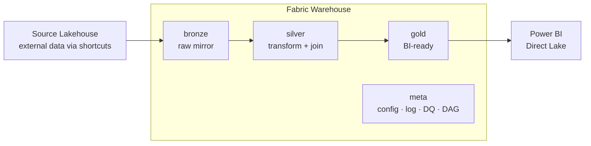
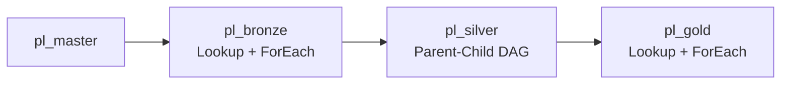
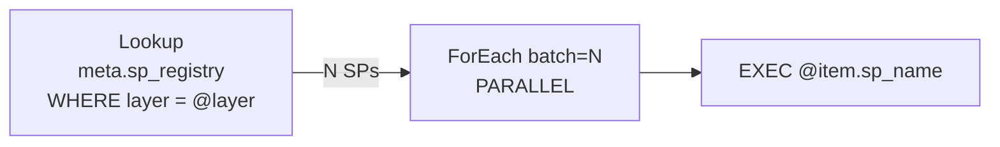
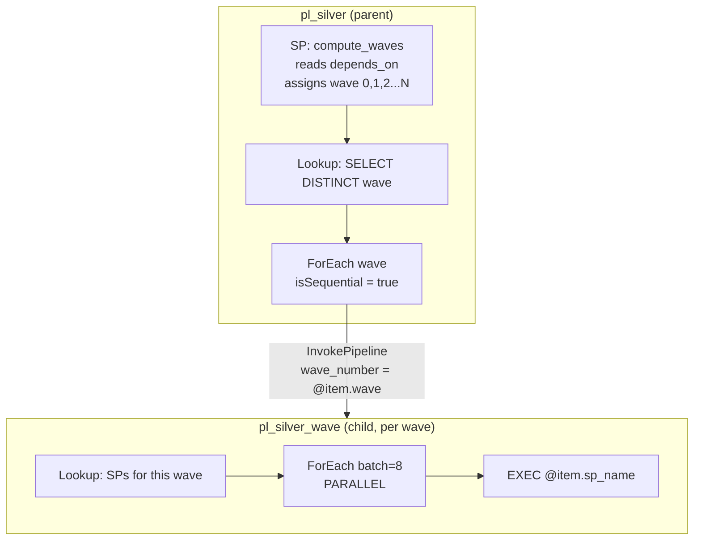
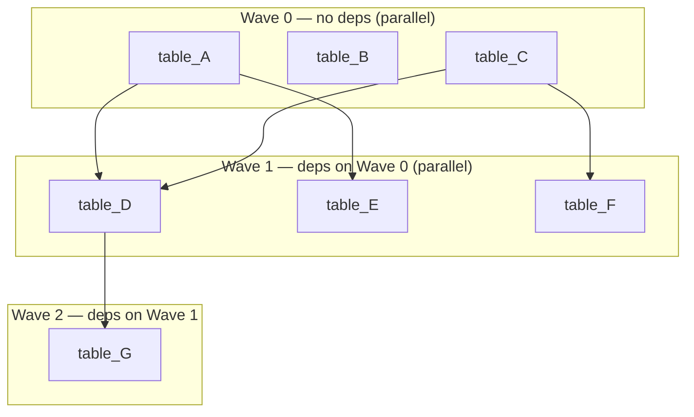
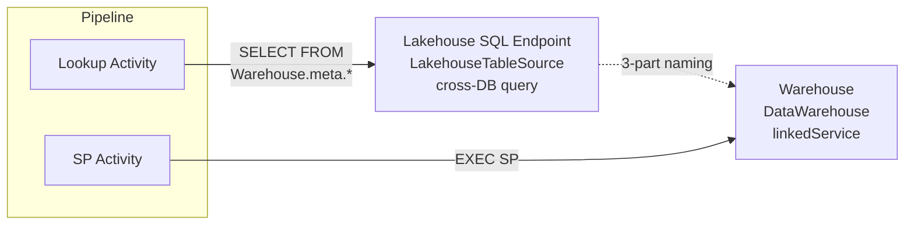
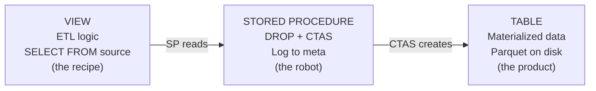

# Warehouse-Native Medallion Architecture
### Microsoft Fabric · Pure T-SQL · Metadata-driven · DAG Orchestration

A complete architecture template for building **enterprise data warehouses** on Microsoft Fabric using **pure T-SQL stored procedures** — no Notebooks, no PySpark, no Lakehouse ETL.

---

## Architecture



### 4 Schemas

| Schema | Purpose | Pattern |
|--------|---------|---------|
| **bronze** | Raw mirror from source systems | `VIEW` reads source via 3-part naming → `SP` does DROP + CTAS |
| **silver** | Clean, conform, join, business rules | `VIEW` reads bronze/silver → `SP` does DROP + CTAS |
| **gold** | Business-ready facts & dimensions | `VIEW` reads silver → `SP` does DROP + CTAS |
| **meta** | System control plane | Config tables + log tables + utility SPs + DAG engine |

---

## Key Features

- **3-file-per-table** — VIEW (ETL logic) + SP (execution) + TABLE (materialized data)
- **Metadata-driven** — adding a new table = INSERT 1 row into `meta.sp_registry`, no pipeline changes
- **DAG-based silver** — `depends_on` column defines dependencies, SP auto-computes execution waves
- **Parent-child pipeline** — sequential between waves, parallel within each wave (Microsoft recommended pattern)
- **Auto-scale to N waves** — iterative wave computation (max 30), no recursive CTE needed
- **Config-driven DQ** — rules in table, 7 check types, severity-based gating
- **Auto-built lineage** — `source_objects` JSON generates source→target edge map

---

## Warehouse Structure

```
{Warehouse}/
├── bronze/
│   ├── Tables/    brz_{source}__{entity}, ref_{entity}
│   ├── Views/     vw_{table_name} → SELECT FROM source (3-part naming)
│   └── SPs/       usp_load_{table_name} → DROP + CTAS
│
├── silver/
│   ├── Tables/    slv_{concept}
│   ├── Views/     vw_slv_{concept} → JOINs, CTEs, transforms
│   └── SPs/       usp_load_slv_{concept} → DROP + CTAS (with depends_on)
│
├── gold/
│   ├── Tables/    gld_{fact|dim}_{subject}
│   ├── Views/     vw_gld_{subject} → aggregation, UNION
│   └── SPs/       usp_load_gld_{subject} → DROP + CTAS
│
└── meta/
    ├── Tables/    sp_registry, sp_run_history, dq_rules, dq_results,
    │              sp_lineage, pipeline_run_log, slv_dag_waves_runtime
    ├── SPs/       usp_log_run, usp_check_dq, usp_build_lineage,
    │              usp_compute_slv_waves, usp_run_silver_dag
    └── Functions/ ufn_should_run
```

---

## Pipeline Architecture

### Master Flow



### Bronze & Gold — Lookup + Parallel ForEach



### Silver — Parent-Child DAG (parallel within wave, sequential between waves)



> **Why parent-child?** Microsoft docs state: *"You can't nest a ForEach loop inside another ForEach loop (or an Until loop)."* The recommended workaround is Execute Pipeline inside ForEach.

### DAG Wave Example



> Adding a new table: `INSERT INTO meta.sp_registry` with `depends_on` → SP auto-computes wave → Pipeline auto picks up. **No pipeline change needed.**

### Connection Topology



> **Why Lakehouse for Lookup?** Fabric Pipeline Lookup natively supports `LakehouseTableSource` but not Warehouse. Workaround: cross-DB 3-part naming.

---

## 3-File-Per-Table Pattern



### SP Template — Overwrite
```sql
CREATE OR ALTER PROCEDURE {schema}.usp_load_{table} AS
BEGIN
    DECLARE @run_id VARCHAR(36) = CONVERT(VARCHAR(36), NEWID());
    DECLARE @rows BIGINT;
    EXEC meta.usp_log_run @run_id, '{schema}.usp_load_{table}', 'running';
    BEGIN TRY
        DROP TABLE IF EXISTS {schema}.{table};
        CREATE TABLE {schema}.{table} AS
        SELECT *, CAST(GETUTCDATE() AS DATETIME2(6)) AS _load_dt
        FROM {schema}.vw_{table};
        SELECT @rows = COUNT(*) FROM {schema}.{table};
        EXEC meta.usp_log_run @run_id, '{schema}.usp_load_{table}', 'success',
             @rows_affected = @rows;
    END TRY
    BEGIN CATCH
        DECLARE @err VARCHAR(4000) = ERROR_MESSAGE();
        EXEC meta.usp_log_run @run_id, '{schema}.usp_load_{table}', 'failed',
             @error_message = @err;
        THROW;
    END CATCH
END
```

---

## Adding a New Table

### Bronze
```sql
-- 1. Create view
CREATE OR ALTER VIEW bronze.vw_brz_{name} AS
SELECT ... FROM {Source_Lakehouse}.{schema}.{source_table};
-- 2. Create SP (copy overwrite template)
-- 3. Register
INSERT INTO meta.sp_registry (sp_name, layer, load_type, ...) VALUES (...);
```

### Silver (with DAG)
```sql
-- Same as bronze, plus depends_on:
INSERT INTO meta.sp_registry (..., depends_on)
VALUES (..., '["silver.usp_load_slv_table_a"]');
-- Pipeline auto picks up → wave auto-computed → parallel execution
```

---

## Naming Convention

| Schema | Tables | Views | SPs |
|--------|--------|-------|-----|
| bronze | `brz_{src}__{tbl}` / `ref_{entity}` | `vw_brz_*` / `vw_ref_*` | `usp_load_brz_*` / `usp_load_ref_*` |
| silver | `slv_{concept}` | `vw_slv_*` | `usp_load_slv_*` |
| gold | `gld_{fact\|dim}_{subject}` | `vw_gld_*` | `usp_load_gld_*` |
| meta | descriptive | `vw_*` | `usp_*` / `ufn_*` |

Column prefixes: `id_` keys · `code_` categories · `name_` descriptions · `qty_` quantities · `amt_` amounts · `dt_` dates · `num_` numbers · `ts_` timestamps · `pct_` percentages · `is_` flags (0/1)

---

## Fabric Warehouse Constraints

| Not Supported | Workaround |
|---------------|------------|
| DEFAULT constraint | Set values in SP |
| IDENTITY | ROW_NUMBER() or MAX(id)+1 |
| PRIMARY KEY / UNIQUE | DQ uniqueness check |
| Recursive CTE | SP iterative WHILE loop |
| ForEach inside Until | Parent-child pipeline pattern |
| Variables in distributed queries | sp_executesql with parameters |
| `DATETIME2` without precision | Always `DATETIME2(6)` |
| `datetime` in CTAS | `CAST(GETUTCDATE() AS DATETIME2(6))` |
| Warehouse Lookup in Pipeline | LakehouseTableSource + cross-DB |

---

## Documentation

| File | Description |
|------|-------------|
| [v9_architecture_complete.md](v9_architecture_complete.md) | Definitive reference: all objects, pipelines, DAG, meta schema, DQ, lineage, constraints |
| [v9_pipeline_deep_dive.md](v9_pipeline_deep_dive.md) | Step-by-step execution trace when pipeline triggers, meta auto-population, adding new tables |
| [v9_setup_guide.md](v9_setup_guide.md) | Phase-by-phase setup with Fabric UI and REST API approaches, DDL, SP templates, JSON definitions |

---

## Tech Stack

- **Platform**: Microsoft Fabric (Synapse Data Warehouse)
- **Language**: T-SQL (pure, no PySpark/Notebooks)
- **Orchestration**: Fabric Data Pipelines (parent-child pattern)
- **BI**: Power BI Direct Lake
- **Version Control**: GitHub / Azure DevOps
- **Deployment**: Fabric REST API + Claude Code / DacFx (.sqlproj)

---

*Built with Claude Code + Fabric MCP Server*
