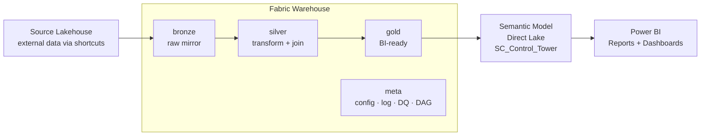
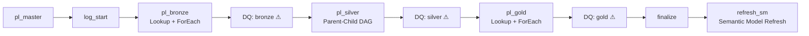
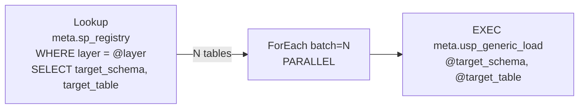
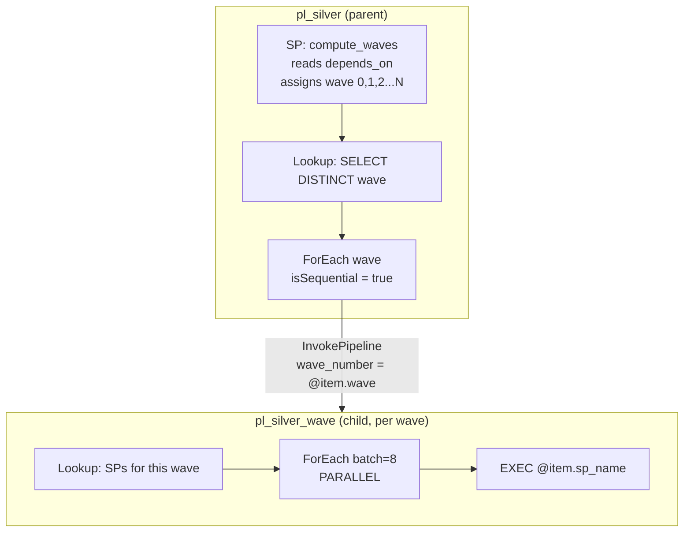
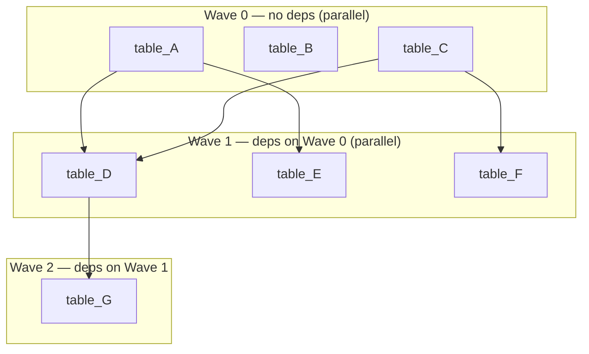
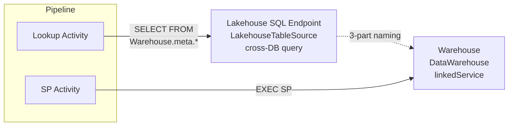
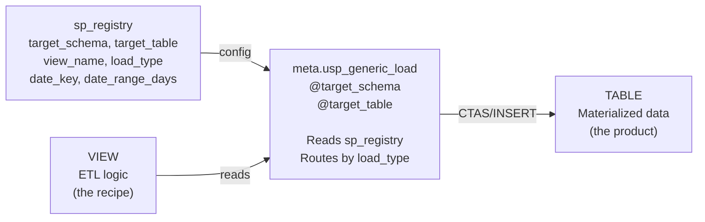
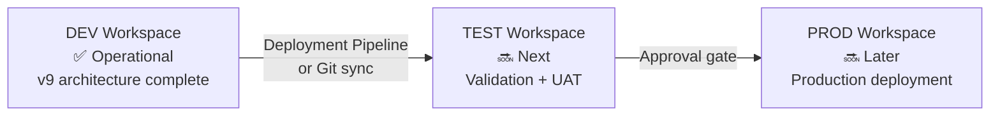

# Warehouse-Native Medallion Architecture
### Microsoft Fabric · Pure T-SQL · Metadata-driven · DAG Orchestration

A complete architecture template for building **enterprise data warehouses** on Microsoft Fabric using **pure T-SQL stored procedures** — no Notebooks, no PySpark, no Lakehouse ETL.

**[🔗 Live Lineage Explorer](https://vn-engineer-lineage.streamlit.app)** — Interactive data lineage visualization (login required)

---

## Architecture



### 4 Schemas

| Schema | Purpose | Pattern |
|--------|---------|---------|
| **bronze** | Raw mirror from source systems | `VIEW` reads source via 3-part naming → Generic SP does DROP + CTAS |
| **silver** | Clean, conform, join, business rules | `VIEW` reads bronze/silver → Generic SP does DROP + CTAS |
| **gold** | Business-ready facts & dimensions | `VIEW` reads silver → Generic SP does DROP + CTAS |
| **meta** | System control plane | Config tables + log tables + utility SPs + DAG engine |

---

## Key Features

- **Generic SP architecture** — 1 SP (`meta.usp_generic_load`) replaces 28 per-table SPs, supports 8 load patterns (overwrite, incremental, upsert, datekey, daterange, identity, cdc, scd2), aligned with Enterprise ETL_Framework
- **2-file-per-table** — VIEW (ETL logic) + TABLE (materialized data). No per-table SP needed.
- **Metadata-driven** — adding a new table = CREATE VIEW + INSERT 1 row into `meta.sp_registry`, no pipeline changes, no SP creation
- **DAG-based silver** — `depends_on` column defines dependencies, SP auto-computes execution waves
- **Parent-child pipeline** — sequential between waves, parallel within each wave (Microsoft recommended pattern)
- **Auto-scale to N waves** — iterative wave computation (max 30), no recursive CTE needed
- **Config-driven DQ** — rules in table, 7 check types, severity-based gating
- **Auto-built lineage** — `source_objects` JSON generates source→target edge map

---

## Warehouse Structure

```
{Warehouse}/
├── bronze/
│   ├── Tables/    brz_{source}__{entity}, ref_{entity}
│   └── Views/     vw_{table_name} → SELECT FROM source (3-part naming)
│
├── silver/
│   ├── Tables/    slv_{concept}
│   └── Views/     vw_slv_{concept} → JOINs, CTEs, transforms
│
├── gold/
│   ├── Tables/    gld_{fact|dim}_{subject}
│   └── Views/     vw_gld_{subject} → aggregation, UNION
│
└── meta/
    ├── Tables/    sp_registry, sp_run_history, dq_rules, dq_results,
    │              sp_lineage, pipeline_run_log, slv_dag_waves_runtime
    ├── SPs/       usp_generic_load (routes by load_type from sp_registry),
    │              usp_log_run, usp_check_dq, usp_build_lineage,
    │              usp_compute_slv_waves, usp_run_silver_dag,
    │              usp_debug_loop, usp_finalize_pipeline,
    │              usp_log_pipeline_run
    └── Functions/ ufn_should_run
```

> **Note**: Per-table SPs (bronze.usp_load_brz_*, silver.usp_load_slv_*, gold.usp_load_gld_*) have been **deleted**. All 28 data tables are now loaded by the single `meta.usp_generic_load` SP, which reads `sp_registry` to determine the target schema, table, view, and load pattern.

---

## Pipeline Architecture

### Master Flow



> ⚠ DQ gates shown for completeness. Currently experimental — `meta.usp_check_dq` has a known WHILE loop limitation in Fabric WH. DQ checks currently run via Python script, not yet integrated into pipeline activities.

### Bronze & Gold — Lookup + Parallel ForEach



### Silver — Parent-Child DAG (parallel within wave, sequential between waves)



> **Why parent-child?** Microsoft docs state: *"You can't nest a ForEach loop inside another ForEach loop (or an Until loop)."* The recommended workaround is Execute Pipeline inside ForEach.

### DAG Wave Example



> Adding a new table: `INSERT INTO meta.sp_registry` with `depends_on` → SP auto-computes wave → Pipeline auto picks up. **No pipeline change needed.**

### Connection Topology



> **Why Lakehouse for Lookup?** Fabric Pipeline Lookup natively supports `LakehouseTableSource` but not Warehouse. Workaround: cross-DB 3-part naming.

---

## Generic SP Architecture

Instead of 28 per-table SPs, a single **Generic SP** handles all loads:



### 8 Load Patterns

| Pattern | load_type | Description |
|---------|-----------|-------------|
| Overwrite | `overwrite` | DROP + CTAS from view (default) |
| Incremental | `incremental` | INSERT WHERE watermark > last value |
| Upsert | `upsert` | MERGE on primary_key |
| DateKey | `datekey` | DELETE + INSERT by date_key column |
| DateRange | `daterange` | DELETE last N days + INSERT |
| Identity | `identity` | INSERT with MAX(id)+1 |
| CDC | `cdc` | Apply change data capture operations |
| SCD2 | `scd2` | Slowly changing dimension type 2 |

### Generic SP Usage
```sql
-- Pipeline ForEach calls this for every table:
EXEC meta.usp_generic_load @target_schema = 'bronze', @target_table = 'brz_saleshistory_afi__invoicedetail';

-- The SP reads sp_registry to find:
--   view_name, load_type, watermark_column, primary_key, date_key, date_range_days
-- Then routes to the correct load pattern.
```

---

## Adding a New Table (Simplified)

With the Generic SP, adding a new table no longer requires creating a per-table stored procedure.

### Bronze (2 steps, was 3)
```sql
-- 1. Create view
CREATE OR ALTER VIEW bronze.vw_brz_{name} AS
SELECT ... FROM {Source_Lakehouse}.{schema}.{source_table};

-- 2. Register (NO SP creation needed!)
INSERT INTO meta.sp_registry (sp_name, view_name, target_schema, target_table,
    layer, load_type, frequency, execution_order, is_active, source_objects, project)
VALUES ('meta.usp_generic_load', 'bronze.vw_brz_{name}',
    'bronze', 'brz_{name}', 'BRZ', 'overwrite', 'daily', 1, 1,
    '["{Source_Lakehouse}.{schema}.{source_table}"]', '{project}');
```

### Silver (with DAG)
```sql
-- 1. Create view
-- 2. Register with depends_on:
INSERT INTO meta.sp_registry (..., depends_on)
VALUES (..., '["silver.slv_upstream_table"]');
-- Pipeline auto picks up -> wave auto-computed -> parallel execution
-- NO SP creation needed!
```

---

## Naming Convention

| Schema | Tables | Views | SPs |
|--------|--------|-------|-----|
| bronze | `brz_{src}__{tbl}` / `ref_{entity}` | `vw_brz_*` / `vw_ref_*` | (none -- uses meta.usp_generic_load) |
| silver | `slv_{concept}` | `vw_slv_*` | (none -- uses meta.usp_generic_load) |
| gold | `gld_{fact\|dim}_{subject}` | `vw_gld_*` | (none -- uses meta.usp_generic_load) |
| meta | descriptive | `vw_*` | `usp_*` / `ufn_*` |

Column prefixes: `id_` keys · `code_` categories · `name_` descriptions · `qty_` quantities · `amt_` amounts · `dt_` dates · `num_` numbers · `ts_` timestamps · `pct_` percentages · `is_` flags (0/1)

---

## Fabric Warehouse Constraints

| Not Supported | Workaround |
|---------------|------------|
| DEFAULT constraint | Set values in SP |
| IDENTITY | ROW_NUMBER() or MAX(id)+1 |
| PRIMARY KEY / UNIQUE | DQ uniqueness check |
| Recursive CTE | SP iterative WHILE loop |
| ForEach inside Until | Parent-child pipeline pattern |
| Variables in distributed queries | sp_executesql with parameters |
| `DATETIME2` without precision | Always `DATETIME2(6)` |
| `datetime` in CTAS | `CAST(GETUTCDATE() AS DATETIME2(6))` |
| Warehouse Lookup in Pipeline | LakehouseTableSource + cross-DB |

---

## Documentation

### Templates (generic, apply to any project)

| File | Description |
|------|-------------|
| [template_architecture.md](Fabric_Architect/template_architecture.md) | Architecture reference template: schemas, pipelines, DAG, meta, DQ, naming, constraints |
| [template_pipeline_guide.md](Fabric_Architect/template_pipeline_guide.md) | Pipeline execution trace template: what happens when master triggers, meta auto-population |
| [template_setup_guide.md](Fabric_Architect/template_setup_guide.md) | Phase-by-phase setup guide: DDL, SP templates, pipeline JSON, both Fabric UI and REST API |

### Project-specific (SupplyChain implementation)

| File | Description |
|------|-------------|
| [v9_architecture_supplychain.md](Fabric_Architect/v9_architecture_supplychain.md) | All 74 objects with names, row counts, pipeline IDs, source mappings, Semantic Model |
| [v9_pipeline_supplychain.md](Fabric_Architect/v9_pipeline_supplychain.md) | Execution trace with actual SP names, durations, wave assignments |
| [v9_setup_supplychain.md](Fabric_Architect/v9_setup_supplychain.md) | Implementation log: Spark→T-SQL conversions, bugs encountered, fixes applied |

### Enterprise comparison

| File | Description |
|------|-------------|
| [Enterprise_vs_Fabric_comparison.md](Enterprise_vs_Fabric_comparison.md) | Detailed comparison: ETL framework, load patterns, schema, CI/CD, change propagation |
| [generic_sp_migration_plan.md](generic_sp_migration_plan.md) | Migration plan: 28 per-table SPs → 1 generic SP (8 patterns) |

---

## Semantic Model

The architecture includes a **Direct Lake Semantic Model** that sits on top of the gold layer and is automatically refreshed at the end of every pipeline run.

| Aspect | Detail |
|--------|--------|
| **Mode** | Direct Lake (reads Parquet from Warehouse) |
| **Deployment** | Fabric REST API with TMDL definition |
| **Refresh** | Power BI API (`PBISemanticModelRefresh` pipeline activity) |
| **Source remapping** | Table display names match v8 (dim_calendar, fact_forecast_kpi, etc.) so reports switch source without breaking. Source references (sourceLineageTag, partition entityName/schemaName) point to warehouse schemas (bronze/silver/gold). |

### SM API Methods

| Operation | Method |
|-----------|--------|
| Create SM | `POST /v1/workspaces/{id}/semanticModels` (TMDL definition parts) |
| Get SM definition | `POST /v1/workspaces/{id}/semanticModels/{id}/getDefinition` (async 202, TMDL format) |
| Refresh SM | `POST https://api.powerbi.com/v1.0/myorg/groups/{ws}/datasets/{id}/refreshes` (Power BI API) |
| Delete SM | `DELETE /v1/workspaces/{id}/semanticModels/{id}` |
| List SMs | `GET /v1/workspaces/{id}/semanticModels` |

---

## Enterprise Compatibility

### TableDictionary View
`meta.vw_table_dictionary` maps `sp_registry` (22 cols) → Enterprise `TableDictionary` format (**63/63 columns matched** + 6 v9 extras = 69 total). US team can query this view using their familiar column names.

### Generic SP — 8 Load Patterns
`meta.usp_generic_load` implements all 8 Enterprise ETL patterns in a single SP:

| v9 load_type | Enterprise Equivalent | SP Used by Enterprise |
|-------------|----------------------|----------------------|
| `overwrite` | DELINSERT | usp_IncrementalTableLoad |
| `incremental` | Append/DateKey | usp_IncrementalTableLoad |
| `upsert` | Upsert | usp_IncrementalTableLoad |
| `datekey` | DateKey | usp_IncrementalTableLoad |
| `daterange` | DateRange | usp_UpdateCuratedTableFromView_DateRange |
| `identity` | Identity | usp_IncrementalTableLoad |
| `cdc` | CDC | usp_IncrementalTableLoad |
| `scd2` | SCD2 | usp_SCD2_TableLoad |

---

## Multi-Environment Roadmap

Current state: **DEV workspace** fully operational. Next steps for TEST and PROD:



### Fabric Git Integration
When Warehouse connects to Git (Azure DevOps or GitHub), Fabric **auto-exports** all objects as a SQL database project (.sqlproj + .sql files). This enables:
- Version control for all DDL changes
- Branch-based development (feature → dev → main)
- Deployment Pipelines: DEV → TEST → PROD promotion

### SqlCmdVariable `$(...)`
Enterprise team uses `$(Source_Data)` syntax in .sql files for multi-environment deployment. Fabric auto-export does **NOT** convert 3-part naming to `$(...)`. Two approaches:
- **Fabric native**: Use Deployment Pipelines (no `$(...)` needed — Fabric handles environment mapping)
- **Enterprise-aligned**: Manually maintain .sql files with `$(...)` + DacFx build/deploy (matches Enterprise CI/CD exactly)

Current v9 uses 3-part naming directly. Convert to `$(...)` when PROD deployment requires it.

---

## Tech Stack

- **Platform**: Microsoft Fabric (Synapse Data Warehouse)
- **Language**: T-SQL (pure, no PySpark/Notebooks)
- **Orchestration**: Fabric Data Pipelines (parent-child pattern)
- **ETL Engine**: Generic SP (8 load patterns, aligned with Enterprise ETL_Framework)
- **Semantic Model**: Direct Lake (TMDL via Fabric REST API)
- **BI**: Power BI Direct Lake
- **Lineage**: Interactive Streamlit app ([live](https://vn-engineer-lineage.streamlit.app))
- **Version Control**: GitHub / Azure DevOps
- **Deployment**: Fabric REST API + Claude Code / DacFx (.sqlproj)
- **Environments**: DEV (operational) → TEST → PROD (roadmap)

---

*Built with Claude Code + Fabric MCP Server*
