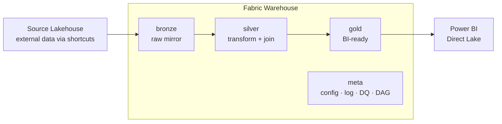
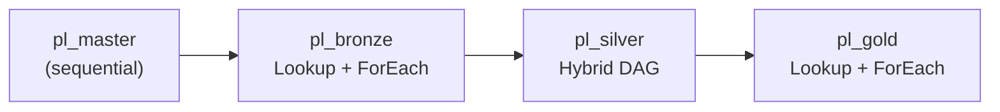
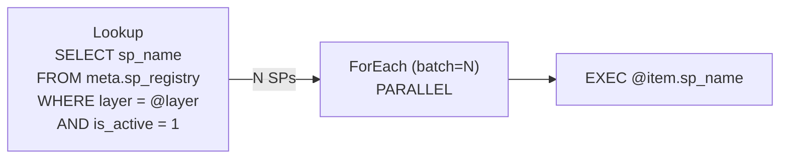
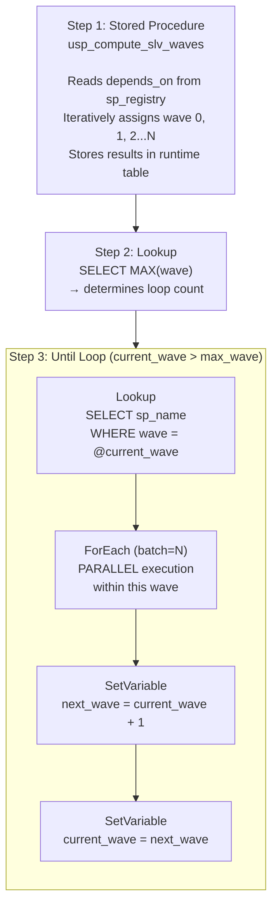
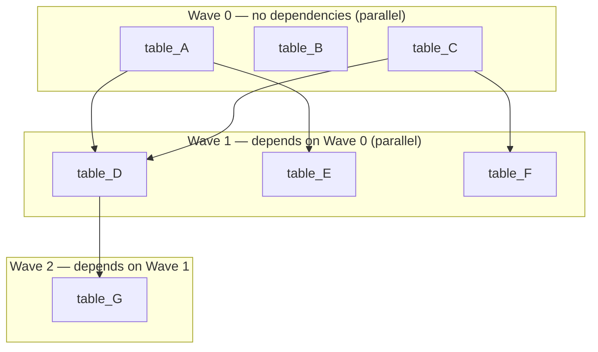
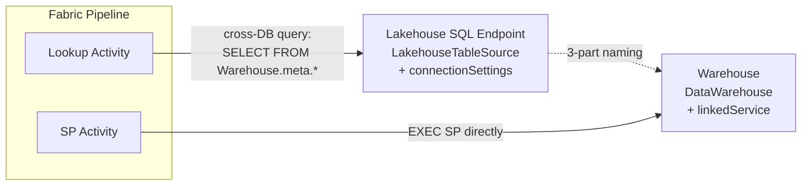
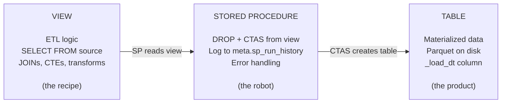

# Warehouse-Native Medallion Architecture
### Microsoft Fabric · Pure T-SQL · Metadata-driven · DAG Orchestration

A complete architecture template for building **enterprise data warehouses** on Microsoft Fabric using **pure T-SQL stored procedures** — no Notebooks, no PySpark, no Lakehouse ETL.

---

## Architecture



### 4 Schemas

| Schema | Purpose | Pattern |
|--------|---------|---------|
| **bronze** | Raw mirror from source systems | `VIEW` reads source via 3-part naming → `SP` does DROP + CTAS |
| **silver** | Clean, conform, join, business rules | `VIEW` reads bronze/silver → `SP` does DROP + CTAS |
| **gold** | Business-ready facts & dimensions | `VIEW` reads silver → `SP` does DROP + CTAS |
| **meta** | System control plane | Config tables + log tables + utility SPs + DAG engine |

---

## Key Features

- **3-file-per-table pattern** — every data table has exactly 3 objects: VIEW (ETL logic) + SP (execution) + TABLE (materialized data)
- **Metadata-driven orchestration** — adding a new table = INSERT 1 row into `meta.sp_registry`, no pipeline changes
- **DAG-based silver execution** — `depends_on` column defines dependencies, SP auto-computes execution waves, pipeline runs each wave in parallel
- **Auto-scale to N waves** — iterative wave computation (max 30), no recursive CTE needed (Fabric WH limitation)
- **Config-driven DQ** — rules stored in table, supports 7 check types, severity-based pipeline gating
- **Auto-built lineage** — `source_objects` JSON in registry auto-generates lineage map (source → target edges)
- **Parallel within wave, sequential between waves** — ForEach batch execution per DAG wave via Pipeline Until loop

---

## Warehouse Structure

```
{Warehouse}/
│
├── bronze/
│   ├── Tables/
│   │   ├── brz_{source_system}__{entity}        ← raw mirror
│   │   └── ref_{entity}                          ← reference/dimension
│   ├── Views/
│   │   └── vw_{table_name}                       ← ETL: SELECT FROM source via 3-part naming
│   └── Stored Procedures/
│       └── usp_load_{table_name}                 ← DROP + CTAS from view + log
│
├── silver/
│   ├── Tables/
│   │   └── slv_{business_concept}                ← cleaned, joined, transformed
│   ├── Views/
│   │   └── vw_slv_{concept}                      ← ETL: JOINs, CTEs, aggregations
│   └── Stored Procedures/
│       └── usp_load_slv_{concept}                ← DROP + CTAS, with depends_on
│
├── gold/
│   ├── Tables/
│   │   └── gld_{fact|dim}_{subject}              ← BI-ready tables
│   ├── Views/
│   │   └── vw_gld_{fact|dim}_{subject}           ← ETL: final aggregation, UNION
│   └── Stored Procedures/
│       └── usp_load_gld_{fact|dim}_{subject}     ← DROP + CTAS
│
└── meta/
    ├── Tables/
    │   ├── sp_registry                ← config: what SP, how, when, depends on what
    │   ├── sp_run_history             ← log: every SP execution (start, end, rows, status)
    │   ├── dq_rules                   ← config: DQ check definitions
    │   ├── dq_results                 ← log: DQ check outcomes (pass/fail)
    │   ├── sp_lineage                 ← map: source → target edges (auto-built)
    │   ├── pipeline_run_log           ← log: pipeline-level run tracking
    │   └── slv_dag_waves_runtime      ← runtime: wave computation results
    ├── Stored Procedures/
    │   ├── usp_log_run                ← log SP start/end/rows/status to sp_run_history
    │   ├── usp_check_dq               ← DQ engine: read rules → execute → log results
    │   ├── usp_build_lineage          ← parse source_objects → build lineage edges
    │   ├── usp_compute_slv_waves      ← iterative DAG wave computation (max 30 waves)
    │   └── usp_run_silver_dag         ← orchestrator: compute waves + run SPs sequentially
    └── Functions/
        └── ufn_should_run             ← schedule gate: returns 1 if SP should run now
```

---

## Pipeline Architecture

### Master Flow



### Bronze & Gold — Lookup + Parallel ForEach



### Silver — Hybrid DAG with Auto-scale Waves



> **Why 2 variables?** Fabric Pipeline does not allow `SetVariable` to reference itself (`x = x + 1` errors with "self-referencing variable"). The workaround: `next_wave = current_wave + 1`, then `current_wave = next_wave`.

### DAG Wave Example



> Adding a new table: `INSERT INTO meta.sp_registry` with `depends_on` → SP auto-computes wave → Pipeline auto picks up. **No pipeline change needed.**

### Connection Topology



> **Why Lakehouse for Lookup?** Fabric Pipeline Lookup natively supports `LakehouseTableSource` but not Warehouse. The workaround: Lookup connects to Lakehouse SQL endpoint, then uses cross-database 3-part naming to query Warehouse tables.

---

## 3-File-Per-Table Pattern



### SP Template — Overwrite Pattern

```sql
CREATE OR ALTER PROCEDURE {schema}.usp_load_{table} AS
BEGIN
    DECLARE @run_id VARCHAR(36) = CONVERT(VARCHAR(36), NEWID());
    DECLARE @rows BIGINT;

    -- Log start
    EXEC meta.usp_log_run @run_id, '{schema}.usp_load_{table}', 'running';

    BEGIN TRY
        -- Drop + recreate from view
        DROP TABLE IF EXISTS {schema}.{table};
        CREATE TABLE {schema}.{table} AS
        SELECT *, CAST(GETUTCDATE() AS DATETIME2(6)) AS _load_dt
        FROM {schema}.vw_{table};

        SELECT @rows = COUNT(*) FROM {schema}.{table};

        -- Log success
        EXEC meta.usp_log_run @run_id, '{schema}.usp_load_{table}', 'success',
             @rows_affected = @rows;
    END TRY
    BEGIN CATCH
        DECLARE @err VARCHAR(4000) = ERROR_MESSAGE();
        EXEC meta.usp_log_run @run_id, '{schema}.usp_load_{table}', 'failed',
             @error_message = @err;
        THROW;
    END CATCH
END
```

### SP Template — Incremental Pattern

```sql
-- First run (watermark IS NULL): full load with cutoff date
DROP TABLE IF EXISTS {schema}.{table};
CREATE TABLE {schema}.{table} AS
SELECT ... FROM {schema}.vw_{table}
WHERE {watermark_col} >= CAST(@cutoff AS DATETIME2(6));

-- Subsequent runs: append only new rows
INSERT INTO {schema}.{table}
SELECT ... FROM {schema}.vw_{table}
WHERE {watermark_col} > CAST(@last_watermark AS DATETIME2(6));

-- Update watermark
UPDATE meta.sp_registry SET last_watermark_value = @new_watermark
WHERE sp_name = '{schema}.usp_load_{table}';
```

---

## Meta Schema — Control Plane

### sp_registry (config)

| Column | Purpose |
|--------|---------|
| `sp_name` | Full SP name: `schema.usp_load_xxx` |
| `view_name` | Corresponding view name |
| `layer` | BRZ / REF / SLV / GLD |
| `load_type` | overwrite / incremental / upsert / scd2 |
| `frequency` | daily / hourly / weekly / monthly |
| `depends_on` | JSON array: `["silver.usp_load_slv_xxx"]` |
| `source_objects` | JSON array: `["Enterprise_Lakehouse.schema.table"]` |
| `watermark_column` | Column name for incremental loads |
| `is_active` | 0/1 — toggle SP on/off |

### DQ System (config-driven)

| Check Type | What it does |
|------------|-------------|
| `completeness` | Column NOT NULL percentage >= threshold |
| `uniqueness` | Primary key has no duplicates |
| `referential_integrity` | Foreign key exists in parent table |
| `row_count` | COUNT(*) within min/max range |
| `validity` | Values within expected set |
| `freshness` | Data loaded within N hours |
| `custom_sql` | Any SQL returning 0 (pass) or >0 (fail) |

### DAG Wave Computation (iterative)

```sql
-- Wave 0: SPs with no silver dependencies
-- Wave 1: SPs whose ALL silver deps are in wave 0
-- Wave 2: SPs whose ALL silver deps are in wave 0+1
-- ... continues until all assigned (max 30 waves)
```

> Replaces recursive CTE (not supported in Fabric Warehouse) with iterative WHILE loop.

---

## Adding a New Table

### Bronze
```sql
-- 1. Create view (ETL logic)
CREATE OR ALTER VIEW bronze.vw_brz_new_table AS
SELECT col1, col2, ... FROM {Source_Lakehouse}.{schema}.{source_table};

-- 2. Create SP (copy overwrite template, change names)

-- 3. Register in metadata
INSERT INTO meta.sp_registry (sp_name, view_name, target_schema, target_table,
    layer, load_type, frequency, execution_order, is_active, source_objects, project)
VALUES ('bronze.usp_load_brz_new_table', 'bronze.vw_brz_new_table',
    'bronze', 'brz_new_table', 'BRZ', 'overwrite', 'daily', 1, 1,
    '["Source_Lakehouse.schema.source_table"]', 'my_project');
```

### Silver (with DAG dependency)
```sql
-- 1. Create view (reads from bronze/silver)
-- 2. Create SP
-- 3. Register with depends_on
INSERT INTO meta.sp_registry (..., depends_on, ...)
VALUES (..., '["silver.usp_load_slv_table_a", "silver.usp_load_slv_table_b"]', ...);
-- Pipeline auto picks up → SP computes wave → ForEach runs parallel
```

---

## Naming Convention

| Schema | Tables | Views | SPs |
|--------|--------|-------|-----|
| bronze | `brz_{source}__{table}` / `ref_{entity}` | `vw_brz_*` / `vw_ref_*` | `usp_load_brz_*` / `usp_load_ref_*` |
| silver | `slv_{concept}` | `vw_slv_*` | `usp_load_slv_*` |
| gold | `gld_{fact\|dim}_{subject}` | `vw_gld_*` | `usp_load_gld_*` |
| meta | descriptive | `vw_*` | `usp_*` / `ufn_*` |

### Column Prefixes

`id_` keys · `code_` categories · `name_` descriptions · `qty_` quantities · `amt_` amounts · `dt_` dates · `num_` numbers · `ts_` timestamps · `pct_` percentages · `is_` boolean flags (INT 0/1)

---

## Fabric Warehouse Constraints

| Not Supported | Workaround |
|---------------|------------|
| DEFAULT constraint | Set values in SP logic |
| IDENTITY columns | ROW_NUMBER() or MAX(id)+1 |
| PRIMARY KEY / UNIQUE | DQ uniqueness check |
| CURSOR / @@FETCH_STATUS | WHILE + MIN(id) pattern |
| Temp tables (#) | CTE or real table + DROP |
| Recursive CTE | SP iterative WHILE loop |
| `DATETIME2` without precision | Always use `DATETIME2(6)` |
| `datetime` type in CTAS | `CAST(GETUTCDATE() AS DATETIME2(6))` |
| `BIT` type | Use `INT` (0/1) |
| `TRIM(numeric)` | Cast to VARCHAR first |
| `nvarchar(4000)` in CTAS | Cast to `VARCHAR(n)` |
| SetVariable self-reference | Use 2 variables (next + current) |
| Warehouse Lookup in Pipeline | LakehouseTableSource + cross-DB query |

---

## Documentation

| File | Description |
|------|-------------|
| [v9_architecture_overview.md](v9_architecture_overview.md) | Full warehouse structure with tree view, pipeline diagrams, row counts, DAG flow |
| [v9_technical_detail.md](v9_technical_detail.md) | Complete technical spec: every table, SP, conversion, bug, alternative considered |
| [v9_template.md](v9_template.md) | Generic reusable template: DDL, SP templates, pipeline patterns, checklists |

---

## Tech Stack

- **Platform**: Microsoft Fabric F256
- **Warehouse**: Fabric Warehouse (Synapse DW)
- **Language**: T-SQL (pure, no PySpark/Notebooks)
- **Orchestration**: Fabric Data Pipelines
- **BI**: Power BI Direct Lake
- **Version Control**: Azure DevOps / GitHub
- **Deployment**: DacFx (.sqlproj) / manual via pyodbc

---

*Built with Claude Code + Fabric MCP Server*
