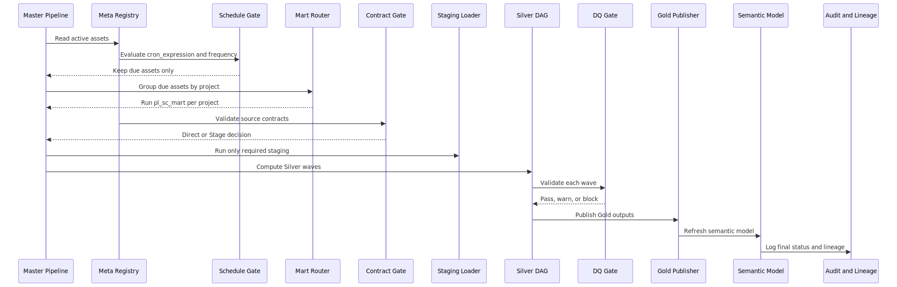

# Supply Chain v10 Hybrid Medallion Architecture
### Microsoft Fabric · OneLake Shortcuts · Warehouse-native T-SQL · Direct Lake · Bob/Rakesh-aligned

This repository now contains the architecture transition from **v9 Warehouse-native Medallion** to **v10 Hybrid Medallion** for Supply Chain analytics on Microsoft Fabric.

The v10 design is not a rewrite. It is a controlled refactor that preserves the strongest v9 operating model while aligning the physical architecture with Fabric medallion guidance and the Enterprise Data Warehouse standards preferred by Bob/Rakesh.

Current build decision:

```text
Ready for v10 side-by-side build planning and non-destructive scaffolding.
Not ready for production cutover.
Not ready to remove Staging / BronzeMirror.
Not ready to move EnterpriseData Silver objects without approval.
```

---

## Table Of Contents

### Architecture
1. [Executive Summary](#executive-summary)
2. [Architecture Diagram](#architecture-diagram)
3. [Why v10 Exists](#why-v10-exists)
4. [Target Physical Items](#target-physical-items)
5. [Medallion Layer Interpretation](#medallion-layer-interpretation)
6. [Control Plane](#control-plane)
7. [Short-Term vs Long-Term Target](#short-term-vs-long-term-target)

### Build Plan
8. [Implementation Status](#implementation-status)
9. [What To Create, Keep, Defer, And Avoid](#what-to-create-keep-defer-and-avoid)
10. [Step-By-Step Build Order](#step-by-step-build-order)
11. [Object Mapping Summary](#object-mapping-summary)
12. [Validation Gates](#validation-gates)

### Governance
13. [Bob/Rakesh Alignment](#bobrakesh-alignment)
14. [Power BI Direct Lake Rule](#power-bi-direct-lake-rule)
15. [TableDictionary Strategy](#tabledictionary-strategy)
16. [Security And Approval Model](#security-and-approval-model)

### Reference
17. [Repository Layout](#repository-layout)
18. [Diagram Gallery](#diagram-gallery)
19. [Documentation Index](#documentation-index)
20. [Official Sources](#official-sources)

---

## Executive Summary

v9 implemented Bronze, Silver, Gold, and Meta as schemas inside one Supply Chain Warehouse. That worked operationally because it kept the whole framework Warehouse-native and metadata-driven, but it did not fully match the standard Fabric medallion pattern expected by the US DE team.

v10 changes the architecture interpretation:

```text
EnterpriseData source products
  -> Enterprise Lakehouse shortcuts as logical Bronze
  -> optional Staging only when required
  -> Supply Chain domain Silver process schemas
  -> dedicated Supply Chain Gold Warehouse
  -> Direct Lake semantic model
```

Core decisions:

- [Verified] The shortcut-backed Enterprise Lakehouse is treated as the **logical Bronze** layer.
- [Verified] Local Warehouse `bronze` is no longer the canonical Bronze layer in the target architecture.
- [Verified] `Staging` / `BronzeMirror` remains only for exception cases such as EDW supplement, unstable sources, snapshot consistency, replay/debug, or performance reasons.
- [Verified] Domain-specific Supply Chain transformations stay in Supply Chain-owned processing schemas unless Bob/Rakesh approve promotion into EnterpriseData.
- [Verified] Gold becomes a dedicated Warehouse boundary for business-ready serving.
- [Verified] Power BI Direct Lake should consume physical Gold tables by default, not non-materialized SQL views.
- [Verified] v9 control-plane strengths remain mandatory: registry, generic runner, mart routing, smart skip, DAG, DQ, lineage, audit, finalizer, TableDictionary adapter, and semantic refresh.

---

## Architecture Diagram



Text view:

```text
Enterprise_Data workspace
  -> upstream source products
  -> enterprise reusable / conformed Silver only after approval

SupplyChain Dev / Enterprise_SupplyChain workspace
  -> Enterprise_Access_Lakehouse
       Logical Bronze through OneLake shortcuts

  -> SupplyChain_Processing_Warehouse_v10
       Meta control plane
       Staging exception mirrors
       ReferenceMaster
       SalesHistory
       ForecastHistory
       OpenOrderHistory

  -> SupplyChain_Gold_Warehouse_v10
       ForecastAccuracy physical Gold tables

  -> SupplyChain semantic model
       Direct Lake over Gold physical tables
```

---

## Why v10 Exists

Bob's feedback identified four main architecture concerns:

| Concern | v9 behavior | v10 answer |
|---|---|---|
| Bronze duplication | Source Lakehouse data was copied into Warehouse `bronze` | Treat shortcut-backed Enterprise Lakehouse as logical Bronze; stage only exceptions |
| Medallion as schemas | Bronze/Silver/Gold were schemas inside one Warehouse | Split logical/physical responsibilities across access, processing, Gold serving |
| Silver placement | Silver was inside SupplyChain Warehouse | Keep domain Silver locally; promote only conformed/reusable Silver to EnterpriseData |
| Gold serving | Gold was a schema in SupplyChain Warehouse | Create dedicated SupplyChain Gold Warehouse for BI/Direct Lake |

The critical point: v10 does **not** blindly remove staging. Staging remains a controlled operational pattern because current v9 evidence shows EDW supplement and source stability exceptions still exist.

---

## Target Physical Items

### SupplyChain Workspace

| Fabric item | Target role | Notes |
|---|---|---|
| `Enterprise_Access_Lakehouse` | Logical Bronze access layer | Current physical item may be `Enterprise_Lakehouse`; rename is deferred until approval |
| `SupplyChain_Processing_Warehouse_v10` | Domain processing and control plane | Holds `Meta`, `Staging`, `ReferenceMaster`, `SalesHistory`, `ForecastHistory`, `OpenOrderHistory` |
| `SupplyChain_Gold_Warehouse_v10` | Gold serving boundary | Holds physical Gold tables for semantic model consumption |
| Supply Chain semantic model | Power BI semantic contract | Direct Lake over physical Gold tables |

### EnterpriseData Workspace

| Fabric item | Target role | Notes |
|---|---|---|
| Upstream source products | Governed source data products | Source ownership remains EnterpriseData-side |
| EnterpriseData `SupplyChain_Warehouse` or approved Silver item | Reusable/conformed Silver | Only for entities approved as reusable across domains |
| Enterprise governance metadata | SLA, schema contracts, dictionary standards | Requires Bob/Rakesh or assigned owner approval |

---

## Medallion Layer Interpretation

### Bronze

[Verified] In v10, Bronze is logical and source-aligned:

```text
EnterpriseData source products
  -> OneLake shortcut
  -> Enterprise_Access_Lakehouse
  -> logical Bronze
```

Bronze rules:

- Mimic source structures.
- Do not add significant business enhancement.
- Prefer direct shortcut access when source contract, grain, SLA, and performance are stable.
- Use Staging only when direct access is not safe.

### Staging

Staging is not canonical Bronze. It is exception-only operational persistence.

Use Staging when:

- Source contract or SLA is unstable.
- Source coverage is incomplete.
- EDW supplement remains active.
- Snapshot consistency is required for deterministic runs.
- Replay/debug/audit needs exact persisted input.
- Direct shortcut read is too slow or unstable.
- Warehouse-native DML/CTAS/persisted state is required.

### Silver

Silver becomes process/metric schemas, not a generic `silver` schema:

```text
SalesHistory
ForecastHistory
OpenOrderHistory
ReferenceMaster
```

Silver placement rule:

- Enterprise reusable/conformed Silver -> EnterpriseData after approval.
- Supply Chain-specific forecasting/inventory/operational logic -> SupplyChain processing Warehouse.

### Gold

Gold becomes a dedicated serving item:

```text
SupplyChain_Gold_Warehouse_v10
  -> ForecastAccuracy
       -> FactForecastActual
       -> FactForecastKpi
```

Gold rules:

- Physical tables are the default semantic model source.
- SQL views are compatibility-only unless Import/DirectQuery/fallback is intentionally accepted.
- Gold is the only default BI serving boundary.

---

## Control Plane



v10 keeps the v9 control plane as a horizontal operating layer across logical Bronze, Staging, Silver, Gold, and Semantic Model.

| Control-plane capability | v9 mechanism | v10 name | v10 action |
|---|---|---|---|
| Metadata registry | `meta.sp_registry` | Asset Registry | Extend, do not replace |
| Generic loader | `meta.usp_generic_load` | Generic SQL Load Runner | Preserve load patterns; add access routing |
| Load patterns | `load_type` | Load Pattern Router | Preserve overwrite, incremental, upsert, datekey, daterange, identity, CDC, SCD2 |
| Mart routing | `project`, `pl_sc_master`, `pl_sc_mart` | Mart Routing Engine | Preserve and make Silver project-aware |
| Smart skip | `next_run_time`, cron metadata | Smart Skip Engine | Preserve Bronze/Gold due filters; extend Silver if mixed frequency appears |
| Silver DAG | `depends_on`, waves runtime | DAG Wave Planner | Preserve; use canonical IDs and project-aware waves |
| DQ | `dq_rules`, `pl_dq_check` | DQ Gate Engine | Preserve; add `Off`, `WarnOnly`, `CriticalStops` mode |
| Lineage | `source_objects`, `sp_lineage` | Lineage Builder | Add logical vs physical edge types |
| Audit | run and pipeline logs | Run/Pipeline Audit Logger | Preserve and extend to v10 stages |
| Finalizer | `usp_finalize_pipeline` | Finalizer | Cover staging, direct, Silver, Gold, semantic refresh |
| TableDictionary | `vw_table_dictionary` | Enterprise Dictionary Adapter | Extend with workspace/item/access mode fields |
| Source contracts | `schema_contracts` | Source Contract Gate | Promote from optional metadata to active preflight gate |
| Reconciliation | planned in v9 | Source-Target Reconciliation | Build as v10 requirement |
| Performance/cost | baseline/cost tables | Performance/Cost Monitor | Wire into finalizer or monitoring path |
| Semantic refresh | Power BI refresh/framing | Semantic Refresh Controller | Preserve after Gold publish |

---

## Short-Term vs Long-Term Target





### Short term

```text
v9 remains live
v10 is built side-by-side
EDW supplement stays staged
Direct shortcut path is validated table-by-table
Gold Warehouse is introduced
Semantic model is validated against v10 Gold
```

### Long term

```text
Direct shortcut access becomes the default for stable Bronze sources
Staging remains only for approved exceptions
Reusable Silver moves to EnterpriseData when approved
Domain Silver remains SupplyChain-owned
Gold Warehouse becomes the only default BI serving boundary
v9 objects are archived only after rollback window closes
```

---

## Implementation Status

| Area | Status | Evidence |
|---|---|---|
| v9 baseline export | Complete locally | `02_Architect_v10_May/readiness_exports/20260430_230936/`; raw exports are intentionally ignored from Git |
| v10 architecture plan | Complete | `01_super_plan_medallion_refactor.md` |
| Bob standards adaptation | Complete | `04_revised_bob_standards_proposal.md` |
| v9 feature parity audit | Complete | `03_v9_feature_parity_checklist.md`, `07_v9_capability_evidence_ledger.md` |
| Gap matrix | Complete | `08_v10_gap_matrix.md` |
| Bob standards mapping | Complete | `09_bob_standards_mapping_matrix.md` |
| Implementation readiness pack | Complete | `11_v10_implementation_readiness_pack.md` |
| Object classification | Complete | `12_v10_object_classification_mapping.md` |
| Build blueprint | Complete | `13_v10_build_blueprint_after_readiness.md` |
| Step-by-step implementation runbook | Complete | `14_v10_step_by_step_implementation_runbook.md` |
| Physical v10 build | Not started | Requires sign-off and non-destructive execution plan |
| Production cutover | Not ready | Requires parallel runs, validation, approvals |

---

## What To Create, Keep, Defer, And Avoid

### Create side-by-side

- `SupplyChain_Processing_Warehouse_v10`
- `SupplyChain_Gold_Warehouse_v10`
- v10 `Meta` schema and compatibility metadata.
- v10 `Staging` schema for exceptions only.
- v10 process schemas: `SalesHistory`, `ForecastHistory`, `OpenOrderHistory`, `ReferenceMaster`.
- v10 Gold schema: `ForecastAccuracy`.
- v10 pipeline copies.
- v10 validation artifacts: source contracts, reconciliation, DQ gate runs, Direct Lake validation.

### Keep initially

- Current v9 Warehouse and pipelines.
- Current v9 `meta.sp_registry` baseline.
- v9 generic runner concept.
- v9 smart skip behavior for Bronze/REF and Gold.
- EDW supplement staging until source readiness is approved.
- v9 lineage evidence and lineage explorer behavior.
- Semantic refresh/framing discipline.

### Defer

- Physical EnterpriseData Silver moves.
- Final naming suffix convention.
- Physical TableDictionary sync/export.
- Security grant changes.
- Production semantic model/report cutover.
- Deactivation of v9 schedules.
- Rename of `Enterprise_Lakehouse`.

### Avoid during build

- No destructive delete/drop/truncate.
- No production cutover before parity validation.
- No full direct-only conversion without source contract and reconciliation.
- No Power BI SQL view layer as default for strict Direct Lake.
- No EnterpriseData object move without approval.

---

## Step-By-Step Build Order



The authoritative implementation runbook is:

[v10 step-by-step implementation runbook](./02_Architect_v10_May/14_v10_step_by_step_implementation_runbook.md)

Recommended order:

1. Freeze v9 evidence and create build run folder.
2. Prepare Bob/Rakesh approval pack.
3. Create/designate v10 physical Fabric items.
4. Create v10 metadata compatibility layer.
5. Build access decision engine.
6. Create exception-only Staging layer.
7. Build logical Bronze direct-read validation path.
8. Build Domain Silver process schemas.
9. Classify EnterpriseData Silver candidates.
10. Build dedicated Gold Warehouse.
11. Create v10 pipeline copies.
12. Make Silver DAG project-aware.
13. Activate source contract gate.
14. Activate source-target reconciliation.
15. Activate explicit DQ gate modes.
16. Extend Enterprise Dictionary Adapter.
17. Define security matrix.
18. Build semantic model contract.
19. Add CI/CD and deployment guardrails.
20. Run v9/v10 in parallel.
21. Cut over only after approval.
22. Decommission only after rollback window and explicit approval.

---

## Object Mapping Summary

### Staging / EDW supplement

| Current object | v10 target | Decision |
|---|---|---|
| `bronze.brz_saleshistory_afi__invoicedetail` | `Staging` | Keep staged until source SLA/coverage/grain/performance passes |
| `bronze.brz_saleshistory_afi__invoiceheader` | `Staging` | Keep staged until source SLA/coverage/grain/performance passes |
| `bronze.brz_supplychain_enh_1__demandforecastsnapshotdaily` | `Staging` | Keep staged until source SLA/coverage/grain/performance passes |
| `bronze.ref_product` | `ReferenceMaster` or EnterpriseData | Owner decision; EDW-backed today |

### Logical Bronze direct-read candidates

| Current object | v10 target | Decision |
|---|---|---|
| `bronze.brz_wholesale_codis_afi__codatan` | Enterprise Lakehouse shortcut | Direct if source contract/performance passes |
| `bronze.brz_wholesale_codis_afi__comast` | Enterprise Lakehouse shortcut | Direct if source contract/performance passes |
| `bronze.brz_wholesale_codis_afi__extord` | Enterprise Lakehouse shortcut | Direct if source contract/performance passes |
| `bronze.brz_wholesale_codis_afi__extorit` | Enterprise Lakehouse shortcut | Direct if source contract/performance passes |

### Domain Silver

| v9 object | v10 target |
|---|---|
| `silver.slv_invoice_detail_line_level` | `SalesHistory.InvoiceDetailLineLevel` |
| `silver.slv_invoice_weekly` | `SalesHistory.InvoiceWeekly` |
| `silver.slv_actual_demand_monthly` | `SalesHistory.ActualDemandMonthly` |
| `silver.slv_actual_demand_weekly` | `SalesHistory.ActualDemandWeekly` |
| `silver.slv_forecast_demand_monthly` | `ForecastHistory.ForecastDemandMonthly` |
| `silver.slv_naive_forecast_monthly` | `ForecastHistory.NaiveForecastMonthly` |
| `silver.slv_open_order_line_level` | `OpenOrderHistory.OpenOrderLineLevel` |
| `silver.slv_open_order_monthly` | `OpenOrderHistory.OpenOrderMonthly` |

### Gold serving

| v9 object | v10 target |
|---|---|
| `gold.gld_fact_flat_forecast_actual` | `ForecastAccuracy.FactForecastActual` |
| `gold.gld_fact_forecast_kpi` | `ForecastAccuracy.FactForecastKpi` |

Full mapping:

[v10 object classification mapping](./02_Architect_v10_May/12_v10_object_classification_mapping.md)

---

## Validation Gates

v10 cannot cut over until these gates pass:

| Gate | Required evidence |
|---|---|
| Source contract | Source schema, grain, SLA, access, and stability validated |
| Direct vs staging | Each source classified as `DirectShortcut`, `StageRequired`, or `EDWSupplement` |
| DQ | Critical checks pass or approved as `WarnOnly` |
| Reconciliation | Row counts, key counts, date ranges, and KPI parity accepted |
| Silver DAG | Project-aware wave execution works |
| Smart skip | Due/not-due behavior preserved |
| Lineage | Source shortcut to Gold lineage is complete |
| TableDictionary | All managed objects appear in adapter |
| Security | Workspace/item/SQL endpoint/semantic access model approved |
| Direct Lake | Semantic model stays Direct Lake or fallback is explicitly accepted |
| Parallel run | At least three successful daily runs |
| Approval | Bob/Rakesh or assigned approver signs off |

---

## Bob/Rakesh Alignment

### Applied directly

- Bronze/source-aligned objects mimic source structure.
- Significant enhancements belong in Silver/process schemas, not Bronze.
- Silver and Gold use Pascal Case after naming approval.
- Schemas group related tables/views/procs by business process or metric group.
- Gold is a clean serving boundary.
- TableDictionary metadata is required.
- Technical design approval is required before production development.

### Adapted for Fabric

| Bob standard intent | Fabric v10 interpretation |
|---|---|
| Source-like data should not be maintained unnecessarily in Warehouse | Use shortcuts as logical Bronze; stage only exceptions |
| Silver schemas group related metrics/processes | Use `SalesHistory`, `ForecastHistory`, `OpenOrderHistory`, `ReferenceMaster` |
| Gold is business-ready | Use dedicated Gold Warehouse with physical serving tables |
| Power BI should be decoupled from physical structures | Use Gold physical tables plus semantic model contract for Direct Lake |
| PolyBase/external table pattern | Use OneLake shortcuts plus source contracts |
| SQL Agent alerting | Use Fabric pipeline logs, alert hooks, health dashboard/runbook |
| ADW indexing/distribution standards | Use Fabric performance, Direct Lake, row group, and reconciliation validation |

### Requires decision

- Pure Pascal Case vs suffix style: `ForecastHistory` vs `ForecastHistory_ENH`.
- Which reference/Silver entities are enterprise reusable.
- Whether `vw_table_dictionary` is enough or physical EnterpriseData sync is required.
- Exact security ownership.
- Exact EDW supplement exit criteria.

---

## Power BI Direct Lake Rule

[Verified] Direct Lake is the preferred serving mode for large Fabric Gold analytics tables.

v10 rule:

```text
Power BI semantic model reads Gold physical tables by default.
SQL views are compatibility-only unless fallback/import/DirectQuery is accepted.
```

Reason:

- Direct Lake works over Delta-backed Fabric data and is especially suitable for Gold analytics layers.
- Non-materialized SQL views can cause fallback to DirectQuery or be unsupported depending on Direct Lake mode.
- The semantic model, not a SQL view layer, should be the primary BI contract for names, relationships, measures, perspectives, and report-facing semantics.

---

## TableDictionary Strategy

v9 already built a TableDictionary adapter. v10 extends it rather than rebuilding it.

Important design rule:

```text
Do not create one physical TableDictionary base table with 63 or 69 columns.
Keep normalized control-plane tables small.
Expose Bob/Enterprise-compatible columns through a view adapter.
```

Recommended shape:

| Object | Purpose | Expected width |
|---|---|---|
| `Meta.AssetRegistryV10` | Core asset/control-plane metadata | Only operational fields needed by the framework |
| `Meta.AssetGovernance` | Owner, approval, classification, security metadata | Small supplemental table |
| `Meta.SourceContract*` | Source/schema/SLA checks | Contract-specific fields only |
| `Meta.DQ*` / `Meta.Reconciliation*` | Quality and reconciliation results | Result-specific fields only |
| `Meta.vw_TableDictionary` | Bob/Enterprise adapter view | 63 Enterprise-compatible columns + v9/v10 extension columns |
| `Meta.TableDictionaryExport` | Optional physical export/sync if required | Same shape as the adapter view |

[Verified] Current v9 `meta.vw_table_dictionary` exposes **69 columns**: 63 Enterprise-compatible columns plus 6 v9 extension columns. v10 should preserve that external compatibility unless Bob/Rakesh approve a new contract.

The v10 control-plane base tables only need these core governance inputs; the adapter view derives/maps them into the 63/69-column output:

```text
workspace_name
item_name
schema_name
object_name
object_type
canonical_layer
access_mode
domain_group
project
primary_key
refresh_frequency
cron_expression
next_run_time
source_objects
load_type
owner_name
approval_status
last_run_status
rows_loaded
dq_status
source_contract_status
security_classification
```

Default:

```text
Meta.vw_TableDictionary
```

Optional if Bob/Rakesh require physical EnterpriseData integration:

```text
Meta.TableDictionaryExport
scheduled sync/export to EnterpriseData
```

---

## Security And Approval Model

v10 needs a Fabric-specific security matrix before production cutover.

Security layers:

- Workspace roles.
- Item permissions.
- Warehouse SQL endpoint permissions.
- Lakehouse SQL endpoint permissions.
- OneLake data access.
- Semantic model permissions.
- RLS/OLS if required.
- Fixed identity if required.

Approval gates:

- Architecture and naming approval.
- Source contract and SLA approval.
- EnterpriseData ownership approval.
- Security owner approval.
- Semantic model cutover approval.
- Decommission approval.

---

## Repository Layout

```text
.
├── 01_Architect_v9_April/
│   ├── README.md
│   ├── 01_sc_forecast/
│   ├── diagrams/
│   ├── docs/
│   ├── lineage_explorer/
│   └── scripts/
│
├── 02_Architect_v10_May/
│   ├── 01_super_plan_medallion_refactor.md
│   ├── 02_architecture_blueprint_mermaid.md
│   ├── 03_v9_feature_parity_checklist.md
│   ├── 04_revised_bob_standards_proposal.md
│   ├── 05_deep_audit_protocol.md
│   ├── 06_v9_source_inventory_and_chronology.md
│   ├── 07_v9_capability_evidence_ledger.md
│   ├── 08_v10_gap_matrix.md
│   ├── 09_bob_standards_mapping_matrix.md
│   ├── 10_final_v10_amendment_plan.md
│   ├── 11_v10_implementation_readiness_pack.md
│   ├── 12_v10_object_classification_mapping.md
│   ├── 13_v10_build_blueprint_after_readiness.md
│   ├── 14_v10_step_by_step_implementation_runbook.md
│   ├── SQL Server Data Warehouse Standards.docx   (local-only, ignored from Git)
│   ├── mermaid/
│   ├── readiness_exports/                         (local-only raw evidence, ignored except README)
│   └── tools/
│
├── docs/
│   └── decisions/
│
└── README.md
```

---

## Diagram Gallery

| Diagram | Image | Mermaid source |
|---|---|---|
| Target flow | [SVG](./02_Architect_v10_May/mermaid/render_check/01_super_plan_target_flow.svg) | [MMD](./02_Architect_v10_May/mermaid/01_super_plan_target_flow.mmd) |
| Main architecture | [SVG](./02_Architect_v10_May/mermaid/render_check/02_main_architecture.svg) | [MMD](./02_Architect_v10_May/mermaid/02_main_architecture.mmd) |
| Control plane | [SVG](./02_Architect_v10_May/mermaid/render_check/03_control_plane.svg) | [MMD](./02_Architect_v10_May/mermaid/03_control_plane.mmd) |
| Direct vs staging decision | [SVG](./02_Architect_v10_May/mermaid/render_check/04_direct_vs_staging_decision.svg) | [MMD](./02_Architect_v10_May/mermaid/04_direct_vs_staging_decision.mmd) |
| Short-term transition | [SVG](./02_Architect_v10_May/mermaid/render_check/05_short_term_transition.svg) | [MMD](./02_Architect_v10_May/mermaid/05_short_term_transition.mmd) |
| Long-term target | [SVG](./02_Architect_v10_May/mermaid/render_check/06_long_term_target.svg) | [MMD](./02_Architect_v10_May/mermaid/06_long_term_target.mmd) |
| Pipeline sequence | [SVG](./02_Architect_v10_May/mermaid/render_check/07_pipeline_sequence.svg) | [MMD](./02_Architect_v10_May/mermaid/07_pipeline_sequence.mmd) |
| Mart schedule and smart skip | [SVG](./02_Architect_v10_May/mermaid/render_check/08_mart_schedule_smart_skip.svg) | [MMD](./02_Architect_v10_May/mermaid/08_mart_schedule_smart_skip.mmd) |
| v9 feature parity | [SVG](./02_Architect_v10_May/mermaid/render_check/09_v9_feature_parity_control_plane.svg) | [MMD](./02_Architect_v10_May/mermaid/09_v9_feature_parity_control_plane.mmd) |
| Bob standards overlay | [SVG](./02_Architect_v10_May/mermaid/render_check/10_bob_standards_overlay.svg) | [MMD](./02_Architect_v10_May/mermaid/10_bob_standards_overlay.mmd) |

---

## Documentation Index

| File | Purpose |
|---|---|
| [v10 super plan](./02_Architect_v10_May/01_super_plan_medallion_refactor.md) | Overall Hybrid Medallion architecture direction |
| [architecture blueprint](./02_Architect_v10_May/02_architecture_blueprint_mermaid.md) | Detailed architecture narrative and diagram references |
| [v9 feature parity checklist](./02_Architect_v10_May/03_v9_feature_parity_checklist.md) | Non-negotiable v9 capabilities to preserve |
| [Bob standards proposal](./02_Architect_v10_May/04_revised_bob_standards_proposal.md) | Fabric adaptation of Bob SQL DW standards |
| [deep audit protocol](./02_Architect_v10_May/05_deep_audit_protocol.md) | Audit process for v9/v10 comparison |
| [source inventory](./02_Architect_v10_May/06_v9_source_inventory_and_chronology.md) | Source inventory and chronology |
| [capability evidence ledger](./02_Architect_v10_May/07_v9_capability_evidence_ledger.md) | Evidence-backed v9 capability analysis |
| [gap matrix](./02_Architect_v10_May/08_v10_gap_matrix.md) | Open gaps and required amendments |
| [Bob standards mapping](./02_Architect_v10_May/09_bob_standards_mapping_matrix.md) | DOCX-to-Fabric mapping |
| [final amendment plan](./02_Architect_v10_May/10_final_v10_amendment_plan.md) | Final amendments before readiness |
| [readiness pack](./02_Architect_v10_May/11_v10_implementation_readiness_pack.md) | Five-step readiness evidence pack |
| [object classification mapping](./02_Architect_v10_May/12_v10_object_classification_mapping.md) | Object-by-object v9 to v10 mapping |
| [build blueprint](./02_Architect_v10_May/13_v10_build_blueprint_after_readiness.md) | Concrete target build after readiness |
| [implementation runbook](./02_Architect_v10_May/14_v10_step_by_step_implementation_runbook.md) | Step-by-step create/change/defer/avoid plan |
| [v9 archive](./01_Architect_v9_April/README.md) | Previous v9 Warehouse-native architecture |

---

## Official Sources

- Microsoft Fabric medallion architecture: https://learn.microsoft.com/en-us/fabric/onelake/onelake-medallion-lakehouse-architecture
- OneLake shortcuts: https://learn.microsoft.com/en-us/fabric/onelake/onelake-shortcuts
- Lakehouse SQL analytics endpoint: https://learn.microsoft.com/en-us/fabric/data-engineering/lakehouse-sql-analytics-endpoint
- Fabric Warehouse T-SQL surface area: https://learn.microsoft.com/en-us/fabric/data-warehouse/tsql-surface-area
- Direct Lake overview: https://learn.microsoft.com/en-us/fabric/fundamentals/direct-lake-overview
- Power BI semantic models in Fabric Warehouse: https://learn.microsoft.com/en-us/fabric/data-warehouse/semantic-models

---

## Current Recommendation

Start with this sequence:

```text
1. Review README and v10 runbook.
2. Get Bob/Rakesh approval on naming, ownership, Direct Lake Gold serving, TableDictionary, and security.
3. Build v10 metadata/control-plane compatibility layer.
4. Build access decision engine and exception-only Staging.
5. Build Domain Silver and dedicated Gold side-by-side.
6. Run parallel validation.
7. Cut over only after approval.
```

The safest first engineering unit is:

```text
v10 metadata/control-plane compatibility layer
  -> registry extension
  -> access_mode routing
  -> project-aware Silver DAG
  -> DQ/source-contract/reconciliation gates
```
