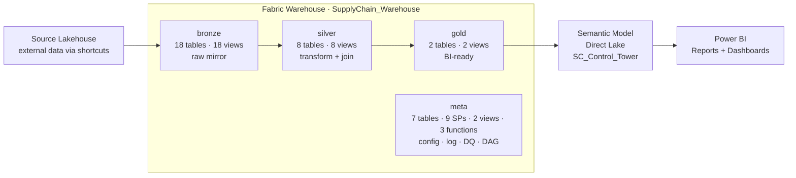
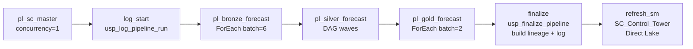
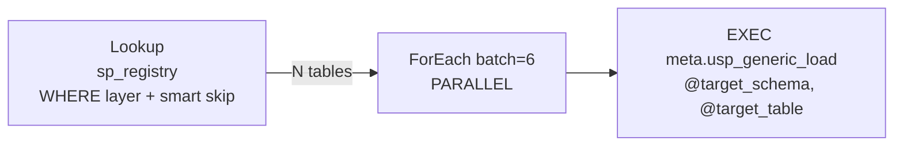
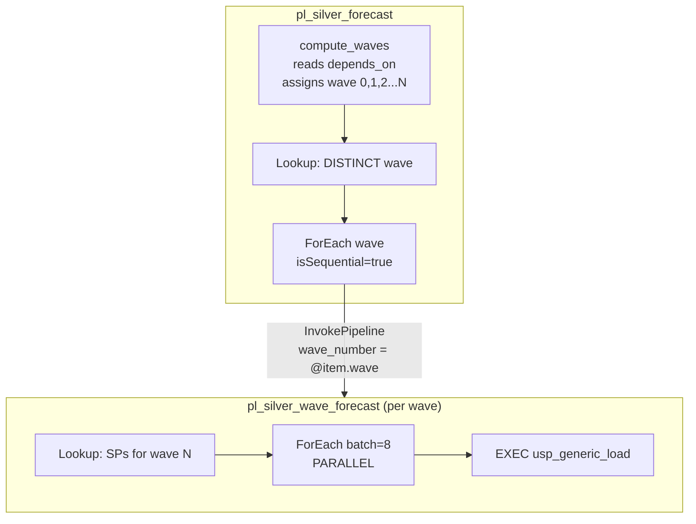
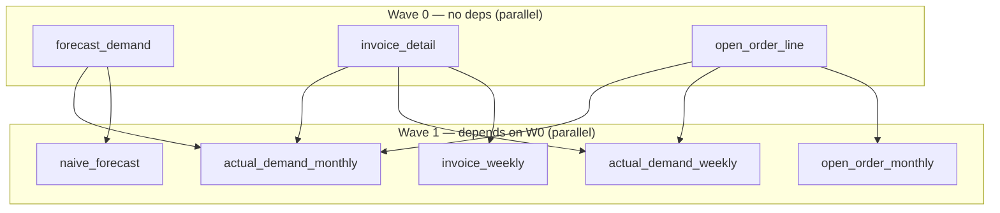
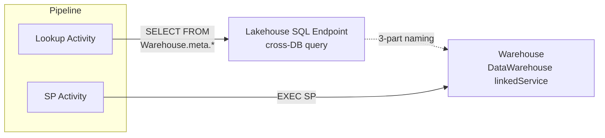
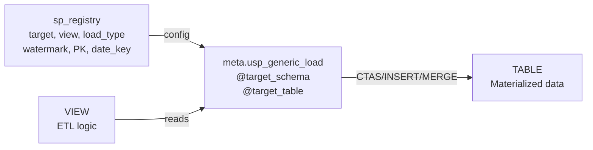
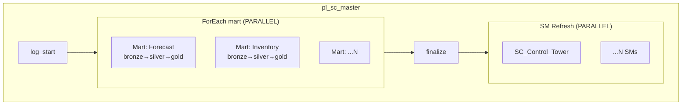
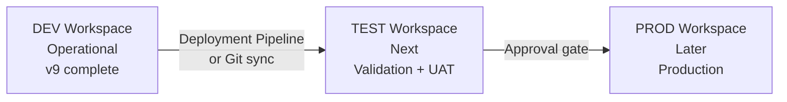

# Warehouse-Native Medallion Architecture
### Microsoft Fabric · Pure T-SQL · Metadata-driven · DAG Orchestration

A complete architecture template for building **enterprise data warehouses** on Microsoft Fabric using **pure T-SQL stored procedures** — no Notebooks, no PySpark, no Lakehouse ETL.

**[Live Lineage Explorer](https://vn-engineer-lineage.streamlit.app)** — Interactive data lineage visualization (login: admin123 / admin123)

---

## Table of Contents

### Architecture & Design
1. [Architecture Overview](#architecture-overview) — Data flow, 4 schemas, warehouse structure
2. [Pipeline Architecture](#pipeline-architecture) — Master orchestration, bronze/silver DAG/gold, connection topology
3. [Generic SP Architecture](#generic-sp-architecture) — 8 load patterns, 1 SP for all tables

### Operations & Usage
4. [Adding a New Table](#adding-a-new-table) — Quick-start for DA/DE (2 steps)
5. [Scheduling & Concurrency](#scheduling--concurrency) — Cron, smart skip, snapshot conflict mitigation
6. [Naming Convention](#naming-convention) — Tables, views, columns, pipelines

### Scale & Enterprise
7. [Multi Data Mart Scale](#multi-data-mart-scale) — N marts parallel, cross-mart dependencies
8. [Enterprise Compatibility](#enterprise-compatibility) — TableDictionary mapping, load pattern alignment
9. [Semantic Model](#semantic-model) — Direct Lake, auto-refresh
10. [Multi-Environment Roadmap](#multi-environment-roadmap) — DEV → TEST → PROD

### Reference
11. [Fabric Warehouse Constraints](#fabric-warehouse-constraints) — Known limitations + workarounds
12. [Tech Stack](#tech-stack) — All technologies used
13. [Documentation Index](#documentation-index) — All docs with links

---

## Architecture Overview



### 4 Schemas

| Schema | Purpose | Objects | Pattern |
|--------|---------|---------|---------|
| **bronze** | Raw mirror from source systems | 18 tables + 18 views | `VIEW` reads source via 3-part naming → Generic SP does DROP + CTAS |
| **silver** | Clean, conform, join, business rules | 8 tables + 8 views | `VIEW` reads bronze/silver → Generic SP does DROP + CTAS (DAG wave order) |
| **gold** | Business-ready facts & dimensions | 2 tables + 2 views | `VIEW` reads silver → Generic SP does DROP + CTAS |
| **meta** | System control plane | 7 tables + 9 SPs + 2 views + 3 fn | Config + log + DQ + DAG + lineage + timezone |

### Warehouse Structure

```
SupplyChain_Warehouse/
├── bronze/
│   ├── Tables/    brz_{source}__{entity}, ref_{entity}     (18)
│   └── Views/     vw_{table_name} → SELECT FROM source      (18)
│
├── silver/
│   ├── Tables/    slv_{concept}                              (8)
│   └── Views/     vw_slv_{concept} → JOINs, transforms      (8)
│
├── gold/
│   ├── Tables/    gld_{fact|dim}_{subject}                   (2)
│   └── Views/     vw_gld_{subject} → aggregation             (2)
│
└── meta/
    ├── Tables/    sp_registry, sp_run_history, dq_rules,
    │              dq_results, sp_lineage, pipeline_run_log,
    │              slv_dag_waves_runtime                       (7)
    ├── SPs/       usp_generic_load, usp_log_run (retry 3x),
    │              usp_check_dq, usp_build_lineage,
    │              usp_compute_slv_waves, usp_run_silver_dag,
    │              usp_debug_loop, usp_finalize_pipeline,
    │              usp_log_pipeline_run                        (9)
    ├── Views/     vw_table_dictionary, vw_run_history_tz        (2)
    └── Functions/ ufn_should_run, ufn_cron_is_due,
                   ufn_utc_to_cst                              (3)
```

> **77 total objects** across 4 schemas. Per-table SPs have been deleted — all 28 tables loaded by 1 generic SP.

### Key Features

- **Generic SP architecture** — 1 SP (`meta.usp_generic_load`) replaces 28 per-table SPs, supports 8 load patterns, aligned with Enterprise ETL_Framework
- **2-file-per-table** — VIEW (ETL logic) + TABLE (materialized data). No per-table SP needed
- **Metadata-driven** — adding a new table = CREATE VIEW + INSERT 1 row into `sp_registry`. No pipeline changes
- **DAG-based silver** — `depends_on` column auto-computes execution waves (max 30 levels)
- **Parent-child pipeline** — parallel within wave, sequential between waves (Microsoft recommended)
- **Smart scheduling** — cron + next_run_time filter, monthly tables auto-skip when not due
- **Snapshot conflict mitigation** — retry 3x in usp_log_run + reduced batch concurrency
- **Config-driven DQ** — rules in table, severity-based gating
- **Auto-built lineage** — `source_objects` JSON → 52 source-to-target edges, rebuilt every run

---

## Pipeline Architecture

### 5 Pipelines

| Pipeline | Type | Role |
|----------|------|------|
| `pl_sc_master` | Master | log_start → bronze → silver → gold → finalize → refresh_sm |
| `pl_bronze_forecast` | Child | Lookup sp_registry → ForEach(batch=6) → EXEC usp_generic_load |
| `pl_silver_forecast` | Child | compute_waves → ForEach wave → invoke pl_silver_wave_forecast |
| `pl_silver_wave_forecast` | Grandchild | Lookup SPs for wave → ForEach(batch=8) → EXEC usp_generic_load |
| `pl_gold_forecast` | Child | Lookup sp_registry → ForEach(batch=2) → EXEC usp_generic_load |

> **Naming**: `pl_{layer}_{project}` for children. Master stays `pl_sc_master` (unique). Invoke by GUID — renaming is safe.

### Master Flow



### Bronze & Gold — Lookup + Parallel ForEach



### Silver — Parent-Child DAG



> **Why parent-child?** Fabric does not allow ForEach inside ForEach/Until. Microsoft-recommended workaround: Execute Pipeline inside ForEach.

### DAG Wave Example



### Connection Topology



> Fabric Pipeline Lookup supports `LakehouseTableSource` but not Warehouse directly. Workaround: cross-DB 3-part naming through Lakehouse.

### Pipeline Performance

| Run | Duration | Tables | Notes |
|-----|----------|--------|-------|
| Typical daily | **17-20 min** | 28/28 | All layers sequential |
| With smart skip | **~15 min** | 18/28 | 10 monthly tables skipped |
| Failed run | 4 min | partial | Snapshot conflict → retry next trigger |

---

## Generic SP Architecture

Instead of 28 per-table SPs, a single **Generic SP** handles all loads:



### 8 Load Patterns

| Pattern | load_type | Description | Required columns |
|---------|-----------|-------------|-----------------|
| Overwrite | `overwrite` | DROP + CTAS from view (default) | — |
| Incremental | `incremental` | INSERT WHERE watermark > last value | `watermark_column` |
| Upsert | `upsert` | DELETE matching + INSERT on PK | `primary_key` |
| DateKey | `datekey` | DELETE + INSERT by date column | `date_key` |
| DateRange | `daterange` | DELETE last N days + INSERT | `date_key` + `date_range_days` |
| Identity | `identity` | INSERT WHERE PK > MAX existing | `primary_key` |
| CDC | `cdc` | Apply change data capture ops | `primary_key` |
| SCD2 | `scd2` | Slowly changing dimension type 2 | `primary_key` |

### Usage

```sql
-- Pipeline ForEach calls this for every table:
EXEC meta.usp_generic_load @target_schema = 'bronze', @target_table = 'brz_saleshistory_afi__invoicedetail';

-- The SP reads sp_registry to find view_name, load_type, watermark, PK, date_key
-- Then routes to the correct load pattern automatically.
```

---

## Adding a New Table

With Generic SP, adding a new table = **2 steps**, no SP creation, no pipeline changes.

### Bronze (2 steps)

```sql
-- 1. Create view (ETL logic)
CREATE OR ALTER VIEW bronze.vw_brz_{name} AS
SELECT * FROM {Source_Lakehouse}.{schema}.{source_table};

-- 2. Register in sp_registry
INSERT INTO meta.sp_registry (sp_name, view_name, target_schema, target_table,
    layer, load_type, frequency, execution_order, is_active, source_objects, project, cron_expression)
VALUES ('meta.usp_generic_load', 'bronze.vw_brz_{name}',
    'bronze', 'brz_{name}', 'BRZ', 'overwrite', 'daily', 1, 1,
    '["{Source_Lakehouse}.{schema}.{source_table}"]', '{project}', '0 2 * * *');
```

### Silver (with DAG dependency)

```sql
-- 1. Create view
-- 2. Register with depends_on:
INSERT INTO meta.sp_registry (..., depends_on)
VALUES (..., '["silver.slv_upstream_table"]');
-- Pipeline auto picks up → wave auto-computed → parallel execution
```

> **Full step-by-step guide**: See [new_table_onboarding_guide.md](Fabric_Architect/new_table_onboarding_guide.md) — covers all layers, load types, DQ rules, testing, FAQ.

---

## Scheduling & Concurrency

| Aspect | Current state |
|--------|--------------|
| **Pipeline trigger** | Manual (auto schedule not yet enabled on Fabric Portal) |
| **Table frequency** | 18 daily (`0 2 * * *`) + 10 monthly (`0 2 1 * *`) via sp_registry |
| **Smart skip** | Active — Lookup WHERE `next_run_time <= GETUTCDATE()` |
| **Concurrency** | Master: concurrency=1, Bronze: batch=6, Silver wave: batch=8, Gold: batch=2 |
| **Snapshot conflict** | Mitigated: usp_log_run retry 3x + reduced batch + pipeline retry 3x60s |

> **Full details**: See [scheduling_and_concurrency.md](Fabric_Architect/scheduling_and_concurrency.md) — trigger scenarios, CU estimates, cron setup.

---

## Naming Convention

### Objects

| Schema | Tables | Views | Pipelines |
|--------|--------|-------|-----------|
| bronze | `brz_{src}__{tbl}` / `ref_{entity}` | `vw_brz_*` / `vw_ref_*` | `pl_bronze_{project}` |
| silver | `slv_{concept}` | `vw_slv_*` | `pl_silver_{project}` |
| gold | `gld_{fact\|dim}_{subject}` | `vw_gld_*` | `pl_gold_{project}` |
| meta | descriptive | `vw_*` | `pl_sc_master` (unique) |

### Column Prefixes

`id_` keys · `code_` categories · `name_` descriptions · `qty_` quantities · `amt_` amounts · `dt_` dates · `num_` numbers · `ts_` timestamps · `pct_` percentages · `is_` flags (0/1)

---

## Multi Data Mart Scale

The architecture supports **N data marts running in parallel**. Each mart = 1 complete bronze→silver→gold flow for a specific project/domain.



| Aspect | Detail |
|--------|--------|
| **Parallel execution** | N marts simultaneously (ForEach isSequential=false) |
| **Project filter** | `sp_registry.project` column filters tables per mart |
| **Cross-mart deps** | Silver in mart B can depend on bronze from mart A via `depends_on` |
| **Cost optimization** | Total time = max(mart), not sum(marts) |

> **Full design**: See [multi_mart_scale_architecture.md](Fabric_Architect/multi_mart_scale_architecture.md)

---

## Enterprise Compatibility

### Mapping Status

| Area | Coverage | Detail |
|------|----------|--------|
| **Load patterns** | **8/8 (100%)** | overwrite, incremental, upsert, datekey, daterange, identity, cdc, scd2 |
| **TableDictionary** | **63/63 cols (100%)** | `meta.vw_table_dictionary` maps all Enterprise columns + 6 v9 extras |
| **Audit log** | **Mapped** | `sp_run_history` = Enterprise `AuditLog` |
| **Pipeline orchestration** | **Mapped** | Fabric Pipelines = Azure Pipelines |
| **DAG orchestration** | **v9 ahead** | Enterprise does not have depends_on/wave computation |
| **Auto lineage** | **v9 ahead** | Enterprise does not have auto-built lineage |
| **DQ config-driven** | **v9 ahead** | Enterprise DQ is simpler (row count only) |
| **Alerts/email** | **Not implemented** | Enterprise has `usp_DataWarehouseDataFeedAlert_Fabric` |
| **fn_GetDate timezone** | **Implemented (CST)** | `meta.ufn_utc_to_cst` — DST aware, maps to TableDictionary `[Modified]` |
| **.sqlproj validation** | **Not implemented** | Enterprise has build-time schema validation |
| **Multi-environment** | **Not implemented** | Enterprise has Dev → Prod via publish profiles |

### Load Pattern Mapping

| v9 load_type | Enterprise Equivalent | Enterprise SP |
|-------------|----------------------|--------------|
| `overwrite` | DELINSERT | usp_IncrementalTableLoad |
| `incremental` | Append/DateKey | usp_IncrementalTableLoad |
| `upsert` | Upsert | usp_IncrementalTableLoad |
| `datekey` | DateKey | usp_IncrementalTableLoad |
| `daterange` | DateRange | usp_UpdateCuratedTableFromView_DateRange |
| `identity` | Identity | usp_IncrementalTableLoad |
| `cdc` | CDC | usp_IncrementalTableLoad |
| `scd2` | SCD2 | usp_SCD2_TableLoad |

> **Full comparison**: See [Enterprise_vs_Fabric_comparison.md](Fabric_Architect/Enterprise_vs_Fabric_comparison.md)

---

## Semantic Model

| Aspect | Detail |
|--------|--------|
| **Name** | SC_Control_Tower |
| **Mode** | Direct Lake (reads Parquet from Warehouse, no import) |
| **Tables** | dim_calendar, dim_customer_grouping, dim_warehouse, dim_product, dim_forecast_horizon, fact_flat_forecast_actual, fact_forecast_kpi |
| **Refresh** | Auto — `PBISemanticModelRefresh` activity at end of every master pipeline run |
| **Source remapping** | Display names match v8 so reports switch source without breaking |
| **Deployment** | Fabric REST API with TMDL definition |

---

## Multi-Environment Roadmap



- **Fabric Git Integration**: Auto-exports all objects as .sqlproj + .sql files
- **Deployment Pipelines**: DEV → TEST → PROD promotion (Fabric native)
- **SqlCmdVariable**: Enterprise uses `$(Source_Data)`. Convert 3-part naming when PROD requires it

---

## Fabric Warehouse Constraints

| Not Supported | Workaround |
|---------------|------------|
| DEFAULT constraint | Set values in SP |
| IDENTITY | ROW_NUMBER() or MAX(id)+1 |
| PRIMARY KEY / UNIQUE | DQ uniqueness check |
| Recursive CTE | SP iterative WHILE loop |
| ForEach inside Until | Parent-child pipeline pattern |
| Variables in distributed queries | sp_executesql with parameters |
| `DATETIME2` without precision | Always `DATETIME2(6)` |
| `datetime` in CTAS | `CAST(GETUTCDATE() AS DATETIME2(6))` |
| Warehouse Lookup in Pipeline | LakehouseTableSource + cross-DB |
| Concurrent writes to same table | usp_log_run retry 3x + WAITFOR DELAY |

---

## Tech Stack

- **Platform**: Microsoft Fabric F256 (Synapse Data Warehouse)
- **Language**: T-SQL (pure, no PySpark/Notebooks)
- **Orchestration**: Fabric Data Pipelines (parent-child pattern, metadata-driven)
- **ETL Engine**: Generic SP — 8 load patterns, aligned with Enterprise ETL_Framework
- **Scheduling**: Cron-based (sp_registry) + smart skip filter
- **Semantic Model**: Direct Lake (TMDL via Fabric REST API)
- **BI**: Power BI Direct Lake
- **Lineage**: Interactive Streamlit app ([live](https://vn-engineer-lineage.streamlit.app))
- **Version Control**: GitHub
- **Deployment**: Fabric REST API + Claude Code
- **Environments**: DEV (operational) → TEST → PROD (roadmap)

---

## Documentation Index

### Onboarding & Operations

| File | Description |
|------|-------------|
| [new_table_onboarding_guide.md](Fabric_Architect/new_table_onboarding_guide.md) | **Start here** — Step-by-step: add new ETL table (for DA/DE) |
| [scheduling_and_concurrency.md](Fabric_Architect/scheduling_and_concurrency.md) | Scheduling: cron, smart skip, concurrency, snapshot conflict mitigation |
| [sqlproj_validation_guide.md](Fabric_Architect/sqlproj_validation_guide.md) | .sqlproj validation: 3 approaches (lint / sqlproj / full ProjectRef) |
| [timezone_sync_guide.md](Fabric_Architect/timezone_sync_guide.md) | Timezone sync: UTC + CST + VN, map Enterprise fn_GetDate |
| [generic_sp_migration_plan.md](Fabric_Architect/generic_sp_migration_plan.md) | Migration history: 28 per-table SPs → 1 generic SP |

### Templates (generic, apply to any project)

| File | Description |
|------|-------------|
| [template_architecture.md](Fabric_Architect/template_architecture.md) | Architecture reference: schemas, pipelines, DAG, meta, DQ, naming |
| [template_pipeline_guide.md](Fabric_Architect/template_pipeline_guide.md) | Pipeline execution trace: what happens when master triggers |
| [template_setup_guide.md](Fabric_Architect/template_setup_guide.md) | Phase-by-phase setup: DDL, SP templates, pipeline JSON, REST API |

### Project-specific (SupplyChain / Forecast)

| File | Description |
|------|-------------|
| [v9_architecture_supplychain.md](Fabric_Architect/v9_architecture_supplychain.md) | All 76 objects: names, row counts, pipeline IDs, source mappings, SM |
| [v9_pipeline_supplychain.md](Fabric_Architect/v9_pipeline_supplychain.md) | Execution trace: actual SP names, durations, wave assignments |
| [v9_setup_supplychain.md](Fabric_Architect/v9_setup_supplychain.md) | Implementation log: Spark→T-SQL conversions, bugs, fixes |

### Scale & Enterprise

| File | Description |
|------|-------------|
| [multi_mart_scale_architecture.md](Fabric_Architect/multi_mart_scale_architecture.md) | Multi Data Mart: N marts parallel, cross-mart deps, cost optimization |
| [Enterprise_vs_Fabric_comparison.md](Fabric_Architect/Enterprise_vs_Fabric_comparison.md) | Enterprise vs v9: ETL framework, load patterns, CI/CD, naming |

### Context

| File | Description |
|------|-------------|
| [SESSION_CONTEXT.md](SESSION_CONTEXT.md) | Session context: connections, decisions, bugs, skills (for AI continuity) |

---

*Built with Claude Code + Fabric MCP Server*
