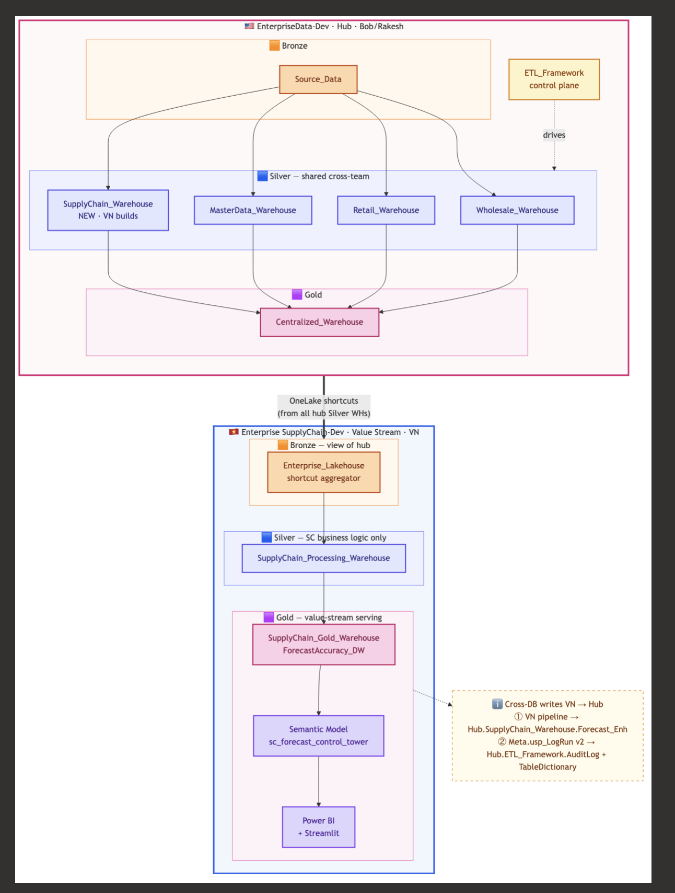
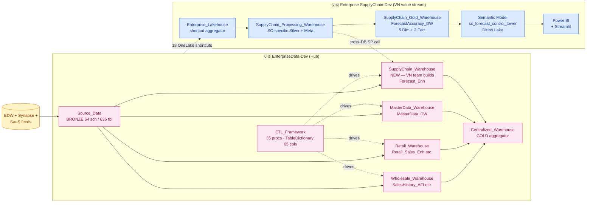

<div align="center">

# Hybrid Medallion Architecture
### Multi-Workspace Enterprise Data Platform on Microsoft Fabric

<br/>


[](https://sc-lineage.streamlit.app/)

</div>

---

## What this repo is

A **2-workspace enterprise data architecture** for Ashley Furniture's Supply Chain value stream on Microsoft Fabric. Implements the **hub-and-spoke pattern** Bob Horton's enterprise team established — hub `EnterpriseData-Dev` (US) hosts Bronze + shared Silver + ETL control plane; value stream `Enterprise SupplyChain-Dev` (VN) hosts SC-specific Silver + Gold + semantic + reports, with cross-workspace OneLake shortcuts and (pending) cross-DB writebacks.

<p align="center">
  
</p>

This repo documents the **VN team's contribution** to that architecture.

---

## Repo navigation

| Folder | Purpose | Owner |
|--------|---------|-------|
| [`Enterprise_Data_architect/`](Enterprise_Data_architect/) | Analysis of Bob's hub workspace `EnterpriseData-Dev` (synthesized from scan) | VN team's view of hub |
| [`Enterprise_SupplyChain_Dev_architect/`](Enterprise_SupplyChain_Dev_architect/) | VN team's value-stream workspace architecture (formerly `02_Architect_v10_May`) | VN team |
| [`docs/decisions/`](docs/decisions/) | Architecture Decision Records (ADRs) | Both |
| [`lineage_explorer/`](lineage_explorer/) | Streamlit live lineage app | VN team |
| [`_external_refs/`](.gitignore) | Cloned external repos (Bob's docs, gitignored) | (read-only) |

Both architect folders use **identical taxonomy** for easy side-by-side comparison:

```
<workspace>_architect/
├── INDEX.md                  # Top-level navigation
├── 00_overview/              # Workspace identity + at-a-glance
├── 10_evidence/              # Inventory + scan synthesis
├── 20_proposals/             # Plans, comparisons, integration
├── 30_runbook/               # Operational notes
├── projects/                 # Per-domain deep dives
├── artifacts/                # Generated outputs
├── diagrams/                 # Mermaid + SVG
└── tools/                    # Analysis scripts
```

---

## Cross-workspace data flow



**Key principle**: Each domain Silver lives at hub (owned by domain team). Each value stream has its own workspace for Gold + serving + value-stream-specific Silver.

---

## Architecture Decision Records

| ADR | Focus | Status |
|---|---|---|
| [ADR-001](docs/decisions/ADR-001-v10-hybrid-medallion.md) | **Hybrid Medallion** — 3-layer design within VN workspace | **Implemented** |
| [ADR-002](docs/decisions/ADR-002-edw-supplement-exit-strategy.md) | **EDW Supplement exit** — pending Enterprise_Lakehouse data completeness | Active |
| [ADR-003](docs/decisions/ADR-003-bob-standards-compliance-audit.md) | **Enterprise standards audit** — naming + PascalCase resolved | Resolved |
| [ADR-004](docs/decisions/ADR-004-architecture-maturity-assessment.md) | **Maturity assessment** — Staff/Principal level | Accepted |
| [ADR-005](docs/decisions/ADR-005-enterprise-promote-pathway.md) | **Enterprise promote pathway (v2)** — 2-workspace topology + 3 promote targets | Proposed |
| [ADR-006](docs/decisions/ADR-006-repo-restructure-documentation-maturity.md) | **Repo restructure** — 4-folder taxonomy | Accepted |
| [ADR-008](docs/decisions/ADR-008-bob-alignment-naming-and-integration.md) | **Bob alignment** — naming `_Enh`/`_Wrk`/`v_*` + TableDictionary port | **Implemented** |

---

## Status — VN team contribution

| Area | Status | Detail |
|------|--------|--------|
| Naming alignment | ✅ Done | Schema casing + view prefix + control plane match Bob's pattern (ADR-008) |
| Control plane (TableDictionary + UpdateLog + AuditLog + procs) | ✅ Done | Cloned 65-col schema, ported procs, `usp_LogRun v2` chains |
| Pipeline orchestration (7 pipelines, DAG waves) | ✅ Done | 30m34s end-to-end run verified 2026-05-10 |
| Gold + semantic model | ✅ Live | `sc_forecast_control_tower` + `sc_inventory_health_control_tower` (2026-05-19) — Direct Lake on Gold WH |
| **2nd mart: inventory_health** | ✅ Live (2026-05-19) | InventoryHealth_DW: FactInventoryHealthSnapshot (**603M rows / 415 daily snapshots since 2021-03**) + FactInventoryRiskForward (3.88M) + 5 Dim + 1 Helper |
| Cross-DB sync to hub `ETL_Framework` | ⏳ Pending | Need Bob Q1 — write permission + AuditLog DDL |
| `SupplyChain_Warehouse` creation in hub | ⏳ Pending | Need Bob Q3 — see [proposal](Enterprise_Data_architect/20_proposals/02_supply_chain_warehouse_proposal.md) |
| Promote shared Silver (forecast) to hub | 🔄 Plan ready | Pending Q3 |
| MasterData_DW DimDate extension (+29 cols) | 🔄 Plan ready | Pending Q2 |
| ADO repo access | ⏳ Pending IT (Q4) | Need Bob/Rakesh push |
| Mail.Send admin consent | ⏳ Pending IT (Q4) | — |
| Schedule trigger automation | ⏳ Blocked by IT | Manual trigger works |

Open questions:
- Forecast: [`Enterprise_SupplyChain_Dev_architect/projects/forecast/_open_questions_for_bob.md`](Enterprise_SupplyChain_Dev_architect/projects/forecast/_open_questions_for_bob.md)
- Inventory Health: [`Enterprise_SupplyChain_Dev_architect/projects/inventory_health/_open_questions_for_bob.md`](Enterprise_SupplyChain_Dev_architect/projects/inventory_health/_open_questions_for_bob.md) (3 Robert sign-offs H1/H5/M3)

---

## Quick start — reading paths

### For new VN team member
1. This README (5 min)
2. [VN architect INDEX](Enterprise_SupplyChain_Dev_architect/INDEX.md) (10 min)
3. [Forecast project README](Enterprise_SupplyChain_Dev_architect/projects/forecast/README.md) (10 min)
4. [Inventory Health project README](Enterprise_SupplyChain_Dev_architect/projects/inventory_health/README.md) (10 min) — 2nd mart, deployed 2026-05-19

### For VN team member needing to understand Bob's hub
1. [Bob hub workspace overview](Enterprise_Data_architect/00_overview/01_workspace_overview.md) (5 min)
2. [Bob hub architecture at a glance](Enterprise_Data_architect/00_overview/02_architecture_at_a_glance.md) (5 min)
3. [Bob ETL framework summary](Enterprise_Data_architect/10_evidence/02_etl_framework_summary.md) (10 min)
4. [Full ETL framework deep-dive synthesis](Enterprise_Data_architect/projects/etl_framework/SYNTHESIS.md) (45 min, 1210 lines)

### For Bob's team reviewing VN work
1. This README (5 min)
2. [ADR-008 — Bob alignment Implemented](docs/decisions/ADR-008-bob-alignment-naming-and-integration.md) (10 min)
3. [VN's analysis of your hub](Enterprise_Data_architect/) — verify VN team understands your patterns
4. [SupplyChain_Warehouse proposal](Enterprise_Data_architect/20_proposals/02_supply_chain_warehouse_proposal.md) (15 min)

---

## Tech stack

- **Platform**: Microsoft Fabric (Warehouse + Lakehouse + Pipelines + Semantic Model)
- **Language**: Pure T-SQL stored procedures (no PySpark, no Notebook ETL)
- **Pattern**: Metadata-driven, registry-based (1 generic SP covers 8 load patterns)
- **BI**: Direct Lake on Gold (no DirectQuery fallback)
- **Lineage**: Auto-built from `source_objects` JSON in registry
- **Auth**: Azure CLI tokens (`az login` → pyodbc + REST API)
- **Git**: Single-branch `main` model (per CLAUDE.md §I)

---

## Live infrastructure snapshot — VN team

> Numbers re-queried from live Fabric workspace 2026-05-22 (post-inventory_health deploy, post-concurrency fixes). Source: `python3 /tmp/wh_query.py` pattern with `az account get-access-token --resource https://database.windows.net/`.

| Item | Value |
|------|-------|
| Workspace | `Enterprise SupplyChain-Dev` (`c8d9fc83-18b6-4e1d-8264-0b49eed36fe0`) |
| Processing WH | `SupplyChain_Processing_Warehouse` (`c0262cef-...`) — forecast (4 schemas) + **inventory_health (InventoryHistory_Enh, 24 tables + 25 views)** |
| Gold WH | `SupplyChain_Gold_Warehouse` (`98e2a911-...`) — ForecastAccuracy_DW (7 tables + 7 views) + **InventoryHealth_DW (8 tables + 8 views)** |
| v10 Gold total rows | **861M** (~254M forecast Gold + ~607M inventory_health Gold) |
| v10 Silver materialized | **~1.50B** rows last successful run (463M forecast Silver + 1.04B inventory_health Silver) |
| Forecast last run | `pl_sc_master` 2026-05-21 05:07 UTC, 48 min, 43/43 success |
| Inventory Health last run | `pl_sc_master` 2026-05-21 09:32 UTC, 50 min, 20/21 success (1 transient race auto-resolved on retry) |
| Semantic models | 2 — `sc_forecast_control_tower` (`f06a2361-...`) + **`sc_inventory_health_control_tower`** Direct Lake on Gold WH |
| Registry assets (active) | **50** (29 forecast: 4 LogicalBronze + 10 RefMaster + 8 DomainSilver + 7 Gold; 21 inventory_health: 1 RefMaster + 12 DomainSilver + 8 Gold) |
| Lineage edges | **105** (98 direct + 7 semantic) |
| DQ rules (active) | **66 total** across both marts (incl. 6 Bronze observability `expected_zero` + `expected_dup_ratio_max`) — 36 DQ gate runs, all PASS |
| Pipeline runs logged | 49 historic runs in Meta.PipelineRunLog, last activity 2026-05-21 09:32 UTC |
| Source feeds | 52 (Meta.SourceFeed) |
| Reconciliation rules | 6 (scaffolded) |
| TableDictionary rows | **59** (Bob-compatible 69-col schema, auto-populated by usp_GenericLoad — 405 audit log entries) |

---

## Cross-refs

- **Bob's hub analysis**: [`Enterprise_Data_architect/INDEX.md`](Enterprise_Data_architect/INDEX.md)
- **VN value stream architect**: [`Enterprise_SupplyChain_Dev_architect/INDEX.md`](Enterprise_SupplyChain_Dev_architect/INDEX.md)
- **All ADRs**: [`docs/decisions/`](docs/decisions/)
- **Live lineage UI**: https://sc-lineage.streamlit.app/

_Last verified: 2026-05-12 (live Fabric re-query — object counts, row counts, DQ rule status)_
