<div align="center">

# Hybrid Medallion Architecture

### Enterprise Data Warehouse Framework on Microsoft Fabric

<br/>


<br/>

A production-ready **metadata-driven** data warehouse framework.<br/>
Pure T-SQL stored procedures. No Notebooks. No PySpark. No Lakehouse ETL.<br/>
**Registry-driven**: 1 generic SP (Silver) + 1 dynamic pipeline (Gold) handles all layers.<br/>
Add any table = INSERT registry + CREATE VIEW. Zero code change.

[Architecture](#architecture-overview) · [Pipeline Topology](#pipeline-topology) · [Control Plane](#control-plane-detail) · [Load Patterns](#generic-sp--8-load-patterns) · [DQ Engine](#data-quality-engine) · [Onboarding](#onboarding-guide)

[](https://supplychain-lineage-vn.streamlit.app/)

---

</div>

## Architecture Decision Records

> Key decisions driving this architecture. Read these first for full context.

| ADR | Focus | Status |
|---|---|---|
| [ADR-001](docs/decisions/ADR-001-v10-hybrid-medallion.md) | **Hybrid Medallion adoption** — 3-layer design: Lakehouse shortcuts (Bronze), Processing Warehouse (Silver+Meta), Gold Warehouse (serving) | **Implemented** |
| [ADR-002](docs/decisions/ADR-002-edw-supplement-exit-strategy.md) | **EDW Supplement exit** — 4 `Staging_WRK` tables pending Enterprise Lakehouse data completeness | Active |
| [ADR-003](docs/decisions/ADR-003-bob-standards-compliance-audit.md) | **Enterprise standards audit** — All 4 items resolved (suffix + PascalCase). 6 infra GAPs remain (CI/CD, Security, Alerting) | **Resolved** |
| [ADR-004](docs/decisions/ADR-004-architecture-maturity-assessment.md) | **Maturity assessment** — 89.3% (Staff/Principal level), scored against 15 Microsoft best-practice criteria | Accepted |
| [ADR-005](docs/decisions/ADR-005-enterprise-promote-pathway.md) | **Enterprise promote pathway** — US/VN collaboration model, naming resolved, 5 ownership questions pending Bob | Proposed |

---

## Table of Contents

### Decision Records
0. [Architecture Decision Records](#architecture-decision-records) — 5 ADRs: medallion design, EDW exit, standards audit, maturity, US/VN promote pathway

### Architecture & Design
1. [Architecture Overview](#architecture-overview) — 3-layer medallion, Fabric items, data flow
2. [Medallion Layer Detail](#medallion-layer-detail) — Bronze (logical), Silver (domain schemas), Gold (dedicated warehouse)
3. [Warehouse Structure](#warehouse-structure) — Full object tree with counts
4. [Data Flow Diagram](#data-flow-diagram) — Source → Bronze → Silver DAG waves → Gold → BI

### Pipeline & Orchestration
5. [Pipeline Topology](#pipeline-topology) — 7 pipelines, parent-child, multi-mart
6. [Silver DAG Wave Engine](#silver-dag-wave-engine) — Dependency graph, wave computation, parallel execution
7. [Smart Skip & Scheduling](#smart-skip--scheduling) — Cron parsing, frequency-aware skip, daily trigger

### Framework Engine
8. [Generic SP & 8 Load Patterns](#generic-sp--8-load-patterns) — overwrite, incremental, upsert, datekey, daterange, identity, cdc, scd2
9. [Control Plane Detail](#control-plane-detail) — 20 meta tables, 5 views, 16 SPs, 3 functions
10. [Data Quality Engine](#data-quality-engine) — 7 check types, severity-based gating, retry-safe writes
11. [Lineage Engine](#lineage-engine) — Auto-built from source_objects, 52+ edges

### Operations
12. [Adding a New Table](#adding-a-new-table) — 3 steps: register → view → test
13. [Adding a New Domain / Data Mart](#adding-a-new-domain--data-mart) — Branch strategy, registry, pipeline auto-pickup
14. [Onboarding Guide](#onboarding-guide) — First 30 minutes for new team members
15. [Fabric Constraints & Workarounds](#fabric-constraints--workarounds) — 10 known limitations + solutions

### Reference
16. [Enterprise Compatibility](#enterprise-compatibility) — TableDictionary adapter, Bob/Rakesh standards
17. [Tech Stack](#tech-stack) — All technologies
18. [Branch Strategy](#branch-strategy) — Main template + domain branches
19. [Documentation Index](#documentation-index) — All docs with links

---

## Architecture Overview



### 3-Layer Medallion Mapping

| Layer | Fabric Item | Role | Pattern |
|---|---|---|---|
| **Bronze** | Lakehouse (shortcuts) | Logical source access | OneLake shortcuts → no local copy. Stage only for exceptions (EDW supplement, unstable SLA, snapshot) |
| **Silver** | Processing Warehouse | Domain transformation + control plane | PascalCase schemas by business process. VIEW defines logic → Generic SP executes CTAS |
| **Gold** | Gold Warehouse (dedicated) | BI serving boundary | Separate Warehouse. Registry-driven pipeline (Lookup + ForEach). Views define cross-DB logic → pipeline CTAS materializes |
| **Meta** | Processing Warehouse | Horizontal control plane | Registry, DQ, lineage, DAG, scheduling, logging. Drives all orchestration |

---

## Workspace Inventory — Medallion Item Map

```
┌──────────────────────────────────────────────────────────────────────────────┐
│                        BRONZE — Logical Access Layer                         │
│                           (No dedicated Warehouse)                           │
├──────────────────────────────────────────────────────────────────────────────┤
│                                                                              │
│  Enterprise_Lakehouse                                                        │
│  ├── OneLake shortcuts → Enterprise_Data workspace                           │
│  ├── N schemas · N+ source-aligned tables                                    │
│  ├── Source_Schema_1/       raw operational data                             │
│  ├── Source_Schema_2/       master data / dimensions                         │
│  ├── Source_Schema_N/       ...                                              │
│  └── Role: READ-ONLY. Silver views read directly from here.                  │
│                                                                              │
│  SupplyChain_Lakehouse                                                       │
│  ├── N Dataflow feeds → _ver2 staging tables                                 │
│  ├── Reference tables (manual / dataflow seeded)                             │
│  └── Role: EDW supplement when Enterprise_LH is incomplete                   │
│                                                                              │
├──────────────────────────────────────────────────────────────────────────────┤
│                        SILVER — Processing Warehouse                         │
│                             Processing_Warehouse                             │
├──────────────────────────────────────────────────────────────────────────────┤
│                                                                              │
│  {Domain}_WRK (N tables, N views, 1 SP)                                      │
│  ├── {EdwTable_1}            ← CTAS from SupplyChain Lakehouse               │
│  ├── {EdwTable_N}            ← CTAS from SupplyChain Lakehouse               │
│  ├── vw_{Source_1}...N       → column mapping from raw sources               │
│  └── usp_RefreshEdwTables    → CTAS all EDW supplement tables                │
│                                                                              │
│  ReferenceMaster_ENH (N tables, N views)                                     │
│  ├── {RefTable_1}            ← Enterprise_Lakehouse source                   │
│  ├── {RefTable_N}            ← Enterprise_Lakehouse source                   │
│  └── Role: Domain reference data, loaded via usp_GenericLoad                 │
│                                                                              │
│  {DomainSchema}_ENH (N tables, N views)     — DAG Wave 0,1,N —               │
│  ├── {DomainTable_A}         ← {Domain}_WRK + ReferenceMaster_ENH            │
│  ├── {DomainTable_B}         ← DomainTable_A + REF                           │
│  └── ...repeat per domain schema                                             │
│                                                                              │
│  Meta (20 tables, 5 views, 16 SPs, 3 functions)                              │
│  ├── AssetRegistry             Registry: asset, layer, schedule              │
│  ├── DQRule                    7 check types, severity gating                │
│  ├── LineageEdge               Auto-built from source_objects                │
│  ├── SilverDagWaveRuntime      Computed wave assignments                     │
│  ├── RunLog                    Per-table UTC+CST, rows, status               │
│  ├── usp_GenericLoad           8 load patterns (1 SP all tables)             │
│  ├── usp_ComputeSilverWaves    Dependency graph → waves                      │
│  ├── usp_CheckDqSingle         Per-rule DQ engine with retry                 │
│  └── ufn_cron_is_due           5-field cron parser                           │
│                                                                              │
├──────────────────────────────────────────────────────────────────────────────┤
│                      GOLD — Dedicated Serving Warehouse                      │
│                                Gold_Warehouse                                │
├──────────────────────────────────────────────────────────────────────────────┤
│                                                                              │
│  {ServingSchema}_DW (N tables, N views)  — Star Schema —                     │
│  ├── Fact{Subject_1}         ← registry-driven pipeline from Silver          │
│  ├── Fact{Subject_N}         ← registry-driven pipeline from Silver          │
│  ├── Dim{Dimension_1}...N    ← registry-driven pipeline from REF             │
│  └── Role: Direct Lake semantic model reads from here                        │
│                                                                              │
├──────────────────────────────────────────────────────────────────────────────┤
│                                 CONSUMPTION                                  │
├──────────────────────────────────────────────────────────────────────────────┤
│                                                                              │
│  Semantic Model (Direct Lake) → reads Gold physical tables                   │
│  Power BI Reports             → reads Semantic Model                         │
│                                                                              │
└──────────────────────────────────────────────────────────────────────────────┘
```

---

## Medallion Layer Detail

### Bronze — Logical Access (No Dedicated Warehouse)

```
Enterprise_Lakehouse (OneLake shortcuts)
  ├── Source_Schema_1/     Raw operational data
  ├── Source_Schema_2/     Master data / dimensions
  └── Source_Schema_N/     ...

SupplyChain_Lakehouse (EDW supplement dataflows)
  └── dbo/                 _ver2 tables (exception sources)
```

**Rules:**
- Default: direct read via 3-part naming (no local copy)
- Exception: CTAS into `{Domain}_WRK` schema only when EDW supplement, unstable source, snapshot consistency, or replay/debug needed
- Source access views (`{Domain}_WRK.vw_{Source}`, etc.) handle column mapping from raw formats

### Silver — Domain Process Schemas

```
Processing_Warehouse/
  ├── {Domain}_WRK/         Exception-only persistence (EDW supplement)
  ├── ReferenceMaster_ENH/  Domain reference data (Calendar, ItemMaster, etc.)
  ├── {DomainSchema_1}_ENH/ Business transformations for domain 1
  ├── {DomainSchema_N}_ENH/ ...repeat per domain
  └── Meta/                 Control plane (registry, DQ, lineage, logging)
```

**Pattern for each table:**

```sql
-- 1. VIEW defines transformation logic
CREATE VIEW {Schema}.vw_{Table} AS
SELECT ... FROM {source} JOIN {ref} ...

-- 2. Generic SP executes the load
EXEC Meta.usp_GenericLoad @target_schema='{Schema}', @target_table='{Table}';
-- → reads registry config → executes load pattern → logs → updates watermark
```

### Gold — Dedicated Serving Warehouse

```
Gold_Warehouse/
  └── {ServingSchema}/
      ├── Tables/     Physical fact/dim tables (Direct Lake source)
      └── Views/      Transformation views (read from Processing WH via cross-DB)
```

**Rules:**
- Physical tables are the default semantic model source
- SQL views are compatibility-only
- Gold is the only default BI serving boundary
- Pipeline loads Gold via registry-driven Lookup + ForEach (dynamic CTAS from Gold views)

---

## Warehouse Structure

```
Processing_Warehouse/
├── {Domain}_WRK/                      ── Exception-only persistence ──
│   ├── Tables/   (N EDW supplement)   CTAS from Lakehouse (PascalCase columns)
│   ├── Views/    (N source access)    Column mapping from raw sources
│   └── SPs/      (1)                  usp_RefreshEdwTables
│
├── ReferenceMaster_ENH/               ── Domain reference data ──
│   ├── Tables/   (N ref tables)       Calendar, ItemMaster, Warehouse, etc.
│   └── Views/    (N source views)     vw_{RefTable} → Enterprise_Lakehouse.{Schema}.{Table}
│
├── {DomainSchema}_ENH/                ── Domain Silver (repeat per domain) ──
│   ├── Tables/   (N domain tables)    Business-transformed data
│   └── Views/    (N transform views)  VIEW = transformation logic
│
└── Meta/                              ── Control Plane ──
    ├── Tables/   (20)                 AssetRegistry, DQRule, LineageEdge, RunLog, ...
    ├── Views/    (5)                  vw_sp_registry, vw_TableDictionary, vw_SilverWaveRuntime, ...
    ├── SPs/      (16)                 usp_GenericLoad, usp_LogRun, usp_CheckDqSingle, ...
    └── Functions (3)                  ufn_utc_to_cst, ufn_should_run, ufn_cron_is_due

Gold_Warehouse/
└── {ServingSchema}_DW/                ── Gold star schema ──
    ├── Facts/    (N)                  Fact{Subject} tables
    ├── Dims/     (N)                  Dim{Dimension} tables
    └── Views/    (N)                  Cross-DB read from Processing WH
```

---

## Data Flow Diagram



```
Source (Lakehouse/Shortcuts)
  │
  ├─ {Domain}_WRK.usp_RefreshEdwTables ──→ Staging tables (EDW supplement CTAS)
  ├─ ReferenceMaster_ENH views ──→ ReferenceMaster tables (via usp_GenericLoad)
  │
  ├─ Silver Wave 0 (no Silver deps, parallel)
  │   └─ Tables that read from Staging_WRK + ReferenceMaster_ENH + Enterprise_Lakehouse
  │
  ├─ Silver Wave 1 (depends on Wave 0, parallel)
  │   └─ Tables that read from Wave 0 tables + ReferenceMaster_ENH
  │
  ├─ Silver Wave N (depends on Wave N-1)
  │   └─ Iterative until all Silver tables assigned
  │
  └─ Gold (registry-driven pipeline → Gold Warehouse)
      ├─ pl_sc_gold: Lookup AssetRegistry(Gold) → ForEach → dynamic CTAS
      ├─ Views on Gold WH define cross-DB logic (read from Processing WH)
      ├─ Pipeline materializes: DROP + CREATE TABLE AS SELECT * FROM view
      └─ Physical Gold tables ──→ Direct Lake Semantic Model ──→ Power BI
```

---

## Pipeline Topology



### 7 Pipelines — Parent-Child Architecture

| Pipeline | Role | Activities | Key Feature |
|---|---|---|---|
| `pl_master` | Master orchestrator | log → Lookup projects → ForEach → finalize | **Multi-mart**: ForEach DISTINCT project |
| `pl_mart` | Per-project mart | invoke staging → silver → gold | Sequential layer execution |
| `pl_staging` | Staging + REF load | EDW refresh → Lookup REF + smart skip → ForEach | **Smart skip**: monthly REF skipped on daily |
| `pl_silver` | Silver DAG dispatch | compute waves → Lookup waves → ForEach sequential | **DAG ordering**: waves execute in order |
| `pl_silver_wave` | Single wave executor | Lookup SPs for wave → ForEach parallel | **Parallel**: batch=8 within wave |
| `pl_gold` | Gold publish | Lookup Gold assets → ForEach → dynamic Script | **Registry-driven**: add Gold table = INSERT registry + CREATE VIEW |
| `pl_dq_check` | DQ gate | Lookup rules → ForEach → usp_CheckDqSingle | **Per-rule**: CRITICAL stops, WARNING logs |

### Multi-Mart Architecture

```
pl_master
  └─ Lookup DISTINCT project FROM Meta.AssetRegistry
     └─ ForEach project (parallel batch=10)
        └─ pl_mart(project_name = @item().project)
           ├─ pl_staging  ── only loads WHERE project = @project_name
           ├─ pl_silver   ── only loads WHERE project = @project_name
           └─ pl_gold     ── only loads WHERE project = @project_name
```

**Adding a new project**: registry INSERT only — no pipeline changes needed.

---

## Silver DAG Wave Engine

### How Waves Are Computed

`Meta.usp_ComputeSilverWaves` builds the dependency graph:

1. **Wave 0**: Silver tables with NO Silver dependencies (reads from Staging/REF/Lakehouse only)
2. **Wave 1**: Tables whose ALL Silver deps are in Wave 0
3. **Wave N**: Iterative until all Silver tables assigned
4. Max 30 waves (safety limit)

```sql
-- Run wave computation
EXEC Meta.usp_ComputeSilverWaves;

-- Check results
SELECT wave_number, asset_id FROM Meta.SilverDagWaveRuntime ORDER BY wave_number;
```

### Execution

- `pl_silver` iterates waves **sequentially** (wave 0 must finish before wave 1)
- `pl_silver_wave` runs tables within a wave **in parallel** (batch=8)
- Backup: `Meta.usp_RunSilverDag` can run the entire DAG from SQL (no pipeline needed)

---

## Smart Skip & Scheduling

### Smart Skip Logic

Embedded in pipeline Lookup SQL:

```sql
SELECT target_schema, target_table
FROM Meta.vw_sp_registry
WHERE is_active = 1
  AND (next_run_time IS NULL OR next_run_time <= GETUTCDATE())  -- ◄ smart skip
  AND project = @project_name
```

After each successful load, `usp_LogRun` sets `next_run_time`:
- `daily` → +1 day
- `monthly` → +1 month
- `weekly` → +1 week
- `hourly` → +1 hour

### Cron Parser

`Meta.ufn_cron_is_due(@cron)` — full 5-field cron with support for:
- `*` (any), `*/N` (step), `N` (exact), `N,M` (list), `N-M` (range)
- Fields: minute, hour, day_of_month, month, day_of_week

```sql
-- Examples
SELECT Meta.ufn_cron_is_due('0 2 * * *');      -- daily 2AM
SELECT Meta.ufn_cron_is_due('0 2 1 * *');      -- monthly 1st 2AM
SELECT Meta.ufn_cron_is_due('*/15 8-22 * * 1-5'); -- every 15min, 8AM-10PM, weekdays
```

---

## Generic SP & 8 Load Patterns

### Registry-Driven Load Architecture

All table loads are **registry-driven** — adding any table requires only INSERT registry + CREATE VIEW:

| Layer | Runner | How It Works | Add Table = |
|---|---|---|---|
| Bronze + ReferenceMaster + Silver | `usp_GenericLoad` (SP) | SP reads `AssetRegistry` → `DROP + CTAS FROM view` | INSERT + VIEW |
| Gold | `pl_sc_gold` (Pipeline) | Lookup `AssetRegistry` → ForEach → dynamic `DROP + CTAS FROM view` | INSERT + VIEW |
| Staging (EDW supplement) | `usp_RefreshEdwTables` (SP) | Hardcoded CTAS from Lakehouse (temporary — will migrate to direct read) | Modify SP |

**Why Gold uses pipeline instead of SP?** Fabric constraint: SP on Processing WH cannot `CREATE TABLE` on Gold WH (cross-DB write blocked). Pipeline bridges both warehouses via separate connections.

`Meta.usp_GenericLoad` — **1 SP handles Bronze + Silver loads**. Pattern selected by `load_type` in registry.

| # | Pattern | Logic | Required Config |
|---|---|---|---|
| 1 | `overwrite` | DROP TABLE + CTAS from view | `view_name` |
| 2 | `incremental` | INSERT WHERE watermark > last value | `watermark_column` |
| 3 | `upsert` | DELETE matching PKs + INSERT | `primary_key` |
| 4 | `datekey` | DELETE today + INSERT today | `date_key` or `watermark_column` |
| 5 | `daterange` | DELETE N days + INSERT N days | `date_key` + `date_range_days` |
| 6 | `identity` | INSERT WHERE PK > MAX(PK) | `primary_key` |
| 7 | `cdc` | DELETE changed PKs + INSERT + update watermark | `primary_key` + `watermark_column` |
| 8 | `scd2` | Close old versions + insert new with versioning | `primary_key` (adds SCD2* columns) |

### SCD2 Auto-Generated Columns

When `load_type = 'scd2'`, the framework automatically adds:

| Column | Type | Purpose |
|---|---|---|
| `SCD2StartDT` | DATETIME2(6) | Version start timestamp |
| `SCD2EndDT` | DATETIME2(6) | Version end (9999-12-31 for current) |
| `SCD2IsCurrent` | INT | 1 = current version |
| `SCD2Version` | INT | Version number (incrementing) |
| `LoadDT` | DATETIME2(6) | ETL load timestamp |

---

## Control Plane Detail



### 16 Stored Procedures

| SP | Chars | Purpose |
|---|---:|---|
| `usp_GenericLoad` | 11,062 | 8 load patterns, registry-driven, logged |
| `usp_CheckDqSingle` | 6,254 | Per-rule DQ: 7 check types, retry-safe writes |
| `usp_CheckDq` | 872 | Bulk DQ by layer (WHILE loop over active rules) |
| `usp_LogRun` | 2,330 | Start/end UTC+CST, rows, status, retry 3x |
| `usp_LogPipelineRun` | 693 | Pipeline-level audit trail |
| `usp_ComputeSilverWaves` | 2,184 | Iterative DAG wave assignment from dependencies |
| `usp_RunSilverDag` | 1,556 | Run entire Silver DAG from SQL (backup for pipeline) |
| `usp_BuildLineage` | 677 | Auto-parse source_objects → edge graph |
| `usp_FinalizePipeline` | 902 | Rebuild lineage + summarize run counts |
| `usp_RefreshEdwTables` | 1,437 | CTAS EDW supplement tables from Lakehouse |
| `usp_ResolveAccessMode` | 449 | Return access decision for an asset |
| `usp_RunDQGate` | 967 | DQ gate orchestration |
| `usp_RunReconciliation` | 770 | Source-target reconciliation |
| `usp_ValidateSourceContract` | 873 | Schema drift detection |
| `usp_DebugLoop` | 594 | Quick meta table row counts |

### 3 Scalar Functions

| Function | Purpose |
|---|---|
| `ufn_cron_is_due(@cron)` | 5-field cron parser with *, step, range, list support (3,668 chars) |
| `ufn_should_run(@asset_id)` | next_run_time check (380 chars) |
| `ufn_utc_to_cst(@dt)` | DST-aware UTC → CST conversion (486 chars) |

### 20 Meta Tables

| Table | Rows | Purpose |
|---|---|---|
| `AssetRegistry` | 28+ | Canonical registry: asset, layer, access mode, load type, frequency, cron, project |
| `AssetAccessPolicy` | 28+ | Access decisions per asset |
| `ObjectClassification` | 28+ | Physical classification |
| `SourceFeed` | 52+ | Source feed metadata |
| `DQRule` | 54+ | DQ rules: 7 check types |
| `DQGateRun` | — | DQ execution results |
| `SourceContract` | 674+ | Column-level schema contracts |
| `SourceContractRun` | — | Contract validation results |
| `ReconciliationRule` | 6+ | Source-target row count checks |
| `ReconciliationResult` | — | Reconciliation results |
| `LineageEdge` | 52+ | Auto-built lineage graph |
| `RunLog` | 37+ | Per-table execution log |
| `PipelineRunLog` | 2+ | Pipeline-level audit |
| `SilverDagWaveRuntime` | 8+ | Computed wave assignments |
| `PerformanceBaseline` | — | Performance benchmarks |
| `PipelineCostLog` | — | Cost tracking |
| `ApprovalLog` | — | Change approvals |
| `DeploymentChecklist` | — | Deployment verification |
| `SecurityPolicy` | — | Security grants |
| `SemanticModelContract` | 2+ | Semantic model validation |

---

## Data Quality Engine

### 7 Check Types

| Check Type | What It Validates | Result |
|---|---|---|
| `completeness` | % of non-NULL values in a column | % value vs threshold |
| `row_count` | Total rows in table | Count vs minimum threshold |
| `uniqueness` | Duplicate count on a column | 0 = PASS |
| `freshness` | Hours since last `LoadDT` | Hours vs threshold |
| `custom_sql` | Custom SQL returning 0 = pass | Configurable |
| `referential_integrity` | FK violations | 0 = PASS |
| `validity` | Value range/format checks | 0 = PASS |

### Severity Behavior

| Severity | On FAIL | Pipeline Effect |
|---|---|---|
| `CRITICAL` | THROW 50001 | Pipeline stops |
| `WARNING` | Log to DQGateRun | Pipeline continues |

### Retry-Safe Writes

DQ results are written with 3x retry + WAITFOR DELAY to handle Fabric snapshot conflicts.

---

## Lineage Engine

`Meta.usp_BuildLineage` auto-parses `source_objects` JSON arrays from the registry to build a complete lineage graph.

```sql
-- Rebuild lineage
EXEC Meta.usp_BuildLineage;

-- Query lineage
SELECT source_asset, target_asset, edge_type
FROM Meta.LineageEdge
ORDER BY target_asset;
```

Lineage is automatically rebuilt by `usp_FinalizePipeline` at the end of each pipeline run.

---

## Adding a New Table

### Silver Table (Processing Warehouse) — 3 Steps

```sql
-- 1. Register in Meta.AssetRegistry
INSERT INTO Meta.AssetRegistry (
    asset_id, canonical_layer, access_mode,
    physical_schema, physical_object, load_type, frequency, cron_expression,
    project, is_active, source_objects, legacy_view_name
) VALUES (
    'newsource.new_table', 'DomainSilver', 'WarehouseTransform',
    'MySchema_ENH', 'NewTable', 'overwrite', 'daily', '0 2 * * *',
    'myproject', 1, '["Staging_WRK.SourceTable"]', 'MySchema_ENH.vw_NewTable'
);

-- 2. Create the transformation view (PascalCase columns, _ENH suffix)
CREATE VIEW MySchema_ENH.vw_NewTable AS
SELECT Col1, Col2, SUM(Qty) AS TotalQty
FROM Staging_WRK.SourceTable
GROUP BY Col1, Col2;

-- 3. Test
EXEC Meta.usp_GenericLoad @target_schema='MySchema_ENH', @target_table='NewTable';
SELECT COUNT(*) FROM MySchema_ENH.NewTable;
```

### Gold Table (Gold Warehouse) — 3 Steps

```sql
-- 1. Register in Meta.AssetRegistry (on Processing WH)
INSERT INTO Meta.AssetRegistry (
    asset_id, canonical_layer, access_mode,
    physical_schema, physical_object, load_type, frequency, cron_expression,
    project, is_active, legacy_view_name
) VALUES (
    'gold::dim_new', 'Gold', 'GoldPublish',
    'MyGoldSchema_DW', 'DimNewDimension', 'overwrite', 'daily', '0 2 * * *',
    'myproject', 1, 'MyGoldSchema_DW.vw_DimNewDimension'
);

-- 2. Create the cross-DB view (on Gold WH, reads from Processing WH)
CREATE VIEW MyGoldSchema_DW.vw_DimNewDimension AS
SELECT Col1, Col2, CAST(GETUTCDATE() AS DATETIME2(6)) AS LoadDT
FROM SupplyChain_Processing_Warehouse.MySchema_ENH.SourceTable;

-- 3. Test (pl_sc_gold auto-discovers from registry)
-- Trigger pl_sc_gold manually or wait for next scheduled run
```

**Same pattern, both layers**: INSERT registry + CREATE VIEW. Zero pipeline change.

Framework auto-handles: logging, watermark update, next_run_time, lineage, DQ eligibility.

---

## Adding a New Domain / Data Mart

### Architecture

Each domain/data mart is a **peer branch** from `main`, not nested under another domain.

```
main                    ← Architecture template (this README)
├── sc_forecast         ← Supply Chain Forecast Accuracy
├── inventory_mgmt      ← (future) Inventory Management
├── logistics_ops       ← (future) Logistics Operations
└── {domain_name}       ← Any new domain
```

### Steps

1. **Branch from main**: `git checkout -b {domain_name} main`
2. **Create domain schemas** in Processing Warehouse:
   ```sql
   CREATE SCHEMA {DomainSchema};
   ```
3. **Register assets** with `project = '{domain_name}'`
4. **Create views** in domain schema
5. **Rebuild DAG**: `EXEC Meta.usp_ComputeSilverWaves;`
6. **Run**: `pl_master` auto-picks up new project via ForEach DISTINCT project
7. **Create Gold schema + views** on Gold Warehouse + register in AssetRegistry with `canonical_layer = 'Gold'`
   ```sql
   -- On Gold Warehouse
   CREATE SCHEMA {DomainGold}_DW;
   CREATE VIEW {DomainGold}_DW.vw_FactX AS SELECT ... FROM Processing_WH.{Domain}_ENH.Table;
   -- On Processing Warehouse
   INSERT INTO Meta.AssetRegistry (..., canonical_layer='Gold', physical_schema='{DomainGold}_DW', ...);
   -- pl_sc_gold auto-discovers via Lookup
   ```
8. **Push branch**: `git push -u origin {domain_name}`

**No pipeline changes needed.** The `pl_master → ForEach project → pl_mart` architecture automatically discovers and processes new projects.

---

## Onboarding Guide

### First 30 Minutes

| Step | Action | Where |
|---|---|---|
| 1 | Get Workspace Viewer access | Fabric Portal → workspace settings |
| 2 | Connect to SQL endpoint | SSMS / Azure Data Studio / DBeaver |
| 3 | Explore registry | `SELECT * FROM Meta.AssetRegistry` |
| 4 | Check DAG waves | `SELECT * FROM Meta.SilverDagWaveRuntime ORDER BY wave_number` |
| 5 | Check recent runs | `SELECT TOP 20 * FROM Meta.RunLog ORDER BY start_time_utc DESC` |
| 6 | Check lineage | `SELECT * FROM Meta.LineageEdge ORDER BY target_asset` |
| 7 | Read implementation docs | `02_Architect_*/14_*_runbook.md` |

### Key Queries

```sql
-- All registered assets with status
SELECT asset_id, canonical_layer, access_mode, physical_schema, physical_object,
    load_type, frequency, is_active, rows_loaded, last_load_date
FROM Meta.AssetRegistry ORDER BY canonical_layer, asset_id;

-- Pipeline run history
SELECT pipeline_run_id, pipeline_name, status, start_time_utc, end_time_utc
FROM Meta.PipelineRunLog ORDER BY start_time_utc DESC;

-- DQ rule summary
SELECT target_schema, target_table, check_type, severity, is_active
FROM Meta.DQRule ORDER BY target_schema, target_table;

-- Run Silver DAG manually (backup for pipeline)
EXEC Meta.usp_RunSilverDag;
```

---

## Fabric Constraints & Workarounds

| # | Constraint | Workaround |
|---|---|---|
| 1 | No DEFAULT constraints | Set defaults in SP logic |
| 2 | No IDENTITY columns | ROW_NUMBER() or MAX(id)+1 |
| 3 | No ForEach inside ForEach | Parent-child pipeline (pl_silver → pl_silver_wave) |
| 4 | Warehouse Lookup requires Lakehouse source | LakehouseTableSource + cross-DB 3-part naming |
| 5 | Concurrent write snapshot conflicts | SP retry 3x + WAITFOR DELAY '00:00:02' |
| 6 | BIT type unstable | Use INT (0/1) |
| 7 | datetime in CTAS | CAST(GETUTCDATE() AS DATETIME2(6)) |
| 8 | CAST AS NVARCHAR without length | Always specify length |
| 9 | Decimal date columns (CODIS) | CAST(BIGINT) → VARCHAR → TRY_CONVERT(DATE) |
| 10 | Table-valued functions not supported | Use scalar functions only |

---

## Enterprise Compatibility

### TableDictionary Adapter

`Meta.vw_TableDictionary` exposes a **63-column Enterprise-compatible** view joining normalized meta tables:

```sql
SELECT * FROM Meta.vw_TableDictionary;
-- Returns: ServerName, DatabaseName, SchemaName, TableName, PrimaryKey,
--          SourceObject, ETLTool, PackageName, RefreshRate, UpdateMethod,
--          RowCount, Modified, ... (63 Enterprise columns + extension columns)
```

### Standards Alignment

| Standard | Implementation |
|---|---|
| Bronze mimics source | OneLake shortcuts = source-aligned logical Bronze |
| Silver PascalCase schemas | Grouped by business process |
| Gold dedicated serving | Separate Fabric Warehouse |
| TableDictionary metadata | 63-column adapter view |
| Security model | Workspace/item/SQL endpoint permissions |

---

## Tech Stack

| Category | Technology |
|---|---|
| Platform | Microsoft Fabric (F64/F256) |
| Compute | Fabric Warehouse (Serverless T-SQL) |
| Storage | OneLake (Delta Lake) |
| Language | Pure T-SQL (stored procedures + scalar functions) |
| Orchestration | Fabric Data Pipelines (7 pipelines, parent-child) |
| BI | Power BI Direct Lake semantic models |
| Source Access | OneLake Shortcuts + Lakehouse Dataflows |
| Scheduling | Fabric Pipeline Schedule + cron parser |
| DQ | Custom T-SQL DQ engine (7 check types) |
| Lineage | Auto-built from metadata |
| API | Fabric REST API + Power BI REST API |
| Auth | Azure AD / Service Principal |
| Monitoring | Streamlit lineage explorer (GitHub Actions auto-refresh) |

---

## Enterprise Standards Compliance

Architecture audited and fully compliant with enterprise DW standards (Bob/Rakesh). Schema suffix (`_DW`/`_ENH`/`_WRK`), PascalCase columns, complete star schema. Full audit in [`docs/decisions/ADR-003-bob-standards-compliance-audit.md`](docs/decisions/ADR-003-bob-standards-compliance-audit.md).

| Status | Count | Detail |
|---|---|---|
| PASS | 13 | Schema grouping, PascalCase tables, Fact/Dim prefix, dbo clean, TableDictionary, ETL docs |
| Adapted for Fabric | 7 | Direct Lake replaces view rule, OneLake replaces PolyBase, Pipeline replaces SQL Agent |
| Needs fix (easy) | 2 | SELECT * in 7 REF views, Primary Key metadata empty |
| Pending Bob decision | 2 | Schema suffix convention (_DW/_ENH/_WRK vs PascalCase), Column naming (snake_case vs PascalCase) |
| Not applicable | 7 | HASH/REPLICATE, CCIX/CIX, partitioning, statistics, SQL Agent, PolyBase, SSIS |

### Resolved (2026-05-04)

1. **Schema suffix**: `_DW` (Gold), `_ENH` (Silver), `_WRK` (Staging) adopted per DOCX. Full rebuild completed.
2. **Column naming**: PascalCase adopted. ~1,800 columns renamed.

---

## Branch Strategy

| Branch | Purpose | Content |
|---|---|---|
| `main` | **Architecture template** | This README, generic patterns, framework docs |
| `sc_forecast` | Supply Chain Forecast Accuracy | Full implementation: connection IDs, row counts, pipeline IDs, Mermaid detail |
| `{future_domain}` | Any new data mart | Branch from main, add domain-specific schemas/views/data |

**Rule**: Domains are **peers**, not children. Each domain branch starts from `main` and adds its own schemas, views, and data without depending on other domains.

---

## Documentation Index

### Architecture Docs (`02_Architect_*/`)

| # | Document | Purpose |
|---|---|---|
| 01 | `super_plan_medallion_refactor.md` | Master refactor plan |
| 02 | `architecture_blueprint_mermaid.md` | Mermaid architecture diagrams |
| 03 | `feature_parity_checklist.md` | Feature parity verification |
| 04 | `revised_bob_standards_proposal.md` | Enterprise standards adaptation |
| 08 | `gap_matrix.md` | Gap analysis |
| 09 | `bob_standards_mapping_matrix.md` | Enterprise standards mapping |
| 12 | `object_classification_mapping.md` | Object classification |
| 13 | `build_blueprint_after_readiness.md` | Build blueprint |
| 14 | `step_by_step_implementation_runbook.md` | 20-phase implementation runbook |

### Architecture Diagrams — Template (main)

| Diagram | File |
|---|---|
| Architecture Overview | `diagrams/30_template_architecture_overview.mmd` / `.svg` |
| Pipeline Flow | `diagrams/31_template_pipeline_flow.mmd` / `.svg` |
| Control Plane Detail | `diagrams/32_template_control_plane.mmd` / `.svg` |
| Silver DAG Waves | `diagrams/33_template_silver_dag.mmd` / `.svg` |

### Architecture Diagrams — Domain Detail (domain branches)

| Diagram | File |
|---|---|
| Architecture Overview (detail) | `diagrams/20_architecture_overview.mmd` / `.svg` |
| Pipeline Flow (detail) | `diagrams/21_pipeline_flow.mmd` / `.svg` |
| Control Plane Detail | `diagrams/22_control_plane_detail.mmd` / `.svg` |
| Silver DAG Waves (detail) | `diagrams/23_silver_dag_waves.mmd` / `.svg` |

### Decision Records (`docs/decisions/`)

| ADR | Decision | Status |
|---|---|---|
| ADR-001 | Adopt Hybrid Medallion architecture | **Implemented** (2026-05-02) |
| ADR-002 | EDW Supplement Exit Strategy | Active — 4 tables pending |
| ADR-003 | Bob Standards Compliance Audit | **Resolved** (2026-05-04) |
| ADR-004 | Architecture Maturity Assessment (89.3%) | Accepted |
| ADR-005 | Enterprise Promote Pathway — US/VN Model | Proposed — 5 questions pending Bob |

---

<div align="center">

**Vietnam Data Hub** · Ashley Furniture Industries · DataHub VN Team

Built with Microsoft Fabric · Architected by Aric Nguyen

</div>
