<div align="center">

# Supply Chain Forecast Accuracy

### Hybrid Medallion Architecture on Microsoft Fabric

<br/>


<br/>

Production deployment of the [Hybrid Medallion Architecture](https://github.com/ankinguyen-engineer-2002/data-architecture-microsoft-medallion-vietnam-data-hub) template<br/>
for **Supply Chain Forecast Accuracy** analytics at Ashley Furniture Industries.

[Architecture](#architecture-overview) · [Data Tables](#data-tables) · [Pipelines](#pipeline-architecture) · [Control Plane](#control-plane) · [Data Parity](#data-parity)

---

</div>

## Table of Contents

### Architecture & Design
1. [Architecture Overview](#architecture-overview) — 3-layer medallion, Fabric items, data flow
2. [Medallion Layer Detail](#medallion-layer-detail) — Bronze (logical), Silver (domain schemas), Gold (dedicated warehouse)
3. [Pipeline Architecture](#pipeline-architecture) — 7 pipelines, multi-mart, DAG wave orchestration
4. [Generic SP Architecture](#generic-sp-architecture) — 8 load patterns, 1 SP for all tables
5. [Feature Status](#feature-status) — All capabilities: active, seeded, blocked

### Operations & Usage
6. [Control Plane](#control-plane) — Registry, DQ, lineage, DAG, smart skip, cron, timezone
7. [Adding a New Table](#adding-a-new-table) — Quick-start for DA/DE
8. [Data Quality Gates](#data-quality-gates) — 54 rules, severity-based gating
9. [Scheduling & Smart Skip](#scheduling--smart-skip) — Cron expressions, frequency-aware skip

### Scale & Enterprise
10. [Multi Data Mart Scale](#multi-data-mart-scale) — N projects parallel, cross-project dependencies
11. [Enterprise Compatibility](#enterprise-compatibility) — Bob/Rakesh standards, TableDictionary adapter
12. [EDW Supplement Strategy](#edw-supplement-strategy) — Exit candidates, fallback retention
13. [Onboarding Guide](#onboarding-guide) — First 30 minutes for new team members

### Reference
14. [Fabric Warehouse Constraints](#fabric-warehouse-constraints) — Known limitations + workarounds
15. [Tech Stack](#tech-stack) — All technologies used
16. [Data Parity](#data-parity) — v10 vs v9 verification
17. [Connection Details](#connection-details) — Warehouse IDs, pipeline IDs, tokens
18. [Documentation Index](#documentation-index) — All docs with links

---

## Architecture Overview



### 3-Layer Medallion Mapping

| Layer | Fabric Item | Role | Objects |
|---|---|---|---|
| **Bronze** | `Enterprise_Lakehouse` | Logical access via OneLake shortcuts | Wholesale_Codis_AFI, MasterData_DW, Customers, SupplyChain_DW |
| | `SupplyChain_Lakehouse` | EDW supplement feeds (4 dataflows) | InvoiceDetail, InvoiceHeader, DemandForecast, Product |
| **Silver** | `SupplyChain_Processing_Warehouse` | Domain processing + control plane | 6 schemas, 22 data tables, 27 views, 13 SPs, 3 functions, 20 meta tables |
| **Gold** | `SupplyChain_Gold_Warehouse` | Dedicated serving boundary for Direct Lake | 1 schema, 2 physical tables, 2 views |

### Warehouse Structure

```
SupplyChain_Processing_Warehouse/
├── Staging/                    EDW supplement (exception-only persistence)
│   ├── Tables/    InvoiceDetailEdw, InvoiceHeaderEdw, ...       (4)
│   ├── Views/     vw_Codatan, vw_Comast, vw_Extord, vw_Extorit (4)
│   └── SPs/       usp_RefreshEdwTables                          (1)
│
├── ReferenceMaster/            Domain reference data
│   ├── Tables/    Calendar, ItemMaster, CustomerAccountGroup, ...  (10)
│   └── Views/     vw_Calendar, vw_ItemMaster, ...                  (11)
│
├── SalesHistory/               Domain Silver — invoice + demand
│   ├── Tables/    InvoiceDetailLineLevel, InvoiceWeekly, ...      (4)
│   └── Views/     vw_InvoiceDetailLineLevel, ...                   (4)
│
├── ForecastHistory/            Domain Silver — forecast + naive
│   ├── Tables/    ForecastDemandMonthly, NaiveForecastMonthly     (2)
│   └── Views/     vw_ForecastDemandMonthly, ...                    (2)
│
├── OpenOrderHistory/           Domain Silver — open orders
│   ├── Tables/    OpenOrderLineLevel, OpenOrderMonthly            (2)
│   └── Views/     vw_OpenOrderLineLevel, vw_OpenOrderMonthly      (2)
│
└── Meta/                       Control plane
    ├── Tables/    AssetRegistryV10, DQRule, LineageEdge, ...      (20)
    ├── Views/     vw_sp_registry, vw_TableDictionary, ...          (5)
    ├── SPs/       usp_GenericLoad, usp_LogRun, ...                (12)
    └── Functions/ ufn_utc_to_cst, ufn_should_run, ufn_cron_is_due (3)

SupplyChain_Gold_Warehouse/
└── ForecastAccuracy/           Gold serving — Direct Lake ready
    ├── Tables/    FactForecastActual (47M), FactForecastKpi (36M) (2)
    └── Views/     vw_FactForecastActual, vw_FactForecastKpi       (2)
```

**Grand Total: 90 objects across 2 warehouses** (42 tables, 28 views, 13 SPs, 3 functions in Processing + 2 tables, 2 views in Gold)

---

## Workspace Inventory — Medallion Item Map

```
┌──────────────────────────────────────────────────────────────────────────────┐
│                           BRONZE — Logical Access                            │
│                          (Không có Warehouse riêng)                          │
├──────────────────────────────────────────────────────────────────────────────┤
│                                                                              │
│  Enterprise_Lakehouse                                                        │
│  ├── OneLake shortcuts → Enterprise_Data workspace                           │
│  ├── ~200+ tables across 20+ schemas                                         │
│  ├── Wholesale_Codis_AFI/  codatan, COMAST, EXTORD, EXTORIT                  │
│  ├── MasterData_DW/        DimDate, DimItemMaster                            │
│  ├── Customers/            AccountMaster, ShippingLocations                  │
│  ├── SupplyChain_DW/       DimAFIWarehouses                                  │
│  ├── DemandPlanning_AFI/   DemandForecast, SupplyForecast                    │
│  ├── + 15 more schemas (Retail, Manufacturing, etc.)                         │
│  └── READ-ONLY. Silver views read directly from here.                        │
│                                                                              │
│  SupplyChain_Lakehouse                                                       │
│  ├── 4 Dataflows → _ver2 tables (EDW supplement)                             │
│  │   ├── brz_saleshistory_afi__invoicedetail_ver2                            │
│  │   ├── brz_saleshistory_afi__invoiceheader_ver2                            │
│  │   ├── brz_supplychain_enh_1__demandforecast_ver2                          │
│  │   └── ref_product_ver2                                                    │
│  ├── + ref_forecast_cycle, other reference tables                            │
│  └── EDW supplement khi Enterprise_Lakehouse chưa đủ                         │
│                                                                              │
├──────────────────────────────────────────────────────────────────────────────┤
│                  SILVER — SupplyChain_Processing_Warehouse                   │
├──────────────────────────────────────────────────────────────────────────────┤
│                                                                              │
│  Staging (4 tables, 4 views, 1 SP)                                           │
│  ├── InvoiceDetailEdw       88M rows ← SupplyChain_LH                        │
│  ├── InvoiceHeaderEdw       24M rows ← SupplyChain_LH                        │
│  ├── DemandForecastSnapshot 42M rows ← SupplyChain_LH                        │
│  ├── ProductEdw             379K rows← SupplyChain_LH                        │
│  ├── vw_Codatan/Comast/Extord/Extorit → column mapping                       │
│  └── usp_RefreshEdwTables   → CTAS 4 EDW tables                              │
│                                                                              │
│  ReferenceMaster (10 tables, 11 views)                                       │
│  ├── Calendar               21K rows ← EL.DimDate                            │
│  ├── ItemMaster             381K rows← EL.DimItemMaster                      │
│  ├── CustomerAccountGroup   35K rows ← EL.CustomerGroup                      │
│  ├── + 7 more REF tables                                                     │
│  └── Domain reference, loaded via usp_GenericLoad                            │
│                                                                              │
│  SalesHistory (4 tables, 4 views)          — DAG Wave 0,1 —                  │
│  ├── InvoiceDetailLineLevel 88M rows ← Staging EDW + REF                     │
│  ├── InvoiceWeekly          37M rows ← InvoiceDetailLL                       │
│  ├── ActualDemandMonthly    2.6M rows← Invoice + OpenOrd                     │
│  └── ActualDemandWeekly     7.8M rows← Invoice + OpenOrd                     │
│                                                                              │
│  ForecastHistory (2 tables, 2 views)       — DAG Wave 0,2 —                  │
│  ├── ForecastDemandMonthly  42M rows ← Staging EDW + REF                     │
│  └── NaiveForecastMonthly   2M rows  ← ActualDemandMthly                     │
│                                                                              │
│  OpenOrderHistory (2 tables, 2 views)      — DAG Wave 0,1 —                  │
│  ├── OpenOrderLineLevel     193K rows← EL Codis direct                       │
│  └── OpenOrderMonthly       80K rows ← OpenOrderLineLevel                    │
│                                                                              │
│  Meta (20 tables, 5 views, 16 SPs, 3 functions)                              │
│  ├── AssetRegistryV10 28    │ DQRule 54 rules                                │
│  ├── LineageEdge 52 edges   │ SourceContract 674 cols                        │
│  ├── SilverDagWaveRuntime 8 │ RunLog 37+ entries                             │
│  ├── usp_GenericLoad 8 pat  │ usp_ComputeSilverWaves                         │
│  ├── usp_CheckDqSingle 7typ │ usp_RunSilverDag                               │
│  └── ufn_cron_is_due │ ufn_should_run │ ufn_utc_to_cst                       │
│                                                                              │
├──────────────────────────────────────────────────────────────────────────────┤
│                      GOLD — SupplyChain_Gold_Warehouse                       │
├──────────────────────────────────────────────────────────────────────────────┤
│                                                                              │
│  ForecastAccuracy (2 tables, 2 views)                                        │
│  ├── FactForecastActual     47M rows ← cross-DB Silver                       │
│  ├── FactForecastKpi        36M rows ← cross-DB Silver                       │
│  ├── vw_FactForecastActual  → UNION ALL 3 Silver tables                      │
│  └── vw_FactForecastKpi     → spine × horizons × calc                        │
│                                                                              │
├──────────────────────────────────────────────────────────────────────────────┤
│                     PIPELINE ORCHESTRATION · 7 pipelines                     │
├──────────────────────────────────────────────────────────────────────────────┤
│                                                                              │
│  pl_sc_master → pl_sc_mart → pl_sc_staging (EDW + REF)                       │
│                            → pl_sc_silver → pl_sc_silver_wave                │
│                            → pl_sc_gold (cross-DB CTAS)                      │
│  pl_dq_check (standalone · 54 rules ForEach)                                 │
│  Schedule: Daily 2:00 AM UTC+7 · Runtime: ~31 min                            │
│                                                                              │
├──────────────────────────────────────────────────────────────────────────────┤
│                            LEGACY (không sử dụng)                            │
├──────────────────────────────────────────────────────────────────────────────┤
│                                                                              │
│  SupplyChain_Warehouse      v9 deleted · SCP_Core by Bob                     │
│  ETL_Framework / Temp_SCPWarehouse   enterprise utility                      │
│  80 Notebooks (v8 PySpark)  12 legacy pipelines                              │
│                                                                              │
└──────────────────────────────────────────────────────────────────────────────┘
```

---

## Medallion Layer Detail

### Bronze — Logical Access Layer

Bronze is **logical, not physical**. Source data is accessed through OneLake shortcuts and Lakehouse tables — no mandatory local copy.

| Source | Access Method | Tables |
|---|---|---|
| Enterprise_Lakehouse shortcuts | Direct read via 3-part naming | Codis (codatan, COMAST, EXTORD, EXTORIT), MasterData, Customers |
| SupplyChain_Lakehouse EDW supplement | CTAS into `Staging` schema | InvoiceDetail, InvoiceHeader, DemandForecast, Product |
| SupplyChain_Lakehouse reference | CTAS into `ReferenceMaster` | ForecastCycle |

**Rule**: Staging is exception-only. Only stage when source SLA is unstable, snapshot consistency is required, replay/debug is needed, or EDW supplement is active.

### Silver — Domain Process Schemas

Silver uses **PascalCase domain schemas** instead of a generic `silver` schema:

| Schema | Tables | Largest Table | DAG Wave |
|---|---|---|---|
| `SalesHistory` | InvoiceDetailLineLevel (88M), InvoiceWeekly (37M), ActualDemandMonthly (2.6M), ActualDemandWeekly (7.8M) | 88M | 0, 1 |
| `ForecastHistory` | ForecastDemandMonthly (42M), NaiveForecastMonthly (2M) | 42M | 0, 2 |
| `OpenOrderHistory` | OpenOrderLineLevel (193K), OpenOrderMonthly (80K) | 193K | 0, 1 |

**Pattern**: Each table has a paired `VIEW` that defines the transformation logic. `Meta.usp_GenericLoad` reads the view and executes `DROP TABLE IF EXISTS` + `CREATE TABLE AS SELECT`.

### Gold — Dedicated Serving Warehouse

Gold is a **separate Fabric Warehouse** (`SupplyChain_Gold_Warehouse`). Direct Lake semantic models should read from these physical tables, not from SQL views.

| Table | Rows | Source |
|---|---:|---|
| `ForecastAccuracy.FactForecastActual` | 47,101,597 | ActualDemand + ForecastDemand + NaiveForecast (UNION ALL) |
| `ForecastAccuracy.FactForecastKpi` | 36,395,948 | Forecast vs Actual error metrics (spine CROSS JOIN horizons) |

---

## Pipeline Architecture



### 7 Pipelines

| Pipeline | Role | Key Activities |
|---|---|---|
| `pl_sc_master` | Master orchestrator | log_start → Lookup projects → ForEach → finalize |
| `pl_sc_mart` | Per-project mart | invoke staging → invoke silver → invoke gold |
| `pl_sc_staging` | Staging + REF load | EDW refresh (155M) → Lookup REF + smart skip → ForEach batch=6 |
| `pl_sc_silver` | Silver DAG dispatch | compute waves → Lookup waves → ForEach wave SEQUENTIAL |
| `pl_sc_silver_wave` | Single wave executor | Lookup SPs for wave → ForEach batch=8 PARALLEL |
| `pl_sc_gold` | Gold publish | CTAS FactForecastActual → CTAS FactForecastKpi (cross-DB) |
| `pl_dq_check` | DQ gate | Lookup active rules → ForEach batch=5 → usp_CheckDqSingle |

### Multi-Mart Flow

```
pl_sc_master
  ├─ log_start (Meta.usp_LogPipelineRun)
  ├─ Lookup DISTINCT project FROM Meta.AssetRegistryV10
  ├─ ForEach project (batch=10, parallel)
  │    └─ pl_sc_mart (project_name = @item().project)
  │         ├─ pl_sc_staging (EDW refresh + REF load)
  │         ├─ pl_sc_silver (3 DAG waves → pl_sc_silver_wave)
  │         └─ pl_sc_gold (cross-DB CTAS to Gold Warehouse)
  └─ finalize (rebuild lineage + log summary)
```

### Pipeline Run Performance

| Metric | Value |
|---|---|
| Full end-to-end runtime | **~31 minutes** |
| Staging refresh | ~6 min (155M rows EDW CTAS) |
| Silver wave 0 | ~8 min (88M + 42M + 193K parallel) |
| Silver wave 1 | ~4 min (4 tables parallel) |
| Silver wave 2 | ~6 min (NaiveForecast) |
| Gold publish | ~7 min (47M + 36M cross-DB CTAS) |
| Schedule | Daily 2:00 AM UTC+7 (auto-trigger) |

---

## Generic SP Architecture

`Meta.usp_GenericLoad` handles all table loads with a single generic SP. The load pattern is determined by the `load_type` column in `Meta.AssetRegistryV10`.

| Load Pattern | When To Use | How It Works |
|---|---|---|
| `overwrite` | Full refresh (default) | DROP TABLE + CTAS from view |
| `incremental` | Append new rows by watermark | INSERT WHERE watermark > last value |
| `upsert` | Update existing + insert new | DELETE matching PKs + INSERT |
| `datekey` | Replace today's partition | DELETE today + INSERT today |
| `daterange` | Rolling window reload | DELETE N days + INSERT N days |
| `identity` | Append by identity column | INSERT WHERE PK > MAX(PK) |
| `cdc` | Apply CDC changes | DELETE changed PKs + INSERT |
| `scd2` | Slowly changing dimension Type 2 | Close old versions + insert new |

**Current deployment**: All 22 tables use `overwrite`. Other patterns are implemented and ready for tables that require them.

---

## Feature Status

| Category | Feature | Status | Evidence |
|---|---|---|---|
| **Core** | Generic load framework (8 patterns) | Active | `Meta.usp_GenericLoad` |
| | Metadata-driven registry | Active | `Meta.AssetRegistryV10` (28 assets) |
| | Run logging (UTC + CST) | Active | `Meta.usp_LogRun` with retry 3x |
| | Pipeline logging | Active | `Meta.usp_LogPipelineRun` |
| | Lineage auto-rebuild | Active | `Meta.usp_BuildLineage` → 52 edges |
| | Finalizer | Active | `Meta.usp_FinalizePipeline` |
| **DAG** | Silver DAG wave computation | Active | `Meta.usp_ComputeSilverWaves` → 3 waves |
| | Silver wave pipeline dispatch | Active | `pl_sc_silver` → sequential ForEach |
| | Parallel execution within wave | Active | `pl_sc_silver_wave` → batch=8 |
| **Schedule** | Smart skip (next_run_time) | Active | Lookup SQL WHERE filter |
| | Cron parser (5-field) | Active | `Meta.ufn_cron_is_due` |
| | DST-aware timezone | Active | `Meta.ufn_utc_to_cst` |
| | Daily auto-trigger | Active | Schedule 2:00 AM UTC+7 |
| **DQ** | 54 DQ rules (4 check types) | Seeded | completeness, row_count, uniqueness, freshness |
| | Per-rule DQ engine | Active | `Meta.usp_CheckDqSingle` |
| | DQ pipeline (ForEach) | Active | `pl_dq_check` |
| **Contracts** | Source contracts (674 columns) | Seeded | `Meta.SourceContract` |
| | Reconciliation (6 rules) | Seeded | `Meta.ReconciliationRule` |
| **Scale** | Multi-mart routing | Active | ForEach DISTINCT project |
| | Enterprise TableDictionary adapter | Active | `Meta.vw_TableDictionary` (63 Enterprise columns) |
| | v9 compatibility view | Active | `Meta.vw_sp_registry` |
| **Blocked** | Alerting | Blocked | IT permissions (Mail.Send, Teams, Data Activator) |
| | CI/CD | Blocked | Azure DevOps access not granted |

---

## Control Plane



### Meta Schema — 20 tables, 5 views, 13 SPs, 3 functions

| Component | Table / SP | Rows | Purpose |
|---|---|---:|---|
| **Asset Registry** | `Meta.AssetRegistryV10` | 28 | Canonical registry: asset, layer, access mode, physical location |
| | `Meta.AssetAccessPolicy` | 28 | Access decision: DirectShortcut, EDWSupplement, WarehouseTransform |
| | `Meta.ObjectClassification` | 28 | Physical classification for each asset |
| | `Meta.SourceFeed` | 52 | Source feed metadata |
| **Quality** | `Meta.DQRule` | 54 | DQ rules: completeness, row_count, uniqueness, freshness |
| | `Meta.DQGateRun` | — | DQ execution results |
| | `Meta.SourceContract` | 674 | Column-level schema contracts |
| | `Meta.ReconciliationRule` | 6 | Source-target row count checks |
| **Observability** | `Meta.RunLog` | 37+ | Per-table execution log (start/end UTC+CST, rows, status) |
| | `Meta.PipelineRunLog` | 2+ | Pipeline-level audit trail |
| | `Meta.LineageEdge` | 52 | Auto-built lineage from source_objects |
| | `Meta.SilverDagWaveRuntime` | 8 | Computed wave assignments |
| **Scheduling** | `Meta.ufn_should_run` | — | next_run_time check |
| | `Meta.ufn_cron_is_due` | — | 5-field cron expression parser |
| | `Meta.ufn_utc_to_cst` | — | DST-aware UTC → CST |

---

## Adding a New Table

### Step 1: Register the asset

```sql
INSERT INTO Meta.AssetRegistryV10 (
    asset_id, canonical_layer, access_mode, physical_schema, physical_object,
    load_type, frequency, cron_expression, project, is_active,
    source_objects, legacy_view_name
) VALUES (
    'newsource.new_table', 'DomainSilver', 'WarehouseTransform',
    'SalesHistory', 'NewTable', 'overwrite', 'daily', '0 2 * * *',
    'supplychain', 1,
    '["Staging.InvoiceDetailEdw"]',
    'SalesHistory.vw_NewTable'
);
```

### Step 2: Create the view

```sql
CREATE VIEW SalesHistory.vw_NewTable AS
SELECT col1, col2, SUM(qty) AS total_qty
FROM Staging.InvoiceDetailEdw
GROUP BY col1, col2;
```

### Step 3: Test

```sql
EXEC Meta.usp_GenericLoad @target_schema='SalesHistory', @target_table='NewTable';
SELECT COUNT(*) FROM SalesHistory.NewTable;
```

The framework handles everything else: logging, watermark update, next_run_time, lineage rebuild.

---

## Data Quality Gates

### 54 Rules Across All Layers

| Layer | Rules | Check Types |
|---|---:|---|
| Staging | 12 | row_count, completeness, freshness |
| ReferenceMaster | 6 | row_count, completeness |
| DomainSilver | 23 | row_count, completeness, uniqueness, freshness |
| Gold | 13 | row_count, completeness |

### Severity Behavior

| Severity | On FAIL |
|---|---|
| `CRITICAL` | THROW → pipeline stops |
| `WARNING` | Log only → pipeline continues |

---

## Silver DAG Waves



| Wave | Tables | Parallelism | Dependencies |
|---|---|---|---|
| 0 | InvoiceDetailLineLevel, ForecastDemandMonthly, OpenOrderLineLevel | 3 parallel | None (reads from Staging/Enterprise_Lakehouse) |
| 1 | ActualDemandMonthly, ActualDemandWeekly, InvoiceWeekly, OpenOrderMonthly | 4 parallel | Wave 0 tables |
| 2 | NaiveForecastMonthly | 1 | ActualDemandMonthly (wave 1) |

Waves are computed dynamically by `Meta.usp_ComputeSilverWaves` based on `depends_on` in the registry.

---

## Scheduling & Smart Skip

| Table Type | Frequency | Cron | Smart Skip |
|---|---|---|---|
| Staging (EDW) | Daily | `0 2 * * *` | next_run_time filter in Lookup SQL |
| ReferenceMaster | Monthly | `0 2 1 * *` | Skipped if not due (verified: REF tables skipped on daily runs) |
| Silver | Daily | `0 2 * * *` | Always runs when triggered |
| Gold | Daily | `0 2 * * *` | Always runs when triggered |

```
Schedule: Daily 2:00 AM UTC+7 (SE Asia Standard Time)
Pipeline: pl_sc_master → auto-trigger
```

---

## Multi Data Mart Scale

The framework supports N data marts running in parallel. Each mart is defined by a `project` value in the registry.

```
pl_sc_master
  └─ Lookup DISTINCT project → ["supplychain", "inventory", ...]
     └─ ForEach project (parallel batch=10)
        └─ pl_sc_mart(project_name)
           └─ Only loads tables WHERE project = @project_name
```

Currently: 1 project (`supplychain`). Adding a new project requires only registry INSERT — no pipeline changes.

---

## Enterprise Compatibility

### Bob/Rakesh Standards Alignment

| Standard | v10 Implementation |
|---|---|
| Bronze mimics source | OneLake shortcuts = source-aligned logical Bronze |
| Silver PascalCase schemas | SalesHistory, ForecastHistory, OpenOrderHistory, ReferenceMaster |
| Gold dedicated serving | Separate `SupplyChain_Gold_Warehouse` |
| TableDictionary metadata | `Meta.vw_TableDictionary` — 63 Enterprise-compatible columns |
| Schema security model | Workspace/item/SQL endpoint permissions (pending IT) |

---

## EDW Supplement Strategy

4 tables still use EDW supplement (Lakehouse dataflow → Staging):

| Object | Status | Exit Condition |
|---|---|---|
| InvoiceDetailEdw | `ExitCandidate` | Dual-read validation + approval |
| InvoiceHeaderEdw | `NotReady` | Date coverage/SLA must pass |
| DemandForecastSnapshotDailyEdw | `NotReady` | Grain/snapshot coverage validation |
| ProductEdw | `ExitCandidate` | Source validation + ownership decision |

**Rule**: No bulk switch. Object-by-object exit per ADR-002.

---

## Onboarding Guide

### First 30 Minutes

1. **Get access**: Request Workspace Viewer role on `SupplyChain Dev` workspace
2. **Connect**: Use SQL endpoint `7woj2wroypauvkpn72b56t46ju-...datawarehouse.fabric.microsoft.com`
3. **Explore**: Query `Meta.vw_sp_registry` for all registered assets
4. **Understand DAG**: Query `Meta.SilverDagWaveRuntime` for wave assignments
5. **Check health**: Query `Meta.RunLog` for recent runs
6. **Read docs**: Start with this README → then `02_Architect_v10_May/14_v10_step_by_step_implementation_runbook.md`

### Key Queries

```sql
-- All registered assets
SELECT asset_id, canonical_layer, access_mode, physical_schema, physical_object, load_type, frequency
FROM Meta.AssetRegistryV10 ORDER BY canonical_layer, asset_id;

-- Recent run history
SELECT asset_id, status, rows_loaded, start_time_utc, end_time_utc
FROM Meta.RunLog ORDER BY start_time_utc DESC;

-- Silver DAG waves
SELECT wave_number, asset_id FROM Meta.SilverDagWaveRuntime ORDER BY wave_number;

-- Lineage
SELECT source_asset, target_asset, edge_type FROM Meta.LineageEdge ORDER BY target_asset;
```

---

## Fabric Warehouse Constraints

| Constraint | Workaround |
|---|---|
| No DEFAULT | Set in SP |
| No IDENTITY | ROW_NUMBER() or MAX(id)+1 |
| ForEach inside ForEach | Parent-child pipeline (pl_sc_silver → pl_sc_silver_wave) |
| Warehouse Lookup requires Lakehouse source | LakehouseTableSource + cross-DB 3-part naming |
| Concurrent writes snapshot conflict | SP retry 3x + reduced batch + pipeline retry |
| BIT type unstable | Use INT (0/1) |
| datetime in CTAS | CAST(GETUTCDATE() AS DATETIME2(6)) |
| CAST AS NVARCHAR no length | Always specify length |
| Table-valued functions | Not supported — use scalar functions |
| Decimal date columns (CODIS) | CAST(CAST(col AS BIGINT) AS VARCHAR) → TRY_CONVERT(DATE, ...) |

---

## Tech Stack

| Category | Technology |
|---|---|
| Platform | Microsoft Fabric F256 |
| Compute | Fabric Warehouse (Serverless T-SQL) |
| Storage | OneLake (Delta Lake) |
| Language | Pure T-SQL (no PySpark, no Notebooks) |
| Orchestration | Fabric Data Pipelines |
| BI | Power BI Direct Lake |
| Source Access | OneLake Shortcuts + Lakehouse Dataflows |
| Scheduling | Fabric Pipeline Schedule (cron) |
| DQ | Custom T-SQL DQ engine (4 check types) |
| Lineage | Auto-built from metadata (52 edges) |
| API | Fabric REST API + Power BI REST API |
| Auth | Azure AD (az login) |
| CI/CD | GitHub + Fabric REST API (manual deploy) |
| Monitoring | Streamlit lineage app (auto-refresh) |

---

## Data Parity

### v10 vs v9 Verification (2026-05-02)

| Category | Metric | v9 | v10 | Status |
|---|---|---:|---:|---|
| Registry | Asset entries | 28 | 28 | EXACT |
| Quality | DQ rules | 54 | 54 | EXACT |
| Lineage | Edges | 52 | 52 | EXACT |
| DAG | Silver waves | 8 | 8 | EXACT |
| Contracts | Source columns | 674 | 674 | EXACT |
| Staging | InvoiceDetail | 88,169,954 | 88,277,086 | ~YES |
| Staging | DemandForecast | 42,406,201 | 42,406,201 | EXACT |
| Silver | InvoiceDetailLineLevel | 88,169,954 | 88,277,089 | ~YES |
| Gold | FactForecastActual | 40,550,760 | 47,101,597 | +16% (newer data) |

---

## Connection Details

| Resource | ID |
|---|---|
| Workspace DEV | `c8d9fc83-18b6-4e1d-8264-0b49eed36fe0` |
| Processing Warehouse | `c0262cef-b8a7-495f-bccc-53b098c7948c` |
| Gold Warehouse | `98e2a911-5af9-442e-9cc8-5d8dadb8b762` |
| SQL Endpoint | `7woj2wroypauvkpn72b56t46ju-qp6ntsfwdaou5atebne65u3p4a.datawarehouse.fabric.microsoft.com` |

### Pipeline IDs

| Pipeline | ID |
|---|---|
| `pl_sc_master` | `f36f56b8-5668-4a0c-b991-2c28302f1710` |
| `pl_sc_mart` | `20db5725-80e3-4081-9ef5-01700acdf3b3` |
| `pl_sc_staging` | `10221fb2-6e30-4911-9d95-d8dd67440d84` |
| `pl_sc_silver` | `7dc6ecda-56cc-4797-893c-1c502863323f` |
| `pl_sc_silver_wave` | `797b1a02-f973-4584-bd27-bb0151549d4b` |
| `pl_sc_gold` | `50ff6263-659d-4b09-9e45-b42a3434e093` |
| `pl_dq_check` | `3c7c61f6-c184-41e5-8309-f9ac3260d38d` |

### Token Commands

```bash
# Warehouse (pyodbc / sqlcmd)
az account get-access-token --resource https://database.windows.net/ --query accessToken -o tsv

# Fabric REST API
az account get-access-token --resource https://api.fabric.microsoft.com --query accessToken -o tsv

# Power BI API
az account get-access-token --resource https://analysis.windows.net/powerbi/api --query accessToken -o tsv
```

---

## Documentation Index

### Architecture Docs (`02_Architect_v10_May/`)

| # | Document | Purpose |
|---|---|---|
| 01 | `01_super_plan_medallion_refactor.md` | Master refactor plan (v9 → v10) |
| 02 | `02_architecture_blueprint_mermaid.md` | Mermaid architecture diagrams |
| 03 | `03_v9_feature_parity_checklist.md` | v9 feature parity verification |
| 04 | `04_revised_bob_standards_proposal.md` | Bob/Rakesh standards adaptation |
| 05 | `05_deep_audit_protocol.md` | Audit protocol for v9→v10 migration |
| 06 | `06_v9_source_inventory_and_chronology.md` | v9 source inventory |
| 07 | `07_v9_capability_evidence_ledger.md` | v9 capability evidence |
| 08 | `08_v10_gap_matrix.md` | v10 gap analysis |
| 09 | `09_bob_standards_mapping_matrix.md` | Enterprise standards mapping |
| 10 | `10_final_v10_amendment_plan.md` | Final amendment plan |
| 11 | `11_v10_implementation_readiness_pack.md` | Readiness verification |
| 12 | `12_v10_object_classification_mapping.md` | Object classification |
| 13 | `13_v10_build_blueprint_after_readiness.md` | Build blueprint |
| 14 | `14_v10_step_by_step_implementation_runbook.md` | Step-by-step runbook (20 phases) |
| 15 | `15_v10_edw_supplement_exit_strategy.md` | EDW exit strategy |
| 16 | `16_v10_readiness_scorecard_and_v9_cleanup.md` | Readiness score: 88/100 |

### Architecture Diagrams (`02_Architect_v10_May/mermaid/`)

| Diagram | File |
|---|---|
| Architecture Overview | `20_architecture_overview.mmd` / `.svg` |
| Pipeline Flow | `21_pipeline_flow.mmd` / `.svg` |
| Control Plane Detail | `22_control_plane_detail.mmd` / `.svg` |
| Silver DAG Waves | `23_silver_dag_waves.mmd` / `.svg` |

### Decision Records (`docs/decisions/`)

| ADR | Decision |
|---|---|
| ADR-001 | Adopt Hybrid Medallion v10 for Supply Chain Fabric Refactor |
| ADR-002 | EDW Supplement Exit Strategy for v10 |

### Build Evidence (`02_Architect_v10_May/build_runs/`)

| Artifact | Purpose |
|---|---|
| `build_v10_full.py` | Full v10 build script (functions, views, data load) |
| `scaffold_v10_sql.py` | Initial SQL scaffold (tables, meta seed) |
| `create_v10_meta_operations.py` | Meta SPs + reconciliation + DAG seed |
| `pipeline_ids.json` | All 7 pipeline IDs |

---

*Built by Aric Nguyen, DataHub VN — Ashley Furniture Industries. Architecture: Aric Nguyen.*
