# Warehouse-Native Medallion Architecture
### Microsoft Fabric · Pure T-SQL · Metadata-driven · DAG Orchestration

A complete architecture template for building **enterprise data warehouses** on Microsoft Fabric using **pure T-SQL stored procedures** — no Notebooks, no PySpark, no Lakehouse ETL.

**[Live Lineage Explorer](https://vn-fabric-lineage.streamlit.app)** — Interactive data lineage visualization (login: admin123 / admin123)

---

## Table of Contents

### Architecture & Design
1. [Architecture Overview](#architecture-overview) — Data flow, 4 schemas, warehouse structure
2. [Pipeline Architecture](#pipeline-architecture) — Master orchestration, bronze/silver DAG/gold, connection topology
3. [Generic SP Architecture](#generic-sp-architecture) — 8 load patterns, 1 SP for all tables
4. [Feature Status](#feature-status-32-features-total) — All 32 features: active, deactivated, created, blocked

### Operations & Usage
5. [Adding a New Table](#adding-a-new-table) — Quick-start for DA/DE (2 steps)
6. [Data Quality Gates](#data-quality-gates) — DQ checks between layers, severity-based gating, examples
7. [Scheduling & Concurrency](#scheduling--concurrency) — Cron, smart skip, snapshot conflict mitigation
8. [Naming Convention](#naming-convention) — Tables, views, columns, pipelines

### Scale & Enterprise
9. [Multi Data Mart Scale](#multi-data-mart-scale) — N marts parallel, cross-mart dependencies
10. [Enterprise Compatibility](#enterprise-compatibility) — TableDictionary mapping, load pattern alignment
11. [Semantic Model](#semantic-model) — Direct Lake, auto-refresh
12. [Multi-Environment Roadmap](#multi-environment-roadmap) — DEV → TEST → PROD

### Reference
13. [Fabric Warehouse Constraints](#fabric-warehouse-constraints) — Known limitations + workarounds
14. [Tech Stack](#tech-stack) — All technologies used
15. [Documentation Index](#documentation-index) — All docs with links

---

## Architecture Overview

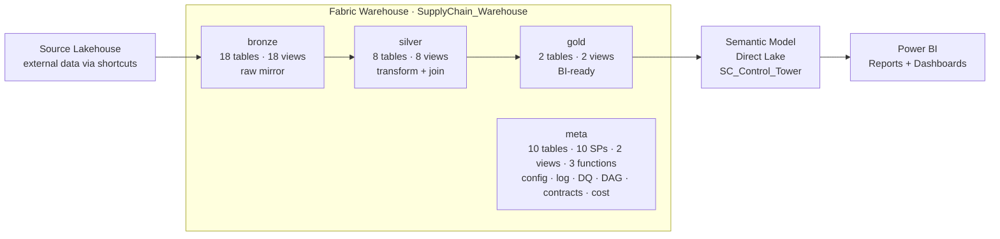

### 4 Schemas

| Schema | Purpose | Objects | Pattern |
|--------|---------|---------|---------|
| **bronze** | Raw mirror from source systems | 18 tables + 18 views | `VIEW` reads source via 3-part naming → Generic SP does DROP + CTAS |
| **silver** | Clean, conform, join, business rules | 8 tables + 8 views | `VIEW` reads bronze/silver → Generic SP does DROP + CTAS (DAG wave order) |
| **gold** | Business-ready facts & dimensions | 2 tables + 2 views | `VIEW` reads silver → Generic SP does DROP + CTAS |
| **meta** | System control plane | 10 tables + 10 SPs + 2 views + 3 fn | Config + log + DQ + DAG + lineage + timezone + contracts + cost + baseline |

### Warehouse Structure

```
SupplyChain_Warehouse/
├── bronze/
│   ├── Tables/    brz_{source}__{entity}, ref_{entity}     (18)
│   └── Views/     vw_{table_name} → SELECT FROM source      (18)
│
├── silver/
│   ├── Tables/    slv_{concept}                              (8)
│   └── Views/     vw_slv_{concept} → JOINs, transforms      (8)
│
├── gold/
│   ├── Tables/    gld_{fact|dim}_{subject}                   (2)
│   └── Views/     vw_gld_{subject} → aggregation             (2)
│
└── meta/
    ├── Tables/    sp_registry, sp_run_history, dq_rules,
    │              dq_results, sp_lineage, pipeline_run_log,
    │              slv_dag_waves_runtime                       (7)
    ├── SPs/       usp_generic_load, usp_log_run (retry 3x),
    │              usp_check_dq, usp_check_dq_single,
    │              usp_build_lineage, usp_compute_slv_waves,
    │              usp_run_silver_dag, usp_debug_loop,
    │              usp_finalize_pipeline, usp_log_pipeline_run (10)
    ├── Views/     vw_table_dictionary, vw_run_history_tz        (2)
    └── Functions/ ufn_should_run, ufn_cron_is_due,
                   ufn_utc_to_cst                              (3)
```

> **78 total objects** across 4 schemas. Per-table SPs have been deleted — all 28 tables loaded by 1 generic SP.

### Key Features

- **Generic SP architecture** — 1 SP (`meta.usp_generic_load`) replaces 28 per-table SPs, supports 8 load patterns, aligned with Enterprise ETL_Framework
- **2-file-per-table** — VIEW (ETL logic) + TABLE (materialized data). No per-table SP needed
- **Metadata-driven** — adding a new table = CREATE VIEW + INSERT 1 row into `sp_registry`. No pipeline changes
- **DAG-based silver** — `depends_on` column auto-computes execution waves (max 30 levels)
- **Parent-child pipeline** — parallel within wave, sequential between waves (Microsoft recommended)
- **Smart scheduling** — cron + next_run_time filter, monthly tables auto-skip when not due
- **Snapshot conflict mitigation** — retry 3x in usp_log_run + reduced batch concurrency
- **Config-driven DQ** — 54 rules (30 active + 24 reserved), 4 check types (completeness/row_count/freshness/uniqueness). DQ gates exist in pipeline but **deactivated** for performance (~18 min vs ~27 min)
- **Auto-built lineage** — `source_objects` JSON → 52 source-to-target edges, rebuilt every run
- **Performance baseline** — 28 SPs baselined with 2x threshold alerting (created, not in pipeline flow)
- **Cost monitoring** — CU consumption tracking per pipeline run (created, not in pipeline flow)
- **Data contracts** — 674 source columns contracted for schema drift detection (created, not in pipeline flow)

### Feature Status (32 features total)

**A. Core Engine (8) — always active:**

| Feature | Object | Status |
|---------|--------|--------|
| Generic SP (8 load patterns) | `usp_generic_load` | ✅ Active |
| Metadata-driven config | `sp_registry` (28 tables) | ✅ Active |
| DAG wave computation | `usp_compute_slv_waves` + `slv_dag_waves_runtime` | ✅ Active |
| Parent-child pipeline | `pl_sc_silver` → `pl_sc_silver_wave` | ✅ Active |
| Auto lineage (52 edges) | `usp_build_lineage` + `sp_lineage` | ✅ Active |
| Execution logging | `usp_log_run` + `sp_run_history` (retry 3x) | ✅ Active |
| Pipeline logging | `usp_log_pipeline_run` + `pipeline_run_log` | ✅ Active |
| Finalize | `usp_finalize_pipeline` (lineage + log) | ✅ Active |

**B. Scheduling (4) — always active:**

| Feature | Object | Status |
|---------|--------|--------|
| Cron scheduling | `ufn_cron_is_due` + `cron_expression` | ✅ Active |
| Smart skip | `ufn_should_run` + `next_run_time` | ✅ Active |
| Auto-trigger daily 2AM UTC+7 | Fabric Schedule | ✅ Active |
| Snapshot retry 3-layer | SP retry 3x/2s + pipeline retry 3x/60s | ✅ Active |

**C. Timezone + Enterprise (4) — always active:**

| Feature | Object | Status |
|---------|--------|--------|
| UTC→CST timezone (DST aware) | `ufn_utc_to_cst` | ✅ Active |
| TableDictionary (63/63 cols) | `vw_table_dictionary` | ✅ Active |
| Run history 3 timezones | `vw_run_history_tz` | ✅ Active |
| Multi-mart project column | `sp_registry.project` | ✅ Ready (1 mart) |

**D. Data Quality (8) — deactivated for performance:**

| Feature | Object | Status | Activate |
|---------|--------|--------|----------|
| DQ engine (7 check types) | `usp_check_dq_single` | ✅ SP exists | Always ready |
| DQ core rules (30) | `dq_rules` 1-30 | ✅ is_active=1 | Ready |
| DQ expansion rules (24) | `dq_rules` 31-54 | ⏸ is_active=0 | `UPDATE SET is_active=1 WHERE rule_id>30` |
| DQ pipeline | `pl_dq_check` | ✅ Pipeline exists | Invoke manually |
| DQ gate bronze | `dq_bronze` in pl_sc_master | ⏸ Deactivated | Right-click → Activate |
| DQ gate silver | `dq_silver` in pl_sc_master | ⏸ Deactivated | Right-click → Activate |
| DQ gate gold | `dq_gold` in pl_sc_master | ⏸ Deactivated | Right-click → Activate |
| DQ results log | `dq_results` | ✅ Table exists | Has history |

**E. Phase 3 Advanced (6) — created, not in pipeline flow:**

| Feature | Object | Status | Activate |
|---------|--------|--------|----------|
| Performance baseline | `performance_baseline` (28 SPs) | ✅ Data exists | Re-deploy enhanced finalize SP |
| Cost monitoring | `pipeline_cost_log` (1 row) | ✅ Data exists | Re-deploy enhanced finalize SP |
| Schema contracts | `schema_contracts` (674 cols) + `usp_validate_schema_contracts` | ✅ Table + SP | Pipeline step or Python |
| Legacy DQ SP | `usp_check_dq` | ✅ Exists | Replaced by usp_check_dq_single |
| Legacy silver runner | `usp_run_silver_dag` | ✅ Exists | Backup sequential |
| Debug utility | `usp_debug_loop` | ✅ Exists | Debug only |

**F. Blocked (2) — needs IT/DevOps:**

| Feature | Status | Blocker |
|---------|--------|---------|
| Alerting (email/Teams) | ⚠ Design ready | IT: Mail.Send / Teams / Power Automate |
| CI/CD (.sqlproj + SqlCmdVariable) | ⚠ Design ready | Azure DevOps access |

> **Pipeline runtime**: ~18-19 min (lean, DQ off) or ~27 min (full, DQ on). Full run: 28/28 tables, 1.47B rows, 0 failures.

---

## Pipeline Architecture

### 7 Pipelines (Multi-Mart Architecture)

| Pipeline | Type | Role | Parameter |
|----------|------|------|-----------|
| `pl_sc_master` | Master | log_start → ForEach projects → finalize → refresh_sm | — |
| `pl_sc_mart` | **Mart orchestrator** | Chains bronze → silver → gold per project | `@project_name` |
| `pl_sc_bronze` | Layer loader | Lookup sp_registry → ForEach(batch=6) → EXEC usp_generic_load | `@project_name` |
| `pl_sc_silver` | DAG parent | compute_waves → ForEach wave → invoke pl_sc_silver_wave | `@project_name` |
| `pl_sc_silver_wave` | DAG child | Lookup SPs for wave → ForEach(batch=8) → EXEC usp_generic_load | `@wave_number` |
| `pl_sc_gold` | Layer loader | Lookup sp_registry → ForEach(batch=2) → EXEC usp_generic_load | `@project_name` |
| `pl_dq_check` | DQ Gate | Lookup dq_rules → ForEach(batch=10) → EXEC usp_check_dq_single (⏸ deactivated) | `@dq_layer` |

> **Multi-mart**: Master pipeline dynamically discovers projects from sp_registry, runs each via `pl_sc_mart` in parallel. Adding a new mart = INSERT rows into sp_registry with new `project` value. No pipeline changes needed.

### Master Flow (Multi-Mart)

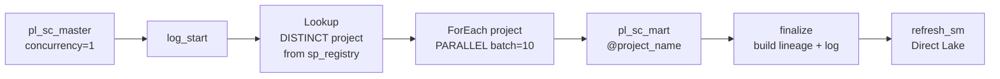

### Mart Flow (per project)

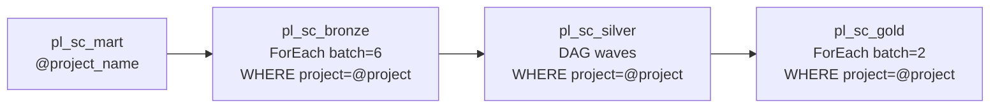

> **DQ gates**: Currently **deactivated** for performance (~20 min vs ~27 min). DQ rules (30 active) and `pl_dq_check` pipeline exist — reactivate via Portal.
> **Scaling**: 1 mart = ~20 min. N marts parallel = still ~20 min (ForEach batchCount=10).

### Bronze & Gold — Lookup + Parallel ForEach

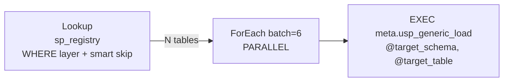

### Silver — Parent-Child DAG

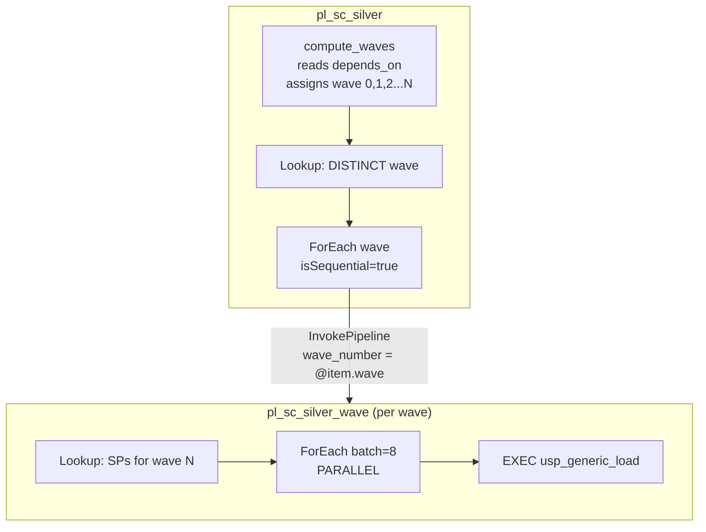

> **Why parent-child?** Fabric does not allow ForEach inside ForEach/Until. Microsoft-recommended workaround: Execute Pipeline inside ForEach.

### DAG Wave Example

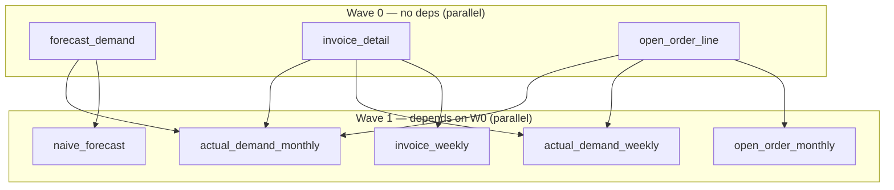

### Connection Topology

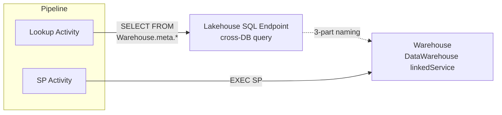

> Fabric Pipeline Lookup supports `LakehouseTableSource` but not Warehouse directly. Workaround: cross-DB 3-part naming through Lakehouse.

### Pipeline Performance

| Run | Duration | Tables | Notes |
|-----|----------|--------|-------|
| Typical daily | **17-20 min** | 28/28 | All layers sequential |
| With smart skip | **~15 min** | 18/28 | 10 monthly tables skipped |
| Failed run | 4 min | partial | Snapshot conflict → retry next trigger |

---

## Generic SP Architecture

Instead of 28 per-table SPs, a single **Generic SP** handles all loads:

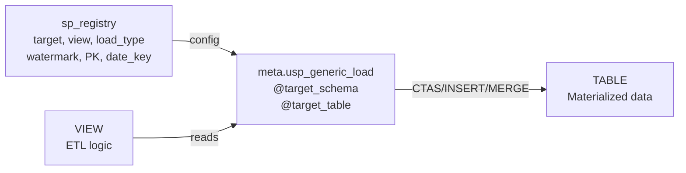

### 8 Load Patterns

| Pattern | load_type | Description | Required columns |
|---------|-----------|-------------|-----------------|
| Overwrite | `overwrite` | DROP + CTAS from view (default) | — |
| Incremental | `incremental` | INSERT WHERE watermark > last value | `watermark_column` |
| Upsert | `upsert` | DELETE matching + INSERT on PK | `primary_key` |
| DateKey | `datekey` | DELETE + INSERT by date column | `date_key` |
| DateRange | `daterange` | DELETE last N days + INSERT | `date_key` + `date_range_days` |
| Identity | `identity` | INSERT WHERE PK > MAX existing | `primary_key` |
| CDC | `cdc` | Apply change data capture ops | `primary_key` |
| SCD2 | `scd2` | Slowly changing dimension type 2 | `primary_key` |

### Usage

```sql
-- Pipeline ForEach calls this for every table:
EXEC meta.usp_generic_load @target_schema = 'bronze', @target_table = 'brz_saleshistory_afi__invoicedetail';

-- The SP reads sp_registry to find view_name, load_type, watermark, PK, date_key
-- Then routes to the correct load pattern automatically.
```

---

## Adding a New Table

With Generic SP, adding a new table = **2 steps**, no SP creation, no pipeline changes.

### Bronze (2 steps)

```sql
-- 1. Create view (ETL logic)
CREATE OR ALTER VIEW bronze.vw_brz_{name} AS
SELECT * FROM {Source_Lakehouse}.{schema}.{source_table};

-- 2. Register in sp_registry
INSERT INTO meta.sp_registry (sp_name, view_name, target_schema, target_table,
    layer, load_type, frequency, execution_order, is_active, source_objects, project, cron_expression)
VALUES ('meta.usp_generic_load', 'bronze.vw_brz_{name}',
    'bronze', 'brz_{name}', 'BRZ', 'overwrite', 'daily', 1, 1,
    '["{Source_Lakehouse}.{schema}.{source_table}"]', '{project}', '0 2 * * *');
```

### Silver (with DAG dependency)

```sql
-- 1. Create view
-- 2. Register with depends_on:
INSERT INTO meta.sp_registry (..., depends_on)
VALUES (..., '["silver.slv_upstream_table"]');
-- Pipeline auto picks up → wave auto-computed → parallel execution
```

> **Full step-by-step guide**: See [onboarding.md](docs/operations/onboarding.md) — covers all layers, load types, DQ rules, testing, FAQ.

---

## Data Quality Gates

> **Status (2026-04-18)**: DQ gates are **deactivated** in pipeline for performance (~18 min vs ~27 min).
> All DQ components exist (rules, SP, pipeline) and can be reactivated anytime.
> See [Feature Status](#feature-status-32-features-total) for details.

DQ checks are designed to run **between every layer** in the master pipeline. If a CRITICAL check fails, the pipeline stops — downstream layers do not run on bad data.

### How It Works (when activated)

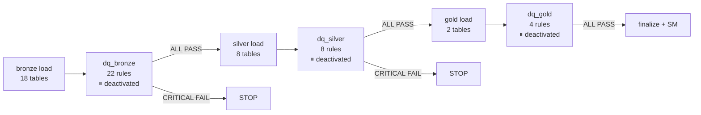

### What Happens Step by Step

1. **Bronze finishes** → master calls `pl_dq_check` with `layer = 'BRZ','REF'`
2. `pl_dq_check` does a **Lookup**: `SELECT rule_id FROM meta.dq_rules WHERE layer IN ('BRZ','REF') AND is_active = 1` → returns 22 rule IDs
3. **ForEach** (batch=10, parallel) calls `EXEC meta.usp_check_dq_single @rule_id = {each rule}` for every rule
4. The SP reads the rule config, generates a SQL check, runs it, and writes PASS/FAIL to `meta.dq_results`
5. If **CRITICAL** rule fails → SP throws error → pipeline stops
6. If **WARNING** rule fails → logged only → pipeline continues

### Example: Completeness Check (Rule 1)

```
Rule config in meta.dq_rules:
  rule_id = 1
  check_type = 'completeness'
  target = bronze.brz_saleshistory_afi__invoicedetail
  column = 'id_invoice'
  severity = CRITICAL

SP generates and runs:
  SELECT SUM(CASE WHEN [id_invoice] IS NULL THEN 0 ELSE 1 END) * 100.0 / COUNT(*)
  FROM [bronze].[brz_saleshistory_afi__invoicedetail]

Result: 100.00% → PASS ✓
```

### Example: Row Count Check (Rule 13)

```
Rule config:
  rule_id = 13
  check_type = 'row_count'
  target = bronze.brz_saleshistory_afi__invoicedetail
  threshold = 1,000,000
  severity = CRITICAL

SP generates and runs:
  SELECT COUNT(*) FROM [bronze].[brz_saleshistory_afi__invoicedetail]

Result: 35,658,453 >= 1,000,000 → PASS ✓

If result was 500 → FAIL → THROW error → pipeline STOPS, silver does NOT run
```

### Severity Behavior

| Severity | On FAIL | Use case |
|----------|---------|----------|
| **CRITICAL** | Pipeline **stops** — downstream layers do not run | Key columns NULL, table empty/too small |
| **WARNING** | Logged to `dq_results`, pipeline **continues** | Row count slightly low, non-essential checks |

### Current Rules (30 total)

| Layer | Rules | What they check |
|-------|-------|----------------|
| BRZ (8) | completeness | Key columns (`id_invoice`, `id_item_sku`, `id_order`) must not be NULL |
| REF (8) | completeness + row_count | Key columns not NULL + minimum row counts (e.g., ref_calendar ≥ 10K) |
| SLV (8) | completeness + row_count | Key columns not NULL + minimum row counts (e.g., slv_invoice ≥ 1M) |
| GLD (4) | completeness + row_count | Key columns not NULL + minimum row counts (e.g., gld_fact ≥ 100K) |

### Adding DQ Rules for a New Table

When you add a new table, DQ does **not** auto-check it. Add rules manually:

```sql
-- Completeness: key column must not be NULL
INSERT INTO meta.dq_rules (rule_id, rule_name, target_schema, target_table,
    check_type, column_name, severity, is_active, layer)
VALUES (
    (SELECT ISNULL(MAX(rule_id),0)+1 FROM meta.dq_rules),
    'new_table id_key not null',
    'bronze', 'brz_new_table',
    'completeness', 'id_key', 'CRITICAL', 1, 'BRZ'
);

-- Row count: minimum expected rows
INSERT INTO meta.dq_rules (rule_id, rule_name, target_schema, target_table,
    check_type, severity, threshold, is_active, layer)
VALUES (
    (SELECT ISNULL(MAX(rule_id),0)+1 FROM meta.dq_rules),
    'new_table min 1K rows',
    'bronze', 'brz_new_table',
    'row_count', 'WARNING', 1000, 1, 'BRZ'
);
```

No pipeline changes needed — `pl_dq_check` Lookup dynamically reads `dq_rules`.

### 7 Supported Check Types

| check_type | What it checks | Required columns |
|------------|---------------|-----------------|
| `completeness` | Column NOT NULL % ≥ threshold | `column_name` |
| `row_count` | Table row count ≥ threshold | `threshold` |
| `uniqueness` | No duplicate values in column | `column_name` |
| `freshness` | Data loaded within N hours | `threshold` (hours) |
| `referential_integrity` | FK exists in parent table | `params` (SQL) |
| `validity` | Values in expected set | `params` (SQL) |
| `custom_sql` | Any arbitrary SQL check | `params` (SQL returning 0=pass) |

---

## Scheduling & Concurrency

| Aspect | Current state |
|--------|--------------|
| **Pipeline trigger** | Manual (auto schedule not yet enabled on Fabric Portal) |
| **Table frequency** | 18 daily (`0 2 * * *`) + 10 monthly (`0 2 1 * *`) via sp_registry |
| **Smart skip** | Active — Lookup WHERE `next_run_time <= GETUTCDATE()` |
| **Concurrency** | Master: concurrency=1, Bronze: batch=6, Silver wave: batch=8, Gold: batch=2 |
| **Snapshot conflict** | Mitigated: usp_log_run retry 3x + reduced batch + pipeline retry 3x60s |

> **Full details**: See [scheduling.md](docs/operations/scheduling.md) — trigger scenarios, CU estimates, cron setup.

---

## Naming Convention

### Objects

| Schema | Tables | Views | Pipelines |
|--------|--------|-------|-----------|
| bronze | `brz_{src}__{tbl}` / `ref_{entity}` | `vw_brz_*` / `vw_ref_*` | `pl_bronze_{project}` |
| silver | `slv_{concept}` | `vw_slv_*` | `pl_silver_{project}` |
| gold | `gld_{fact\|dim}_{subject}` | `vw_gld_*` | `pl_gold_{project}` |
| meta | descriptive | `vw_*` | `pl_sc_master` (unique) |

### Column Prefixes

`id_` keys · `code_` categories · `name_` descriptions · `qty_` quantities · `amt_` amounts · `dt_` dates · `num_` numbers · `ts_` timestamps · `pct_` percentages · `is_` flags (0/1)

---

## Multi Data Mart Scale

The architecture supports **N data marts running in parallel**. Each mart = 1 complete bronze→silver→gold flow for a specific project/domain.

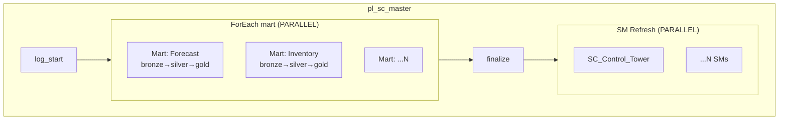

| Aspect | Detail |
|--------|--------|
| **Parallel execution** | N marts simultaneously (ForEach isSequential=false) |
| **Project filter** | `sp_registry.project` column filters tables per mart |
| **Cross-mart deps** | Silver in mart B can depend on bronze from mart A via `depends_on` |
| **Cost optimization** | Total time = max(mart), not sum(marts) |

> **Full design**: See [multi_mart_scale.md](docs/enterprise/multi_mart_scale.md)

---

## Enterprise Compatibility

### Mapping Status

| Area | Coverage | Detail |
|------|----------|--------|
| **Load patterns** | **8/8 (100%)** | overwrite, incremental, upsert, datekey, daterange, identity, cdc, scd2 |
| **TableDictionary** | **63/63 cols (100%)** | `meta.vw_table_dictionary` maps all Enterprise columns + 6 v9 extras |
| **Audit log** | **Mapped** | `sp_run_history` = Enterprise `AuditLog` |
| **Pipeline orchestration** | **Mapped** | Fabric Pipelines = Azure Pipelines |
| **DAG orchestration** | **v9 ahead** | Enterprise does not have depends_on/wave computation |
| **Auto lineage** | **v9 ahead** | Enterprise does not have auto-built lineage |
| **DQ config-driven** | **v9 ahead** | Enterprise DQ is simpler (row count only) |
| **Alerts/email** | **Not implemented** | Enterprise has `usp_DataWarehouseDataFeedAlert_Fabric` |
| **fn_GetDate timezone** | **Implemented (CST)** | `meta.ufn_utc_to_cst` — DST aware, maps to TableDictionary `[Modified]` |
| **.sqlproj validation** | **Not implemented** | Enterprise has build-time schema validation |
| **Multi-environment** | **Not implemented** | Enterprise has Dev → Prod via publish profiles |

### Load Pattern Mapping

| v9 load_type | Enterprise Equivalent | Enterprise SP |
|-------------|----------------------|--------------|
| `overwrite` | DELINSERT | usp_IncrementalTableLoad |
| `incremental` | Append/DateKey | usp_IncrementalTableLoad |
| `upsert` | Upsert | usp_IncrementalTableLoad |
| `datekey` | DateKey | usp_IncrementalTableLoad |
| `daterange` | DateRange | usp_UpdateCuratedTableFromView_DateRange |
| `identity` | Identity | usp_IncrementalTableLoad |
| `cdc` | CDC | usp_IncrementalTableLoad |
| `scd2` | SCD2 | usp_SCD2_TableLoad |

> **Full comparison**: See [fabric_vs_enterprise.md](docs/enterprise/fabric_vs_enterprise.md)

---

## Semantic Model

| Aspect | Detail |
|--------|--------|
| **Name** | SC_Control_Tower |
| **Mode** | Direct Lake (reads Parquet from Warehouse, no import) |
| **Tables** | dim_calendar, dim_customer_grouping, dim_warehouse, dim_product, dim_forecast_horizon, fact_flat_forecast_actual, fact_forecast_kpi |
| **Refresh** | Auto — `PBISemanticModelRefresh` activity at end of every master pipeline run |
| **Source remapping** | Display names match v8 so reports switch source without breaking |
| **Deployment** | Fabric REST API with TMDL definition |

---

## Multi-Environment Roadmap

> **⚠ BLOCKED**: Requires Azure DevOps access (not yet granted as of 2026-04-18).
> CI/CD setup (.sqlproj, SqlCmdVariable, PR gates, build validation) cannot proceed until access is provided.
> See [roadmap.md](docs/enterprise/roadmap.md) Phase 2 for full details.

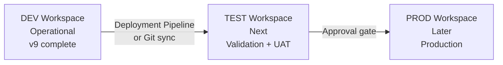

- **Fabric Git Integration**: Auto-exports all objects as .sqlproj + .sql files
- **Deployment Pipelines**: DEV → TEST → PROD promotion (Fabric native)
- **SqlCmdVariable**: Enterprise uses `$(Source_Data)`. Convert 3-part naming via `sqlpackage publish` — **do NOT convert SQL files until deploy flow is ready** (Fabric cannot interpret `$(...)` directly)
- **.sqlproj Build Validation**: `dotnet build *.sqlproj` catches schema errors before deploy. Matches Enterprise DacFx pattern

---

## Fabric Warehouse Constraints

| Not Supported | Workaround |
|---------------|------------|
| DEFAULT constraint | Set values in SP |
| IDENTITY | ROW_NUMBER() or MAX(id)+1 |
| PRIMARY KEY / UNIQUE | DQ uniqueness check |
| Recursive CTE | SP iterative WHILE loop |
| ForEach inside Until | Parent-child pipeline pattern |
| Variables in distributed queries | sp_executesql with parameters |
| `DATETIME2` without precision | Always `DATETIME2(6)` |
| `datetime` in CTAS | `CAST(GETUTCDATE() AS DATETIME2(6))` |
| Warehouse Lookup in Pipeline | LakehouseTableSource + cross-DB |
| Concurrent writes to same table | usp_log_run retry 3x + WAITFOR DELAY |

---

## Tech Stack

- **Platform**: Microsoft Fabric F256 (Synapse Data Warehouse)
- **Language**: T-SQL (pure, no PySpark/Notebooks)
- **Orchestration**: Fabric Data Pipelines (parent-child pattern, metadata-driven)
- **ETL Engine**: Generic SP — 8 load patterns, aligned with Enterprise ETL_Framework
- **Scheduling**: Cron-based (sp_registry) + smart skip filter
- **Semantic Model**: Direct Lake (TMDL via Fabric REST API)
- **BI**: Power BI Direct Lake
- **Lineage**: Interactive Streamlit app ([live](https://vn-fabric-lineage.streamlit.app))
- **Version Control**: GitHub
- **Deployment**: Fabric REST API + Claude Code
- **Environments**: DEV (operational) → TEST → PROD (roadmap)

---

## Documentation Index

### Architecture Diagrams (`diagrams/`)

| File | Audience | Description |
|------|----------|-------------|
| [v9_presentation.mmd](diagrams/v9_presentation.mmd) | DA / BU / Leadership | **Presentation** — Overview: data flow, pipeline with DQ gates, scorecard, metrics |
| [template_full_architecture.mmd](diagrams/template_full_architecture.mmd) | DE / Architect | **System Design** — Full detail: all objects, SPs, functions, connections, lineage |
| [v9_supplychain_full_architecture.mmd](diagrams/v9_supplychain_full_architecture.mmd) | DE (v9 project) | **v9 Actual** — 85 objects, 7 pipelines, 1.47B rows, all IDs |

### Onboarding & Operations (`docs/operations/`)

| File | Description |
|------|-------------|
| [onboarding.md](docs/operations/onboarding.md) | **Start here** — Step-by-step: add new ETL table (for DA/DE) |
| [runbook.md](docs/operations/runbook.md) | **Operations** — Pipeline troubleshooting, common errors, re-run guide, escalation |
| [alerting.md](docs/operations/alerting.md) | **Alerting** — Power Automate + Teams: setup guide, Adaptive Card design |
| [health_check.py](scripts/health_check.py) | **Health Check** — 49 automated checks: `python3 scripts/health_check.py` |
| [scheduling.md](docs/operations/scheduling.md) | Scheduling: cron, smart skip, concurrency, snapshot conflict mitigation |
| [sqlproj_validation.md](docs/operations/sqlproj_validation.md) | .sqlproj validation: 3 approaches (lint / sqlproj / full ProjectRef) |
| [timezone_sync.md](docs/operations/timezone_sync.md) | Timezone sync: UTC + CST + VN, map Enterprise fn_GetDate |
| [generic_sp_migration.md](docs/operations/generic_sp_migration.md) | Migration history: 28 per-table SPs → 1 generic SP |

### Templates (`docs/templates/`)

| File | Description |
|------|-------------|
| [architecture.md](docs/templates/architecture.md) | Architecture reference: schemas, pipelines, DAG, meta, DQ, naming |
| [pipeline_guide.md](docs/templates/pipeline_guide.md) | Pipeline execution trace: what happens when master triggers |
| [setup_guide.md](docs/templates/setup_guide.md) | Phase-by-phase setup: DDL, SP templates, pipeline JSON, REST API |

### Project-specific (`docs/supplychain/`)

| File | Description |
|------|-------------|
| [architecture.md](docs/supplychain/architecture.md) | All 76 objects: names, row counts, pipeline IDs, source mappings, SM |
| [pipeline.md](docs/supplychain/pipeline.md) | Execution trace: actual SP names, durations, wave assignments |
| [setup.md](docs/supplychain/setup.md) | Implementation log: Spark→T-SQL conversions, bugs, fixes |

### Scale & Enterprise (`docs/enterprise/`)

| File | Description |
|------|-------------|
| [multi_mart_scale.md](docs/enterprise/multi_mart_scale.md) | Multi Data Mart: N marts parallel, cross-mart deps, cost optimization |
| [fabric_vs_enterprise.md](docs/enterprise/fabric_vs_enterprise.md) | Enterprise vs v9: ETL framework, load patterns, CI/CD, naming |
| [roadmap.md](docs/enterprise/roadmap.md) | Future roadmap: production hardening, CI/CD, scale, enterprise integration |

### Apps & Scripts

| File | Description |
|------|-------------|
| [lineage_explorer/](lineage_explorer/) | **Lineage Explorer** — Streamlit app: interactive DAG visualization |
| [scripts/health_check.py](scripts/health_check.py) | **Health Check** — 49 automated checks |

---

*Built with Claude Code + Fabric MCP Server*
