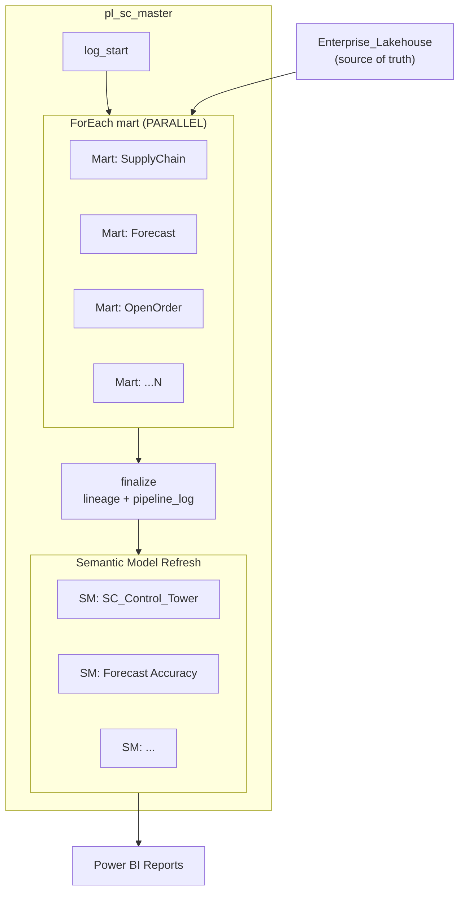
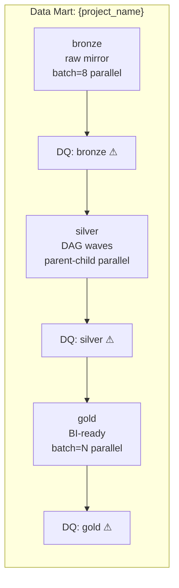
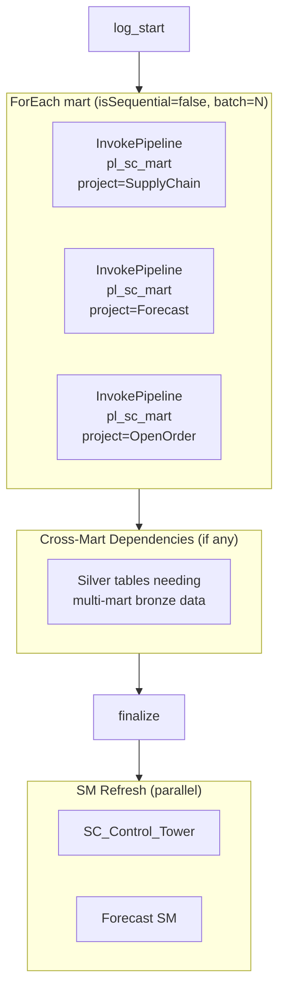
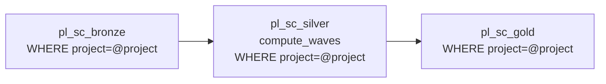
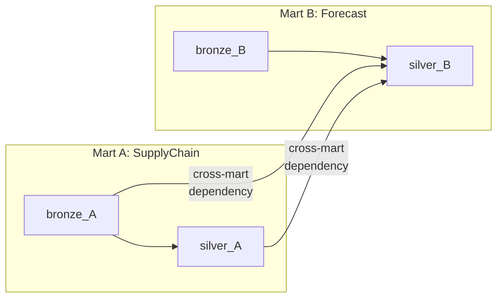
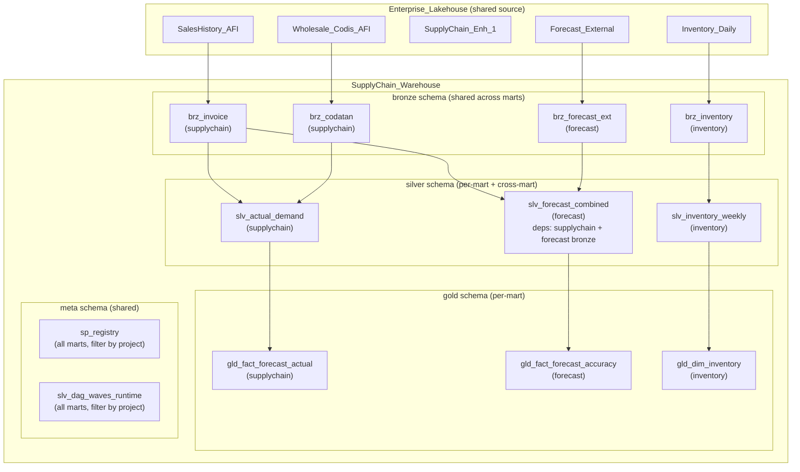
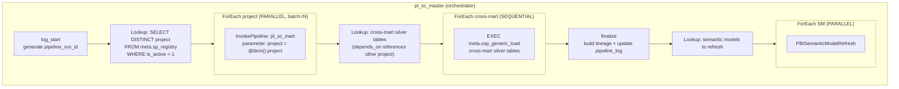
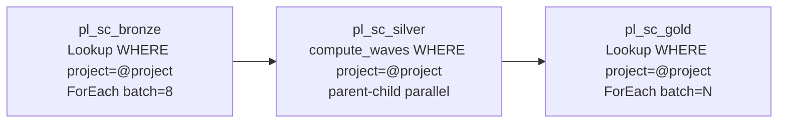

# Multi Data Mart — Scale Architecture
> pl_sc_master quản lý N data marts song song
> Mỗi mart = 1 luồng bronze → silver → gold độc lập
> Cross-mart dependencies + shared semantic models

---

## 1. Viễn cảnh Scale

### Hiện tại (1 mart)
```
pl_sc_master → [SupplyChain mart] → SC_Control_Tower SM
```

### Tương lai (N marts)
```
pl_sc_master
  ├─ [SupplyChain mart]      → SC_Control_Tower SM
  ├─ [Forecast mart]         → Forecast Accuracy SM
  ├─ [OpenOrder mart]        → Order Fulfillment SM
  ├─ [Invoice mart]          → Sales Analytics SM
  ├─ [Inventory mart]        → Inventory Dashboard SM
  └─ ...N marts

Mỗi mart chạy PARALLEL (không chờ nhau)
Trừ khi: mart B cần data từ mart A → dependency
```

---

## 2. Kiến trúc Tổng Quan



### Mỗi Mart bên trong:



---

## 3. Pipeline Architecture — Multi Mart

### 3.1 Master Pipeline



### 3.2 Generic Mart Pipeline (pl_sc_mart)

**1 pipeline chung cho TẤT CẢ marts** — nhận parameter `project_name`:



**Lookup queries filter by project**:
```sql
-- Bronze
SELECT target_schema, target_table FROM meta.sp_registry
WHERE layer IN ('BRZ','REF') AND is_active = 1 AND project = @project_name

-- Silver (waves cũng filter by project)
SELECT DISTINCT wave FROM meta.slv_dag_waves_runtime r
INNER JOIN meta.sp_registry s ON r.sp_name = s.sp_name
WHERE s.project = @project_name

-- Gold
SELECT target_schema, target_table FROM meta.sp_registry
WHERE layer = 'GLD' AND is_active = 1 AND project = @project_name
```

### 3.3 Cross-Mart Dependencies

Khi silver mart B cần bronze từ mart A + mart B:



**Giải pháp**: `depends_on` trong sp_registry hỗ trợ cross-project:
```json
{
  "sp_name": "silver.slv_forecast_combined",
  "project": "Forecast",
  "depends_on": [
    "silver.slv_actual_demand_monthly",
    "bronze.brz_forecast_external"
  ]
}
```

`usp_compute_slv_waves` tự phân wave đúng — wave 0 = tables không deps, wave 1 = deps satisfied.

**Execution order**: Master chạy tất cả marts parallel → cross-mart silver chạy SAU khi cả 2 marts xong bronze.

---

## 4. sp_registry — Đã sẵn sàng cho multi-mart

Column `project` **đã tồn tại** trong sp_registry (22 cols). Hiện tại tất cả = `'supplychain'`.

### Thêm mart mới:
```sql
-- Mart: Forecast (ví dụ)
INSERT INTO meta.sp_registry
(sp_name, view_name, target_schema, target_table, layer, load_type,
 frequency, execution_order, is_active, source_objects, project)
VALUES
('bronze.brz_forecast_external', 'bronze.vw_brz_forecast_external',
 'bronze', 'brz_forecast_external', 'BRZ', 'overwrite',
 'daily', 1, 1, '["Enterprise_Lakehouse.Forecast.ExternalData"]',
 'forecast');  -- ← project = 'forecast'
```

### Pipeline Lookup tự filter:
```sql
SELECT target_schema, target_table FROM meta.sp_registry
WHERE project = 'forecast' AND layer = 'BRZ' AND is_active = 1
```

---

## 5. Medallion Layers — Multi Mart



### Shared vs Isolated:

| Component | Shared across marts? | Lý do |
|-----------|---------------------|-------|
| Enterprise_Lakehouse | **Shared** (read-only) | 1 source of truth |
| bronze schema | **Shared** (all marts write here) | Tránh duplicate raw data |
| silver schema | **Per-mart** + cross-mart deps | Business logic khác nhau |
| gold schema | **Per-mart** | BI output riêng |
| meta.sp_registry | **Shared** (filter by project) | 1 config table cho all |
| meta.usp_generic_load | **Shared** (1 SP for all) | Generic, project-agnostic |
| Pipelines | **Shared** (parameterized by project) | 1 bộ pipeline cho all marts |
| Semantic Models | **Per-mart** (hoặc cross-mart) | Mỗi mart có SM riêng |

---

## 6. Giải pháp cho các bài toán Scale

### 6.1 Tối ưu chi phí (CU consumption)

| Giải pháp | Mô tả | Tiết kiệm |
|-----------|-------|-----------|
| **Right-size frequency** | Dim tables: weekly/monthly, fact tables: daily | ~30% CU |
| **ufn_should_run gate** | Skip table nếu đã load hôm nay | Tránh re-run |
| **Incremental > overwrite** | Tables >10M rows dùng incremental/upsert | ~50% CU cho large tables |
| **Mart-level parallelism** | N marts chạy parallel = tổng thời gian = max(mart) thay vì sum(mart) | ~Nx faster |
| **Scale-down off-peak** | F256 ban ngày, F64 ban đêm via REST API | ~60% cost off-peak |
| **Materialized aggregate** | Pre-compute daily agg ở gold → PBI query nhỏ | PBI query 100x faster |

### 6.2 Tối ưu hiệu suất

| Giải pháp | Mô tả |
|-----------|-------|
| **Parallel marts** | ForEach isSequential=false, batch=N → N marts chạy cùng lúc |
| **Parallel within wave** | Parent-child pipeline → ForEach batch=8 per wave |
| **Generic SP parameterized** | sp_executesql tránh recompile |
| **Bronze batch=8** | 8 tables parallel (Fabric WH dual compute pool) |
| **Retry 3x60s** | Handle snapshot conflicts tự động |
| **CTAS > INSERT** | Overwrite dùng DROP+CTAS (faster than TRUNCATE+INSERT on Fabric) |

### 6.3 Cross-mart dependency resolution

| Scenario | Giải pháp |
|----------|-----------|
| Silver B cần Bronze A | `depends_on` cross-project → wave computation tự handle |
| Silver B cần Silver A | Master chạy mart A trước mart B (mart-level depends_on) |
| Gold cần data từ 2 marts | Gold table depends_on silver từ cả 2 marts |
| SM cần data từ N marts | SM refresh chạy SAU tất cả marts xong |

### 6.4 Monitoring & Alerting (tương lai)

| Giải pháp | Mô tả |
|-----------|-------|
| **pipeline_run_log per mart** | Mỗi mart ghi riêng: duration, tables ok/fail |
| **SLA per mart** | RefreshRate per project → alert nếu mart trễ |
| **Lineage per mart** | sp_lineage filter by project → trace per mart |
| **Cost per mart** | Track CU consumption by project tag |

---

## 7. Implementation Roadmap

### Phase 1: Hiện tại (DONE)
- 1 mart (SupplyChain), 28 tables
- 1 luồng pipeline
- Generic SP + DAG waves

### Phase 2: Multi-mart ready (cần làm)
- [ ] Thêm `project` filter vào pipeline Lookup queries
- [ ] Thêm `project` parameter cho pl_sc_mart
- [ ] Master pipeline: ForEach marts parallel
- [ ] usp_compute_slv_waves: filter by project
- [ ] Test với 2 marts

### Phase 3: Cross-mart (khi cần)
- [ ] Cross-mart depends_on resolution
- [ ] Mart-level dependency in master pipeline
- [ ] Shared bronze optimization (dedup)

### Phase 4: Enterprise scale (future)
- [ ] 10+ marts, 200+ tables
- [ ] Cost optimization (frequency tuning)
- [ ] SLA monitoring per mart
- [ ] Deployment pipeline: DEV → TEST → PROD per mart

---

## 8. Cấu trúc Pipeline Tương Lai



### pl_sc_mart (generic, receives @project):



---

## 9. Ví dụ: 3 Marts chạy parallel

```
Thời gian:
  T+0:00  log_start
  T+0:01  ForEach 3 marts PARALLEL:
            ├─ SupplyChain: bronze(3min) → silver(6min) → gold(2min) = 11min
            ├─ Forecast:    bronze(1min) → silver(2min) → gold(1min) = 4min
            └─ Inventory:   bronze(2min) → silver(3min) → gold(1min) = 6min
  T+0:12  Tất cả marts xong (max = 11min)
  T+0:12  Cross-mart silver (nếu có): 2min
  T+0:14  finalize: 1min
  T+0:15  SM refresh (parallel): 1min
  T+0:16  DONE

  Tổng: ~16min cho 3 marts
  Nếu sequential: 11+4+6 = 21min
  Tiết kiệm: ~25% thời gian
```

Với 10 marts:
```
  Parallel: max(mart) + cross + finalize ≈ 15-20min
  Sequential: sum(all marts) ≈ 60-90min
  Tiết kiệm: 70-80%
```

---

## 10. Thay đổi cần thiết (từ hiện tại → multi-mart)

| Component | Hiện tại | Cần đổi | Effort |
|-----------|---------|---------|--------|
| sp_registry.project | Tất cả = 'supplychain' | Set đúng project per table | Nhỏ |
| Pipeline Lookup | Không filter project | Thêm WHERE project=@param | Nhỏ |
| pl_sc_mart | Không có (inline trong master) | Tạo generic mart pipeline | Trung bình |
| pl_sc_master | Gọi bronze/silver/gold trực tiếp | ForEach marts → InvokePipeline | Trung bình |
| usp_compute_slv_waves | Tính tất cả SLV | Filter by project | Nhỏ |
| Cross-mart resolver | Không có | Thêm cross-mart stage | Trung bình |
| SM refresh | 1 SM | ForEach N SMs | Nhỏ |
| meta tables | Đủ columns | Không cần đổi | Zero |
| usp_generic_load | 8 patterns | Không cần đổi | Zero |
| Views | Per-table ETL | Không cần đổi | Zero |
