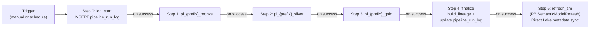
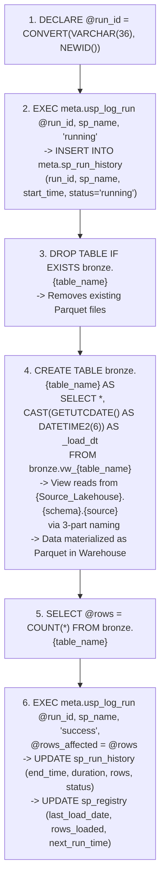
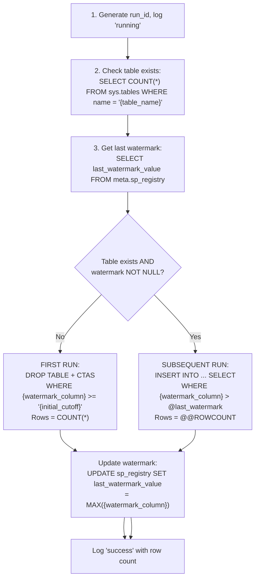
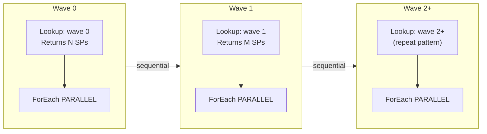
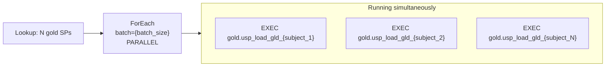
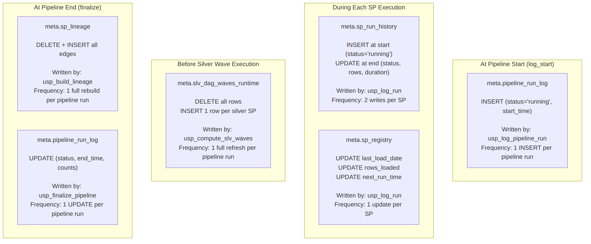
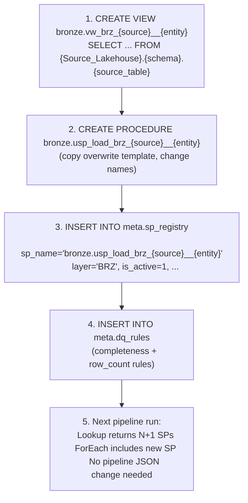
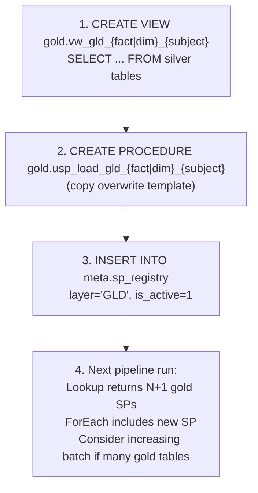

# Pipeline Deep Dive -- Execution Trace (Template)
> What happens step-by-step when pl_{prefix}_master is triggered
> Generic template | Replace all {placeholders} with project-specific values
> Microsoft Fabric | Warehouse-Native Medallion Architecture

---

## Trigger: pl_{prefix}_master Starts

When `pl_{prefix}_master` is triggered (manually or on schedule), it executes 7 steps sequentially:



If any child pipeline fails, execution stops. Silver does not run if bronze fails. Gold does not run if silver fails. The Semantic Model refresh runs only after all data layers and finalize succeed.

---

## Step 0: log_start SP

The first activity is a SqlServerStoredProcedure that calls:

```sql
EXEC meta.usp_log_pipeline_run
    @pipeline_run_id = CONVERT(VARCHAR(36), NEWID()),
    @pipeline_name = 'pl_{prefix}_master',
    @status = 'running';
```

This inserts a row into `meta.pipeline_run_log`:

| Column | Value |
|--------|-------|
| pipeline_run_id | New GUID |
| pipeline_name | pl_{prefix}_master |
| status | running |
| start_time | GETUTCDATE() |
| end_time | NULL |
| tables_succeeded | NULL |
| tables_failed | NULL |
| dq_failures_critical | NULL |

---

## Step 1: pl_{prefix}_bronze Executes

### 1.1 Lookup Activity: Get Bronze SP List

The Lookup activity connects to the **Lakehouse SQL endpoint** (not the Warehouse directly) and runs a cross-database query:

```sql
-- Executed on: {Project_Lakehouse} SQL endpoint
-- Connection: {lakehouse_connection_id} (LakehouseTableSource)
SELECT sp_name
FROM {Project_Warehouse}.meta.sp_registry
WHERE layer IN ('BRZ', 'REF')
  AND is_active = 1
  AND meta.ufn_should_run(sp_name) = 1
```

**Returns N rows** ({N_brz} BRZ + {N_ref} REF).

### 1.2 ForEach Activity: Execute SPs in Parallel

The ForEach activity iterates over the SP names with `batch={batch_size}` and `isSequential=false`. Up to **{batch_size} SPs run in parallel** at any time.

Each SP is executed via `SqlServerStoredProcedure` activity:
- **Connection**: DataWarehouse linkedService (endpoint: {warehouse_endpoint})
- **Retry policy**: retry=2, interval=30 seconds
- **Command**: `EXEC @item().sp_name`

### 1.3 Inside Each Bronze SP (Overwrite Pattern)

Every overwrite bronze SP follows this exact sequence:



**If an error occurs** (TRY/CATCH):
1. `DECLARE @err = ERROR_MESSAGE()`
2. `EXEC meta.usp_log_run @run_id, sp_name, 'failed', @error_message = @err`
3. `THROW` (re-raises error to pipeline, triggering retry)

### 1.4 Inside an Incremental SP (if applicable)

For SPs using the incremental pattern:



### 1.5 Snapshot Conflict and Retry

When multiple bronze SPs run in parallel, they all do DROP TABLE + CTAS. If two SPs operate on Parquet files that share the same underlying storage segments, a **snapshot isolation conflict** occurs:

```
Error: "Snapshot isolation transaction aborted due to update conflict.
The transaction was aborted because another concurrent operation modified or deleted
the same resource."
```

**How it is handled**: The pipeline retry policy (retry=2, interval=30s) automatically retries the failed SP. After a 30-second wait, the conflicting transaction has completed, and the retry succeeds.

---

## Step 2: pl_{prefix}_silver Executes

### 2.1 Step 1 of Silver: Compute DAG Waves

The first activity in pl_{prefix}_silver is a SqlServerStoredProcedure that calls:

```sql
EXEC meta.usp_compute_slv_waves
```

This SP does the following:

1. **DELETE** all rows from `meta.slv_dag_waves_runtime` (clean slate)
2. **Wave 0**: Find all SLV SPs where `depends_on` does not reference any silver SP:
   ```sql
   INSERT INTO slv_dag_waves_runtime (sp_name, wave)
   SELECT sp_name, 0 FROM sp_registry
   WHERE layer = 'SLV' AND is_active = 1
   AND (depends_on IS NULL OR depends_on NOT LIKE '%silver.usp_%')
   ```
3. **Wave 1+**: Iteratively find SLV SPs where ALL silver dependencies are already assigned:
   ```sql
   INSERT INTO slv_dag_waves_runtime (sp_name, wave)
   SELECT r.sp_name, @wave FROM sp_registry r
   WHERE r.layer = 'SLV' AND r.is_active = 1
   AND r.sp_name NOT IN (SELECT sp_name FROM slv_dag_waves_runtime)
   AND NOT EXISTS (
       SELECT 1 FROM sp_registry dep
       WHERE dep.layer = 'SLV' AND dep.is_active = 1
       AND r.depends_on LIKE '%' + dep.sp_name + '%'
       AND dep.sp_name NOT IN (SELECT sp_name FROM slv_dag_waves_runtime)
   )
   ```
4. Repeat until all SLV SPs are assigned or max 30 waves reached.

### 2.2 Wave Execution: Sequential Waves, Parallel Within

The silver pipeline has 10 pre-built Lookup+ForEach stages (wave 0 through wave 9), connected sequentially. Each stage:

1. **Lookup**: Queries the Lakehouse SQL endpoint with cross-DB:
   ```sql
   SELECT sp_name
   FROM {Project_Warehouse}.meta.slv_dag_waves_runtime
   WHERE wave = {N}
   ```
2. **ForEach** (batch={batch_size}, PARALLEL): Executes each returned SP via SqlServerStoredProcedure.

For waves where the Lookup returns no rows, the ForEach receives an empty array and skips execution entirely. No error, no delay.



Each SP within a wave follows the same overwrite pattern as bronze:
1. Generate run_id
2. Log 'running' to sp_run_history
3. DROP TABLE IF EXISTS silver.{table_name}
4. CTAS from silver.vw_{table_name} (view reads from bronze tables, applies JOINs/CTEs/transforms)
5. COUNT rows
6. Log 'success', update sp_registry

**Wave N completes when all SPs in that wave finish**. The slowest SP determines the wave duration. Wave N+1 starts only after wave N completes.

### 2.3 Empty Waves: Skip

Lookups for waves that have no assigned SPs return empty result sets. The ForEach activities receive empty arrays and complete immediately (no-op).

---

## Step 3: pl_{prefix}_gold Executes

### 3.1 Lookup Activity: Get Gold SP List

```sql
-- Executed on: {Project_Lakehouse} SQL endpoint (cross-DB)
SELECT sp_name
FROM {Project_Warehouse}.meta.sp_registry
WHERE layer = 'GLD'
  AND is_active = 1
```

### 3.2 ForEach Activity: Execute Gold SPs

ForEach with `batch={batch_size}` and `isSequential=false`. All gold SPs run in parallel.



Each gold SP follows the same overwrite pattern: NEWID -> log running -> DROP+CTAS -> COUNT -> log success.

---

## Step 4: finalize SP

The last activity calls:

```sql
EXEC meta.usp_finalize_pipeline @pipeline_run_id = '{run_id}'
```

This SP does:

1. **Build lineage**: Calls `meta.usp_build_lineage` to rebuild the full lineage graph from `source_objects` in sp_registry.
2. **Update pipeline_run_log**: Updates the row inserted by log_start with:
   - `status = 'success'`
   - `end_time = GETUTCDATE()`
   - `tables_succeeded = (SELECT COUNT(*) FROM sp_run_history WHERE pipeline_run_id = @id AND status = 'success')`
   - `tables_failed = (SELECT COUNT(*) FROM sp_run_history WHERE pipeline_run_id = @id AND status = 'failed')`

---

## Step 5: Semantic Model Refresh

After finalize completes, the master pipeline refreshes the Direct Lake Semantic Model via a `PBISemanticModelRefresh` activity.

### What happens during SM refresh

1. The pipeline sends a POST request to the Power BI refresh API
2. Direct Lake metadata is synced with the latest Parquet files in the warehouse
3. The SM picks up any new data written by the gold layer SPs
4. Power BI reports connected to this SM will see updated data on next query

### Activity configuration

| Property | Value |
|----------|-------|
| Activity type | PBISemanticModelRefresh |
| Connection | externalReferences.connection: `{sm_connection_id}` |
| groupId | workspace_id |
| datasetId | Semantic Model id |
| objects | List of table display names to refresh (dims + facts) |

### Why this is the last step

The SM refresh must run after finalize because:
- Gold tables must be fully materialized before the SM reads them
- The finalize step ensures lineage and run logs are updated first
- If finalize fails, we do not want a partial SM refresh

---

## Meta Tables: What Gets Written During a Pipeline Run

### Auto-Populated Tables



| Table | Writes per Pipeline Run | Written by |
|-------|------------------------|------------|
| pipeline_run_log | 1 INSERT + 1 UPDATE | usp_log_pipeline_run + usp_finalize_pipeline |
| sp_run_history | 2 x {N_total_sps} (INSERT + UPDATE per SP) | usp_log_run |
| sp_registry (auto cols) | {N_total_sps} UPDATEs | usp_log_run |
| slv_dag_waves_runtime | 1 DELETE + {N_silver_sps} INSERTs | usp_compute_slv_waves |
| sp_lineage | 1 DELETE + {N_lineage_edges} INSERTs | usp_build_lineage |
| dq_results | {N_dq_rules} INSERTs (if DQ runs) | usp_check_dq |
| Semantic Model | 1 refresh (all tables) | refresh_sm activity (PBISemanticModelRefresh) |

### Tables Requiring Manual Input

| Table | When to Write | What to Write |
|-------|--------------|---------------|
| sp_registry | When adding a new table | INSERT 1 row with sp_name, layer, load_type, depends_on, source_objects |
| dq_rules | When adding DQ checks | INSERT 1 row per rule with check_type, target table, threshold, severity |

---

## Adding a New Table: Impact on Pipeline Flow

### Adding a Bronze Table



**What changes in the pipeline**: Nothing. The Lookup dynamically reads sp_registry. The ForEach iterates over whatever the Lookup returns. Adding a row to sp_registry is sufficient.

### Adding a Silver Table

```mermaid
flowchart TD
    A["1. CREATE VIEW silver.vw_slv_{concept}\n   SELECT ... FROM bronze/silver tables"]
    B["2. CREATE PROCEDURE silver.usp_load_slv_{concept}\n   (copy overwrite template)"]
    C["3. INSERT INTO meta.sp_registry\n   layer='SLV', depends_on='[\"silver.usp_load_slv_{dep}\"]'"]
    D["4. Next pipeline run:\n   usp_compute_slv_waves recalculates\n   New SP auto-assigned to correct wave\n   If new wave needed, pipeline already has\n   stages 0-9 pre-built"]
    E["5. ForEach for that wave\n   includes the new SP\n   No pipeline change needed"]

    A --> B --> C --> D --> E
```

**What changes in the pipeline**: Nothing. The wave computation is dynamic. The 10 pre-built wave stages handle up to 10 waves. The new SP is automatically placed in the correct wave based on its `depends_on` declaration.

### Adding a Gold Table



**What changes in the pipeline**: Nothing in the pipeline definition. The Lookup dynamically picks up the new SP.

---

## End-to-End Timeline (Template)

```
T+00:00  pl_{prefix}_master triggers
T+00:00  -> SP: log_start (INSERT pipeline_run_log)
T+00:01  -> Invokes pl_{prefix}_bronze
T+00:02    -> Lookup: SELECT N sp_names from sp_registry (via Lakehouse cross-DB)
T+00:03    -> ForEach batch={batch_size}: SPs start in parallel
T+{xx}     -> All bronze SPs complete (some may have retried for snapshot conflicts)
T+{xx}   -> pl_{prefix}_bronze completes, master invokes pl_{prefix}_silver
T+{xx}     -> SP: EXEC meta.usp_compute_slv_waves (computes waves)
T+{xx}     -> Lookup wave 0 -> ForEach PARALLEL
T+{xx}     -> Wave 0 completes (slowest SP determines duration)
T+{xx}     -> Lookup wave 1 -> ForEach PARALLEL
T+{xx}     -> Wave 1 completes
T+{xx}     -> (repeat for remaining waves; empty waves skip instantly)
T+{xx}   -> pl_{prefix}_silver completes, master invokes pl_{prefix}_gold
T+{xx}     -> Lookup gold SPs -> ForEach PARALLEL
T+{xx}     -> All gold SPs complete
T+{xx}   -> SP: finalize (build_lineage + update pipeline_run_log)
T+{xx}   -> PBISemanticModelRefresh: refresh_sm (Direct Lake metadata sync)
T+{xx}   pl_{prefix}_master completes successfully
```

---

## Error Scenarios and Recovery

### Scenario 1: Bronze SP Fails After All Retries

If a bronze SP fails after 2 retries:
- The ForEach marks that iteration as failed
- **Other SPs in the ForEach continue** (ForEach does not abort on individual failure)
- pl_{prefix}_bronze marks as failed after ForEach completes
- pl_{prefix}_master stops -- silver and gold do NOT run
- **sp_run_history** shows the failed run with error_message
- **Fix**: Investigate error, fix issue, re-trigger pl_{prefix}_master

### Scenario 2: Silver SP Fails

If a silver SP fails within a wave:
- Other SPs in the same wave continue (parallel ForEach)
- The wave's ForEach marks as failed
- Subsequent waves do NOT run (sequential between waves)
- pl_{prefix}_silver fails, pl_{prefix}_gold does not run
- **Impact**: Any SP in a later wave that depends on the failed SP would also fail if it ran

### Scenario 3: Wave Computation Produces Unexpected Results

If `usp_compute_slv_waves` assigns SPs to wrong waves (e.g., due to incorrect depends_on):
- SPs will run but may read stale data from upstream silver tables
- No runtime error (tables exist from prior run), but data may be incorrect
- **Detection**: Check slv_dag_waves_runtime after compute, verify wave assignments
- **Fix**: Update depends_on in sp_registry, re-run pipeline

---

*Template version: v9 Warehouse-Native Medallion Pipeline Guide*
*Replace all {placeholders} before use.*
