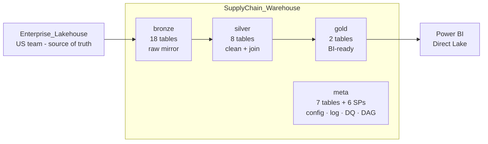
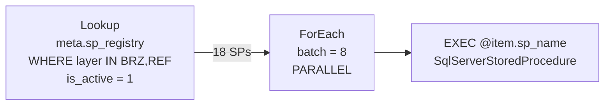
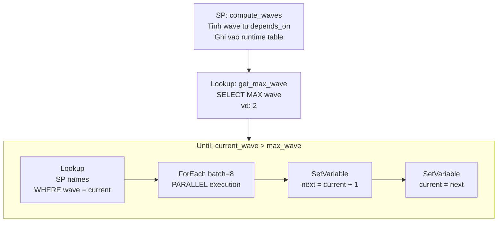
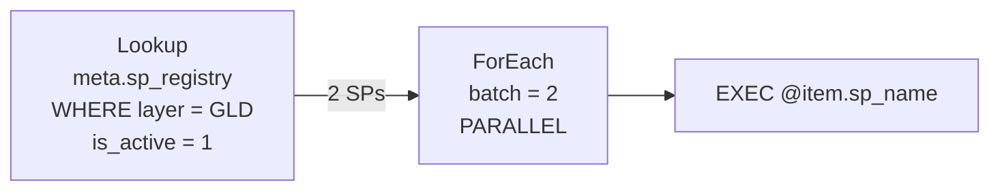
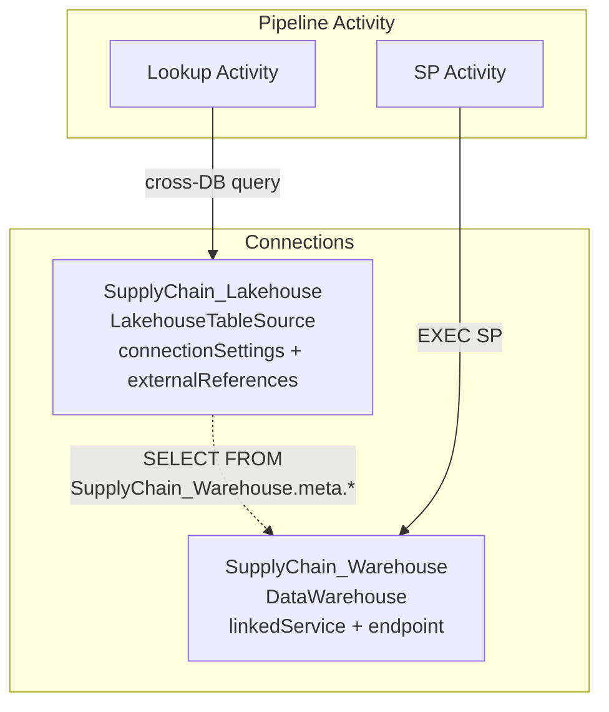
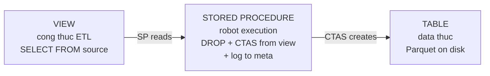

# Architecture v9 — Overview & Template
> SupplyChain_Warehouse · Warehouse-Native Medallion
> 4 Schemas · 28 Tables · 4 Pipelines

---

## 1. Data Flow



### 4 Schemas

| Schema | Role | Contains |
|--------|------|----------|
| `bronze` | Raw mirror from source | Tables + Views (ETL logic) + SPs (load) |
| `silver` | Clean, join, business rules | Tables + Views + SPs |
| `gold` | Business-ready facts/dims | Tables + Views + SPs |
| `meta` | System control plane | Config tables + Log tables + Utility SPs/functions |

---

## 2. Warehouse Structure (Tree View)

```
SupplyChain_Warehouse/
│
├── bronze/
│   ├── Tables/ (18)
│   │   ├── brz_saleshistory_afi__invoicedetail        35.8M rows
│   │   ├── brz_saleshistory_afi__invoiceheader         4.0M rows
│   │   ├── brz_supplychain_enh_1__demandforecast...    1.3B rows
│   │   ├── brz_wholesale_codis_afi__codatan            918K rows
│   │   ├── brz_wholesale_codis_afi__comast             229K rows
│   │   ├── brz_wholesale_codis_afi__extord             230K rows
│   │   ├── brz_wholesale_codis_afi__extorit            912K rows
│   │   ├── ref_calendar                                 22K rows
│   │   ├── ref_customer_account                         36K rows
│   │   ├── ref_customer_account_group                   35K rows
│   │   ├── ref_customer_grouping                          9 rows
│   │   ├── ref_customer_shipping_location              128K rows
│   │   ├── ref_forecast_cycle                            43 rows
│   │   ├── ref_forecast_horizon                           8 rows
│   │   ├── ref_item_master                             379K rows
│   │   ├── ref_order_type                                29 rows
│   │   ├── ref_product                                 373K rows
│   │   └── ref_warehouse                                 55 rows
│   ├── Views/ (17)
│   │   └── vw_{table_name}  →  Enterprise_Lakehouse.{schema}.{source}
│   └── Stored Procedures/ (18)
│       └── usp_load_{table_name}  [overwrite / incremental]
│
├── silver/
│   ├── Tables/ (8)
│   │   ├── slv_invoice_detail_line_level              35.8M rows  wave 0
│   │   ├── slv_forecast_demand_monthly                13.9M rows  wave 0
│   │   ├── slv_open_order_line_level                   258K rows  wave 0
│   │   ├── slv_actual_demand_monthly                   572K rows  wave 1
│   │   ├── slv_actual_demand_weekly                    1.1M rows  wave 1
│   │   ├── slv_invoice_weekly                         15.6M rows  wave 1
│   │   ├── slv_open_order_monthly                      120K rows  wave 1
│   │   └── slv_naive_forecast_monthly                  347K rows  wave 2
│   ├── Views/ (8)
│   │   └── vw_slv_{name}  ←  bronze.* + silver.* (JOINs, CTEs)
│   └── Stored Procedures/ (8)
│       └── usp_load_slv_{name}  [overwrite, with depends_on]
│
├── gold/
│   ├── Tables/ (2)
│   │   ├── gld_fact_flat_forecast_actual              14.8M rows
│   │   └── gld_fact_forecast_kpi                      41.1M rows
│   ├── Views/ (2)
│   │   └── vw_gld_{name}  ←  silver.* + bronze.ref_*
│   └── Stored Procedures/ (2)
│       └── usp_load_gld_{name}  [overwrite]
│
└── meta/
    ├── Tables/ (7)
    │   ├── sp_registry              28 rows   config: SP definitions
    │   ├── sp_run_history           34 rows   log: SP executions
    │   ├── dq_rules                 30 rows   config: DQ checks
    │   ├── dq_results               30 rows   log: DQ outcomes
    │   ├── sp_lineage               52 rows   map: data flow edges
    │   ├── pipeline_run_log          0 rows   log: pipeline runs
    │   └── slv_dag_waves_runtime     8 rows   runtime: wave results
    ├── Stored Procedures/ (5)
    │   ├── usp_log_run              log SP start/end/status
    │   ├── usp_check_dq             DQ engine
    │   ├── usp_build_lineage        auto-build lineage
    │   ├── usp_compute_slv_waves    iterative DAG wave computation
    │   └── usp_run_silver_dag       orchestrator backup
    └── Functions/ (1)
        └── ufn_should_run           check schedule gate
```

---

## 3. Pipeline Architecture

### 3.1 Master Flow


### 3.2 pl_sc_bronze



> **Connection**: Lookup via LakehouseTableSource (cross-DB query) · SP via DataWarehouse linkedService

### 3.3 pl_sc_silver — Hybrid DAG (auto-scale N waves)



> **Wave execution example**:
> | Wave | SPs (parallel) | Count |
> |------|----------------|-------|
> | 0 | invoice_detail, forecast_demand, open_order | 3 |
> | 1 | actual_monthly, actual_weekly, invoice_weekly, open_order_monthly | 4 |
> | 2 | naive_forecast_monthly | 1 |
>
> **Auto-scale**: add table with `depends_on` → SP computes wave → Until loops → no pipeline change

### 3.4 pl_sc_gold



### 3.5 Connection Pattern



---

## 4. 3-File-Per-Table Pattern



### SP Template (overwrite)
```sql
CREATE OR ALTER PROCEDURE {schema}.usp_load_{table} AS
BEGIN
    DECLARE @run_id VARCHAR(36) = CONVERT(VARCHAR(36), NEWID());
    DECLARE @rows BIGINT;
    EXEC meta.usp_log_run @run_id, '{schema}.usp_load_{table}', 'running';
    BEGIN TRY
        DROP TABLE IF EXISTS {schema}.{table};
        CREATE TABLE {schema}.{table} AS
        SELECT *, CAST(GETUTCDATE() AS DATETIME2(6)) AS _load_dt
        FROM {schema}.vw_{table};
        SELECT @rows = COUNT(*) FROM {schema}.{table};
        EXEC meta.usp_log_run @run_id, '{schema}.usp_load_{table}', 'success',
             @rows_affected = @rows;
    END TRY
    BEGIN CATCH
        DECLARE @err VARCHAR(4000) = ERROR_MESSAGE();
        EXEC meta.usp_log_run @run_id, '{schema}.usp_load_{table}', 'failed',
             @error_message = @err;
        THROW;
    END CATCH
END
```

---

## 5. Silver DAG — depends_on Flow

```mermaid
flowchart TD
    subgraph Wave 0 - No deps, parallel
        A[slv_invoice_detail\n35.8M rows]
        B[slv_forecast_demand\n13.9M rows]
        C[slv_open_order\n258K rows]
    end

    subgraph Wave 1 - Depends on Wave 0, parallel
        D[slv_actual_monthly\n572K rows]
        E[slv_actual_weekly\n1.1M rows]
        F[slv_invoice_weekly\n15.6M rows]
        G[slv_open_order_monthly\n120K rows]
    end

    subgraph Wave 2 - Depends on Wave 1
        H[slv_naive_forecast\n347K rows]
    end

    A --> D
    A --> E
    A --> F
    C --> D
    C --> E
    C --> G
    D --> H
```

---

## 6. Adding a New Table — Checklist

### Bronze
- [ ] `CREATE VIEW bronze.vw_brz_{name}` — SELECT FROM source
- [ ] `CREATE PROCEDURE bronze.usp_load_brz_{name}` — copy template
- [ ] `INSERT INTO meta.sp_registry` — layer='BRZ'
- [ ] `INSERT INTO meta.dq_rules` — completeness + row_count
- [ ] EXEC SP → verify data

### Silver (with depends_on)
- [ ] `CREATE VIEW silver.vw_slv_{name}` — SELECT FROM bronze/silver
- [ ] `CREATE PROCEDURE silver.usp_load_slv_{name}` — copy template
- [ ] `INSERT INTO meta.sp_registry` — layer='SLV', depends_on='["silver.usp_load_slv_xxx"]'
- [ ] Pipeline auto picks up — no change needed

### Gold
- [ ] `CREATE VIEW gold.vw_gld_{name}` — SELECT FROM silver
- [ ] `CREATE PROCEDURE gold.usp_load_gld_{name}` — copy template
- [ ] `INSERT INTO meta.sp_registry` — layer='GLD'

---

## 7. Naming Convention

| Schema | Table | View | SP |
|--------|-------|------|----|
| bronze | `brz_{source}__{table}` / `ref_{entity}` | `vw_brz_*` / `vw_ref_*` | `usp_load_brz_*` / `usp_load_ref_*` |
| silver | `slv_{concept}` | `vw_slv_*` | `usp_load_slv_*` |
| gold | `gld_{fact\|dim}_{subject}` | `vw_gld_*` | `usp_load_gld_*` |
| meta | descriptive | `vw_*` | `usp_*` / `ufn_*` |

Column prefixes: `id_` keys · `code_` categories · `name_` descriptions · `qty_` quantities · `amt_` amounts · `dt_` dates · `num_` numbers · `ts_` timestamps · `pct_` percentages · `is_` flags (0/1)

---

## 8. Object Count Summary

| Schema | Tables | Views | SPs | Functions | Total |
|--------|--------|-------|-----|-----------|-------|
| bronze | 18 | 17 | 18 | — | 53 |
| silver | 8 | 8 | 8 | — | 24 |
| gold | 2 | 2 | 2 | — | 6 |
| meta | 7 | 1 | 5 | 1 | 14 |
| **Total** | **35** | **28** | **33** | **1** | **97** |

Pipelines: 4 (`pl_sc_master`, `pl_sc_bronze`, `pl_sc_silver`, `pl_sc_gold`)
