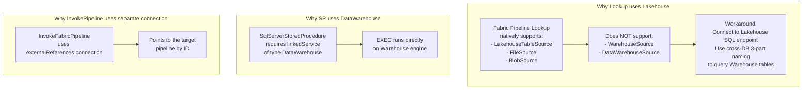

# Setup Guide -- Warehouse-Native Medallion Architecture
> Step-by-step instructions to build SupplyChain_Warehouse v9 from scratch
> Both approaches: Fabric UI and Fabric REST API + Claude Code
> Microsoft Fabric F256

---

## Prerequisites

| Requirement | Detail |
|-------------|--------|
| Microsoft Fabric workspace | F256 or higher capacity |
| Fabric Warehouse | `SupplyChain_Warehouse` (create if not exists) |
| Source Lakehouse | `Enterprise_Lakehouse` (must exist with shortcuts to source data) |
| SupplyChain_Lakehouse | Existing v8 lakehouse (needed for ref_forecast_cycle only) |
| Azure CLI | `az login` for token-based authentication |
| Python 3.9+ | For pyodbc approach |
| pyodbc + ODBC Driver 18 | For API approach: `pip install pyodbc` |

### Two Approaches

| Approach | When to Use | Tools |
|----------|-------------|-------|
| **Fabric UI** | Interactive setup, small changes, debugging | Warehouse query editor in browser |
| **API + Claude Code** | Bulk deployment, automation, CI/CD | pyodbc + `az account get-access-token` |

### API Connection Template (pyodbc)

```python
import pyodbc
import subprocess
import json

# Get Fabric access token via Azure CLI
token_result = subprocess.run(
    ["az", "account", "get-access-token", "--resource", "https://database.windows.net/"],
    capture_output=True, text=True
)
access_token = json.loads(token_result.stdout)["accessToken"]

# Connect to Fabric Warehouse
conn_str = (
    "Driver={ODBC Driver 18 for SQL Server};"
    "Server=<your-endpoint>.datawarehouse.fabric.microsoft.com;"
    "Database=SupplyChain_Warehouse;"
    "Encrypt=Yes;"
    "TrustServerCertificate=No;"
)
conn = pyodbc.connect(conn_str, attrs_before={1256: bytearray(access_token.encode("UTF-16-LE"))})
cursor = conn.cursor()

# Execute SQL
cursor.execute("SELECT @@VERSION")
print(cursor.fetchone()[0])
```

---

## Phase 0: Foundation -- Meta Schema

### Step 0.1: Create Schema

**Fabric UI**: Open Warehouse query editor, run:

```sql
CREATE SCHEMA meta;
CREATE SCHEMA bronze;
CREATE SCHEMA silver;
CREATE SCHEMA gold;
```

**API**: Execute via pyodbc cursor.

### Step 0.2: Create Meta Tables (7 Tables)

Execute all DDL statements below. Note the Fabric Warehouse constraints -- no DEFAULT, no IDENTITY, no PRIMARY KEY, use DATETIME2(6), use INT instead of BIT.

```sql
-- Table 1: sp_registry (central config)
CREATE TABLE meta.sp_registry (
    sp_name                 VARCHAR(200)    NOT NULL,
    view_name               VARCHAR(200)    NULL,
    target_schema           VARCHAR(50)     NOT NULL,
    target_table            VARCHAR(200)    NOT NULL,
    layer                   VARCHAR(10)     NOT NULL,
    load_type               VARCHAR(20)     NOT NULL,
    frequency               VARCHAR(20)     NOT NULL,
    scheduled_hour          INT             NULL,
    execution_order         INT             NOT NULL,
    parallel_group          INT             NULL,
    depends_on              VARCHAR(500)    NULL,
    source_objects          VARCHAR(2000)   NULL,
    watermark_column        VARCHAR(100)    NULL,
    primary_key             VARCHAR(500)    NULL,
    is_active               INT             NOT NULL,
    last_load_date          DATETIME2(6)    NULL,
    last_watermark_value    VARCHAR(200)    NULL,
    next_run_time           DATETIME2(6)    NULL,
    rows_loaded             BIGINT          NULL,
    project                 VARCHAR(50)     NULL
);

-- Table 2: sp_run_history (execution log)
CREATE TABLE meta.sp_run_history (
    run_id                  VARCHAR(36)     NOT NULL,
    pipeline_run_id         VARCHAR(36)     NULL,
    sp_name                 VARCHAR(200)    NOT NULL,
    start_time              DATETIME2(6)    NOT NULL,
    end_time                DATETIME2(6)    NULL,
    duration_seconds        INT             NULL,
    rows_affected           BIGINT          NULL,
    status                  VARCHAR(20)     NOT NULL,
    error_message           VARCHAR(4000)   NULL,
    load_type               VARCHAR(20)     NULL
);

-- Table 3: dq_rules (DQ config)
CREATE TABLE meta.dq_rules (
    rule_id                 INT             NOT NULL,
    rule_name               VARCHAR(200)    NOT NULL,
    target_schema           VARCHAR(50)     NOT NULL,
    target_table            VARCHAR(200)    NOT NULL,
    check_type              VARCHAR(30)     NOT NULL,
    column_name             VARCHAR(100)    NULL,
    severity                VARCHAR(10)     NOT NULL,
    threshold               DECIMAL(18,2)   NULL,
    params                  VARCHAR(1000)   NULL,
    is_active               INT             NOT NULL,
    layer                   VARCHAR(10)     NOT NULL
);

-- Table 4: dq_results (DQ outcomes)
CREATE TABLE meta.dq_results (
    result_id               INT             NOT NULL,
    pipeline_run_id         VARCHAR(36)     NULL,
    rule_id                 INT             NOT NULL,
    check_time              DATETIME2(6)    NOT NULL,
    status                  VARCHAR(10)     NOT NULL,
    actual_value            VARCHAR(500)    NULL,
    expected_value          VARCHAR(500)    NULL,
    error_detail            VARCHAR(4000)   NULL
);

-- Table 5: sp_lineage (lineage graph)
CREATE TABLE meta.sp_lineage (
    lineage_id              INT             NOT NULL,
    source_schema           VARCHAR(100)    NOT NULL,
    source_table            VARCHAR(200)    NOT NULL,
    target_schema           VARCHAR(100)    NOT NULL,
    target_table            VARCHAR(200)    NOT NULL,
    relationship_type       VARCHAR(20)     NULL,
    sp_name                 VARCHAR(200)    NULL
);

-- Table 6: pipeline_run_log (pipeline-level tracking)
CREATE TABLE meta.pipeline_run_log (
    pipeline_run_id         VARCHAR(36)     NOT NULL,
    pipeline_name           VARCHAR(100)    NOT NULL,
    status                  VARCHAR(20)     NOT NULL,
    start_time              DATETIME2(6)    NOT NULL,
    end_time                DATETIME2(6)    NULL,
    tables_succeeded        INT             NULL,
    tables_failed           INT             NULL,
    dq_failures_critical    INT             NULL,
    notes                   VARCHAR(2000)   NULL
);

-- Table 7: slv_dag_waves_runtime (wave computation results)
CREATE TABLE meta.slv_dag_waves_runtime (
    sp_name                 VARCHAR(200)    NOT NULL,
    wave                    INT             NOT NULL
);
```

### Step 0.3: Create Utility Stored Procedures (5 SPs)

```sql
-- SP 1: usp_log_run (log SP start/end)
CREATE OR ALTER PROCEDURE meta.usp_log_run
    @run_id VARCHAR(36), @sp_name VARCHAR(200), @status VARCHAR(20),
    @rows_affected BIGINT = NULL, @error_message VARCHAR(4000) = NULL,
    @pipeline_run_id VARCHAR(36) = NULL, @load_type VARCHAR(20) = NULL
AS
BEGIN
    IF @status = 'running'
        INSERT INTO meta.sp_run_history (run_id, pipeline_run_id, sp_name, start_time, status, load_type)
        VALUES (@run_id, @pipeline_run_id, @sp_name, CAST(GETUTCDATE() AS DATETIME2(6)), 'running', @load_type);
    ELSE
    BEGIN
        UPDATE meta.sp_run_history
        SET end_time = CAST(GETUTCDATE() AS DATETIME2(6)),
            duration_seconds = DATEDIFF(SECOND, start_time, GETUTCDATE()),
            rows_affected = @rows_affected, status = @status, error_message = @error_message
        WHERE run_id = @run_id;

        UPDATE meta.sp_registry
        SET last_load_date = CAST(GETUTCDATE() AS DATETIME2(6)), rows_loaded = @rows_affected,
            next_run_time = CASE
                WHEN frequency = 'daily'   THEN DATEADD(DAY, 1, CAST(GETUTCDATE() AS DATE))
                WHEN frequency = 'hourly'  THEN DATEADD(HOUR, 1, GETUTCDATE())
                WHEN frequency = 'weekly'  THEN DATEADD(WEEK, 1, CAST(GETUTCDATE() AS DATE))
                WHEN frequency = 'monthly' THEN DATEADD(MONTH, 1, CAST(GETUTCDATE() AS DATE))
                ELSE DATEADD(DAY, 1, CAST(GETUTCDATE() AS DATE)) END
        WHERE sp_name = @sp_name;
    END
END;

-- SP 2: usp_compute_slv_waves (DAG wave computation)
CREATE OR ALTER PROCEDURE meta.usp_compute_slv_waves AS
BEGIN
    DELETE FROM meta.slv_dag_waves_runtime;
    DECLARE @wave INT = 0, @assigned INT = 0, @new_count INT = 1;
    DECLARE @total INT, @max_waves INT = 30;

    SELECT @total = COUNT(*) FROM meta.sp_registry WHERE layer = 'SLV' AND is_active = 1;

    -- Wave 0: no silver dependencies
    INSERT INTO meta.slv_dag_waves_runtime (sp_name, wave)
    SELECT sp_name, 0 FROM meta.sp_registry
    WHERE layer = 'SLV' AND is_active = 1
    AND (depends_on IS NULL OR depends_on NOT LIKE '%silver.usp_%');

    SELECT @assigned = COUNT(*) FROM meta.slv_dag_waves_runtime;
    SET @wave = 1;

    WHILE @assigned < @total AND @wave < @max_waves AND @new_count > 0
    BEGIN
        INSERT INTO meta.slv_dag_waves_runtime (sp_name, wave)
        SELECT r.sp_name, @wave FROM meta.sp_registry r
        WHERE r.layer = 'SLV' AND r.is_active = 1
        AND r.sp_name NOT IN (SELECT sp_name FROM meta.slv_dag_waves_runtime)
        AND NOT EXISTS (
            SELECT 1 FROM meta.sp_registry dep
            WHERE dep.layer = 'SLV' AND dep.is_active = 1
            AND r.depends_on LIKE '%' + dep.sp_name + '%'
            AND dep.sp_name NOT IN (SELECT sp_name FROM meta.slv_dag_waves_runtime)
        );
        SET @new_count = @@ROWCOUNT;
        SET @assigned = @assigned + @new_count;
        SET @wave = @wave + 1;
    END
END;

-- SP 3: usp_build_lineage (auto-build lineage from source_objects JSON)
CREATE OR ALTER PROCEDURE meta.usp_build_lineage AS
BEGIN
    DELETE FROM meta.sp_lineage;

    -- Parse source_objects JSON and create lineage edges
    -- (Simplified: for each sp_registry row with source_objects, create edges)
    INSERT INTO meta.sp_lineage (lineage_id, source_schema, source_table,
                                  target_schema, target_table, relationship_type, sp_name)
    SELECT
        ROW_NUMBER() OVER (ORDER BY r.sp_name, src.value) AS lineage_id,
        CASE
            WHEN CHARINDEX('.', src.value) > 0
            THEN LEFT(src.value, CHARINDEX('.', src.value, CHARINDEX('.', src.value) + 1) - 1)
            ELSE 'unknown'
        END AS source_schema,
        CASE
            WHEN CHARINDEX('.', src.value) > 0
            THEN RIGHT(src.value, LEN(src.value) - CHARINDEX('.', src.value, CHARINDEX('.', src.value) + 1))
            ELSE src.value
        END AS source_table,
        r.target_schema,
        r.target_table,
        'direct' AS relationship_type,
        r.sp_name
    FROM meta.sp_registry r
    CROSS APPLY OPENJSON(r.source_objects) src
    WHERE r.source_objects IS NOT NULL;
END;

-- SP 4: usp_run_silver_dag (backup orchestrator -- sequential)
CREATE OR ALTER PROCEDURE meta.usp_run_silver_dag AS
BEGIN
    EXEC meta.usp_compute_slv_waves;

    DECLARE @max_wave INT;
    SELECT @max_wave = MAX(wave) FROM meta.slv_dag_waves_runtime;

    DECLARE @w INT = 0;
    WHILE @w <= @max_wave
    BEGIN
        DECLARE @sp VARCHAR(200);
        DECLARE @min_id INT = 0;

        -- Loop through SPs in this wave (sequential)
        WHILE 1 = 1
        BEGIN
            SELECT TOP 1 @sp = sp_name
            FROM meta.slv_dag_waves_runtime
            WHERE wave = @w AND sp_name > ISNULL(@sp, '')
            ORDER BY sp_name;

            IF @@ROWCOUNT = 0 BREAK;
            EXEC sp_executesql @sp;
        END

        SET @w = @w + 1;
    END
END;

-- SP 5: usp_check_dq (DQ engine -- known bug: only runs 1 iteration)
CREATE OR ALTER PROCEDURE meta.usp_check_dq
    @target_schema VARCHAR(50) = NULL,
    @target_table VARCHAR(200) = NULL
AS
BEGIN
    DECLARE @rule_id INT, @check_type VARCHAR(30), @schema VARCHAR(50);
    DECLARE @table VARCHAR(200), @col VARCHAR(100), @threshold DECIMAL(18,2);
    DECLARE @sql NVARCHAR(4000), @result DECIMAL(18,2);
    DECLARE @status VARCHAR(10), @actual VARCHAR(500), @expected VARCHAR(500);
    DECLARE @result_id INT;

    SELECT @result_id = ISNULL(MAX(result_id), 0) FROM meta.dq_results;

    DECLARE @min_rule INT = 0;
    WHILE 1 = 1
    BEGIN
        SELECT TOP 1 @rule_id = rule_id, @check_type = check_type,
               @schema = target_schema, @table = target_table,
               @col = column_name, @threshold = threshold
        FROM meta.dq_rules
        WHERE is_active = 1 AND rule_id > @min_rule
        AND (@target_schema IS NULL OR target_schema = @target_schema)
        AND (@target_table IS NULL OR target_table = @target_table)
        ORDER BY rule_id;

        IF @@ROWCOUNT = 0 BREAK;
        SET @min_rule = @rule_id;

        -- Generate SQL based on check_type
        IF @check_type = 'completeness'
            SET @sql = N'SELECT @r = CAST(SUM(CASE WHEN ' + QUOTENAME(@col) +
                       N' IS NULL THEN 0 ELSE 1 END) * 100.0 / COUNT(*) AS DECIMAL(18,2)) FROM '
                       + QUOTENAME(@schema) + '.' + QUOTENAME(@table);
        ELSE IF @check_type = 'row_count'
            SET @sql = N'SELECT @r = CAST(COUNT(*) AS DECIMAL(18,2)) FROM '
                       + QUOTENAME(@schema) + '.' + QUOTENAME(@table);
        -- ... (additional check types)

        EXEC sp_executesql @sql, N'@r DECIMAL(18,2) OUTPUT', @r = @result OUTPUT;

        -- Evaluate result
        SET @actual = CAST(@result AS VARCHAR(500));
        SET @expected = CAST(@threshold AS VARCHAR(500));
        SET @status = CASE WHEN @result >= @threshold THEN 'PASS' ELSE 'FAIL' END;

        SET @result_id = @result_id + 1;
        INSERT INTO meta.dq_results (result_id, rule_id, check_time, status, actual_value, expected_value)
        VALUES (@result_id, @rule_id, CAST(GETUTCDATE() AS DATETIME2(6)), @status, @actual, @expected);
    END
END;
```

### Step 0.4: Create Function and View

```sql
-- Function: ufn_should_run
CREATE OR ALTER FUNCTION meta.ufn_should_run(@sp_name VARCHAR(200))
RETURNS INT
AS
BEGIN
    DECLARE @result INT = 0;
    SELECT @result = CASE
        WHEN is_active = 1 AND (next_run_time IS NULL OR next_run_time <= GETUTCDATE())
        THEN 1 ELSE 0 END
    FROM meta.sp_registry WHERE sp_name = @sp_name;
    RETURN ISNULL(@result, 0);
END;

-- View: vw_slv_dag_waves (legacy, kept for reference)
CREATE OR ALTER VIEW meta.vw_slv_dag_waves AS
WITH wave0 AS (
    SELECT sp_name, 0 AS wave FROM meta.sp_registry
    WHERE layer = 'SLV' AND is_active = 1
    AND (depends_on IS NULL OR depends_on NOT LIKE '%silver.usp_%')
),
wave1 AS (
    SELECT r.sp_name, 1 AS wave FROM meta.sp_registry r
    WHERE r.layer = 'SLV' AND r.is_active = 1
    AND r.sp_name NOT IN (SELECT sp_name FROM wave0)
    AND NOT EXISTS (
        SELECT 1 FROM meta.sp_registry dep
        WHERE dep.layer = 'SLV' AND r.depends_on LIKE '%' + dep.sp_name + '%'
        AND dep.sp_name NOT IN (SELECT sp_name FROM wave0)
    )
),
wave2 AS (
    SELECT r.sp_name, 2 AS wave FROM meta.sp_registry r
    WHERE r.layer = 'SLV' AND r.is_active = 1
    AND r.sp_name NOT IN (SELECT sp_name FROM wave0)
    AND r.sp_name NOT IN (SELECT sp_name FROM wave1)
)
SELECT * FROM wave0
UNION ALL SELECT * FROM wave1
UNION ALL SELECT * FROM wave2;
```

---

## Phase 1: Bronze Layer

### Step 1.1: Create Views (17 Views)

Each bronze view reads from the source system via 3-part naming. The view contains the ETL logic: column selection, CAST, TRIM, renaming.

**Fabric UI**: Open query editor, create each view.
**API**: Execute via pyodbc.

**Template**:

```sql
CREATE OR ALTER VIEW bronze.vw_brz_{source}__{entity} AS
SELECT
    CAST(col1 AS VARCHAR(200))         AS id_entity,
    CAST(col2 AS FLOAT)                AS amt_value,
    TRY_CONVERT(DATE, CAST(col3 AS VARCHAR(20))) AS dt_transaction,
    TRY_CAST(col4 AS DATETIME2(6))    AS ts_created
FROM Enterprise_Lakehouse.{Schema_Folder}.{Source_Table};
```

**Source mappings** (create 1 view per table):

| View | Source (3-part name) |
|------|---------------------|
| bronze.vw_brz_saleshistory_afi__invoicedetail | Enterprise_Lakehouse.SalesHistory_AFI.InvoiceDetail |
| bronze.vw_brz_saleshistory_afi__invoiceheader | Enterprise_Lakehouse.SalesHistory_AFI.InvoiceHeader |
| bronze.vw_brz_supplychain_enh_1__demandforecastsnapshotdaily | Enterprise_Lakehouse.SupplyChain_Enh_1.DemandForecastSnapshotDaily |
| bronze.vw_brz_wholesale_codis_afi__codatan | Enterprise_Lakehouse.Wholesale_Codis_AFI.codatan |
| bronze.vw_brz_wholesale_codis_afi__comast | Enterprise_Lakehouse.Wholesale_Codis_AFI.COMAST |
| bronze.vw_brz_wholesale_codis_afi__extord | Enterprise_Lakehouse.Wholesale_Codis_AFI.EXTORD |
| bronze.vw_brz_wholesale_codis_afi__extorit | Enterprise_Lakehouse.Wholesale_Codis_AFI.EXTORIT |
| bronze.vw_ref_calendar | Enterprise_Lakehouse.MasterData_DW.DimDate |
| bronze.vw_ref_customer_account | Enterprise_Lakehouse.Customers.AccountMaster |
| bronze.vw_ref_customer_account_group | Enterprise_Lakehouse.Wholesale_ProductSourcing_AFI.CustomerGrouping |
| bronze.vw_ref_customer_grouping | Enterprise_Lakehouse.Wholesale_ProductSourcing_AFI.CustomerGrouping |
| bronze.vw_ref_customer_shipping_location | Enterprise_Lakehouse.Customers.ShippingLocations |
| bronze.vw_ref_forecast_cycle | SupplyChain_Lakehouse.dbo.ref_forecast_cycle |
| bronze.vw_ref_item_master | Enterprise_Lakehouse.MasterData_DW.DimItemMaster |
| bronze.vw_ref_order_type | Enterprise_Lakehouse.Wholesale_Codis_AFI.AAORDTYP |
| bronze.vw_ref_product | Enterprise_Lakehouse.SupplyChain_DW.DimCurrentProductDetails |
| bronze.vw_ref_warehouse | Enterprise_Lakehouse.SupplyChain_DW.DimAFIWarehouses |

**Note**: `ref_forecast_horizon` has no view -- it uses hardcoded INSERT of 8 rows in the SP.

**Important**: The schema in the 3-part name corresponds to the **folder name** in the Lakehouse, not `dbo`. Using `dbo` will return a 404 error.

### Step 1.2: Create Stored Procedures (18 SPs)

Create one SP per table using the overwrite template (Section 5.3 of architecture doc).

**For 17 overwrite SPs**, copy the template and replace `{schema}` and `{table}`:

```sql
-- Example: bronze.usp_load_brz_saleshistory_afi__invoicedetail
CREATE OR ALTER PROCEDURE bronze.usp_load_brz_saleshistory_afi__invoicedetail AS
BEGIN
    DECLARE @run_id VARCHAR(36) = CONVERT(VARCHAR(36), NEWID());
    DECLARE @rows BIGINT;
    EXEC meta.usp_log_run @run_id, 'bronze.usp_load_brz_saleshistory_afi__invoicedetail', 'running',
         @load_type = 'overwrite';
    BEGIN TRY
        DROP TABLE IF EXISTS bronze.brz_saleshistory_afi__invoicedetail;
        CREATE TABLE bronze.brz_saleshistory_afi__invoicedetail AS
        SELECT *, CAST(GETUTCDATE() AS DATETIME2(6)) AS _load_dt
        FROM bronze.vw_brz_saleshistory_afi__invoicedetail;
        SELECT @rows = COUNT(*) FROM bronze.brz_saleshistory_afi__invoicedetail;
        EXEC meta.usp_log_run @run_id, 'bronze.usp_load_brz_saleshistory_afi__invoicedetail', 'success',
             @rows_affected = @rows, @load_type = 'overwrite';
    END TRY
    BEGIN CATCH
        DECLARE @err VARCHAR(4000) = ERROR_MESSAGE();
        EXEC meta.usp_log_run @run_id, 'bronze.usp_load_brz_saleshistory_afi__invoicedetail', 'failed',
             @error_message = @err, @load_type = 'overwrite';
        THROW;
    END CATCH
END;
```

**For the 1 incremental SP** (brz_demandforecast), use the incremental template from Section 5.4 of the architecture doc, with `watermark_column = ts_snapshot` and cutoff = `2023-01-01`.

**For ref_forecast_horizon** (hardcoded), the SP does not read from a view:

```sql
CREATE OR ALTER PROCEDURE bronze.usp_load_ref_forecast_horizon AS
BEGIN
    DECLARE @run_id VARCHAR(36) = CONVERT(VARCHAR(36), NEWID());
    EXEC meta.usp_log_run @run_id, 'bronze.usp_load_ref_forecast_horizon', 'running';
    BEGIN TRY
        DROP TABLE IF EXISTS bronze.ref_forecast_horizon;
        CREATE TABLE bronze.ref_forecast_horizon (
            horizon_months INT NOT NULL,
            horizon_label VARCHAR(20) NOT NULL,
            _load_dt DATETIME2(6) NOT NULL
        );
        INSERT INTO bronze.ref_forecast_horizon VALUES
            (1, '1M', CAST(GETUTCDATE() AS DATETIME2(6))),
            (2, '2M', CAST(GETUTCDATE() AS DATETIME2(6))),
            (3, '3M', CAST(GETUTCDATE() AS DATETIME2(6))),
            (4, '4M', CAST(GETUTCDATE() AS DATETIME2(6))),
            (5, '5M', CAST(GETUTCDATE() AS DATETIME2(6))),
            (6, '6M', CAST(GETUTCDATE() AS DATETIME2(6))),
            (9, '9M', CAST(GETUTCDATE() AS DATETIME2(6))),
            (12, '12M', CAST(GETUTCDATE() AS DATETIME2(6)));
        DECLARE @rows BIGINT;
        SELECT @rows = COUNT(*) FROM bronze.ref_forecast_horizon;
        EXEC meta.usp_log_run @run_id, 'bronze.usp_load_ref_forecast_horizon', 'success',
             @rows_affected = @rows;
    END TRY
    BEGIN CATCH
        DECLARE @err VARCHAR(4000) = ERROR_MESSAGE();
        EXEC meta.usp_log_run @run_id, 'bronze.usp_load_ref_forecast_horizon', 'failed',
             @error_message = @err;
        THROW;
    END CATCH
END;
```

### Step 1.3: Test Bronze SPs

Execute each SP manually and verify:

```sql
-- Test one SP
EXEC bronze.usp_load_ref_calendar;

-- Verify
SELECT COUNT(*) FROM bronze.ref_calendar;
SELECT TOP 10 * FROM bronze.ref_calendar;
SELECT * FROM meta.sp_run_history WHERE sp_name = 'bronze.usp_load_ref_calendar' ORDER BY start_time DESC;
```

---

## Phase 2: Silver Layer

### Step 2.1: Spark SQL to T-SQL Conversion

When converting v8 Notebook Spark SQL to v9 T-SQL views, apply these conversions:

| Spark SQL | T-SQL | Notes |
|-----------|-------|-------|
| `CAST(x AS STRING)` | `CAST(x AS VARCHAR(200))` | Specify length |
| `to_date(CAST(x AS STRING), 'yyyyMMdd')` | `TRY_CONVERT(DATE, CAST(x AS VARCHAR(20)))` | Use TRY_ for safety |
| `CAST(x AS TIMESTAMP)` | `TRY_CAST(x AS DATETIME2(6))` | Always DATETIME2(6) |
| `CAST(x AS DOUBLE)` | `CAST(x AS FLOAT)` | |
| `true` / `false` | `1` / `0` | INT, not BIT |
| `` `column` `` | `[column]` | Square brackets |
| `"string"` | `'string'` | Single quotes |
| `DATE_FORMAT(col, 'yyyy.MM')` | `FORMAT(col, 'yyyy.MM')` | |
| `ADD_MONTHS(date, n)` | `DATEADD(MONTH, n, date)` | |
| `DATE_TRUNC('year', date)` | `DATETRUNC(YEAR, date)` | No quotes on YEAR |
| `MAKE_DATE(y, m, d)` | `DATEFROMPARTS(y, m, d)` | |
| `LIMIT 1` | `TOP 1` | |
| `CURRENT_DATE()` | `CAST(GETDATE() AS DATE)` | |

### Step 2.2: Table Reference Remapping (v8 to v9)

In v8 Notebooks, silver tables referenced other silver tables using `SupplyChain_Lakehouse.dbo.{table}` or `{table}` directly. In v9, references must use the v9 schema:

| v8 Reference | v9 Reference |
|-------------|-------------|
| `invoice_detail_line_level` or `dbo.invoice_detail_line_level` | `silver.slv_invoice_detail_line_level` |
| `forecast_demand_monthly` | `silver.slv_forecast_demand_monthly` |
| `open_order_line_level` | `silver.slv_open_order_line_level` |
| `InvoiceDetail` (from Lakehouse) | `bronze.brz_saleshistory_afi__invoicedetail` |
| `ref_calendar` (from Lakehouse) | `bronze.ref_calendar` |

### Step 2.3: Create Silver Views (8 Views)

Each silver view reads from bronze and/or other silver tables. Apply JOINs, CTEs, business logic.

**Template**:
```sql
CREATE OR ALTER VIEW silver.vw_slv_{business_concept} AS
WITH cte AS (
    SELECT ...
    FROM bronze.brz_{table1} a
    JOIN bronze.ref_{table2} b ON a.key = b.key
    WHERE ...
)
SELECT
    id_col,
    CAST(amt_col AS FLOAT) AS amt_value,
    dt_col
FROM cte;
```

### Step 2.4: Create Silver SPs (8 SPs)

Use the same overwrite SP template as bronze, with `{schema} = silver` and `{table} = slv_{name}`.

### Step 2.5: Define depends_on

For each silver SP, determine which other silver SPs it depends on. This information goes into `sp_registry.depends_on` in Phase 4.

| Silver SP | depends_on |
|-----------|-----------|
| usp_load_slv_invoice_detail_line_level | NULL (only bronze deps) |
| usp_load_slv_forecast_demand_monthly | NULL (only bronze deps) |
| usp_load_slv_open_order_line_level | NULL (only bronze deps) |
| usp_load_slv_actual_demand_monthly | `["silver.usp_load_slv_invoice_detail_line_level", "silver.usp_load_slv_open_order_line_level"]` |
| usp_load_slv_actual_demand_weekly | `["silver.usp_load_slv_invoice_detail_line_level", "silver.usp_load_slv_open_order_line_level"]` |
| usp_load_slv_invoice_weekly | `["silver.usp_load_slv_invoice_detail_line_level"]` |
| usp_load_slv_open_order_monthly | `["silver.usp_load_slv_open_order_line_level"]` |
| usp_load_slv_naive_forecast_monthly | `["silver.usp_load_slv_actual_demand_monthly"]` |

---

## Phase 3: Gold Layer

### Step 3.1: Create Gold Views (2 Views)

Gold views read from silver tables and optionally bronze reference tables.

**gld_fact_flat_forecast_actual**: UNION ALL of actual demand, forecast demand, and naive forecast.
**gld_fact_forecast_kpi**: CTE chain that cross-joins forecast with horizon periods and LEFT JOINs actual and naive values.

### Step 3.2: Create Gold SPs (2 SPs)

Same overwrite template as bronze/silver with `{schema} = gold` and `{table} = gld_{name}`.

### Step 3.3: Gold Naming

Use `gld_` prefix on all gold tables to avoid name collision with v8 tables in `dbo` and `test_sp` schemas. Without the prefix, Fabric may confuse `fact_forecast_kpi` with existing v8 objects.

---

## Phase 4: Seed Metadata

### Step 4.1: Insert sp_registry (28 rows)

```sql
-- Bronze tables (7 BRZ)
INSERT INTO meta.sp_registry (sp_name, view_name, target_schema, target_table,
    layer, load_type, frequency, execution_order, is_active, source_objects, project)
VALUES
('bronze.usp_load_brz_saleshistory_afi__invoicedetail',
 'bronze.vw_brz_saleshistory_afi__invoicedetail',
 'bronze', 'brz_saleshistory_afi__invoicedetail',
 'BRZ', 'overwrite', 'daily', 1, 1,
 '["Enterprise_Lakehouse.SalesHistory_AFI.InvoiceDetail"]', 'supply_chain'),

('bronze.usp_load_brz_saleshistory_afi__invoiceheader',
 'bronze.vw_brz_saleshistory_afi__invoiceheader',
 'bronze', 'brz_saleshistory_afi__invoiceheader',
 'BRZ', 'overwrite', 'daily', 1, 1,
 '["Enterprise_Lakehouse.SalesHistory_AFI.InvoiceHeader"]', 'supply_chain'),

-- ... (repeat for all 7 BRZ tables)

-- Incremental table
('bronze.usp_load_brz_supplychain_enh_1__demandforecastsnapshotdaily',
 'bronze.vw_brz_supplychain_enh_1__demandforecastsnapshotdaily',
 'bronze', 'brz_supplychain_enh_1__demandforecastsnapshotdaily',
 'BRZ', 'incremental', 'daily', 1, 1,
 '["Enterprise_Lakehouse.SupplyChain_Enh_1.DemandForecastSnapshotDaily"]', 'supply_chain');

-- Reference tables (11 REF)
INSERT INTO meta.sp_registry (sp_name, view_name, target_schema, target_table,
    layer, load_type, frequency, execution_order, is_active, source_objects, project)
VALUES
('bronze.usp_load_ref_calendar', 'bronze.vw_ref_calendar',
 'bronze', 'ref_calendar', 'REF', 'overwrite', 'daily', 1, 1,
 '["Enterprise_Lakehouse.MasterData_DW.DimDate"]', 'supply_chain'),
-- ... (repeat for all 11 REF tables)

-- Silver tables (8 SLV) with depends_on
INSERT INTO meta.sp_registry (sp_name, view_name, target_schema, target_table,
    layer, load_type, frequency, execution_order, depends_on, is_active, source_objects, project)
VALUES
('silver.usp_load_slv_invoice_detail_line_level',
 'silver.vw_slv_invoice_detail_line_level',
 'silver', 'slv_invoice_detail_line_level',
 'SLV', 'overwrite', 'daily', 2, NULL, 1,
 '["bronze.brz_saleshistory_afi__invoicedetail", "bronze.brz_saleshistory_afi__invoiceheader", "bronze.ref_customer_account_group"]',
 'supply_chain'),

('silver.usp_load_slv_actual_demand_monthly',
 'silver.vw_slv_actual_demand_monthly',
 'silver', 'slv_actual_demand_monthly',
 'SLV', 'overwrite', 'daily', 3,
 '["silver.usp_load_slv_invoice_detail_line_level", "silver.usp_load_slv_open_order_line_level"]',
 1,
 '["silver.slv_invoice_detail_line_level", "silver.slv_open_order_line_level", "bronze.ref_calendar"]',
 'supply_chain'),
-- ... (repeat for all 8 SLV tables)

-- Gold tables (2 GLD)
INSERT INTO meta.sp_registry (sp_name, view_name, target_schema, target_table,
    layer, load_type, frequency, execution_order, is_active, source_objects, project)
VALUES
('gold.usp_load_gld_fact_flat_forecast_actual',
 'gold.vw_gld_fact_flat_forecast_actual',
 'gold', 'gld_fact_flat_forecast_actual',
 'GLD', 'overwrite', 'daily', 5, 1,
 '["silver.slv_actual_demand_monthly", "silver.slv_forecast_demand_monthly", "silver.slv_naive_forecast_monthly"]',
 'supply_chain'),

('gold.usp_load_gld_fact_forecast_kpi',
 'gold.vw_gld_fact_forecast_kpi',
 'gold', 'gld_fact_forecast_kpi',
 'GLD', 'overwrite', 'daily', 5, 1,
 '["silver.slv_forecast_demand_monthly", "silver.slv_actual_demand_monthly", "silver.slv_naive_forecast_monthly", "bronze.ref_forecast_horizon"]',
 'supply_chain');
```

### Step 4.2: Insert dq_rules (30 rows)

```sql
-- Example bronze rules
INSERT INTO meta.dq_rules (rule_id, rule_name, target_schema, target_table,
    check_type, column_name, severity, threshold, is_active, layer)
VALUES
(1, 'invoicedetail_completeness_id', 'bronze', 'brz_saleshistory_afi__invoicedetail',
 'completeness', 'id_invoice', 'CRITICAL', 99.0, 1, 'BRZ'),
(2, 'invoicedetail_row_count', 'bronze', 'brz_saleshistory_afi__invoicedetail',
 'row_count', NULL, 'WARNING', 1000000, 1, 'BRZ'),
-- ... (18 bronze rules total)

-- Example silver rules
(19, 'invoice_detail_slv_uniqueness', 'silver', 'slv_invoice_detail_line_level',
 'uniqueness', 'id_invoice_line', 'CRITICAL', 0, 1, 'SLV'),
-- ... (8 silver rules total)

-- Example gold rules
(27, 'forecast_kpi_row_count', 'gold', 'gld_fact_forecast_kpi',
 'row_count', NULL, 'CRITICAL', 1000000, 1, 'GLD'),
(28, 'forecast_kpi_freshness', 'gold', 'gld_fact_forecast_kpi',
 'freshness', '_load_dt', 'WARNING', 24, 1, 'GLD');
-- ... (4 gold rules total)
```

### Step 4.3: Run DQ Checks

Due to the WHILE loop bug in `usp_check_dq`, run DQ checks from Python:

```python
# Python DQ runner (workaround for SP WHILE loop bug)
cursor.execute("SELECT rule_id, check_type, target_schema, target_table, column_name, threshold FROM meta.dq_rules WHERE is_active = 1 ORDER BY rule_id")
rules = cursor.fetchall()

for rule in rules:
    rule_id, check_type, schema, table, col, threshold = rule

    if check_type == 'completeness':
        sql = f"""SELECT CAST(SUM(CASE WHEN [{col}] IS NULL THEN 0 ELSE 1 END) * 100.0 / COUNT(*) AS DECIMAL(18,2))
                  FROM [{schema}].[{table}]"""
    elif check_type == 'row_count':
        sql = f"SELECT CAST(COUNT(*) AS DECIMAL(18,2)) FROM [{schema}].[{table}]"
    # ... other check types

    cursor.execute(sql)
    result = cursor.fetchone()[0]
    status = 'PASS' if result >= threshold else 'FAIL'

    cursor.execute("""INSERT INTO meta.dq_results (result_id, rule_id, check_time, status, actual_value, expected_value)
                      VALUES (?, ?, CAST(GETUTCDATE() AS DATETIME2(6)), ?, ?, ?)""",
                   next_result_id, rule_id, status, str(result), str(threshold))
    next_result_id += 1
    conn.commit()
```

### Step 4.4: Build Lineage

```sql
EXEC meta.usp_build_lineage;

-- Verify
SELECT * FROM meta.sp_lineage ORDER BY lineage_id;
-- Should return 52 rows
```

---

## Phase 5: Pipelines

### Approach A: Create via Fabric UI

#### Pipeline 1: pl_sc_bronze

1. Open Fabric workspace, click **New** -> **Data Pipeline**
2. Name: `pl_sc_bronze`
3. Add **Lookup** activity:
   - Name: `get_bronze_sps`
   - Source type: **Lakehouse** (select SupplyChain_Lakehouse)
   - Use query: **Query**
   - Query:
     ```sql
     SELECT sp_name FROM SupplyChain_Warehouse.meta.sp_registry
     WHERE layer IN ('BRZ', 'REF') AND is_active = 1
     ```
   - First row only: **No** (return all rows)
4. Add **ForEach** activity:
   - Name: `run_bronze_sps`
   - Sequential: **No** (parallel)
   - Batch count: **8**
   - Items: `@activity('get_bronze_sps').output.value`
5. Inside ForEach, add **Stored Procedure** activity:
   - Name: `exec_sp`
   - Linked service: Select **SupplyChain_Warehouse** (Data Warehouse type)
   - Stored procedure name: `@item().sp_name`
   - Retry: **2**, Retry interval: **30** seconds

#### Pipeline 2: pl_sc_silver

1. Create pipeline: `pl_sc_silver`
2. Add **Stored Procedure** activity (first):
   - Name: `compute_waves`
   - Stored procedure: `meta.usp_compute_slv_waves`
3. For each wave 0-9, add **Lookup** + **ForEach** pair:
   - Lookup name: `get_wave_N_sps`
   - Query: `SELECT sp_name FROM SupplyChain_Warehouse.meta.slv_dag_waves_runtime WHERE wave = N`
   - ForEach name: `run_wave_N`
   - Items: `@activity('get_wave_N_sps').output.value`
   - Inside ForEach: Stored Procedure activity, `@item().sp_name`
4. Connect sequentially: compute_waves -> wave_0_lookup -> wave_0_foreach -> wave_1_lookup -> ...
5. Total: 1 SP + 10 Lookup + 10 ForEach = 21 activities

#### Pipeline 3: pl_sc_gold

Same pattern as pl_sc_bronze but with:
- Query: `WHERE layer = 'GLD'`
- Batch count: **2**

#### Pipeline 4: pl_sc_master

1. Create pipeline: `pl_sc_master`
2. Add 3 **Invoke Pipeline** activities, connected sequentially:
   - `invoke_bronze` -> `invoke_silver` -> `invoke_gold`
   - Each invokes the corresponding child pipeline

### Approach B: Create via REST API

Fabric pipelines can be deployed via the Fabric REST API. Each pipeline is a JSON definition.

#### Step B.1: Get Workspace and Item IDs

```bash
# List workspaces
az rest --method GET --url "https://api.fabric.microsoft.com/v1/workspaces"

# List items in workspace
az rest --method GET --url "https://api.fabric.microsoft.com/v1/workspaces/{workspace_id}/items"
```

#### Step B.2: Deploy Pipeline JSON

```python
import requests
import json

# Get token
token = subprocess.run(
    ["az", "account", "get-access-token", "--resource", "https://api.fabric.microsoft.com"],
    capture_output=True, text=True
)
access_token = json.loads(token.stdout)["accessToken"]
headers = {"Authorization": f"Bearer {access_token}", "Content-Type": "application/json"}

workspace_id = "<your-workspace-id>"

# Create pipeline
payload = {
    "displayName": "pl_sc_bronze",
    "type": "DataPipeline",
    "definition": {
        "parts": [
            {
                "path": "pipeline-content.json",
                "payload": "<base64-encoded-pipeline-json>",
                "payloadType": "InlineBase64"
            }
        ]
    }
}

resp = requests.post(
    f"https://api.fabric.microsoft.com/v1/workspaces/{workspace_id}/items",
    headers=headers, json=payload
)
print(resp.json())
```

#### Step B.3: Pipeline JSON Structure

The pipeline JSON follows the Fabric Pipeline schema. Key sections:

```json
{
    "properties": {
        "activities": [
            {
                "name": "get_bronze_sps",
                "type": "Lookup",
                "typeProperties": {
                    "source": {
                        "type": "LakehouseTableSource",
                        "sqlReaderQuery": "SELECT sp_name FROM SupplyChain_Warehouse.meta.sp_registry WHERE layer IN ('BRZ','REF') AND is_active = 1"
                    },
                    "firstRowOnly": false
                },
                "linkedServiceName": {
                    "type": "LinkedServiceReference"
                },
                "externalReferences": {
                    "connection": "b4311980-xxxx-xxxx-xxxx-xxxxxxxxxxxx"
                },
                "connectionSettings": {
                    "type": "Lakehouse",
                    "typeProperties": {
                        "artifactId": "62a3081e-xxxx-xxxx-xxxx-xxxxxxxxxxxx"
                    }
                }
            },
            {
                "name": "run_bronze_sps",
                "type": "ForEach",
                "typeProperties": {
                    "isSequential": false,
                    "batchCount": 8,
                    "items": {
                        "value": "@activity('get_bronze_sps').output.value"
                    },
                    "activities": [
                        {
                            "name": "exec_sp",
                            "type": "SqlServerStoredProcedure",
                            "typeProperties": {
                                "storedProcedureName": {
                                    "value": "@item().sp_name",
                                    "type": "Expression"
                                }
                            },
                            "linkedServiceName": {
                                "type": "LinkedServiceReference"
                            },
                            "policy": {
                                "retry": 2,
                                "retryIntervalInSeconds": 30
                            }
                        }
                    ]
                },
                "dependsOn": [
                    {
                        "activity": "get_bronze_sps",
                        "dependencyConditions": ["Succeeded"]
                    }
                ]
            }
        ]
    }
}
```

### Connection Topology Explanation



---

## Fabric Warehouse Constraints (Comprehensive Reference)

This section lists every Fabric Warehouse constraint discovered during implementation, along with the error message and the workaround applied.

| # | Constraint | Error / Behavior | Workaround |
|---|-----------|-----------------|------------|
| 1 | No DEFAULT constraint | `DEFAULT is not supported` on CREATE TABLE | Set values in SP INSERT/CTAS logic |
| 2 | No IDENTITY column | `IDENTITY is not supported` | ROW_NUMBER() OVER (...) or MAX(id)+1 |
| 3 | No PRIMARY KEY | `PRIMARY KEY is not supported` | DQ uniqueness check in dq_rules |
| 4 | No UNIQUE constraint | `UNIQUE is not supported` | DQ uniqueness check |
| 5 | No CURSOR | `CURSOR is not supported` | WHILE + MIN(id) WHERE id > @current |
| 6 | No @@FETCH_STATUS | N/A (no cursors) | N/A |
| 7 | No temp tables (#) | `Temporary tables not supported` | CTE or real table + DROP after use |
| 8 | No recursive CTE | `Recursive CTE not supported` | SP iterative WHILE loop |
| 9 | DATETIME2 requires precision | Implicit precision causes errors | Always use DATETIME2(6) |
| 10 | datetime type in CTAS fails | `datetime not supported in CTAS` | CAST(GETUTCDATE() AS DATETIME2(6)) |
| 11 | BIT type unstable | Unpredictable behavior | Use INT (0/1) instead |
| 12 | TRIM on numeric fails | `TRIM expects string input` | Remove TRIM or CAST to VARCHAR first |
| 13 | NVARCHAR(4000) in CTAS | CTAS issues with NVARCHAR | CAST to VARCHAR(n) explicitly |
| 14 | NVARCHAR default length 30 | `CAST(x AS NVARCHAR)` truncates to 30 chars | Always specify length: NVARCHAR(200) |
| 15 | SetVariable self-reference | `Variable cannot reference itself` in Pipeline | Use 2 variables: next + current |
| 16 | Warehouse not supported as Lookup source | `Failed to open resource` | LakehouseTableSource + cross-DB query |
| 17 | Until activity not supported | `BadRequest` on pipeline start | 10 pre-built sequential Lookup+ForEach stages |
| 18 | Nested EXEC from Pipeline | `BadRequest` when SP calls sp_executesql | Pipeline directly calls individual SPs via ForEach |
| 19 | DECIMAL(10,4) overflow | Overflow on values > 999999.9999 | Use DECIMAL(18,2) |
| 20 | sp_executesql in WHILE loop | Only 1 iteration executes | Run dynamic SQL from Python client |
| 21 | VARCHAR in sp_executesql | sp_executesql rejects VARCHAR @sql | Use NVARCHAR(4000) for dynamic SQL |
| 22 | 3-part name with dbo | 404 error on Lakehouse tables | Use folder name as schema: {Lakehouse}.{Folder}.{Table} |
| 23 | Script activity for SP | `ReferenceName null` error | Use SqlServerStoredProcedure + linkedService |
| 24 | ForEach inside ForEach | Not supported in Fabric Pipeline | Parent-child pipeline pattern |
| 25 | ForEach inside Until | Not supported / BadRequest | Pre-built sequential stages |

---

## Alternatives Attempted (Decision Log)

| Problem | Approach 1 (Tried) | Result | Approach 2 (Tried) | Result | Final Solution |
|---------|-------------------|--------|-------------------|--------|---------------|
| Bronze source | Read from v8 Lakehouse tables | Creates v8 dependency | Read from Enterprise_Lakehouse | Works, independent | **Enterprise_Lakehouse 3-part naming** |
| Lakehouse schema | Use dbo.{table} | 404 error | Use {FolderName}.{table} | Works | **Folder name as schema** |
| Silver DAG | Static execution_order | Does not scale | depends_on + wave computation | Works | **Iterative wave computation** |
| Wave computation | Recursive CTE | Not supported | WHILE loop SP | Works | **usp_compute_slv_waves** |
| Wave view | 3 hardcoded CTEs | Max 3 waves | SP + runtime table | Max 30 waves | **SP + slv_dag_waves_runtime** |
| Silver pipeline | SP orchestrator (sequential) | No parallelism | Until + ForEach | BadRequest | **10 pre-built Lookup+ForEach stages** |
| Pipeline variable increment | x = x + 1 | Self-reference error | 2 variables | Works | **next_wave + current_wave** |
| Pipeline Lookup source | WarehouseSource | Failed to open resource | LakehouseTableSource + cross-DB | Works | **Lakehouse cross-DB query** |
| Pipeline SP activity | Script activity | ReferenceName null | SqlServerStoredProcedure | Works | **SP activity + linkedService** |
| Gold naming | fact_* (no prefix) | Collides with v8 | gld_fact_* | Works | **gld_ prefix** |
| DQ engine | SP WHILE + sp_executesql | Only 1 iteration | Python client loop | Works | **Python-side DQ** |
| DQ threshold type | DECIMAL(10,4) | Overflow | DECIMAL(18,2) | Works | **DECIMAL(18,2)** |
| Dynamic SQL type | VARCHAR @sql | sp_executesql rejects | NVARCHAR(4000) @sql | Works | **NVARCHAR(4000)** |
| NVARCHAR cast | CAST AS NVARCHAR | Truncates to 30 chars | CAST AS NVARCHAR(200) | Works | **Always specify length** |

---

## Verification Checklist

After completing all phases, verify:

### Objects Created

```sql
-- Count objects by schema
SELECT s.name AS schema_name, COUNT(*) AS table_count
FROM sys.tables t JOIN sys.schemas s ON t.schema_id = s.schema_id
GROUP BY s.name ORDER BY s.name;
-- Expected: bronze=18, gold=2, meta=7, silver=8

SELECT s.name AS schema_name, COUNT(*) AS view_count
FROM sys.views v JOIN sys.schemas s ON v.schema_id = s.schema_id
GROUP BY s.name ORDER BY s.name;
-- Expected: bronze=17, gold=2, meta=1, silver=8

SELECT s.name AS schema_name, COUNT(*) AS sp_count
FROM sys.procedures p JOIN sys.schemas s ON p.schema_id = s.schema_id
GROUP BY s.name ORDER BY s.name;
-- Expected: bronze=18, gold=2, meta=6, silver=8
```

### Metadata

```sql
-- sp_registry populated
SELECT layer, COUNT(*) FROM meta.sp_registry GROUP BY layer;
-- Expected: BRZ=7, REF=11, SLV=8, GLD=2

-- DQ rules
SELECT layer, COUNT(*) FROM meta.dq_rules GROUP BY layer;
-- Expected: BRZ=18, SLV=8, GLD=4

-- Lineage
SELECT COUNT(*) FROM meta.sp_lineage;
-- Expected: 52

-- Wave computation
EXEC meta.usp_compute_slv_waves;
SELECT wave, COUNT(*) FROM meta.slv_dag_waves_runtime GROUP BY wave ORDER BY wave;
-- Expected: wave 0=3, wave 1=4, wave 2=1
```

### Pipeline Test

```sql
-- Test individual SP
EXEC bronze.usp_load_ref_calendar;
SELECT * FROM meta.sp_run_history WHERE sp_name LIKE '%ref_calendar%' ORDER BY start_time DESC;

-- Test wave computation
EXEC meta.usp_compute_slv_waves;
SELECT * FROM meta.slv_dag_waves_runtime ORDER BY wave, sp_name;
```

Then trigger `pl_sc_master` from Fabric UI and monitor execution. Expected: ~16 minutes for full refresh of 28 tables, ~1.47 billion rows.

---

*This guide reflects the production setup as of 2026-04-14.*
